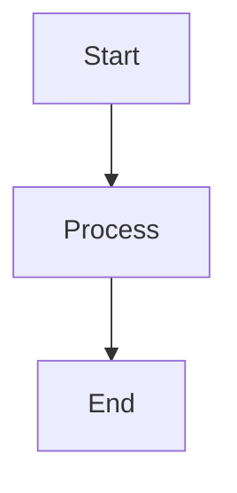
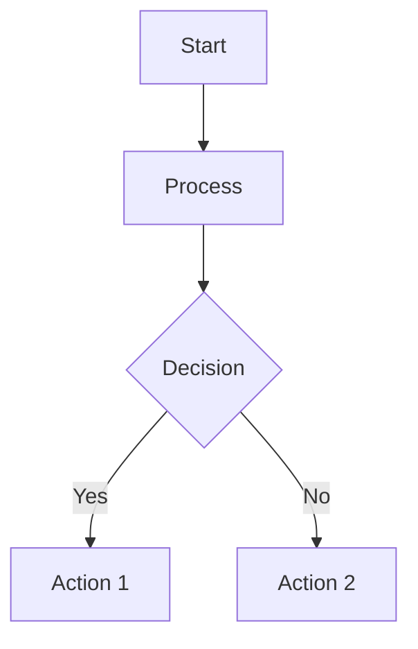
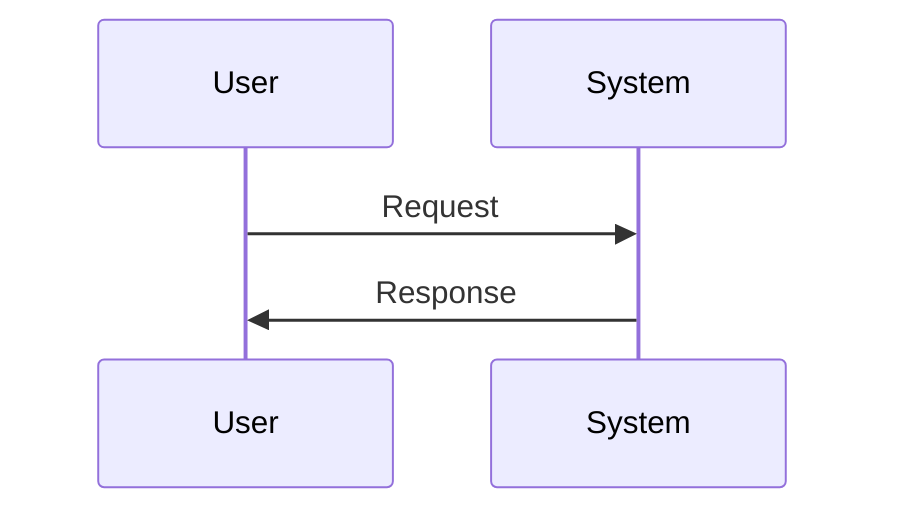
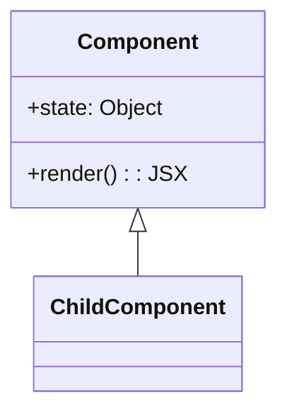
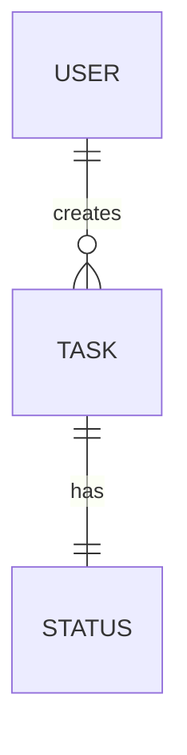
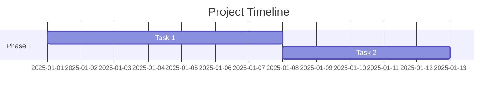
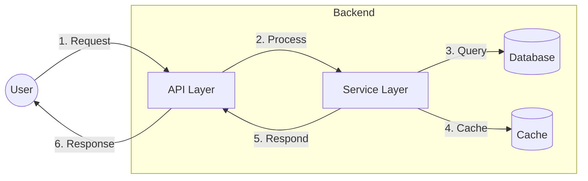

# 📊 Mermaid Diagram Standard Rule

## 📋 Purpose

This rule defines the standard for creating and maintaining diagrams in our project documentation. All diagrams should be created using Mermaid syntax to ensure consistency, version control compatibility, and ease of maintenance.

## 🌟 Key Principles

1. All diagrams must be created using Mermaid syntax
2. Diagram code must be embedded directly in markdown files
3. Visual consistency must be maintained across diagrams
4. Complex diagrams should include explanatory text

## 📝 Implementation

### Basic Syntax

All Mermaid diagrams should be enclosed in a code block with the `mermaid` language specifier:

````markdown

````

### Diagram Types

Choose the appropriate diagram type for the content:

1. **Flowcharts** (`graph` syntax) - for processes and workflows:



2. **Sequence Diagrams** - for interaction sequences:



3. **Class Diagrams** - for code structure:



4. **Entity Relationship Diagrams** - for data models:



5. **Gantt Charts** - for project timelines:



### Visual Style Guidelines

1. **Direction**
   - Use top-down (`TD`) for process flows
   - Use left-right (`LR`) for architectural or component diagrams

2. **Node Shapes**
   - Rectangles `[Text]` for processes or components
   - Rounded rectangles `(Text)` for start/end points
   - Diamonds `{Text}` for decision points
   - Circles `((Text))` for events or signals

3. **Colors**
   - Use colors sparingly and meaningfully
   - Consistent color scheme across related diagrams
   - Example color usage:
     ```mermaid
     graph TD
         A[Start] --> B[Process]
         B --> C{Decision}
         C -->|Yes| D[Action 1]
         C -->|No| E[Action 2]
         
         style A fill:#d0f0c0
         style C fill:#fff0c0
         style D fill:#c0d0f0
         style E fill:#f0c0d0
     ```

4. **Text**
   - Use concise, clear descriptions
   - Maintain consistent terminology
   - Use line breaks (`<br>`) for readability in complex nodes

### Documentation Integration

1. **Context**
   - Always provide explanatory text before a diagram
   - Explain the purpose and key elements of the diagram

2. **Referencing**
   - Add numbers or identifiers to significant elements for easy referencing 
   - Reference diagram elements in accompanying text

3. **Alternatives**
   - Include a text-based description as a fallback for accessibility

## 🛠️ Example Implementation

### System Architecture Diagram

This diagram illustrates the core system architecture:



1. The user initiates a request to the API Layer
2. The API Layer forwards the request to the Service Layer
3. The Service Layer queries the Database for required data
4. Results are cached for future requests
5. The Service Layer returns processed data to the API Layer
6. The API Layer formats and sends the response to the user

## 🚫 Non-Compliant Examples

Avoid using external diagram tools or images:

```markdown

```

Avoid ASCII art diagrams:

```
User -> API -> Service -> Database
           ^      |
           |      v
           +--- Cache
```

## 📈 Success Metrics

1. 100% of new diagrams follow Mermaid syntax
2. All existing diagrams are converted to Mermaid
3. No image-based diagrams in the documentation
4. Consistent visual style across all diagrams

## 🔄 Conversion Process

For existing diagrams:

1. Identify image-based diagrams in documentation
2. Recreate each diagram using Mermaid syntax
3. Replace the image with Mermaid code block
4. Validate the rendered output
5. Update any references or explanations

## 📚 Resources

- [Mermaid JS Documentation](https://mermaid-js.github.io/mermaid/#/)
- [Mermaid Live Editor](https://mermaid.live)
- [GitHub Mermaid Support](https://github.blog/2022-02-14-include-diagrams-markdown-files-mermaid/)

---

🧭 **Navigation**
- [Home](/CLAUDE.md)
- [Rules Index](/.claude/rules/README.md)