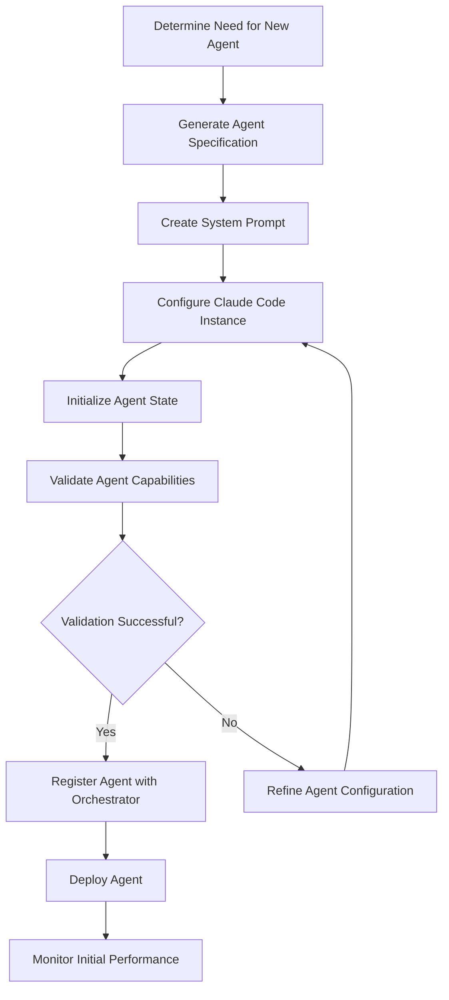
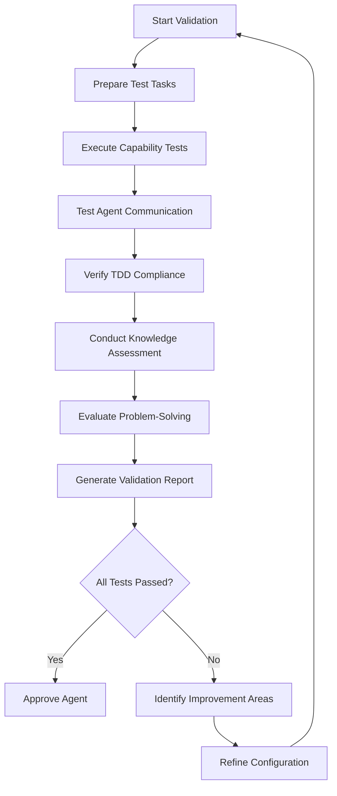

# 🔧 Agent Creation Process

<!-- 📑 TABLE OF CONTENTS -->
- [🔧 Agent Creation Process](#-agent-creation-process)
  - [📋 Overview](#-overview)
  - [🔄 Agent Creation Workflow](#-agent-creation-workflow)
  - [📝 Agent Specification](#-agent-specification)
  - [🧠 System Prompt Engineering](#-system-prompt-engineering)
  - [⚙️ Agent Configuration](#️-agent-configuration)
  - [🧪 Agent Validation](#-agent-validation)
  - [📊 Agent Performance Monitoring](#-agent-performance-monitoring)

---

## 📋 Overview

The Agent Creation Process defines how new specialized agents are created when existing agents are not suitable for a particular task. This process ensures that new agents are properly configured with appropriate roles, personas, capabilities, and system prompts that match their intended purpose.

## 🔄 Agent Creation Workflow

The agent creation workflow consists of the following steps:



### 1. Determine Need for New Agent

- Analyzer determines no existing agent meets the task requirements
- Required capability gap exceeds threshold for creating new agent
- Task represents a new domain or specialization

```typescript
function shouldCreateNewAgent(task, existingAgents) {
  // Get best matching agent and score
  const { bestAgent, matchScore } = findBestMatchingAgent(task, existingAgents);
  
  // Check if score is below threshold
  if (matchScore < NEW_AGENT_THRESHOLD) {
    // Determine if specialized agent would be beneficial
    if (isSpecializedDomain(task) || isRecurringTaskType(task)) {
      return {
        createNew: true,
        reason: `Match score ${matchScore} below threshold, specialized domain detected`
      };
    }
  }
  
  return { createNew: false };
}
```

### 2. Generate Agent Specification

- Analyzer creates detailed specification for new agent
- Defines required capabilities and knowledge domains
- Specifies role and responsibilities
- Identifies primary and secondary focus areas

```typescript
function generateAgentSpecification(task, requiredCapabilities) {
  // Determine agent type based on task domain
  const agentType = determineAgentType(task);
  
  // Generate unique agent identifier
  const agentId = generateAgentId(agentType);
  
  // Determine knowledge domains
  const knowledgeDomains = identifyKnowledgeDomains(task, requiredCapabilities);
  
  // Define primary responsibilities
  const responsibilities = defineResponsibilities(agentType, task);
  
  return {
    id: agentId,
    type: agentType,
    name: generateAgentName(agentType, knowledgeDomains),
    capabilities: requiredCapabilities,
    knowledgeDomains: knowledgeDomains,
    responsibilities: responsibilities,
    primaryFocus: determinePrimaryFocus(task),
    secondaryFocus: determineSecondaryFocus(task),
    collaborationModel: determineCollaborationModel(agentType)
  };
}
```

### 3. Create System Prompt

- Generate comprehensive system prompt that defines agent's role
- Include domain knowledge, constraints, and guidelines
- Specify communication style and decision-making approach
- Define workflow and process requirements

```typescript
function createSystemPrompt(agentSpec) {
  // Start with template for agent type
  let prompt = getBasePromptTemplate(agentSpec.type);
  
  // Add role definition
  prompt += generateRoleDefinition(agentSpec);
  
  // Add capabilities section
  prompt += generateCapabilitiesSection(agentSpec.capabilities);
  
  // Add knowledge domains
  prompt += generateKnowledgeSection(agentSpec.knowledgeDomains);
  
  // Add responsibility guidelines
  prompt += generateResponsibilityGuidelines(agentSpec.responsibilities);
  
  // Add communication guidelines
  prompt += generateCommunicationGuidelines(agentSpec.type);
  
  // Add TDD workflow requirements
  prompt += generateTDDRequirements();
  
  // Add collaboration model
  prompt += generateCollaborationGuidelines(agentSpec.collaborationModel);
  
  return prompt;
}
```

### 4. Configure Claude Code Instance

- Set up Claude Code instance with appropriate parameters
- Configure debug flags for maximum visibility
- Set up MCP server and client capabilities
- Configure GitHub integration permissions

```bash
# Example Claude Code configuration command
claude-code \
  --profile "/profiles/${AGENT_ID}.json" \
  --system-prompt "/prompts/${AGENT_ID}_system_prompt.txt" \
  --verbose --debug --mcp-debug \
  --mcp-server --port ${PORT} \
  --mcp-client \
  --github-token ${GITHUB_TOKEN} \
  --agent-name ${AGENT_NAME}
```

### 5. Initialize Agent State

- Set up agent's initial knowledge base
- Configure connection to other agents
- Initialize performance metrics
- Set up task history tracking

```typescript
function initializeAgentState(agentSpec) {
  // Create knowledge base directory
  setupKnowledgeBase(agentSpec.id);
  
  // Configure connections to other agents
  configureAgentConnections(agentSpec);
  
  // Initialize metrics collection
  initializeMetricsCollection(agentSpec.id);
  
  // Create empty task history
  createTaskHistory(agentSpec.id);
  
  // Setup agent configuration file
  createAgentConfigFile(agentSpec);
}
```

### 6. Validate Agent Capabilities

- Test agent against sample tasks
- Verify communication with other agents
- Ensure TDD workflow compliance
- Validate GitHub integration

```typescript
async function validateAgent(agentSpec) {
  // Generate validation tasks
  const validationTasks = generateValidationTasks(agentSpec);
  
  // Test each required capability
  const results = await Promise.all(
    validationTasks.map(task => testAgentWithTask(agentSpec.id, task))
  );
  
  // Test communication with Orchestrator
  const commResult = await testAgentCommunication(agentSpec.id);
  
  // Check TDD compliance
  const tddResult = await testTDDCompliance(agentSpec.id);
  
  // Determine overall validation result
  return {
    successful: results.every(r => r.passed) && commResult.passed && tddResult.passed,
    results: {
      capabilities: results,
      communication: commResult,
      tddCompliance: tddResult
    },
    recommendations: generateImprovementRecommendations(results, commResult, tddResult)
  };
}
```

### 7. Register Agent with Orchestrator

- Add agent to Agent Registry
- Update capability database
- Configure task routing rules
- Set up monitoring and alerts

```typescript
function registerAgent(agentSpec, validationResults) {
  // Add to agent registry
  addToAgentRegistry(agentSpec, validationResults);
  
  // Update capability database
  updateCapabilityDatabase(agentSpec.id, agentSpec.capabilities);
  
  // Configure routing rules
  configureTaskRouting(agentSpec);
  
  // Setup monitoring
  setupAgentMonitoring(agentSpec.id);
  
  // Log agent creation
  logAgentCreation(agentSpec, validationResults);
  
  return {
    registered: true,
    agentId: agentSpec.id,
    capabilities: agentSpec.capabilities,
    validationSummary: summarizeValidation(validationResults)
  };
}
```

### 8. Deploy Agent

- Launch agent in production environment
- Configure auto-restart and recovery
- Set up logging and diagnostics
- Enable task assignment

```typescript
function deployAgent(agentSpec) {
  // Start Claude Code process
  const process = startClaudeCodeProcess(agentSpec);
  
  // Configure auto-recovery
  setupAutoRecovery(process, agentSpec);
  
  // Setup log rotation
  configureLogging(agentSpec.id);
  
  // Enable task assignment
  enableTaskAssignment(agentSpec.id);
  
  return {
    deployed: true,
    processId: process.id,
    endpoint: `http://localhost:${process.port}`
  };
}
```

### 9. Monitor Initial Performance

- Track performance on initial tasks
- Gather feedback from collaborating agents
- Measure quality metrics
- Refine agent configuration based on early results

```typescript
function monitorInitialPerformance(agentId, initialPeriod = '24h') {
  // Setup performance tracking
  setupPerformanceTracking(agentId, initialPeriod);
  
  // Configure feedback collection
  setupFeedbackCollection(agentId);
  
  // Schedule performance review
  schedulePerformanceReview(agentId, initialPeriod);
  
  // Setup alerts for potential issues
  configureEarlyWarningAlerts(agentId);
  
  return {
    monitoring: true,
    reviewScheduled: true,
    reviewTime: calculateReviewTime(initialPeriod)
  };
}
```

## 📝 Agent Specification

The agent specification includes these key components:

### Core Identity

| Field | Description | Example |
|-------|-------------|---------|
| ID | Unique identifier | `fe-dev-react-001` |
| Name | Human-readable name | `React Frontend Developer` |
| Type | Agent category | `developer` |
| Version | Agent version | `1.0.0` |

### Capabilities

| Field | Description | Example |
|-------|-------------|---------|
| Technical Skills | Languages, frameworks, etc. | `{javascript: 0.9, react: 0.8, css: 0.7}` |
| Development Activities | Types of tasks | `['implementation', 'bugfixing', 'review']` |
| Tools | Development tools | `['webpack', 'jest', 'eslint']` |
| Communication | Communication capabilities | `{clarity: 0.8, technical_detail: 0.9}` |

### Knowledge Domains

| Field | Description | Example |
|-------|-------------|---------|
| Primary Domains | Main expertise areas | `['ui_development', 'component_design']` |
| Secondary Domains | Supporting expertise | `['accessibility', 'performance']` |
| Reference Resources | Knowledge sources | `['react_docs', 'web_standards']` |

### Responsibilities

| Field | Description | Example |
|-------|-------------|---------|
| Primary | Main responsibilities | `['implement_ui_components', 'fix_frontend_bugs']` |
| Secondary | Supporting responsibilities | `['review_frontend_code', 'update_documentation']` |
| Constraints | Limitation boundaries | `['no_backend_changes', 'follow_design_system']` |

### Collaboration Model

| Field | Description | Example |
|-------|-------------|---------|
| Collaboration Style | How agent works with others | `'active_collaborator'` |
| Preferred Collaborators | Agent types to work with | `['designer', 'backend_developer', 'tester']` |
| Communication Frequency | Update frequency | `'high'` |

## 🧠 System Prompt Engineering

The system prompt is carefully engineered to define the agent's behavior:

### Structure

1. **Role Definition**: Clear statement of agent's role and purpose
2. **Capabilities**: Technical and functional capabilities
3. **Knowledge Domains**: Areas of expertise and limitations
4. **Process Guidelines**: Workflow and methodologies (e.g., TDD)
5. **Communication Guidelines**: How the agent should communicate
6. **Decision Framework**: How the agent should make decisions
7. **Collaboration Model**: How the agent works with others
8. **Example Scenarios**: Illustrative examples of proper behavior

### Prompt Templates

Each agent type has a base template that is then customized:

#### Developer Agent Template

```
# Developer Agent: {{SPECIALIZATION}}

## Role Definition
You are a {{SPECIALIZATION}} developer responsible for implementing solutions in the {{DOMAIN}} domain. Your primary focus is {{PRIMARY_FOCUS}}, and you have expertise in {{TECHNOLOGIES}}.

## Capabilities
- You excel at {{CAPABILITIES}}
- You are skilled in {{SKILLS}}
- You can effectively {{ACTIVITIES}}

## Knowledge Domains
- Primary expertise in {{PRIMARY_DOMAINS}}
- Secondary knowledge of {{SECONDARY_DOMAINS}}
- You should reference {{RESOURCES}} when needed

## Process Guidelines
- Always follow Test-Driven Development (TDD) principles:
  1. Write tests first that define the expected behavior
  2. Verify tests fail initially
  3. Implement the minimum code to make tests pass
  4. Refactor while maintaining passing tests
- Document your implementation decisions
- Follow the project's coding standards
- Consider performance, security, and maintainability

## Communication Guidelines
- Provide clear, concise technical explanations
- Use appropriate technical terminology
- When asking questions, provide context and background
- When reporting issues, include reproducible examples

## Decision Framework
- Prioritize correctness over performance initially
- Balance technical debt against delivery timelines
- Consider long-term maintainability in your solutions
- When facing tradeoffs, clearly document your reasoning

## Collaboration Model
- Work closely with {{COLLABORATORS}}
- Provide regular updates on progress
- Request help when encountering blockers
- Review and provide feedback on related work

## Example Scenarios
- When implementing a new feature, you should first...
- When fixing a bug, your approach should be...
- When reviewing code, focus on...
```

### Prompt Optimization

The system prompt is optimized through:

1. **A/B Testing**: Compare different prompt variations
2. **Performance Analysis**: Analyze agent outputs with different prompts
3. **Incremental Refinement**: Iteratively improve prompts based on results
4. **Expert Review**: Subject matter experts review and refine prompts
5. **Automated Analysis**: Use metrics to identify prompt improvement areas

## ⚙️ Agent Configuration

Agent configuration involves several technical aspects:

### Claude Code Configuration

```json
{
  "agent_id": "fe-dev-react-001",
  "agent_name": "React Frontend Developer",
  "model": "claude-3-7-sonnet-20250219",
  "debug_flags": "--verbose --debug --mcp-debug",
  "system_prompt_path": "/prompts/fe-dev-react-001_system_prompt.txt",
  "working_directory": "/workspace/fe-dev-react-001",
  "memory_file": "/memory/fe-dev-react-001.json",
  "log_directory": "/logs/fe-dev-react-001",
  "tools_config": {
    "github": true,
    "npm": true,
    "browser": true
  }
}
```

### MCP Configuration

```json
{
  "server": {
    "enabled": true,
    "port": 8101,
    "max_connections": 10,
    "timeout": 30000
  },
  "client": {
    "enabled": true,
    "endpoints": {
      "orchestrator": "http://localhost:8000",
      "analyzer": "http://localhost:8001",
      "reviewer": "http://localhost:8201"
    },
    "timeout": 30000,
    "retry": {
      "max_attempts": 3,
      "backoff_factor": 1.5
    }
  }
}
```

### GitHub Integration Configuration

```json
{
  "github": {
    "auth_token": "${GITHUB_TOKEN}",
    "username": "fe-dev-react-001",
    "email": "fe-dev-react-001@agents.example.com",
    "allowed_repositories": [
      "organization/frontend-repo",
      "organization/design-system"
    ],
    "permission_level": "write",
    "issue_labels": ["frontend", "react", "ui"]
  }
}
```

## 🧪 Agent Validation

New agents undergo validation to ensure they meet requirements:

### Validation Criteria

1. **Capability Tests**: Verify claimed capabilities
2. **Communication Tests**: Ensure proper interaction with other agents
3. **Workflow Compliance**: Verify TDD workflow adherence
4. **Knowledge Tests**: Validate domain knowledge
5. **Problem-Solving Tests**: Assess analytical abilities

### Validation Process



### Validation Metrics

| Metric | Target | Importance |
|--------|--------|------------|
| Capability Test Score | ≥85% | Critical |
| Communication Success Rate | ≥90% | High |
| TDD Compliance Score | ≥95% | Critical |
| Knowledge Accuracy | ≥80% | Medium |
| Problem-Solving Score | ≥75% | Medium |
| Overall Validation Score | ≥85% | Critical |

## 📊 Agent Performance Monitoring

After deployment, agents are continuously monitored:

### Performance Metrics

1. **Task Completion**:
   - Success rate
   - Time to completion
   - Quality of deliverables

2. **Process Compliance**:
   - TDD compliance rate
   - Documentation completeness
   - Code quality metrics

3. **Collaboration Effectiveness**:
   - Communication clarity
   - Responsiveness
   - Feedback incorporation

4. **Knowledge Application**:
   - Proper use of domain knowledge
   - Appropriate solution selection
   - Error avoidance

### Continuous Improvement

1. **Performance Reviews**:
   - Regular performance assessments
   - Identify improvement areas
   - Update agent configuration

2. **Knowledge Updates**:
   - Refresh domain knowledge
   - Update technical capabilities
   - Add new skill areas

3. **System Prompt Refinement**:
   - Adjust based on performance data
   - Incorporate new guidelines
   - Refine decision framework

4. **Configuration Optimization**:
   - Tune resource allocation
   - Adjust connection parameters
   - Optimize tool configurations

---

<!-- 🧭 NAVIGATION -->
**Navigation**: [Home](../README.md) | [Component Index](./README.md) | [Agent Factory](./agent-factory.md) | [Task Execution Process](./task-execution-process.md)

*Last updated: 2025-05-16*