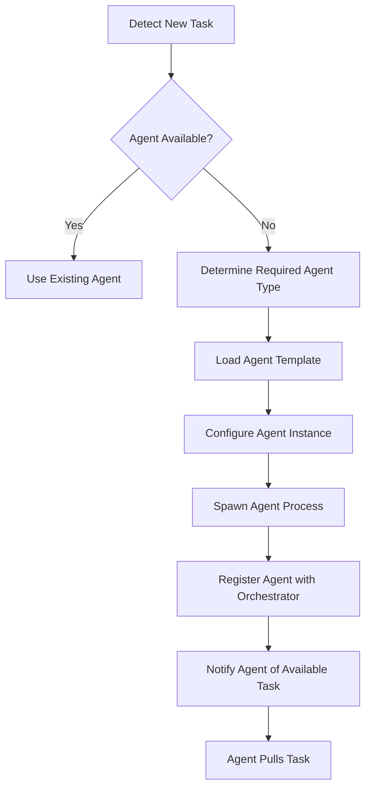
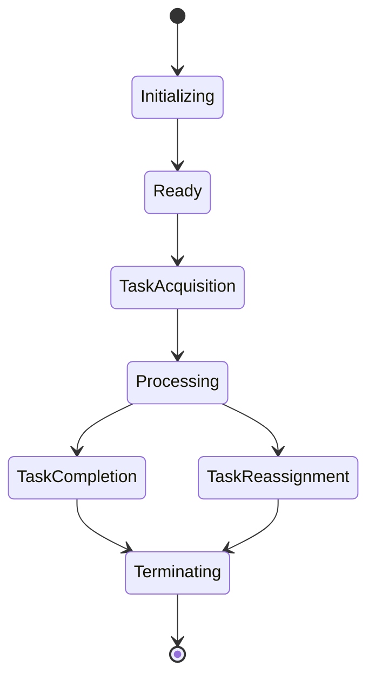
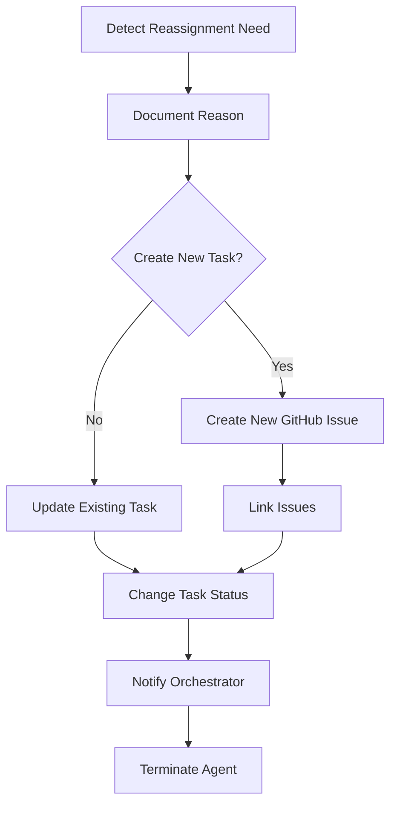
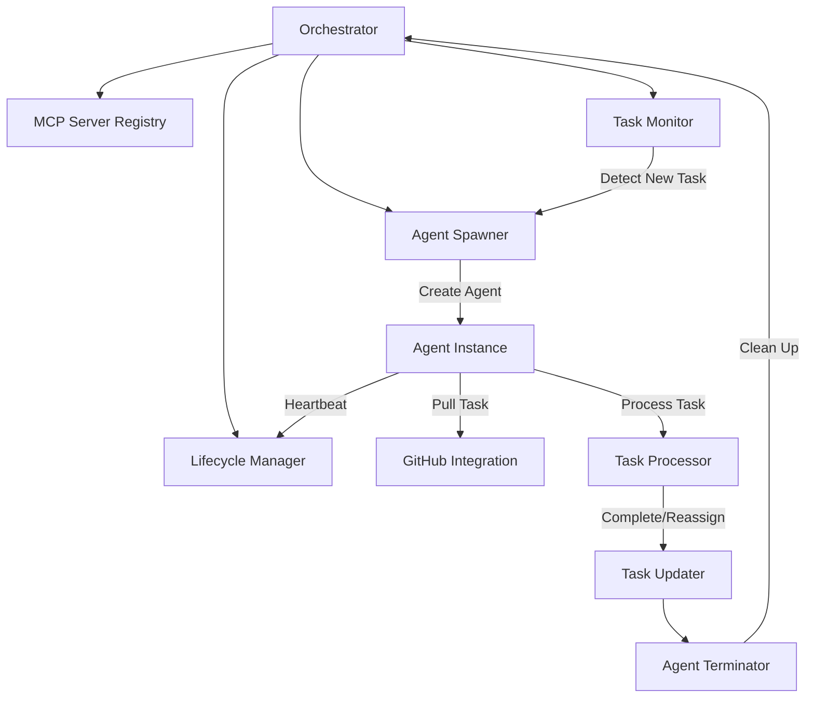

# 🔄 Agent Lifecycle Management

<!-- 📑 TABLE OF CONTENTS -->
- [🔄 Agent Lifecycle Management](#-agent-lifecycle-management)
  - [📋 Overview](#-overview)
  - [🚀 On-Demand Agent Spawning](#-on-demand-agent-spawning)
  - [🔄 Kanban Task Processing](#-kanban-task-processing)
  - [🧬 Agent Lifecycle States](#-agent-lifecycle-states)
  - [📤 Task Reassignment](#-task-reassignment)
  - [🔌 MCP Server Management](#-mcp-server-management)
  - [⚙️ Implementation Architecture](#️-implementation-architecture)
  - [📝 Logging and Monitoring](#-logging-and-monitoring)

---

## 📋 Overview

The Agent Lifecycle Management system controls the spawning, operation, and termination of agent instances. Agents are created on-demand, pull tasks from a Kanban-style board implemented via GitHub issues, and terminate after task completion or reassignment. This approach optimizes resource usage while maintaining the flexibility to handle various task types and agent specializations.

## 🚀 On-Demand Agent Spawning

Agents are spawned on-demand using the following workflow:



### Spawning Process

1. **Task Detection**: The Orchestrator monitors GitHub for new issues with appropriate tags
2. **Agent Type Determination**: Based on issue tags/content, determine required agent type
3. **Template Loading**: Load appropriate agent template from the team directory
4. **Instance Configuration**:
   - Generate unique agent ID and configure working directory
   - Assign port for MCP server
   - Configure GitHub access tokens
   - Set up logging for the instance
5. **Process Spawning**: Launch Claude Code instance with appropriate parameters
6. **Agent Registration**: Register the new agent with the Orchestrator
7. **Task Notification**: Notify the agent about available tasks

### Spawning Script

```bash
#!/bin/bash
# spawn-agent.sh - Spawn a new agent instance on demand

# Import utilities
source "$(dirname "$0")/utils/config.sh"

# Parse arguments
AGENT_TYPE="$1"
TASK_ID="$2"
PRIORITY="${3:-medium}"

# Validate arguments
if [[ -z "$AGENT_TYPE" || -z "$TASK_ID" ]]; then
  echo "Usage: spawn-agent.sh <agent_type> <task_id> [priority]"
  exit 1
fi

# Find appropriate agent template
TEMPLATE_DIR=$(find_agent_template "$AGENT_TYPE")
if [[ -z "$TEMPLATE_DIR" || ! -d "$TEMPLATE_DIR" ]]; then
  echo "Error: No template found for agent type: ${AGENT_TYPE}"
  exit 1
fi

# Generate unique agent ID
AGENT_ID="${AGENT_TYPE}-$(uuidgen | cut -d'-' -f1)"

# Create agent instance directory
INSTANCE_DIR="${WORKSPACE_DIR}/instances/${AGENT_ID}"
mkdir -p "${INSTANCE_DIR}/memory"
mkdir -p "${INSTANCE_DIR}/logs"

# Copy template files
cp -r "${TEMPLATE_DIR}/." "${INSTANCE_DIR}/"

# Configure agent instance
configure_agent_instance "$INSTANCE_DIR" "$AGENT_ID" "$AGENT_TYPE" "$TASK_ID" "$PRIORITY"

# Spawn Claude Code process
PORT=$(find_available_port)
CLAUDE_PID=$(claude-code \
  --profile "${INSTANCE_DIR}/profile.txt" \
  --system-prompt "${INSTANCE_DIR}/profile.txt" \
  --verbose --debug --mcp-debug \
  --mcp-server --port $PORT \
  --working-directory "${INSTANCE_DIR}/workspace" \
  --name "$AGENT_ID" \
  > "${INSTANCE_DIR}/logs/claude.log" 2>&1 & echo $!)

# Store PID and port
echo "$CLAUDE_PID" > "${INSTANCE_DIR}/pid"
echo "$PORT" > "${INSTANCE_DIR}/port"

# Register agent with orchestrator
register_agent "$AGENT_ID" "$PORT" "$AGENT_TYPE" "$TASK_ID"

echo "Spawned agent ${AGENT_ID} (PID: ${CLAUDE_PID}, Port: ${PORT}) for task ${TASK_ID}"
```

## 🔄 Kanban Task Processing

Agents use a Kanban-style approach for task processing, implemented through GitHub issues:

### Kanban Board Structure

The Kanban board is implemented using GitHub issue labels:

1. **To Do**: Issues ready to be worked on (`status:to-do`)
2. **In Progress**: Issues currently being worked on (`status:in-progress`)
3. **Review**: Issues awaiting review (`status:review`)
4. **Done**: Completed issues (`status:done`)
5. **Blocked**: Issues that cannot proceed (`status:blocked`)

Additional labels indicate task types, priorities, and required agent specializations.

### Task Pull Mechanism

Agents pull tasks using this process:

1. Agent queries GitHub for available tasks matching its capabilities
2. Agent selects highest priority task based on labels and assignment
3. Agent updates issue to "In Progress" status
4. Agent processes the task
5. Upon completion, agent updates issue with results and changes status
6. Agent terminates after task completion

```bash
#!/bin/bash
# pull-task.sh - Pull next available task for an agent

# Import utilities
source "$(dirname "$0")/utils/config.sh"
source "$(dirname "$0")/utils/github.sh"

# Parse arguments
AGENT_ID="$1"
AGENT_TYPE="$2"

# Validate arguments
if [[ -z "$AGENT_ID" || -z "$AGENT_TYPE" ]]; then
  echo "Usage: pull-task.sh <agent_id> <agent_type>"
  exit 1
fi

# Find available tasks matching agent capabilities
AGENT_CAPABILITIES=$(get_agent_capabilities "$AGENT_ID")
REPO=$(jq -r '.github.repo' "${CONFIG_DIR}/system.json")

# Query GitHub for matching tasks
echo "Querying for available tasks matching ${AGENT_TYPE}..."
TASKS=$(get_github_issues "$REPO" "open" "status:to-do,agent:${AGENT_TYPE}")

# Select highest priority task
if [[ $(echo "$TASKS" | jq '. | length') -eq 0 ]]; then
  echo "No available tasks found for ${AGENT_TYPE}"
  exit 1
fi

TASK=$(echo "$TASKS" | jq 'sort_by(.labels[] | select(.name | startswith("priority:")) | .name) | reverse | .[0]')
TASK_NUMBER=$(echo "$TASK" | jq -r '.number')
TASK_TITLE=$(echo "$TASK" | jq -r '.title')

echo "Selected task #${TASK_NUMBER}: ${TASK_TITLE}"

# Update task status to In Progress
update_github_issue "$REPO" "$TASK_NUMBER" "{
  \"labels\": [\"status:in-progress\"],
  \"assignees\": [\"$AGENT_ID\"]
}"

echo "Updated task #${TASK_NUMBER} to In Progress and assigned to ${AGENT_ID}"
echo "$TASK_NUMBER" > "/tmp/agent_${AGENT_ID}_task"

# Return task information
echo "$TASK"
```

## 🧬 Agent Lifecycle States

Agents progress through these lifecycle states:



### State Handlers

Each state has specific handlers:

1. **Initializing**:
   - Load agent configuration and capabilities
   - Initialize MCP server
   - Connect to orchestrator
   - Set up GitHub integration

2. **Ready**:
   - Signal availability to orchestrator
   - Monitor for task notifications

3. **TaskAcquisition**:
   - Query GitHub for available tasks
   - Select appropriate task
   - Update task status

4. **Processing**:
   - Execute task using appropriate process
   - Monitor progress
   - Check for blockers

5. **TaskCompletion**:
   - Update task with results
   - Update task status
   - Notify orchestrator of completion

6. **TaskReassignment**:
   - Determine appropriate new agent type
   - Document blocker/reason for reassignment
   - Create new task if needed
   - Update original task status

7. **Terminating**:
   - Clean up resources
   - Unregister from orchestrator
   - Shut down MCP server
   - Exit process

## 📤 Task Reassignment

Agents can reassign tasks when they determine they cannot complete them:

### Reassignment Triggers

1. **Capability Mismatch**: Agent discovers it lacks necessary capabilities
2. **Decision Needed**: Agent requires a decision from another agent/role
3. **Dependency Blocker**: Task depends on another uncompleted task
4. **Question Raised**: Agent needs information not available to it

### Reassignment Process



The process includes:

1. **Reason Documentation**: Agent clearly documents why it cannot complete task
2. **New Task Creation**: If needed, agent creates a new GitHub issue
3. **Issue Linking**: New issue references original issue
4. **Status Update**: Original issue status changes to "Blocked" or appropriate status
5. **Orchestrator Notification**: Agent informs orchestrator of reassignment

```bash
#!/bin/bash
# reassign-task.sh - Reassign a task to another agent type

# Import utilities
source "$(dirname "$0")/utils/config.sh"
source "$(dirname "$0")/utils/github.sh"

# Parse arguments
AGENT_ID="$1"
TASK_NUMBER="$2"
TARGET_AGENT_TYPE="$3"
REASON="$4"
CREATE_NEW="${5:-false}"

# Validate arguments
if [[ -z "$AGENT_ID" || -z "$TASK_NUMBER" || -z "$TARGET_AGENT_TYPE" || -z "$REASON" ]]; then
  echo "Usage: reassign-task.sh <agent_id> <task_number> <target_agent_type> <reason> [create_new]"
  exit 1
fi

# Get repository from config
REPO=$(jq -r '.github.repo' "${CONFIG_DIR}/system.json")

# Get current task details
TASK=$(get_github_issue "$REPO" "$TASK_NUMBER")
TASK_TITLE=$(echo "$TASK" | jq -r '.title')

if [[ "$CREATE_NEW" == "true" ]]; then
  # Create new task for target agent type
  NEW_TASK_BODY="**This task was created by agent ${AGENT_ID}**

## Reason for Creation
${REASON}

## Original Task
#${TASK_NUMBER} - ${TASK_TITLE}

## Required Action
[Describe what needs to be done]
"
  
  NEW_TASK=$(create_github_issue "$REPO" "[$TARGET_AGENT_TYPE] Action required: ${TASK_TITLE}" "$NEW_TASK_BODY" "[\"status:to-do\", \"agent:${TARGET_AGENT_TYPE}\", \"priority:high\"]")
  NEW_TASK_NUMBER=$(echo "$NEW_TASK" | jq -r '.number')
  
  echo "Created new task #${NEW_TASK_NUMBER} for ${TARGET_AGENT_TYPE}"
  
  # Update original task with reference to new task
  COMMENT="**Task Reassignment**

I, agent ${AGENT_ID}, am unable to complete this task due to the following:

${REASON}

I've created a new task #${NEW_TASK_NUMBER} for ${TARGET_AGENT_TYPE} to address this.
"
  
  add_github_comment "$REPO" "$TASK_NUMBER" "$COMMENT"
  
  # Update original task status to blocked
  update_github_issue "$REPO" "$TASK_NUMBER" "{
    \"labels\": [\"status:blocked\"],
    \"assignees\": []
  }"
  
else
  # Just reassign the existing task
  COMMENT="**Task Reassignment**

I, agent ${AGENT_ID}, am unable to complete this task due to the following:

${REASON}

This task should be handled by an agent of type: ${TARGET_AGENT_TYPE}
"
  
  add_github_comment "$REPO" "$TASK_NUMBER" "$COMMENT"
  
  # Update task with new agent type and reset status to to-do
  update_github_issue "$REPO" "$TASK_NUMBER" "{
    \"labels\": [\"status:to-do\", \"agent:${TARGET_AGENT_TYPE}\"],
    \"assignees\": []
  }"
fi

echo "Task #${TASK_NUMBER} has been reassigned from ${AGENT_ID} to ${TARGET_AGENT_TYPE}"

# Notify orchestrator of reassignment
notify_orchestrator_reassignment "$AGENT_ID" "$TASK_NUMBER" "$TARGET_AGENT_TYPE" "$REASON"
```

## 🔌 MCP Server Management

Since agents operate as MCP servers, careful lifecycle management is required:

### MCP Server Registry

The system maintains a registry of active MCP servers:

```json
{
  "servers": [
    {
      "agent_id": "react-dev-eb4a2",
      "port": 8101,
      "pid": 12345,
      "status": "active",
      "task_id": "123",
      "started_at": "2024-05-16T12:34:56Z",
      "last_heartbeat": "2024-05-16T13:34:56Z"
    },
    ...
  ]
}
```

### Heartbeat Mechanism

Agents send regular heartbeats to the orchestrator:

```bash
#!/bin/bash
# heartbeat.sh - Send agent heartbeat to orchestrator

# Import utilities
source "$(dirname "$0")/utils/config.sh"

# Parse arguments
AGENT_ID="$1"
STATUS="${2:-active}"

# Validate arguments
if [[ -z "$AGENT_ID" ]]; then
  echo "Usage: heartbeat.sh <agent_id> [status]"
  exit 1
fi

# Get orchestrator endpoint
ORCHESTRATOR_PORT=$(jq -r '.orchestrator.port' "${CONFIG_DIR}/system.json")

# Send heartbeat
TIMESTAMP=$(date -u +"%Y-%m-%dT%H:%M:%SZ")
PAYLOAD="{\"agent_id\": \"$AGENT_ID\", \"status\": \"$STATUS\", \"timestamp\": \"$TIMESTAMP\"}"

curl -s -X POST "http://localhost:${ORCHESTRATOR_PORT}/heartbeat" \
  -H "Content-Type: application/json" \
  -d "$PAYLOAD" > /dev/null

echo "Sent heartbeat for agent ${AGENT_ID}"
```

### Graceful Termination

When an agent completes its task, it terminates gracefully:

```bash
#!/bin/bash
# terminate-agent.sh - Gracefully terminate an agent

# Import utilities
source "$(dirname "$0")/utils/config.sh"

# Parse arguments
AGENT_ID="$1"
REASON="${2:-task_completed}"

# Validate arguments
if [[ -z "$AGENT_ID" ]]; then
  echo "Usage: terminate-agent.sh <agent_id> [reason]"
  exit 1
fi

# Find agent instance directory
INSTANCE_DIR="${WORKSPACE_DIR}/instances/${AGENT_ID}"
if [[ ! -d "$INSTANCE_DIR" ]]; then
  echo "Error: Agent instance directory not found: ${INSTANCE_DIR}"
  exit 1
fi

# Send final heartbeat
"${BIN_DIR}/heartbeat.sh" "$AGENT_ID" "terminating"

# Unregister from orchestrator
ORCHESTRATOR_PORT=$(jq -r '.orchestrator.port' "${CONFIG_DIR}/system.json")
curl -s -X DELETE "http://localhost:${ORCHESTRATOR_PORT}/agents/${AGENT_ID}" \
  -H "Content-Type: application/json" \
  -d "{\"reason\": \"$REASON\"}" > /dev/null

# Get PID
if [[ ! -f "${INSTANCE_DIR}/pid" ]]; then
  echo "Error: PID file not found"
  exit 1
fi

PID=$(cat "${INSTANCE_DIR}/pid")

# Terminate process gracefully
echo "Terminating agent ${AGENT_ID} (PID: ${PID})"
kill -TERM $PID

# Wait for process to exit
TIMEOUT=30
COUNT=0
while kill -0 $PID 2>/dev/null; do
  sleep 1
  COUNT=$((COUNT + 1))
  if [[ $COUNT -ge $TIMEOUT ]]; then
    echo "Force terminating agent ${AGENT_ID}"
    kill -KILL $PID
    break
  fi
done

# Archive logs
ARCHIVE_DIR="${LOGS_DIR}/archived/${AGENT_ID}_$(date +%Y%m%d_%H%M%S)"
mkdir -p "$ARCHIVE_DIR"
cp -r "${INSTANCE_DIR}/logs/." "$ARCHIVE_DIR/"

# Clean up instance directory
rm -rf "$INSTANCE_DIR"

echo "Agent ${AGENT_ID} terminated and cleaned up"
```

### Recovery Mechanism

The orchestrator monitors agent health and can recover from failures:

1. **Heartbeat Monitoring**: Detect missing heartbeats
2. **Process Monitoring**: Check if agent process is still running
3. **Task Recovery**: Reassign tasks from failed agents
4. **Server Cleanup**: Clean up resources from failed servers

## ⚙️ Implementation Architecture

The implementation architecture includes these components:



### Key Components

1. **Orchestrator**: Central coordination service
2. **MCP Server Registry**: Tracks active MCP servers
3. **Task Monitor**: Monitors GitHub for new tasks
4. **Agent Spawner**: Creates new agent instances
5. **Lifecycle Manager**: Manages agent lifecycle states
6. **Agent Instance**: Individual Claude Code instance
7. **GitHub Integration**: Interacts with GitHub issues
8. **Task Processor**: Handles task execution
9. **Task Updater**: Updates task status/content
10. **Agent Terminator**: Handles graceful shutdown

## 📝 Logging and Monitoring

Comprehensive logging tracks the agent lifecycle:

### Log Categories

1. **Spawning Logs**: Agent creation and initialization
2. **Heartbeat Logs**: Agent health status
3. **Task Logs**: Task acquisition and processing
4. **MCP Logs**: MCP server communication
5. **Termination Logs**: Agent shutdown and cleanup

### Monitoring Metrics

1. **Active Agents**: Number of active agent instances
2. **Task Throughput**: Tasks processed per time period
3. **Agent Lifespan**: Duration from spawn to termination
4. **Reassignment Rate**: Percentage of tasks reassigned
5. **Failure Rate**: Percentage of agent failures

---

<!-- 🧭 NAVIGATION -->
**Navigation**: [Home](../README.md) | [Component Index](./README.md) | [Agent Creation Process](./agent-creation-process.md)

*Last updated: 2024-05-16*