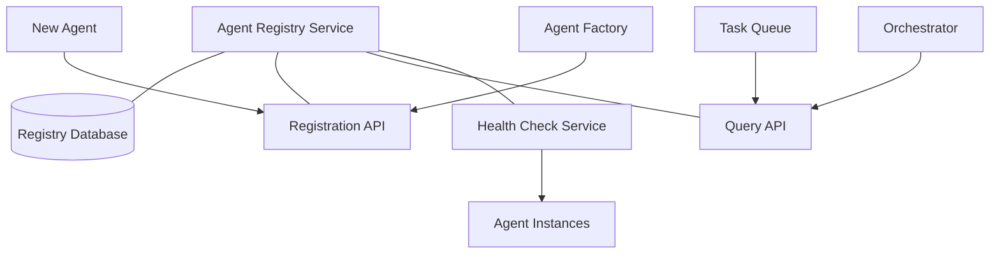
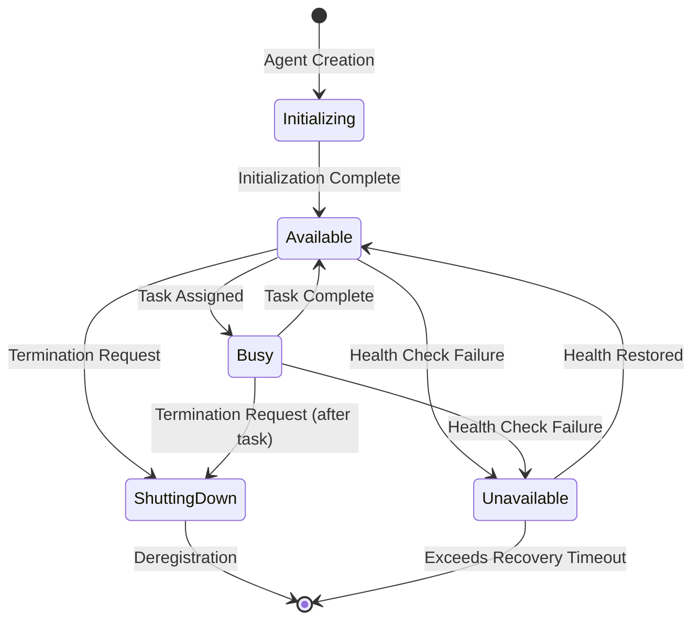

# 📒 Agent Registry Component

<!-- 📑 TABLE OF CONTENTS -->
- [📒 Agent Registry Component](#-agent-registry-component)
  - [📖 Description](#-description)
  - [🏗️ Architecture](#️-architecture)
  - [🧰 Implementation](#-implementation)
  - [🔄 Agent Lifecycle Management](#-agent-lifecycle-management)
  - [🧩 Capability Model](#-capability-model)
  - [📊 Agent Status and Health Monitoring](#-agent-status-and-health-monitoring)
  - [🔍 Agent Discovery](#-agent-discovery)

---

## 📖 Description

The Agent Registry is a central component in the multi-agent system that maintains a comprehensive directory of all available agents, their capabilities, current status, and performance metrics. It acts as a service discovery mechanism, enabling the Orchestrator and Task Queue to efficiently match tasks to the most suitable agents. The registry tracks both static information (agent specializations, system requirements) and dynamic information (current load, availability).

## 🏗️ Architecture

The Agent Registry implements a lightweight service registry pattern with the following components:



Key components include:

1. **Registry Database**: Stores agent information in a structured format
2. **Registration API**: Handles agent registration, updates, and deregistration
3. **Query API**: Provides filtering and selection capabilities for finding suitable agents
4. **Health Check Service**: Monitors agent health and updates status

## 🧰 Implementation

The Agent Registry is implemented using simple file-based storage with shell scripts for manipulation:

```bash
# Agent registry implementation
cat << 'EOF' > ./scripts/agent_registry.sh
#!/bin/bash

# Configuration
REGISTRY_DIR="$(pwd)/registry"
AGENTS_FILE="${REGISTRY_DIR}/agents.json"

# Initialize registry if it doesn't exist
function init_registry() {
  mkdir -p "$REGISTRY_DIR"
  if [[ ! -f "$AGENTS_FILE" ]]; then
    echo '{"agents":[]}' > "$AGENTS_FILE"
    echo "Agent registry initialized at $AGENTS_FILE"
  fi
}

# Register a new agent
function register_agent() {
  agent_name="$1"
  agent_type="$2"
  capabilities="$3"
  endpoint="$4"
  
  # Create agent entry
  agent_entry=$(cat << AGENT
{
  "name": "$agent_name",
  "type": "$agent_type",
  "capabilities": $capabilities,
  "endpoint": "$endpoint",
  "status": "available",
  "load": 0,
  "created_at": "$(date -u +"%Y-%m-%dT%H:%M:%SZ")",
  "last_seen": "$(date -u +"%Y-%m-%dT%H:%M:%SZ")"
}
AGENT
)
  
  # Add to registry
  tmp_file=$(mktemp)
  jq ".agents += [$agent_entry]" "$AGENTS_FILE" > "$tmp_file"
  mv "$tmp_file" "$AGENTS_FILE"
  
  echo "Agent $agent_name registered successfully"
}

# Update agent status
function update_agent_status() {
  agent_name="$1"
  status="$2"
  load="$3"
  
  tmp_file=$(mktemp)
  jq ".agents |= map(if .name == \"$agent_name\" then .status = \"$status\" | .load = $load | .last_seen = \"$(date -u +"%Y-%m-%dT%H:%M:%SZ")\" else . end)" "$AGENTS_FILE" > "$tmp_file"
  mv "$tmp_file" "$AGENTS_FILE"
  
  echo "Agent $agent_name status updated to $status with load $load"
}

# Deregister an agent
function deregister_agent() {
  agent_name="$1"
  
  tmp_file=$(mktemp)
  jq ".agents |= map(select(.name != \"$agent_name\"))" "$AGENTS_FILE" > "$tmp_file"
  mv "$tmp_file" "$AGENTS_FILE"
  
  echo "Agent $agent_name deregistered"
}

# Find suitable agents for a given task
function find_suitable_agents() {
  capability="$1"
  max_load="$2"
  
  jq -c ".agents[] | select(.status == \"available\" and .load <= $max_load and .capabilities[] | contains(\"$capability\"))" "$AGENTS_FILE"
}

# Get all agents
function get_all_agents() {
  jq ".agents" "$AGENTS_FILE"
}

# Check for stale agents and mark them as unavailable
function check_stale_agents() {
  # Consider agents not seen in the last 5 minutes as stale
  cutoff_time=$(date -d "5 minutes ago" -u +"%Y-%m-%dT%H:%M:%SZ")
  
  tmp_file=$(mktemp)
  jq ".agents |= map(if .last_seen < \"$cutoff_time\" and .status != \"unavailable\" then .status = \"unavailable\" else . end)" "$AGENTS_FILE" > "$tmp_file"
  mv "$tmp_file" "$AGENTS_FILE"
  
  stale_count=$(jq ".agents | map(select(.last_seen < \"$cutoff_time\")) | length" "$AGENTS_FILE")
  echo "Found $stale_count stale agents, marked as unavailable"
}

# Usage handling
case "$1" in
  "init")
    init_registry
    ;;
  "register")
    register_agent "$2" "$3" "$4" "$5"
    ;;
  "update")
    update_agent_status "$2" "$3" "$4"
    ;;
  "deregister")
    deregister_agent "$2"
    ;;
  "find")
    find_suitable_agents "$2" "${3:-100}"
    ;;
  "list")
    get_all_agents
    ;;
  "check-stale")
    check_stale_agents
    ;;
  *)
    echo "Usage: $0 {init|register|update|deregister|find|list|check-stale}"
    exit 1
    ;;
esac
EOF

chmod +x ./scripts/agent_registry.sh
```

## 🔄 Agent Lifecycle Management

The Agent Registry works closely with the Agent Factory and Lifecycle Management components to track agent states throughout their lifecycle:

1. **Creation**: When a new agent is created, it's registered with its capabilities
2. **Initialization**: Agents report when they're fully initialized and ready to accept tasks
3. **Active State**: Agents periodically report health status and current load
4. **Busy State**: Agents update their status when working on tasks
5. **Idle State**: Agents report when they're available for new tasks
6. **Shutdown**: Agents deregister themselves before graceful termination
7. **Failure Detection**: Registry detects failed agents through missed health checks

The lifecycle state machine is defined as:



## 🧩 Capability Model

The registry implements a structured capability model for precise task-agent matching:

1. **Domain Capabilities**: Knowledge domains the agent specializes in (e.g., "python", "react", "security")
2. **Function Capabilities**: Types of tasks the agent can perform (e.g., "code", "test", "document", "analyze")
3. **Skill Level**: Proficiency in each domain (e.g., "expert", "intermediate", "basic")
4. **Resource Capabilities**: Available memory, processing capacity, etc.
5. **Tool Access**: What external tools the agent can utilize

Capabilities are stored in a structured JSON format:

```json
{
  "domains": [
    {"name": "python", "level": "expert"},
    {"name": "javascript", "level": "intermediate"},
    {"name": "security", "level": "basic"}
  ],
  "functions": ["code", "test", "review"],
  "resources": {
    "memory": "high",
    "processing": "medium",
    "context_length": 100000
  },
  "tools": ["git", "bash", "pip"]
}
```

## 📊 Agent Status and Health Monitoring

The registry implements a comprehensive health monitoring system:

1. **Heartbeat Mechanism**: Agents send periodic heartbeats to confirm availability
2. **Load Metrics**: Agents report their current load (0-100%)
3. **Response Time**: Registry tracks agent response times to detect degradation
4. **Error Rates**: Registry monitors task failure rates for each agent
5. **Recovery Tracking**: Tracks agent recovery after failures

Health status information is used by the Task Queue for intelligent task routing.

## 🔍 Agent Discovery

The registry provides multiple methods for discovering and selecting agents:

1. **Capability-Based Selection**: Find agents with specific capabilities
2. **Load-Based Selection**: Find agents with available capacity
3. **Affinity Selection**: Find agents that previously worked on related tasks
4. **Round-Robin Selection**: Distribute tasks evenly across suitable agents
5. **Availability Filtering**: Filter out unavailable or heavily loaded agents

Example discovery query:

```bash
# Find Python expert agents with testing capability and low load
./scripts/agent_registry.sh find '{"domains": [{"name": "python", "level": "expert"}], "functions": ["test"]}' 50
```

---

<!-- 🧭 NAVIGATION -->
**Navigation**: [Home](../README.md) | [Components](./README.md) | [Task Queue](./task-queue.md) | [Communication Hub](./communication-hub.md)

*Last updated: 2024-05-16*