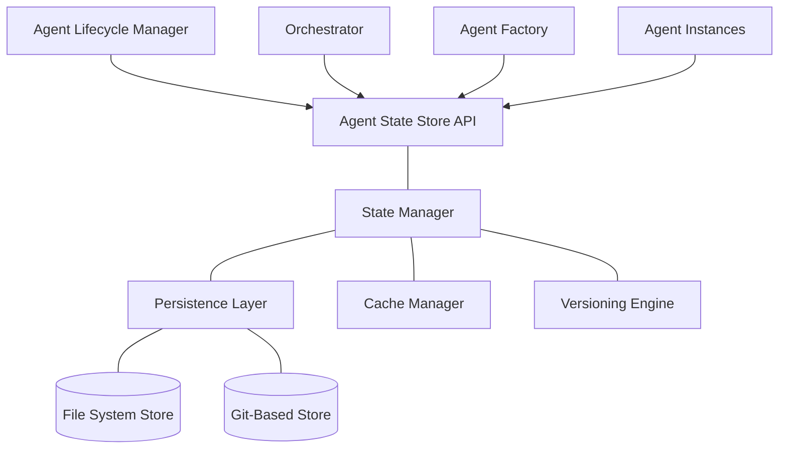
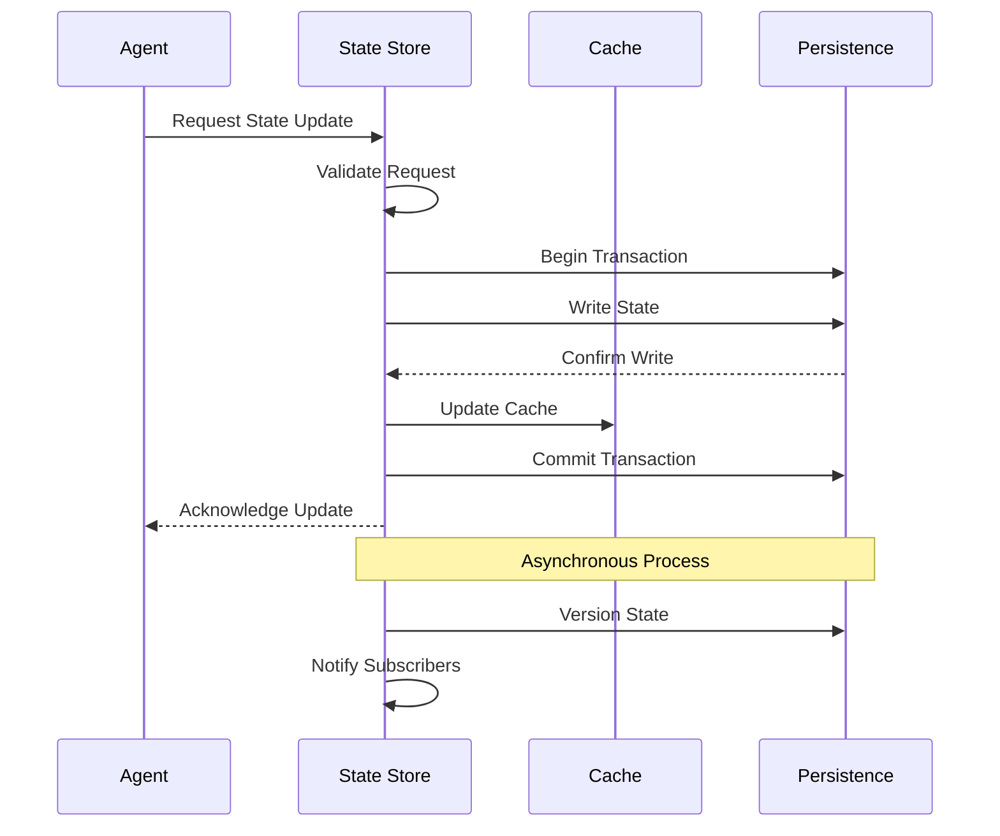

# 💾 Agent State Store Component

<!-- 📑 TABLE OF CONTENTS -->
- [💾 Agent State Store Component](#-agent-state-store-component)
  - [📖 Description](#-description)
  - [🏗️ Architecture](#️-architecture)
  - [🧰 Implementation](#-implementation)
  - [💾 State Persistence](#-state-persistence)
  - [🔄 State Synchronization](#-state-synchronization)
  - [🛡️ Security and Access Control](#️-security-and-access-control)
  - [🚀 Performance Considerations](#-performance-considerations)
  - [🔌 Integration Points](#-integration-points)

---

## 📖 Description

The Agent State Store is a critical persistence component responsible for storing, retrieving, and managing the state of all agents in the multi-agent system. It ensures that agent configurations, runtime states, and historical context are preserved across agent lifecycles, system restarts, and deployments. The State Store enables the system to maintain continuity, recover from failures, and optimize resource usage by providing a reliable persistence layer for agent state information.

## 🏗️ Architecture

The Agent State Store follows a layered architecture with specialized components for different aspects of state management:



Key components include:

1. **State Store API**: Provides a unified interface for state operations
2. **State Manager**: Coordinates state operations and maintains consistency
3. **Persistence Layer**: Handles durable storage of state data
4. **Cache Manager**: Optimizes access to frequently used state information
5. **Versioning Engine**: Maintains state history and enables rollbacks

## 🧰 Implementation

The Agent State Store is implemented using a combination of file-based storage and Git for version control:

```bash
# Agent State Store implementation
cat << 'EOF' > ./scripts/agent_state_store.sh
#!/bin/bash

# Configuration
STATE_DIR="$(pwd)/state"
STATE_REPO="$(pwd)/state_repo"
CACHE_DIR="$(pwd)/state_cache"

# Initialize state store
function init_state_store() {
  # Create state directories
  mkdir -p "$STATE_DIR"
  mkdir -p "$CACHE_DIR"
  
  # Initialize Git repository for versioning if it doesn't exist
  if [[ ! -d "$STATE_REPO/.git" ]]; then
    mkdir -p "$STATE_REPO"
    cd "$STATE_REPO"
    git init --quiet
    echo "# Agent State Repository" > README.md
    git add README.md
    git config --local user.email "system@agent-system.local"
    git config --local user.name "Agent System"
    git commit -m "Initial commit" --quiet
    cd - > /dev/null
  fi
  
  echo "Agent State Store initialized at $STATE_DIR with versioning at $STATE_REPO"
}

# Save agent state
function save_agent_state() {
  agent_id="$1"
  state_type="$2"  # "config", "runtime", or "memory"
  state_data="$3"
  
  # Create agent directory if it doesn't exist
  agent_dir="$STATE_DIR/$agent_id"
  mkdir -p "$agent_dir"
  
  # Save state to file
  state_file="$agent_dir/${state_type}.json"
  echo "$state_data" > "$state_file"
  
  # Update cache
  cp "$state_file" "$CACHE_DIR/${agent_id}_${state_type}.json"
  
  # Version the state if it's a config or memory
  if [[ "$state_type" == "config" || "$state_type" == "memory" ]]; then
    # Copy to versioned repository
    mkdir -p "$STATE_REPO/$agent_id"
    cp "$state_file" "$STATE_REPO/$agent_id/"
    
    # Commit changes
    cd "$STATE_REPO"
    git add "$agent_id/${state_type}.json"
    git commit -m "Update $state_type state for agent $agent_id" --quiet
    cd - > /dev/null
  fi
  
  echo "State saved for agent $agent_id ($state_type)"
}

# Load agent state
function load_agent_state() {
  agent_id="$1"
  state_type="$2"  # "config", "runtime", or "memory"
  
  # Check cache first
  cache_file="$CACHE_DIR/${agent_id}_${state_type}.json"
  if [[ -f "$cache_file" ]]; then
    # Get file modification time
    cache_mtime=$(stat -c %Y "$cache_file" 2>/dev/null || stat -f %m "$cache_file")
    state_file="$STATE_DIR/$agent_id/${state_type}.json"
    
    if [[ -f "$state_file" ]]; then
      state_mtime=$(stat -c %Y "$state_file" 2>/dev/null || stat -f %m "$state_file")
      
      # If cache is current, use it
      if [[ $cache_mtime -ge $state_mtime ]]; then
        cat "$cache_file"
        return 0
      fi
    fi
  fi
  
  # Fall back to state file
  state_file="$STATE_DIR/$agent_id/${state_type}.json"
  if [[ -f "$state_file" ]]; then
    # Update cache
    cp "$state_file" "$CACHE_DIR/${agent_id}_${state_type}.json"
    cat "$state_file"
    return 0
  fi
  
  # State not found
  echo "{\"error\": \"State not found for agent $agent_id ($state_type)\"}"
  return 1
}

# Delete agent state
function delete_agent_state() {
  agent_id="$1"
  state_type="$2"  # "config", "runtime", "memory", or "all"
  
  if [[ "$state_type" == "all" ]]; then
    # Delete all state for the agent
    rm -rf "$STATE_DIR/$agent_id"
    rm -f "$CACHE_DIR/${agent_id}_"*
    
    # Record deletion in versioned repository
    if [[ -d "$STATE_REPO/$agent_id" ]]; then
      cd "$STATE_REPO"
      git rm -rf "$agent_id" --quiet
      git commit -m "Delete all state for agent $agent_id" --quiet
      cd - > /dev/null
    fi
    
    echo "All state deleted for agent $agent_id"
  else
    # Delete specific state type
    rm -f "$STATE_DIR/$agent_id/${state_type}.json"
    rm -f "$CACHE_DIR/${agent_id}_${state_type}.json"
    
    # Record deletion in versioned repository if it's config or memory
    if [[ "$state_type" == "config" || "$state_type" == "memory" ]]; then
      if [[ -f "$STATE_REPO/$agent_id/${state_type}.json" ]]; then
        cd "$STATE_REPO"
        git rm "$agent_id/${state_type}.json" --quiet
        git commit -m "Delete $state_type state for agent $agent_id" --quiet
        cd - > /dev/null
      fi
    fi
    
    echo "State type $state_type deleted for agent $agent_id"
  fi
}

# List all agents with stored state
function list_agents() {
  # List all agent directories
  find "$STATE_DIR" -mindepth 1 -maxdepth 1 -type d -exec basename {} \; | sort
}

# Get agent state history
function get_state_history() {
  agent_id="$1"
  state_type="$2"  # "config" or "memory"
  
  if [[ "$state_type" != "config" && "$state_type" != "memory" ]]; then
    echo "History only available for config or memory state types"
    return 1
  fi
  
  # Check if agent has versioned state
  if [[ ! -f "$STATE_REPO/$agent_id/${state_type}.json" ]]; then
    echo "No history found for agent $agent_id ($state_type)"
    return 1
  fi
  
  # Get commit history for this file
  cd "$STATE_REPO"
  git log --pretty=format:"%h %ad %s" --date=short -- "$agent_id/${state_type}.json"
  cd - > /dev/null
}

# Restore agent state to a previous version
function restore_state_version() {
  agent_id="$1"
  state_type="$2"  # "config" or "memory"
  commit_id="$3"
  
  if [[ "$state_type" != "config" && "$state_type" != "memory" ]]; then
    echo "Restore only available for config or memory state types"
    return 1
  fi
  
  # Check if agent has versioned state
  if [[ ! -f "$STATE_REPO/$agent_id/${state_type}.json" ]]; then
    echo "No history found for agent $agent_id ($state_type)"
    return 1
  fi
  
  # Restore file from specific commit
  cd "$STATE_REPO"
  git checkout "$commit_id" -- "$agent_id/${state_type}.json"
  restored_content=$(cat "$agent_id/${state_type}.json")
  
  # Commit the restoration
  git add "$agent_id/${state_type}.json"
  git commit -m "Restore $state_type state for agent $agent_id to version $commit_id" --quiet
  cd - > /dev/null
  
  # Update the actual state
  save_agent_state "$agent_id" "$state_type" "$restored_content"
  
  echo "State restored for agent $agent_id ($state_type) to version $commit_id"
}

# Usage handling
case "$1" in
  "init")
    init_state_store
    ;;
  "save")
    save_agent_state "$2" "$3" "$4"
    ;;
  "load")
    load_agent_state "$2" "$3"
    ;;
  "delete")
    delete_agent_state "$2" "$3"
    ;;
  "list")
    list_agents
    ;;
  "history")
    get_state_history "$2" "$3"
    ;;
  "restore")
    restore_state_version "$2" "$3" "$4"
    ;;
  *)
    echo "Usage: $0 {init|save|load|delete|list|history|restore}"
    echo "  init: Initialize the state store"
    echo "  save <agent_id> <state_type> <state_data>: Save agent state"
    echo "  load <agent_id> <state_type>: Load agent state"
    echo "  delete <agent_id> <state_type|all>: Delete agent state"
    echo "  list: List all agents with stored state"
    echo "  history <agent_id> <state_type>: Get state history"
    echo "  restore <agent_id> <state_type> <commit_id>: Restore to previous version"
    exit 1
    ;;
esac
EOF

chmod +x ./scripts/agent_state_store.sh
```

## 💾 State Persistence

The State Store maintains several types of agent state information:

1. **Configuration State**: 
   - Agent role and capabilities
   - System profile and settings
   - External tool integrations
   - Initialization parameters

2. **Runtime State**:
   - Current task assignments
   - Resource utilization
   - Connection status
   - Performance metrics
   - Temporary work artifacts

3. **Memory State**:
   - Long-term memory storage
   - Learning patterns
   - Historical context
   - Knowledge base updates

Each state type is stored with appropriate persistence and versioning characteristics:

| State Type | Persistence | Versioning | Caching | Backup |
|------------|-------------|------------|---------|--------|
| Configuration | Durable | Full history | High | Critical |
| Runtime | Ephemeral | Limited | High | Optional |
| Memory | Durable | Full history | Medium | Critical |

State data is formatted in a structured JSON schema:

```json
{
  "agent_id": "developer-agent-123",
  "state_type": "config",
  "timestamp": "2024-05-16T15:30:45Z",
  "version": 5,
  "data": {
    "role": "developer",
    "capabilities": {
      "domains": ["python", "javascript"],
      "functions": ["code", "test", "refactor"]
    },
    "system_profile": "path/to/profile.txt",
    "settings": {
      "max_memory": "high",
      "debug_mode": true,
      "verbose_logging": true
    },
    "tools": ["git", "npm", "pytest"]
  }
}
```

## 🔄 State Synchronization

The State Store ensures state consistency through:

1. **Atomic Operations**: State updates are atomic to prevent partial updates
2. **Optimistic Concurrency**: Version checking prevents conflicts
3. **Transaction Logging**: All operations are logged for audit and recovery
4. **Change Notifications**: Agents can subscribe to state change events
5. **Periodic Synchronization**: Background processes ensure state consistency

The synchronization process includes:



## 🛡️ Security and Access Control

The State Store implements several security measures:

1. **Authentication**: Only authorized agents can access state data
2. **Authorization**: Access control lists determine read/write permissions
3. **Encryption**: Sensitive state data is encrypted at rest
4. **Audit Logging**: All access and modifications are logged
5. **Data Isolation**: Tenant-specific state is isolated

```bash
# Example access control implementation
function check_access() {
  agent_id="$1"
  target_agent="$2"
  operation="$3"  # "read" or "write"
  
  # Get agent's roles and permissions
  agent_roles=$(get_agent_roles "$agent_id")
  
  # Check if agent has admin role
  if [[ "$agent_roles" == *"admin"* ]]; then
    return 0  # Admin has full access
  fi
  
  # Check if agent is accessing its own state
  if [[ "$agent_id" == "$target_agent" ]]; then
    return 0  # Agent can access its own state
  fi
  
  # Check if agent has specific permission
  if [[ "$operation" == "read" ]]; then
    # Check read permissions
    read_acl=$(get_read_acl "$target_agent")
    if [[ "$read_acl" == *"$agent_id"* || "$read_acl" == *"all"* ]]; then
      return 0
    fi
  elif [[ "$operation" == "write" ]]; then
    # Check write permissions
    write_acl=$(get_write_acl "$target_agent")
    if [[ "$write_acl" == *"$agent_id"* ]]; then
      return 0
    fi
  fi
  
  # Access denied
  return 1
}
```

## 🚀 Performance Considerations

The State Store is optimized for performance:

1. **Multi-Level Caching**: In-memory cache for frequent access patterns
2. **Lazy Loading**: State is loaded on-demand to reduce resource usage
3. **Partial Updates**: Support for updating only changed state fields
4. **Compression**: Large state objects are compressed for efficiency
5. **Batch Operations**: Multiple state updates can be batched for efficiency

Performance metrics are collected to monitor and optimize state operations:

```bash
# Performance monitoring function
function monitor_performance() {
  # Collect metrics over the last hour
  operation_count=$(grep "state_operation" "$LOG_FILE" | wc -l)
  read_count=$(grep "state_operation.*load" "$LOG_FILE" | wc -l)
  write_count=$(grep "state_operation.*save" "$LOG_FILE" | wc -l)
  avg_latency=$(grep "state_operation" "$LOG_FILE" | grep -o "latency=[0-9]*" | cut -d= -f2 | awk '{sum+=$1; count++} END {print sum/count}')
  cache_hit_rate=$(grep "cache_hit" "$LOG_FILE" | wc -l)
  cache_miss_rate=$(grep "cache_miss" "$LOG_FILE" | wc -l)
  
  # Calculate hit rate percentage
  total_cache_ops=$((cache_hit_rate + cache_miss_rate))
  hit_rate_pct=0
  if [[ $total_cache_ops -gt 0 ]]; then
    hit_rate_pct=$(echo "scale=2; ($cache_hit_rate * 100) / $total_cache_ops" | bc)
  fi
  
  # Report metrics
  echo "State Store Performance (last hour):"
  echo "- Total operations: $operation_count"
  echo "- Read operations: $read_count"
  echo "- Write operations: $write_count"
  echo "- Average latency: ${avg_latency:-0} ms"
  echo "- Cache hit rate: $hit_rate_pct%"
  
  # Check for performance issues
  if [[ $(echo "$avg_latency > 100" | bc -l) -eq 1 ]]; then
    echo "WARNING: High average latency detected"
  fi
  
  if [[ $(echo "$hit_rate_pct < 80" | bc -l) -eq 1 ]]; then
    echo "WARNING: Low cache hit rate detected"
  fi
}
```

## 🔌 Integration Points

The State Store integrates with several system components:

1. **Agent Lifecycle Manager**: 
   - Persists agent state during creation and termination
   - Restores agent state when restarting agents
   - Manages state cleanup for terminated agents

2. **Orchestrator**:
   - Accesses agent capabilities for task assignment
   - Updates agent status information
   - Tracks agent availability and load

3. **Agent Factory**:
   - Stores agent templates and configurations
   - Retrieves configuration for new agents
   - Maintains agent creation history

4. **Tenant Manager**:
   - Isolates state data per tenant
   - Enforces tenant-specific retention policies
   - Tracks tenant resource usage

Integration examples:

```bash
# Agent lifecycle integration
function restart_agent() {
  agent_id="$1"
  
  echo "Restarting agent $agent_id..."
  
  # Stop the agent if running
  stop_agent "$agent_id"
  
  # Load agent configuration
  agent_config=$(./scripts/agent_state_store.sh load "$agent_id" "config")
  
  if [[ $? -ne 0 ]]; then
    echo "Failed to load configuration for agent $agent_id"
    return 1
  fi
  
  # Extract agent settings
  agent_role=$(echo "$agent_config" | jq -r '.data.role')
  agent_profile=$(echo "$agent_config" | jq -r '.data.system_profile')
  
  # Start the agent with saved configuration
  start_agent "$agent_id" "$agent_role" "$agent_profile"
  
  # Load memory state if available
  memory_state=$(./scripts/agent_state_store.sh load "$agent_id" "memory" 2>/dev/null)
  if [[ $? -eq 0 ]]; then
    restore_agent_memory "$agent_id" "$memory_state"
  fi
  
  echo "Agent $agent_id restarted successfully"
}

# Orchestrator integration
function update_agent_status() {
  agent_id="$1"
  status="$2"
  task_id="$3"
  
  # Get current runtime state
  runtime_state=$(./scripts/agent_state_store.sh load "$agent_id" "runtime")
  
  # Update status
  updated_state=$(echo "$runtime_state" | jq --arg status "$status" --arg task "$task_id" '.data.status = $status | .data.current_task = $task')
  
  # Save updated state
  ./scripts/agent_state_store.sh save "$agent_id" "runtime" "$updated_state"
  
  echo "Agent $agent_id status updated to $status (Task: $task_id)"
}
```

---

<!-- 🧭 NAVIGATION -->
**Navigation**: [Home](../README.md) | [Components](./README.md) | [Task History](./task-history.md) | [Knowledge Base](./knowledge-base.md)

*Last updated: 2024-05-16*