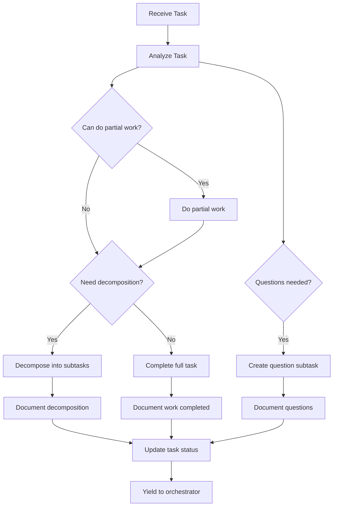

# 🔄 Agent Task Workflow

<!-- 📑 TABLE OF CONTENTS -->
- [🔄 Agent Task Workflow](#-agent-task-workflow)
  - [📋 Overview](#-overview)
  - [📊 Task Processing Workflow](#-task-processing-workflow)
  - [🧩 Task Decomposition](#-task-decomposition)
  - [📝 Task Documentation](#-task-documentation)
  - [❓ Question Handling](#-question-handling)
  - [🔄 Yield Process](#-yield-process)
  - [🏗️ Implementation Guidelines](#️-implementation-guidelines)

---

## 📋 Overview

This document defines the standardized workflow that all agents must follow when handling tasks in the multi-agent system. The workflow ensures consistent task processing, proper documentation, effective decomposition, and appropriate yielding back to the orchestrator. Following this workflow is mandatory for all agents regardless of their specialization.

## 📊 Task Processing Workflow

The standard task handling workflow consists of the following steps:



1. **Task Analysis**: When an agent receives a task, its first step is to thoroughly analyze the task requirements, complexity, and scope.

2. **Partial Work Assessment**: The agent evaluates if any partial work can be completed immediately before further decomposition.

3. **Partial Work Execution**: If partial work is possible, the agent completes and documents this work.

4. **Decomposition Decision**: The agent determines if the task requires decomposition into smaller, more manageable subtasks.

5. **Task Execution or Decomposition**: Based on the decision, the agent either:
   - Completes the entire task if no decomposition is needed, or
   - Decomposes the task into subtasks

6. **Documentation**: The agent documents all work done and/or decomposition performed.

7. **Status Update**: The agent updates the task status to reflect the current state.

8. **Yield to Orchestrator**: The agent yields control back to the orchestrator.

## 🧩 Task Decomposition

When decomposing tasks, agents must follow these guidelines:

1. **Granularity**: Subtasks should be granular enough to be completed by a single agent without further decomposition.

2. **Independence**: Subtasks should be as independent as possible to enable parallel processing.

3. **Clear Boundaries**: Each subtask should have clearly defined inputs, outputs, and success criteria.

4. **Proper Linking**: All subtasks must be properly linked to the parent task with appropriate GitHub issue references.

5. **Ordering**: Dependencies between subtasks must be explicitly documented.

```bash
# Example of task decomposition function
function decompose_task() {
  task_id="$1"
  
  # Get task details
  task_details=$(gh issue view "$task_id" --json title,body,labels)
  
  # Create subtasks with proper references
  for subtask in "${SUBTASKS[@]}"; do
    subtask_title=$(echo "$subtask" | jq -r '.title')
    subtask_body=$(echo "$subtask" | jq -r '.body')
    subtask_labels=$(echo "$subtask" | jq -r '.labels | join(",")')
    
    # Create subtask with reference to parent
    subtask_body_with_parent="${subtask_body}

### Parent Task
- #${task_id}: $(echo "$task_details" | jq -r '.title')"

    new_subtask_id=$(gh issue create --title "$subtask_title" --body "$subtask_body_with_parent" --label "$subtask_labels,subtask" | grep -o '#[0-9]*' | tr -d '#')
    
    # Add reference to child task in parent task
    current_body=$(gh issue view "$task_id" --json body -q .body)
    
    # Check if subtasks section exists
    if [[ "$current_body" != *"### Subtasks"* ]]; then
      # Add subtasks section
      new_body="${current_body}

### Subtasks
- #${new_subtask_id}: ${subtask_title}"
    else
      # Append to existing subtasks section
      new_body=$(echo "$current_body" | sed "/### Subtasks/a\\- #${new_subtask_id}: ${subtask_title}")
    fi
    
    # Update parent task
    gh issue edit "$task_id" --body "$new_body"
  done
  
  # Update task status to indicate decomposition
  gh issue edit "$task_id" --add-label "status:decomposed"
  
  echo "Task #$task_id decomposed into ${#SUBTASKS[@]} subtasks"
}
```

## 📝 Task Documentation

Agents must document their work thoroughly using the following guidelines:

1. **Work Performed**: Document all work completed, even if partial.

2. **Decomposition Reasoning**: Explain the rationale for task decomposition.

3. **Linking**: Maintain proper links between parent and child tasks.

4. **Status Updates**: Use standardized GitHub labels to indicate task status:
   - `status:pending` - Task is waiting to be worked on
   - `status:in_progress` - Task is currently being worked on
   - `status:decomposed` - Task has been broken down into subtasks
   - `status:blocked` - Task is blocked by questions or dependencies
   - `status:completed` - Task has been completed

5. **Progress Updates**: Add detailed comments about progress, including:
   - Work completed
   - Challenges encountered
   - Decisions made
   - Next steps (if applicable)

```bash
# Example of task documentation function
function document_task_progress() {
  task_id="$1"
  progress_type="$2"  # "partial", "complete", "decomposed", or "question"
  details="$3"
  
  # Create progress comment
  case "$progress_type" in
    "partial")
      comment_body="## Partial Progress Update

$details

*Note: This task requires further work or decomposition.*"
      new_status="in_progress"
      ;;
    "complete")
      comment_body="## Task Completed

$details

*All requirements have been satisfied.*"
      new_status="completed"
      ;;
    "decomposed")
      comment_body="## Task Decomposed

$details

*This task has been decomposed into subtasks listed in the task description.*"
      new_status="decomposed"
      ;;
    "question")
      comment_body="## Questions Raised

$details

*This task is blocked pending answers to these questions.*"
      new_status="blocked"
      ;;
    *)
      echo "Invalid progress type: $progress_type"
      return 1
      ;;
  esac
  
  # Add comment to task
  gh issue comment "$task_id" --body "$comment_body"
  
  # Update task status
  gh issue edit "$task_id" --add-label "status:$new_status" --remove-label "status:in_progress" 2>/dev/null || true
  
  echo "Task #$task_id documentation updated with $progress_type progress"
}
```

## ❓ Question Handling

When an agent has questions that must be answered before proceeding, it should:

1. **Document Questions**: Clearly document all questions in the original task.

2. **Create Question Task**: Create a dedicated child task with the specific questions.

3. **Link Appropriately**: Ensure proper linking between the original task and question task.

4. **Update Status**: Mark the original task as blocked.

5. **Yield Control**: Yield back to the orchestrator.

```bash
# Example of question handling function
function raise_task_questions() {
  task_id="$1"
  questions="$2"
  
  # Get task details
  task_details=$(gh issue view "$task_id" --json title,body,labels)
  task_title=$(echo "$task_details" | jq -r '.title')
  
  # Create question task
  question_task_body="## Questions Regarding Task #$task_id

These questions need to be answered before task \"$task_title\" can proceed:

$questions

### Parent Task
- #${task_id}: $task_title"

  question_task_id=$(gh issue create --title "Questions for: $task_title" --body "$question_task_body" --label "question,blocker" | grep -o '#[0-9]*' | tr -d '#')
  
  # Update original task
  current_body=$(gh issue view "$task_id" --json body -q .body)
  
  # Add questions section if it doesn't exist
  if [[ "$current_body" != *"### Questions"* ]]; then
    new_body="${current_body}

### Questions
See question task #${question_task_id} for details.

$questions"
  else
    # Append to existing questions section
    new_body=$(echo "$current_body" | sed "/### Questions/a\\See question task #${question_task_id} for details.\\n\\n$questions")
  fi
  
  # Update parent task
  gh issue edit "$task_id" --body "$new_body"
  
  # Mark task as blocked
  gh issue edit "$task_id" --add-label "status:blocked"
  
  # Document in comments
  document_task_progress "$task_id" "question" "Task is blocked by questions in #$question_task_id"
  
  echo "Questions raised for task #$task_id in question task #$question_task_id"
}
```

## 🔄 Yield Process

The process for yielding back to the orchestrator involves:

1. **Status Confirmation**: Ensure the task status is properly updated before yielding.

2. **Notification**: Notify the orchestrator that the agent has completed its current work.

3. **State Cleanup**: Ensure any temporary resources are cleaned up.

4. **Availability Update**: Update the agent's status in the registry to available.

```bash
# Example of yield function
function yield_to_orchestrator() {
  task_id="$1"
  agent_name="$2"
  final_status="$3"  # The final status of the task: "in_progress", "decomposed", "blocked", or "completed"
  
  # Ensure status is updated
  gh issue edit "$task_id" --add-label "status:$final_status" 2>/dev/null || true
  
  # Notify orchestrator
  curl -s -X POST "http://localhost:8080/agent/yield" \
    -H "Content-Type: application/json" \
    -d "{
      \"agent_name\": \"$agent_name\",
      \"task_id\": $task_id,
      \"task_status\": \"$final_status\",
      \"timestamp\": \"$(date -u +"%Y-%m-%dT%H:%M:%SZ")\"
    }"
  
  # Update agent status in registry
  ./scripts/agent_registry.sh update "$agent_name" "available" 0
  
  echo "Agent $agent_name yielded control of task #$task_id to orchestrator"
}
```

## 🏗️ Implementation Guidelines

All agents must implement this workflow with the following considerations:

1. **Consistency**: Ensure consistent application of the workflow across all agent types.

2. **Failure Handling**: Implement proper error handling and recovery mechanisms.

3. **Documentation Quality**: Maintain high-quality documentation that is clear and actionable.

4. **Audit Trail**: Preserve a complete audit trail of all actions taken.

5. **Performance**: Optimize the workflow implementation for performance.

```bash
# Example of complete task handling function
function handle_task() {
  task_id="$1"
  agent_name="$2"
  
  echo "Agent $agent_name starting work on task #$task_id"
  
  # Mark task as in progress
  gh issue edit "$task_id" --add-label "status:in_progress"
  
  # Update agent status
  ./scripts/agent_registry.sh update "$agent_name" "busy" 100
  
  # Analyze task
  task_analysis=$(analyze_task "$task_id")
  
  # Check if any questions need to be raised
  questions=$(extract_questions "$task_analysis")
  if [[ -n "$questions" ]]; then
    echo "Questions identified, creating question task..."
    raise_task_questions "$task_id" "$questions"
    yield_to_orchestrator "$task_id" "$agent_name" "blocked"
    return
  fi
  
  # Check if partial work can be done
  can_do_partial=$(can_do_partial_work "$task_analysis")
  if [[ "$can_do_partial" == "true" ]]; then
    echo "Doing partial work before decomposition..."
    partial_work_result=$(do_partial_work "$task_id" "$task_analysis")
    document_task_progress "$task_id" "partial" "$partial_work_result"
  fi
  
  # Check if task needs decomposition
  needs_decomposition=$(needs_decomposition "$task_analysis")
  if [[ "$needs_decomposition" == "true" ]]; then
    echo "Task needs decomposition, creating subtasks..."
    
    # Define subtasks
    SUBTASKS=($(define_subtasks "$task_id" "$task_analysis"))
    
    # Perform decomposition
    decompose_task "$task_id"
    
    # Document decomposition
    decomposition_details="Task has been decomposed into ${#SUBTASKS[@]} subtasks based on the following analysis:\n\n$task_analysis"
    document_task_progress "$task_id" "decomposed" "$decomposition_details"
    
    # Yield to orchestrator
    yield_to_orchestrator "$task_id" "$agent_name" "decomposed"
  else
    echo "Task does not need decomposition, executing full task..."
    
    # Execute full task
    task_result=$(execute_full_task "$task_id" "$task_analysis")
    
    # Document completion
    document_task_progress "$task_id" "complete" "$task_result"
    
    # Yield to orchestrator
    yield_to_orchestrator "$task_id" "$agent_name" "completed"
  fi
}
```

---

<!-- 🧭 NAVIGATION -->
**Navigation**: [Home](../README.md) | [Components](./README.md) | [Task Execution Process](./task-execution-process.md) | [Orchestrator](./orchestrator.md)

*Last updated: 2024-05-16*