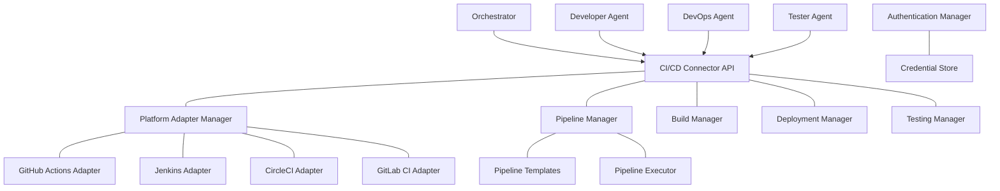

# 🚀 CI/CD Connector Component

<!-- 📑 TABLE OF CONTENTS -->
- [🚀 CI/CD Connector Component](#-cicd-connector-component)
  - [📖 Description](#-description)
  - [🏗️ Architecture](#️-architecture)
  - [🧰 Implementation](#-implementation)
  - [📋 CI Pipeline Integration](#-ci-pipeline-integration)
  - [🚢 CD Pipeline Integration](#-cd-pipeline-integration)
  - [📊 Build and Test Management](#-build-and-test-management)
  - [🔍 Quality Control Integration](#-quality-control-integration)
  - [📈 Performance and Metrics](#-performance-and-metrics)

---

## 📖 Description

The CI/CD Connector component provides a standardized interface for the multi-agent system to interact with continuous integration and continuous deployment systems. It enables agents to trigger builds, run tests, deploy applications, and monitor the results of these operations. The connector abstracts away the specific details of different CI/CD platforms, presenting a consistent interface to the agents while handling authentication, rate limiting, and error recovery for various CI/CD systems. This integration is critical for enabling agents to participate in the complete software delivery lifecycle.

## 🏗️ Architecture

The CI/CD Connector follows a layered architecture with specialized components for different CI/CD platforms and operations:



Key components include:

1. **Platform Adapter Manager**: Provides adapters for various CI/CD platforms
2. **Pipeline Manager**: Handles creating, updating, and executing pipelines
3. **Build Manager**: Manages build configurations and execution
4. **Deployment Manager**: Handles environment deployments
5. **Testing Manager**: Coordinates test execution in CI/CD pipelines
6. **Authentication Manager**: Securely handles credentials for CI/CD platforms

## 🧰 Implementation

The CI/CD Connector is implemented as a shell script that provides a unified interface to various CI/CD systems:

```bash
# CI/CD Connector implementation
cat << 'EOF' > ./scripts/cicd_connector.sh
#!/bin/bash

# Configuration
CONFIG_DIR="$(pwd)/config/cicd"
CREDENTIAL_FILE="$CONFIG_DIR/credentials.json"
LOG_FILE="$(pwd)/logs/cicd_connector.log"
TEMPLATE_DIR="$CONFIG_DIR/templates"
DEBUG=${CICD_CONNECTOR_DEBUG:-false}

# Initialize connector
function init_connector() {
  # Create config directories
  mkdir -p "$CONFIG_DIR"
  mkdir -p "$TEMPLATE_DIR"
  mkdir -p "$(dirname "$LOG_FILE")"
  
  # Create empty credential file if it doesn't exist
  if [[ ! -f "$CREDENTIAL_FILE" ]]; then
    echo '{}' > "$CREDENTIAL_FILE"
    chmod 600 "$CREDENTIAL_FILE"  # Secure permissions
  fi
  
  # Initialize platform configurations
  init_github_actions
  init_jenkins
  init_circleci
  init_gitlab_ci
  
  echo "CI/CD Connector initialized"
  return 0
}

# Log message
function log_message() {
  level="$1"
  message="$2"
  
  timestamp=$(date -u +"%Y-%m-%dT%H:%M:%SZ")
  echo "[$timestamp] [$level] $message" >> "$LOG_FILE"
  
  if [[ "$level" == "ERROR" || "$DEBUG" == "true" ]]; then
    echo "[$level] $message" >&2
  fi
}

# Platform-specific initialization functions
function init_github_actions() {
  mkdir -p "$CONFIG_DIR/github_actions"
  
  # Create default workflow template if it doesn't exist
  if [[ ! -f "$TEMPLATE_DIR/github_actions_default.yml" ]]; then
    cat << TEMPLATE > "$TEMPLATE_DIR/github_actions_default.yml"
name: Default CI Pipeline

on:
  workflow_dispatch:
    inputs:
      branch:
        description: 'Branch to build'
        required: true
        default: 'main'

jobs:
  build_and_test:
    runs-on: ubuntu-latest
    steps:
      - uses: actions/checkout@v2
        with:
          ref: \${{ github.event.inputs.branch }}
      
      - name: Setup environment
        run: |
          echo "Setting up environment..."
      
      - name: Build
        run: |
          echo "Building application..."
      
      - name: Test
        run: |
          echo "Running tests..."
      
      - name: Lint
        run: |
          echo "Running linters..."
      
      - name: Security scan
        run: |
          echo "Running security scans..."
TEMPLATE
  fi
  
  log_message "INFO" "GitHub Actions initialized"
}

function init_jenkins() {
  mkdir -p "$CONFIG_DIR/jenkins"
  
  # Create default Jenkinsfile template if it doesn't exist
  if [[ ! -f "$TEMPLATE_DIR/jenkinsfile_default" ]]; then
    cat << TEMPLATE > "$TEMPLATE_DIR/jenkinsfile_default"
pipeline {
    agent any
    
    parameters {
        string(name: 'BRANCH', defaultValue: 'main', description: 'Branch to build')
    }
    
    stages {
        stage('Checkout') {
            steps {
                checkout([\$class: 'GitSCM', branches: [[name: '*/${params.BRANCH}']], userRemoteConfigs: [[url: 'REPO_URL']]])
            }
        }
        
        stage('Build') {
            steps {
                echo 'Building application...'
            }
        }
        
        stage('Test') {
            steps {
                echo 'Running tests...'
            }
        }
        
        stage('Lint') {
            steps {
                echo 'Running linters...'
            }
        }
        
        stage('Security Scan') {
            steps {
                echo 'Running security scans...'
            }
        }
    }
    
    post {
        always {
            echo 'Pipeline completed'
        }
    }
}
TEMPLATE
  fi
  
  log_message "INFO" "Jenkins initialized"
}

function init_circleci() {
  mkdir -p "$CONFIG_DIR/circleci"
  
  # Create default CircleCI config template if it doesn't exist
  if [[ ! -f "$TEMPLATE_DIR/circleci_default.yml" ]]; then
    cat << TEMPLATE > "$TEMPLATE_DIR/circleci_default.yml"
version: 2.1

parameters:
  branch:
    type: string
    default: "main"

jobs:
  build_and_test:
    docker:
      - image: cimg/base:stable
    steps:
      - checkout
      - run:
          name: Setup environment
          command: echo "Setting up environment..."
      - run:
          name: Build
          command: echo "Building application..."
      - run:
          name: Test
          command: echo "Running tests..."
      - run:
          name: Lint
          command: echo "Running linters..."
      - run:
          name: Security scan
          command: echo "Running security scans..."

workflows:
  main:
    jobs:
      - build_and_test
TEMPLATE
  fi
  
  log_message "INFO" "CircleCI initialized"
}

function init_gitlab_ci() {
  mkdir -p "$CONFIG_DIR/gitlab_ci"
  
  # Create default GitLab CI config template if it doesn't exist
  if [[ ! -f "$TEMPLATE_DIR/gitlab_ci_default.yml" ]]; then
    cat << TEMPLATE > "$TEMPLATE_DIR/gitlab_ci_default.yml"
variables:
  BRANCH: "main"

stages:
  - build
  - test
  - lint
  - security

build:
  stage: build
  script:
    - echo "Building application..."

test:
  stage: test
  script:
    - echo "Running tests..."

lint:
  stage: lint
  script:
    - echo "Running linters..."

security_scan:
  stage: security
  script:
    - echo "Running security scans..."
TEMPLATE
  fi
  
  log_message "INFO" "GitLab CI initialized"
}

# Credential management functions
function set_credential() {
  platform="$1"
  credential_key="$2"
  credential_value="$3"
  
  # Read current credentials
  credentials=$(cat "$CREDENTIAL_FILE")
  
  # Update credentials
  updated_credentials=$(echo "$credentials" | jq --arg platform "$platform" --arg key "$credential_key" --arg value "$credential_value" 'if has($platform) then .[$platform][$key] = $value else . + {($platform): {($key): $value}} end')
  
  # Write updated credentials
  echo "$updated_credentials" > "$CREDENTIAL_FILE"
  
  log_message "INFO" "Credential set for $platform: $credential_key"
}

function get_credential() {
  platform="$1"
  credential_key="$2"
  
  # Read credentials
  credentials=$(cat "$CREDENTIAL_FILE")
  
  # Extract credential
  credential=$(echo "$credentials" | jq -r --arg platform "$platform" --arg key "$credential_key" '.[$platform][$key] // ""')
  
  echo "$credential"
}

# Pipeline management functions
function create_pipeline() {
  platform="$1"
  pipeline_name="$2"
  repository="$3"
  template="${4:-default}"  # Use default template if not specified
  parameters="$5"  # JSON string of parameters
  
  # Get template path
  case "$platform" in
    "github_actions")
      template_path="$TEMPLATE_DIR/github_actions_${template}.yml"
      output_path="$CONFIG_DIR/github_actions/${pipeline_name}.yml"
      ;;
    "jenkins")
      template_path="$TEMPLATE_DIR/jenkinsfile_${template}"
      output_path="$CONFIG_DIR/jenkins/${pipeline_name}"
      ;;
    "circleci")
      template_path="$TEMPLATE_DIR/circleci_${template}.yml"
      output_path="$CONFIG_DIR/circleci/${pipeline_name}.yml"
      ;;
    "gitlab_ci")
      template_path="$TEMPLATE_DIR/gitlab_ci_${template}.yml"
      output_path="$CONFIG_DIR/gitlab_ci/${pipeline_name}.yml"
      ;;
    *)
      log_message "ERROR" "Unsupported platform: $platform"
      return 1
      ;;
  esac
  
  # Check if template exists
  if [[ ! -f "$template_path" ]]; then
    log_message "ERROR" "Template not found: $template_path"
    return 1
  fi
  
  # Create pipeline from template
  cp "$template_path" "$output_path"
  
  # Replace placeholder values
  sed -i.bak "s|REPO_URL|$repository|g" "$output_path"
  rm "${output_path}.bak"
  
  # Apply parameters if provided
  if [[ -n "$parameters" ]]; then
    params=$(echo "$parameters" | jq -r 'to_entries[] | "\(.key)|\(.value)"')
    while IFS= read -r param; do
      key=$(echo "$param" | cut -d'|' -f1)
      value=$(echo "$param" | cut -d'|' -f2)
      sed -i.bak "s|{{${key}}}|${value}|g" "$output_path"
      rm "${output_path}.bak"
    done <<< "$params"
  fi
  
  log_message "INFO" "Pipeline created: $platform/$pipeline_name"
  
  # Deploy pipeline to CI/CD system if possible
  deploy_pipeline "$platform" "$pipeline_name" "$repository"
  
  echo "{\"platform\": \"$platform\", \"pipeline\": \"$pipeline_name\", \"status\": \"created\"}"
}

function deploy_pipeline() {
  platform="$1"
  pipeline_name="$2"
  repository="$3"
  
  case "$platform" in
    "github_actions")
      # Get GitHub token
      token=$(get_credential "github_actions" "token")
      if [[ -z "$token" ]]; then
        log_message "ERROR" "GitHub token not found"
        return 1
      fi
      
      # Create workflow directory if it doesn't exist
      mkdir -p ".github/workflows"
      
      # Copy workflow file
      cp "$CONFIG_DIR/github_actions/${pipeline_name}.yml" ".github/workflows/${pipeline_name}.yml"
      
      # Commit and push using git
      git add ".github/workflows/${pipeline_name}.yml"
      git commit -m "Add GitHub Actions workflow: ${pipeline_name}"
      git push
      
      log_message "INFO" "GitHub Actions workflow deployed: ${pipeline_name}"
      ;;
    "jenkins")
      # For Jenkins, typically we would use the Jenkins API to create a pipeline
      # This is a simplified example
      log_message "INFO" "Jenkins pipeline created: ${pipeline_name} (manual setup required)"
      ;;
    "circleci")
      # For CircleCI, configuration is stored in the repository
      mkdir -p ".circleci"
      cp "$CONFIG_DIR/circleci/${pipeline_name}.yml" ".circleci/config.yml"
      
      git add ".circleci/config.yml"
      git commit -m "Add CircleCI configuration: ${pipeline_name}"
      git push
      
      log_message "INFO" "CircleCI configuration deployed: ${pipeline_name}"
      ;;
    "gitlab_ci")
      # For GitLab CI, configuration is stored in the repository
      cp "$CONFIG_DIR/gitlab_ci/${pipeline_name}.yml" ".gitlab-ci.yml"
      
      git add ".gitlab-ci.yml"
      git commit -m "Add GitLab CI configuration: ${pipeline_name}"
      git push
      
      log_message "INFO" "GitLab CI configuration deployed: ${pipeline_name}"
      ;;
  esac
}

function trigger_pipeline() {
  platform="$1"
  pipeline_name="$2"
  parameters="$3"  # JSON string of parameters
  repository="$4"
  
  case "$platform" in
    "github_actions")
      # Get GitHub token
      token=$(get_credential "github_actions" "token")
      if [[ -z "$token" ]]; then
        log_message "ERROR" "GitHub token not found"
        return 1
      fi
      
      # Extract owner and repo from repository URL
      owner=$(echo "$repository" | grep -o 'github.com[:/][^/]*' | sed 's|github.com[:/]||')
      repo=$(echo "$repository" | grep -o '/[^/]*$' | sed 's|/||')
      
      # Trigger workflow
      response=$(curl -s -X POST "https://api.github.com/repos/$owner/$repo/actions/workflows/${pipeline_name}.yml/dispatches" \
        -H "Authorization: token $token" \
        -H "Accept: application/vnd.github.v3+json" \
        -d "{\"ref\":\"main\", \"inputs\": $parameters}")
      
      # Check response
      if [[ -n "$response" ]]; then
        log_message "ERROR" "Failed to trigger GitHub Actions workflow: $response"
        return 1
      fi
      
      log_message "INFO" "GitHub Actions workflow triggered: ${pipeline_name}"
      
      # Wait for workflow to start and get run ID
      sleep 5
      runs=$(curl -s -H "Authorization: token $token" \
        "https://api.github.com/repos/$owner/$repo/actions/workflows/${pipeline_name}.yml/runs?per_page=1")
      
      run_id=$(echo "$runs" | jq -r '.workflow_runs[0].id')
      status_url="https://github.com/$owner/$repo/actions/runs/$run_id"
      
      echo "{\"platform\": \"github_actions\", \"pipeline\": \"$pipeline_name\", \"run_id\": \"$run_id\", \"status\": \"triggered\", \"url\": \"$status_url\"}"
      ;;
    "jenkins")
      # Get Jenkins credentials
      jenkins_url=$(get_credential "jenkins" "url")
      jenkins_user=$(get_credential "jenkins" "user")
      jenkins_token=$(get_credential "jenkins" "token")
      
      if [[ -z "$jenkins_url" || -z "$jenkins_user" || -z "$jenkins_token" ]]; then
        log_message "ERROR" "Jenkins credentials not found"
        return 1
      fi
      
      # Prepare parameter string
      if [[ -n "$parameters" ]]; then
        params=$(echo "$parameters" | jq -r 'to_entries[] | "\(.key)=\(.value)"' | tr '\n' '&')
        params="${params%&}"
      else
        params=""
      fi
      
      # Trigger Jenkins job
      response=$(curl -s -X POST "$jenkins_url/job/${pipeline_name}/buildWithParameters?$params" \
        --user "$jenkins_user:$jenkins_token")
      
      echo "{\"platform\": \"jenkins\", \"pipeline\": \"$pipeline_name\", \"status\": \"triggered\", \"url\": \"$jenkins_url/job/${pipeline_name}\"}"
      ;;
    "circleci")
      # Get CircleCI token
      circleci_token=$(get_credential "circleci" "token")
      
      if [[ -z "$circleci_token" ]]; then
        log_message "ERROR" "CircleCI token not found"
        return 1
      fi
      
      # Extract owner and repo from repository URL
      owner=$(echo "$repository" | grep -o 'github.com[:/][^/]*' | sed 's|github.com[:/]||')
      repo=$(echo "$repository" | grep -o '/[^/]*$' | sed 's|/||')
      
      # Trigger CircleCI pipeline
      response=$(curl -s -X POST "https://circleci.com/api/v2/project/github/$owner/$repo/pipeline" \
        -H "Circle-Token: $circleci_token" \
        -H "Content-Type: application/json" \
        -d "{\"parameters\": $parameters}")
      
      # Extract pipeline ID
      pipeline_id=$(echo "$response" | jq -r '.id')
      
      echo "{\"platform\": \"circleci\", \"pipeline\": \"$pipeline_name\", \"pipeline_id\": \"$pipeline_id\", \"status\": \"triggered\", \"url\": \"https://app.circleci.com/pipelines/github/$owner/$repo/$pipeline_id\"}"
      ;;
    "gitlab_ci")
      # Get GitLab token
      gitlab_token=$(get_credential "gitlab_ci" "token")
      gitlab_url=$(get_credential "gitlab_ci" "url")
      
      if [[ -z "$gitlab_token" || -z "$gitlab_url" ]]; then
        log_message "ERROR" "GitLab credentials not found"
        return 1
      fi
      
      # Extract project ID from repository URL
      project_id=$(echo "$repository" | grep -o '[0-9]*$')
      
      # Trigger GitLab pipeline
      response=$(curl -s -X POST "$gitlab_url/api/v4/projects/$project_id/pipeline" \
        -H "PRIVATE-TOKEN: $gitlab_token" \
        -H "Content-Type: application/json" \
        -d "{\"ref\": \"main\", \"variables\": $parameters}")
      
      # Extract pipeline ID
      pipeline_id=$(echo "$response" | jq -r '.id')
      
      echo "{\"platform\": \"gitlab_ci\", \"pipeline\": \"$pipeline_name\", \"pipeline_id\": \"$pipeline_id\", \"status\": \"triggered\", \"url\": \"$gitlab_url/$owner/$repo/-/pipelines/$pipeline_id\"}"
      ;;
    *)
      log_message "ERROR" "Unsupported platform: $platform"
      return 1
      ;;
  esac
}

function get_pipeline_status() {
  platform="$1"
  pipeline_id="$2"
  repository="$3"
  
  case "$platform" in
    "github_actions")
      # Get GitHub token
      token=$(get_credential "github_actions" "token")
      if [[ -z "$token" ]]; then
        log_message "ERROR" "GitHub token not found"
        return 1
      fi
      
      # Extract owner and repo from repository URL
      owner=$(echo "$repository" | grep -o 'github.com[:/][^/]*' | sed 's|github.com[:/]||')
      repo=$(echo "$repository" | grep -o '/[^/]*$' | sed 's|/||')
      
      # Get workflow run status
      response=$(curl -s -H "Authorization: token $token" \
        "https://api.github.com/repos/$owner/$repo/actions/runs/$pipeline_id")
      
      status=$(echo "$response" | jq -r '.status')
      conclusion=$(echo "$response" | jq -r '.conclusion')
      
      echo "{\"platform\": \"github_actions\", \"pipeline_id\": \"$pipeline_id\", \"status\": \"$status\", \"conclusion\": \"$conclusion\", \"url\": \"https://github.com/$owner/$repo/actions/runs/$pipeline_id\"}"
      ;;
    "jenkins")
      # Get Jenkins credentials
      jenkins_url=$(get_credential "jenkins" "url")
      jenkins_user=$(get_credential "jenkins" "user")
      jenkins_token=$(get_credential "jenkins" "token")
      
      if [[ -z "$jenkins_url" || -z "$jenkins_user" || -z "$jenkins_token" ]]; then
        log_message "ERROR" "Jenkins credentials not found"
        return 1
      fi
      
      # Get Jenkins build status
      response=$(curl -s "$jenkins_url/job/pipeline_name/$pipeline_id/api/json" \
        --user "$jenkins_user:$jenkins_token")
      
      status=$(echo "$response" | jq -r '.result')
      
      echo "{\"platform\": \"jenkins\", \"pipeline_id\": \"$pipeline_id\", \"status\": \"$status\", \"url\": \"$jenkins_url/job/pipeline_name/$pipeline_id\"}"
      ;;
    "circleci")
      # Get CircleCI token
      circleci_token=$(get_credential "circleci" "token")
      
      if [[ -z "$circleci_token" ]]; then
        log_message "ERROR" "CircleCI token not found"
        return 1
      fi
      
      # Get CircleCI pipeline status
      response=$(curl -s "https://circleci.com/api/v2/pipeline/$pipeline_id" \
        -H "Circle-Token: $circleci_token")
      
      status=$(echo "$response" | jq -r '.state')
      
      # Extract owner and repo from repository URL
      owner=$(echo "$repository" | grep -o 'github.com[:/][^/]*' | sed 's|github.com[:/]||')
      repo=$(echo "$repository" | grep -o '/[^/]*$' | sed 's|/||')
      
      echo "{\"platform\": \"circleci\", \"pipeline_id\": \"$pipeline_id\", \"status\": \"$status\", \"url\": \"https://app.circleci.com/pipelines/github/$owner/$repo/$pipeline_id\"}"
      ;;
    "gitlab_ci")
      # Get GitLab token
      gitlab_token=$(get_credential "gitlab_ci" "token")
      gitlab_url=$(get_credential "gitlab_ci" "url")
      
      if [[ -z "$gitlab_token" || -z "$gitlab_url" ]]; then
        log_message "ERROR" "GitLab credentials not found"
        return 1
      fi
      
      # Extract project ID from repository URL
      project_id=$(echo "$repository" | grep -o '[0-9]*$')
      
      # Get GitLab pipeline status
      response=$(curl -s "$gitlab_url/api/v4/projects/$project_id/pipelines/$pipeline_id" \
        -H "PRIVATE-TOKEN: $gitlab_token")
      
      status=$(echo "$response" | jq -r '.status')
      
      echo "{\"platform\": \"gitlab_ci\", \"pipeline_id\": \"$pipeline_id\", \"status\": \"$status\", \"url\": \"$gitlab_url/projects/$project_id/pipelines/$pipeline_id\"}"
      ;;
    *)
      log_message "ERROR" "Unsupported platform: $platform"
      return 1
      ;;
  esac
}

# Deployment management functions
function trigger_deployment() {
  platform="$1"
  pipeline_id="$2"
  environment="$3"  # e.g., "staging", "production"
  repository="$4"
  parameters="$5"  # JSON string of parameters
  
  case "$platform" in
    "github_actions")
      # Get GitHub token
      token=$(get_credential "github_actions" "token")
      if [[ -z "$token" ]]; then
        log_message "ERROR" "GitHub token not found"
        return 1
      fi
      
      # Extract owner and repo from repository URL
      owner=$(echo "$repository" | grep -o 'github.com[:/][^/]*' | sed 's|github.com[:/]||')
      repo=$(echo "$repository" | grep -o '/[^/]*$' | sed 's|/||')
      
      # Create deployment via GitHub API
      response=$(curl -s -X POST "https://api.github.com/repos/$owner/$repo/deployments" \
        -H "Authorization: token $token" \
        -H "Accept: application/vnd.github.v3+json" \
        -d "{\"ref\":\"main\", \"environment\":\"$environment\", \"auto_merge\":false, \"required_contexts\":[]}")
      
      # Extract deployment ID
      deployment_id=$(echo "$response" | jq -r '.id')
      
      echo "{\"platform\": \"github_actions\", \"environment\": \"$environment\", \"deployment_id\": \"$deployment_id\", \"status\": \"triggered\", \"url\": \"https://github.com/$owner/$repo/deployments\"}"
      ;;
    # Similar implementations for other CI/CD platforms...
    *)
      log_message "ERROR" "Deployment not supported for platform: $platform"
      return 1
      ;;
  esac
}

# Test management functions
function get_test_results() {
  platform="$1"
  pipeline_id="$2"
  repository="$3"
  
  case "$platform" in
    "github_actions")
      # Get GitHub token
      token=$(get_credential "github_actions" "token")
      if [[ -z "$token" ]]; then
        log_message "ERROR" "GitHub token not found"
        return 1
      fi
      
      # Extract owner and repo from repository URL
      owner=$(echo "$repository" | grep -o 'github.com[:/][^/]*' | sed 's|github.com[:/]||')
      repo=$(echo "$repository" | grep -o '/[^/]*$' | sed 's|/||')
      
      # Get workflow run details
      response=$(curl -s -H "Authorization: token $token" \
        "https://api.github.com/repos/$owner/$repo/actions/runs/$pipeline_id/jobs")
      
      # Extract test step results
      jobs=$(echo "$response" | jq '.jobs')
      test_job=$(echo "$jobs" | jq '.[] | select(.name | contains("test"))')
      test_steps=$(echo "$test_job" | jq '.steps[] | select(.name | contains("test"))')
      
      echo "{\"platform\": \"github_actions\", \"pipeline_id\": \"$pipeline_id\", \"test_results\": $test_steps}"
      ;;
    # Similar implementations for other CI/CD platforms...
    *)
      log_message "ERROR" "Test results not supported for platform: $platform"
      return 1
      ;;
  esac
}

# Usage handling
case "$1" in
  "init")
    init_connector
    ;;
  "set-credential")
    set_credential "$2" "$3" "$4"
    ;;
  "create-pipeline")
    create_pipeline "$2" "$3" "$4" "$5" "$6"
    ;;
  "trigger-pipeline")
    trigger_pipeline "$2" "$3" "$4" "$5"
    ;;
  "get-pipeline-status")
    get_pipeline_status "$2" "$3" "$4"
    ;;
  "trigger-deployment")
    trigger_deployment "$2" "$3" "$4" "$5" "$6"
    ;;
  "get-test-results")
    get_test_results "$2" "$3" "$4"
    ;;
  *)
    echo "Usage: $0 {init|set-credential|create-pipeline|trigger-pipeline|get-pipeline-status|trigger-deployment|get-test-results}"
    echo "  init: Initialize CI/CD connector"
    echo "  set-credential <platform> <key> <value>: Set credential for platform"
    echo "  create-pipeline <platform> <name> <repository> [<template>] [<parameters>]: Create pipeline"
    echo "  trigger-pipeline <platform> <name> <parameters> <repository>: Trigger pipeline execution"
    echo "  get-pipeline-status <platform> <pipeline_id> <repository>: Get pipeline execution status"
    echo "  trigger-deployment <platform> <pipeline_id> <environment> <repository> [<parameters>]: Trigger deployment"
    echo "  get-test-results <platform> <pipeline_id> <repository>: Get test results"
    exit 1
    ;;
esac
EOF

chmod +x ./scripts/cicd_connector.sh
```

## 📋 CI Pipeline Integration

The CI/CD Connector provides comprehensive integration with continuous integration pipelines:

1. **Pipeline Creation**:
   - Creates CI pipelines from templates
   - Customizes pipelines for specific projects
   - Supports multiple CI platforms
   - Handles pipeline versioning

2. **Pipeline Execution**:
   - Triggers pipeline execution
   - Passes parameters to pipelines
   - Monitors execution status
   - Handles pipeline timeouts

3. **Build Configuration**:
   - Manages build environments
   - Configures build parameters
   - Handles dependencies
   - Sets up build matrix configurations

4. **Pipeline Customization**:
   - Creates custom pipeline steps
   - Modifies existing pipelines
   - Adds specialized validation
   - Integrates security scanning

Example CI pipeline functions:

```bash
# Create a CI pipeline for a specific project and language
function create_language_pipeline() {
  repository="$1"
  language="$2"  # "java", "python", "javascript", etc.
  platform="${3:-github_actions}"  # Default to GitHub Actions
  
  # Create pipeline name
  repo_name=$(echo "$repository" | grep -o '/[^/]*$' | sed 's|/||')
  pipeline_name="${repo_name}_${language}_ci"
  
  # Select template based on language
  template="${language}_ci"
  
  # Check if language-specific template exists, otherwise use default
  template_path="$TEMPLATE_DIR/${platform}_${template}.yml"
  if [[ ! -f "$template_path" ]]; then
    template="default"
    log_message "INFO" "Using default template for $language"
  fi
  
  # Create parameters based on language
  case "$language" in
    "java")
      parameters="{\"java_version\":\"11\", \"build_tool\":\"maven\"}"
      ;;
    "python")
      parameters="{\"python_version\":\"3.9\", \"test_framework\":\"pytest\"}"
      ;;
    "javascript")
      parameters="{\"node_version\":\"16\", \"test_framework\":\"jest\"}"
      ;;
    *)
      parameters="{}"
      ;;
  esac
  
  # Create the pipeline
  ./scripts/cicd_connector.sh create-pipeline "$platform" "$pipeline_name" "$repository" "$template" "$parameters"
  
  echo "CI pipeline created for $language project: $pipeline_name"
}

# Trigger a pipeline and wait for results
function trigger_and_monitor_pipeline() {
  platform="$1"
  pipeline_name="$2"
  parameters="$3"
  repository="$4"
  timeout="${5:-600}"  # Default timeout: 10 minutes
  
  # Trigger pipeline
  result=$(./scripts/cicd_connector.sh trigger-pipeline "$platform" "$pipeline_name" "$parameters" "$repository")
  
  # Extract pipeline ID
  pipeline_id=$(echo "$result" | jq -r '.pipeline_id // .run_id')
  
  if [[ -z "$pipeline_id" || "$pipeline_id" == "null" ]]; then
    log_message "ERROR" "Failed to extract pipeline ID from result: $result"
    return 1
  fi
  
  echo "Pipeline triggered with ID: $pipeline_id"
  
  # Monitor status until completion or timeout
  start_time=$(date +%s)
  status="pending"
  
  while [[ "$status" != "completed" && "$status" != "success" && "$status" != "failed" ]]; do
    # Check if timeout reached
    current_time=$(date +%s)
    elapsed=$((current_time - start_time))
    
    if [[ $elapsed -gt $timeout ]]; then
      log_message "WARNING" "Pipeline monitoring timed out after $timeout seconds"
      echo "{\"platform\": \"$platform\", \"pipeline_id\": \"$pipeline_id\", \"status\": \"timeout\", \"elapsed\": $elapsed}"
      return 0
    fi
    
    # Get pipeline status
    status_result=$(./scripts/cicd_connector.sh get-pipeline-status "$platform" "$pipeline_id" "$repository")
    status=$(echo "$status_result" | jq -r '.status')
    conclusion=$(echo "$status_result" | jq -r '.conclusion // "none"')
    
    echo "Pipeline status: $status ($conclusion) - elapsed: $elapsed seconds"
    
    # If status indicates completion, break out of loop
    if [[ "$status" == "completed" || "$status" == "success" || "$status" == "failed" ]]; then
      break
    fi
    
    # Wait before checking again
    sleep 10
  done
  
  # Get final status
  final_status=$(./scripts/cicd_connector.sh get-pipeline-status "$platform" "$pipeline_id" "$repository")
  
  # Get test results if available
  test_results=$(./scripts/cicd_connector.sh get-test-results "$platform" "$pipeline_id" "$repository")
  
  echo "{\"platform\": \"$platform\", \"pipeline_id\": \"$pipeline_id\", \"final_status\": $final_status, \"test_results\": $test_results, \"elapsed\": $elapsed}"
}
```

## 🚢 CD Pipeline Integration

The CI/CD Connector provides robust integration with continuous deployment pipelines:

1. **Deployment Pipeline Creation**:
   - Creates deployment pipelines for various environments
   - Configures deployment strategies
   - Sets up approval gates
   - Manages deployment configurations

2. **Environment Management**:
   - Handles multiple deployment environments
   - Manages environment configurations
   - Controls environment-specific variables
   - Implements deployment order

3. **Deployment Execution**:
   - Triggers deployments to environments
   - Validates deployment prerequisites
   - Monitors deployment progress
   - Handles deployment rollbacks

4. **Release Management**:
   - Creates release artifacts
   - Manages release versions
   - Tracks release history
   - Generates release notes

Example CD pipeline functions:

```bash
# Create a deployment pipeline for specific environments
function create_deployment_pipeline() {
  repository="$1"
  environments="$2"  # Comma-separated list of environments
  platform="${3:-github_actions}"  # Default to GitHub Actions
  
  # Create pipeline name
  repo_name=$(echo "$repository" | grep -o '/[^/]*$' | sed 's|/||')
  pipeline_name="${repo_name}_deploy"
  
  # Create parameters including environments
  IFS=',' read -ra env_array <<< "$environments"
  env_json="["
  for i in "${!env_array[@]}"; do
    if [[ $i -gt 0 ]]; then
      env_json+=","
    fi
    env_json+="\"${env_array[$i]}\""
  done
  env_json+="]"
  
  parameters="{\"environments\":$env_json}"
  
  # Create the deployment pipeline
  ./scripts/cicd_connector.sh create-pipeline "$platform" "$pipeline_name" "$repository" "deployment" "$parameters"
  
  echo "Deployment pipeline created for environments: $environments"
  
  # Return the pipeline details
  echo "{\"platform\": \"$platform\", \"pipeline\": \"$pipeline_name\", \"environments\": $env_json}"
}

# Deploy to a specific environment
function deploy_to_environment() {
  repository="$1"
  environment="$2"  # "staging", "production", etc.
  version="$3"  # Version to deploy
  platform="${4:-github_actions}"  # Default to GitHub Actions
  
  # Create pipeline name (should match existing pipeline)
  repo_name=$(echo "$repository" | grep -o '/[^/]*$' | sed 's|/||')
  pipeline_name="${repo_name}_deploy"
  
  # Create parameters for deployment
  parameters="{\"environment\":\"$environment\", \"version\":\"$version\"}"
  
  # Trigger deployment pipeline
  result=$(./scripts/cicd_connector.sh trigger-pipeline "$platform" "$pipeline_name" "$parameters" "$repository")
  
  # Extract pipeline ID
  pipeline_id=$(echo "$result" | jq -r '.pipeline_id // .run_id')
  
  echo "Deployment to $environment triggered with pipeline ID: $pipeline_id"
  
  # Monitor deployment status
  monitor_result=$(trigger_and_monitor_pipeline "$platform" "$pipeline_name" "$parameters" "$repository" 1200)  # 20 minute timeout
  
  # Update deployment status in release tracking
  status=$(echo "$monitor_result" | jq -r '.final_status.status // "unknown"')
  
  if [[ "$status" == "success" || "$status" == "completed" ]]; then
    # Record successful deployment
    record_deployment "$repository" "$environment" "$version" "success"
  else
    # Record failed deployment
    record_deployment "$repository" "$environment" "$version" "failed"
  fi
  
  echo "$monitor_result"
}

# Record deployment for tracking
function record_deployment() {
  repository="$1"
  environment="$2"
  version="$3"
  status="$4"
  
  # Create deployment record
  deployment_record="{\"repository\": \"$repository\", \"environment\": \"$environment\", \"version\": \"$version\", \"status\": \"$status\", \"timestamp\": \"$(date -u +"%Y-%m-%dT%H:%M:%SZ")\"}"
  
  # Store deployment record (simplified - in a real implementation, this would be stored in a database)
  record_dir="$CONFIG_DIR/deployments"
  mkdir -p "$record_dir"
  echo "$deployment_record" > "$record_dir/${repository//\//_}_${environment}_${version}.json"
  
  log_message "INFO" "Deployment recorded: $environment - $version - $status"
}
```

## 📊 Build and Test Management

The CI/CD Connector provides comprehensive build and test management capabilities:

1. **Build Configuration**:
   - Manages build parameters
   - Configures build environments
   - Handles build dependencies
   - Optimizes build performance

2. **Build Monitoring**:
   - Tracks build progress
   - Captures build logs
   - Analyzes build failures
   - Reports build metrics

3. **Test Execution**:
   - Manages test suite execution
   - Handles different test types
   - Controls test environments
   - Parallelizes test execution

4. **Test Result Analysis**:
   - Captures test results
   - Analyzes test failures
   - Tracks test coverage
   - Identifies flaky tests

Example build and test management functions:

```bash
# Monitor build progress
function monitor_build() {
  platform="$1"
  pipeline_id="$2"
  repository="$3"
  
  # Get build steps from pipeline status
  build_status=$(./scripts/cicd_connector.sh get-pipeline-status "$platform" "$pipeline_id" "$repository")
  
  # Extract build-specific information
  case "$platform" in
    "github_actions")
      # For GitHub Actions, parse the jobs to find build jobs
      build_jobs=$(echo "$build_status" | jq -r '.jobs[] | select(.name | contains("build"))')
      
      # Extract build metrics
      build_duration=$(echo "$build_jobs" | jq -r '.steps[] | select(.name | contains("Build")) | .duration')
      build_status=$(echo "$build_jobs" | jq -r '.steps[] | select(.name | contains("Build")) | .conclusion')
      
      echo "{\"platform\": \"$platform\", \"pipeline_id\": \"$pipeline_id\", \"build_duration\": \"$build_duration\", \"build_status\": \"$build_status\"}"
      ;;
    # Similar implementations for other CI/CD platforms...
    *)
      echo "{\"error\": \"Build monitoring not supported for platform: $platform\"}"
      return 1
      ;;
  esac
}

# Analyze test results
function analyze_test_results() {
  platform="$1"
  pipeline_id="$2"
  repository="$3"
  
  # Get test results
  test_results=$(./scripts/cicd_connector.sh get-test-results "$platform" "$pipeline_id" "$repository")
  
  # Extract test metrics
  test_count=$(echo "$test_results" | jq -r '.test_count // 0')
  passed_tests=$(echo "$test_results" | jq -r '.passed_tests // 0')
  failed_tests=$(echo "$test_results" | jq -r '.failed_tests // 0')
  skipped_tests=$(echo "$test_results" | jq -r '.skipped_tests // 0')
  
  # Calculate pass rate
  if [[ $test_count -gt 0 ]]; then
    pass_rate=$(echo "scale=2; $passed_tests * 100 / $test_count" | bc)
  else
    pass_rate=0
  fi
  
  # Analyze test failures
  failure_analysis="No failures detected"
  if [[ $failed_tests -gt 0 ]]; then
    failure_analysis=$(echo "$test_results" | jq -r '.failures[] | .name + ": " + .message' | head -5 | tr '\n' '; ')
    failure_analysis+=" (showing first 5 failures)"
  fi
  
  echo "{\"platform\": \"$platform\", \"pipeline_id\": \"$pipeline_id\", \"test_count\": $test_count, \"passed\": $passed_tests, \"failed\": $failed_tests, \"skipped\": $skipped_tests, \"pass_rate\": $pass_rate, \"failure_analysis\": \"$failure_analysis\"}"
}
```

## 🔍 Quality Control Integration

The CI/CD Connector integrates with various quality control tools:

1. **Code Quality Tools**:
   - Integrates linters and formatters
   - Runs static analysis tools
   - Enforces code style guides
   - Measures code quality metrics

2. **Security Scanning**:
   - Runs vulnerability scanners
   - Performs dependency checks
   - Conducts static application security testing
   - Executes dynamic security analysis

3. **Performance Testing**:
   - Runs load tests
   - Measures response times
   - Identifies performance bottlenecks
   - Verifies performance requirements

4. **Compliance Checks**:
   - Enforces licensing compliance
   - Verifies regulatory requirements
   - Conducts policy validation
   - Generates compliance reports

Example quality control functions:

```bash
# Run code quality checks
function run_code_quality_checks() {
  repository="$1"
  language="$2"
  platform="${3:-github_actions}"  # Default to GitHub Actions
  
  # Create pipeline name
  repo_name=$(echo "$repository" | grep -o '/[^/]*$' | sed 's|/||')
  pipeline_name="${repo_name}_quality"
  
  # Configure language-specific tools
  case "$language" in
    "java")
      tools="\"checkstyle\", \"pmd\", \"spotbugs\""
      ;;
    "python")
      tools="\"flake8\", \"pylint\", \"black\""
      ;;
    "javascript")
      tools="\"eslint\", \"prettier\", \"jshint\""
      ;;
    *)
      tools="\"generic\""
      ;;
  esac
  
  # Create parameters
  parameters="{\"language\":\"$language\", \"tools\":[$tools]}"
  
  # Create and trigger quality pipeline
  ./scripts/cicd_connector.sh create-pipeline "$platform" "$pipeline_name" "$repository" "quality" "$parameters"
  result=$(./scripts/cicd_connector.sh trigger-pipeline "$platform" "$pipeline_name" "$parameters" "$repository")
  
  # Extract pipeline ID
  pipeline_id=$(echo "$result" | jq -r '.pipeline_id // .run_id')
  
  echo "Code quality checks triggered with pipeline ID: $pipeline_id"
  
  # Monitor pipeline and get results
  monitor_result=$(trigger_and_monitor_pipeline "$platform" "$pipeline_name" "$parameters" "$repository" 600)
  
  echo "$monitor_result"
}

# Run security scanning
function run_security_scan() {
  repository="$1"
  scan_type="${2:-dependency}"  # "dependency", "sast", "dast", "container"
  platform="${3:-github_actions}"  # Default to GitHub Actions
  
  # Create pipeline name
  repo_name=$(echo "$repository" | grep -o '/[^/]*$' | sed 's|/||')
  pipeline_name="${repo_name}_security"
  
  # Create parameters
  parameters="{\"scan_type\":\"$scan_type\"}"
  
  # Create and trigger security pipeline
  ./scripts/cicd_connector.sh create-pipeline "$platform" "$pipeline_name" "$repository" "security" "$parameters"
  result=$(./scripts/cicd_connector.sh trigger-pipeline "$platform" "$pipeline_name" "$parameters" "$repository")
  
  # Extract pipeline ID
  pipeline_id=$(echo "$result" | jq -r '.pipeline_id // .run_id')
  
  echo "Security scan ($scan_type) triggered with pipeline ID: $pipeline_id"
  
  # Monitor pipeline and get results
  monitor_result=$(trigger_and_monitor_pipeline "$platform" "$pipeline_name" "$parameters" "$repository" 900)
  
  # Extract vulnerabilities from results
  vulns=$(echo "$monitor_result" | jq -r '.vulnerabilities // []')
  
  # Generate summary
  vuln_count=$(echo "$vulns" | jq -r 'length')
  high_vuln_count=$(echo "$vulns" | jq -r '[.[] | select(.severity == "high")] | length')
  
  echo "{\"repository\": \"$repository\", \"scan_type\": \"$scan_type\", \"pipeline_id\": \"$pipeline_id\", \"vulnerability_count\": $vuln_count, \"high_severity_count\": $high_vuln_count, \"details\": $monitor_result}"
}
```

## 📈 Performance and Metrics

The CI/CD Connector provides comprehensive performance monitoring and metrics:

1. **Pipeline Metrics**:
   - Tracks pipeline execution times
   - Measures success/failure rates
   - Monitors build durations
   - Analyzes bottlenecks

2. **Resource Utilization**:
   - Monitors compute resources
   - Tracks storage usage
   - Measures network utilization
   - Optimizes resource consumption

3. **Integration Metrics**:
   - Measures API call volumes
   - Tracks rate limit consumption
   - Analyzes integration errors
   - Monitors service availability

4. **Trend Analysis**:
   - Tracks metrics over time
   - Identifies performance trends
   - Detects anomalies
   - Generates trend reports

Example performance metric functions:

```bash
# Collect pipeline metrics
function collect_pipeline_metrics() {
  platform="$1"
  repository="$2"
  period="${3:-week}"  # "day", "week", "month"
  
  # Determine date range
  case "$period" in
    "day")
      start_date=$(date -d "1 day ago" +"%Y-%m-%d")
      ;;
    "week")
      start_date=$(date -d "7 days ago" +"%Y-%m-%d")
      ;;
    "month")
      start_date=$(date -d "30 days ago" +"%Y-%m-%d")
      ;;
    *)
      start_date=$(date -d "7 days ago" +"%Y-%m-%d")  # Default to week
      ;;
  esac
  
  # Get pipeline runs based on platform
  case "$platform" in
    "github_actions")
      # Get GitHub token
      token=$(get_credential "github_actions" "token")
      if [[ -z "$token" ]]; then
        log_message "ERROR" "GitHub token not found"
        return 1
      fi
      
      # Extract owner and repo from repository URL
      owner=$(echo "$repository" | grep -o 'github.com[:/][^/]*' | sed 's|github.com[:/]||')
      repo=$(echo "$repository" | grep -o '/[^/]*$' | sed 's|/||')
      
      # Get workflow runs
      response=$(curl -s -H "Authorization: token $token" \
        "https://api.github.com/repos/$owner/$repo/actions/runs?created=>$start_date")
      
      # Extract metrics
      total_runs=$(echo "$response" | jq -r '.total_count')
      successful_runs=$(echo "$response" | jq -r '.workflow_runs[] | select(.conclusion == "success") | .id' | wc -l)
      failed_runs=$(echo "$response" | jq -r '.workflow_runs[] | select(.conclusion == "failure") | .id' | wc -l)
      
      # Calculate success rate
      if [[ $total_runs -gt 0 ]]; then
        success_rate=$(echo "scale=2; $successful_runs * 100 / $total_runs" | bc)
      else
        success_rate=0
      fi
      
      # Calculate average duration (simplified)
      avg_duration=$(echo "$response" | jq -r '.workflow_runs[] | select(.conclusion != null) | (.updated_at | fromdateiso8601) - (.created_at | fromdateiso8601)' | awk '{ sum += $1; count++ } END { if (count > 0) print sum / count; else print 0; }')
      
      echo "{\"platform\": \"$platform\", \"repository\": \"$repository\", \"period\": \"$period\", \"total_runs\": $total_runs, \"successful_runs\": $successful_runs, \"failed_runs\": $failed_runs, \"success_rate\": $success_rate, \"avg_duration_seconds\": $avg_duration}"
      ;;
    # Similar implementations for other CI/CD platforms...
    *)
      echo "{\"error\": \"Metrics collection not supported for platform: $platform\"}"
      return 1
      ;;
  esac
}

# Generate metrics report
function generate_metrics_report() {
  platform="$1"
  repository="$2"
  output_file="$3"
  
  # Collect metrics for different time periods
  day_metrics=$(collect_pipeline_metrics "$platform" "$repository" "day")
  week_metrics=$(collect_pipeline_metrics "$platform" "$repository" "week")
  month_metrics=$(collect_pipeline_metrics "$platform" "$repository" "month")
  
  # Create report
  cat << EOF > "$output_file"
# CI/CD Pipeline Metrics Report

## Repository: $repository
## Generated: $(date -u +"%Y-%m-%d %H:%M:%S UTC")

## Daily Metrics (Last 24 Hours)
- Total Runs: $(echo "$day_metrics" | jq -r '.total_runs')
- Success Rate: $(echo "$day_metrics" | jq -r '.success_rate')%
- Average Duration: $(echo "$day_metrics" | jq -r '.avg_duration_seconds') seconds

## Weekly Metrics (Last 7 Days)
- Total Runs: $(echo "$week_metrics" | jq -r '.total_runs')
- Success Rate: $(echo "$week_metrics" | jq -r '.success_rate')%
- Average Duration: $(echo "$week_metrics" | jq -r '.avg_duration_seconds') seconds

## Monthly Metrics (Last 30 Days)
- Total Runs: $(echo "$month_metrics" | jq -r '.total_runs')
- Success Rate: $(echo "$month_metrics" | jq -r '.success_rate')%
- Average Duration: $(echo "$month_metrics" | jq -r '.avg_duration_seconds') seconds

## Analysis
$(analyze_metrics "$day_metrics" "$week_metrics" "$month_metrics")
EOF

  echo "Metrics report generated at $output_file"
}

# Analyze metrics to provide insights
function analyze_metrics() {
  day_metrics="$1"
  week_metrics="$2"
  month_metrics="$3"
  
  # Extract key metrics
  day_success_rate=$(echo "$day_metrics" | jq -r '.success_rate')
  week_success_rate=$(echo "$week_metrics" | jq -r '.success_rate')
  month_success_rate=$(echo "$month_metrics" | jq -r '.success_rate')
  
  day_duration=$(echo "$day_metrics" | jq -r '.avg_duration_seconds')
  week_duration=$(echo "$week_metrics" | jq -r '.avg_duration_seconds')
  month_duration=$(echo "$month_metrics" | jq -r '.avg_duration_seconds')
  
  # Generate insights
  insights=""
  
  # Success rate trend
  if (( $(echo "$day_success_rate > $week_success_rate" | bc -l) )); then
    insights+="- Success rate has improved in the last 24 hours compared to the weekly average.\n"
  elif (( $(echo "$day_success_rate < $week_success_rate" | bc -l) )); then
    insights+="- Success rate has declined in the last 24 hours compared to the weekly average.\n"
  fi
  
  # Duration trend
  if (( $(echo "$day_duration < $week_duration" | bc -l) )); then
    insights+="- Build duration has improved in the last 24 hours compared to the weekly average.\n"
  elif (( $(echo "$day_duration > $week_duration" | bc -l) )); then
    insights+="- Build duration has increased in the last 24 hours compared to the weekly average.\n"
  fi
  
  # Long-term trend
  if (( $(echo "$week_success_rate > $month_success_rate" | bc -l) )); then
    insights+="- Success rate has been improving over the past week compared to the monthly average.\n"
  elif (( $(echo "$week_success_rate < $month_success_rate" | bc -l) )); then
    insights+="- Success rate has been declining over the past week compared to the monthly average.\n"
  fi
  
  # General assessment
  if (( $(echo "$day_success_rate < 80" | bc -l) )); then
    insights+="- Current success rate is below 80%, indicating potential stability issues.\n"
  fi
  
  if (( $(echo "$day_duration > 900" | bc -l) )); then
    insights+="- Current build duration exceeds 15 minutes, which may indicate performance issues.\n"
  fi
  
  echo -e "$insights"
}
```

---

🧭 **Navigation**
- [Architecture Home](../README.md)
- [Components](./README.md)
- [Previous: GitHub Connector](./github-connector.md)
- [Next: Development Environment](./development-environment.md)

*Last updated: 2025-05-16*