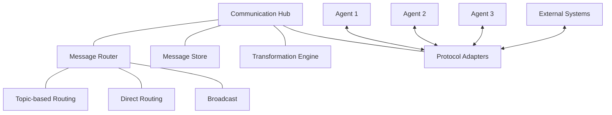
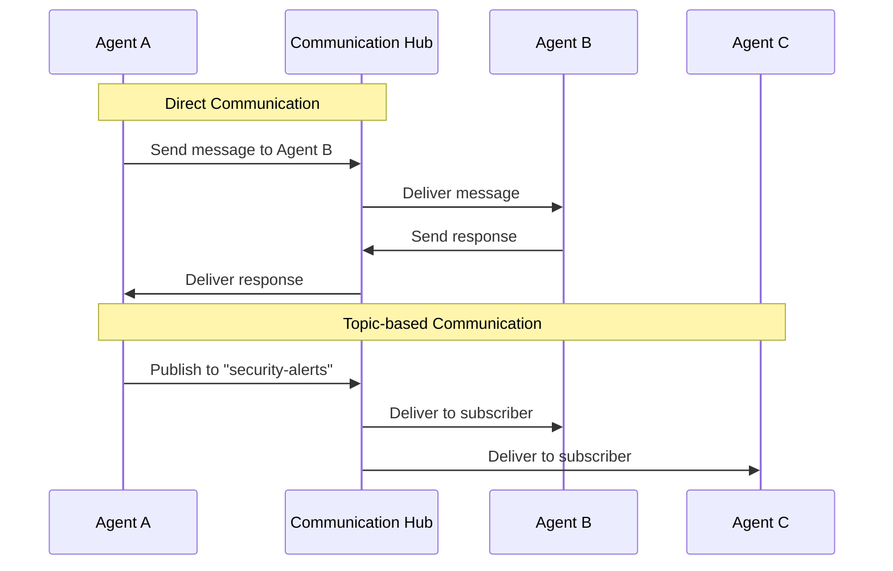

# 🔄 Communication Hub Component

<!-- 📑 TABLE OF CONTENTS -->
- [🔄 Communication Hub Component](#-communication-hub-component)
  - [📖 Description](#-description)
  - [🏗️ Architecture](#️-architecture)
  - [🔀 Message Routing](#-message-routing)
  - [🧰 Implementation](#-implementation)
  - [📊 Message Types and Protocols](#-message-types-and-protocols)
  - [🔒 Security and Authentication](#-security-and-authentication)
  - [📈 Monitoring and Logging](#-monitoring-and-logging)
  - [🚀 Performance Considerations](#-performance-considerations)

---

## 📖 Description

The Communication Hub is a central component in the multi-agent system that enables reliable, secure, and efficient message exchange between agents. It implements the Model Context Protocol (MCP) to facilitate standardized communication patterns across the system. The hub handles message routing, delivery guarantees, format transformations, and maintains an audit trail of all agent interactions. It acts as the nervous system of the multi-agent architecture, ensuring all components can coordinate effectively.

## 🏗️ Architecture

The Communication Hub follows a message broker architecture with publisher-subscriber patterns and direct routing capabilities:



Key components include:

1. **Message Router**: Directs messages to appropriate recipients based on addressing and content
2. **Message Store**: Persists messages for delivery guarantees and audit purposes
3. **Transformation Engine**: Converts between different message formats as needed
4. **Protocol Adapters**: Supports various communication protocols (HTTP, WebSockets, etc.)

## 🔀 Message Routing

The Communication Hub supports several routing patterns:

1. **Direct Agent-to-Agent**: Point-to-point communication between specific agents
2. **Topic-based Publish/Subscribe**: Agents subscribe to topics of interest
3. **Broadcast**: Messages sent to all agents or a category of agents
4. **Request-Response**: Synchronous communication with response tracking
5. **Task Distribution**: Specialized routing for task assignments
6. **Capability-Based Routing**: Route messages based on agent capabilities



## 🧰 Implementation

The Communication Hub is implemented using lightweight HTTP servers with shell scripts for message handling:

```bash
# Communication Hub implementation
cat << 'EOF' > ./scripts/communication_hub.sh
#!/bin/bash

# Configuration
HUB_PORT=8080
MESSAGE_STORE="$(pwd)/messages"
LOG_FILE="$(pwd)/logs/communication_hub.log"

# Initialize message store
mkdir -p "$MESSAGE_STORE"
mkdir -p "$(dirname "$LOG_FILE")"

# Generate unique message ID
function generate_message_id() {
  echo "msg_$(date +%s)_$(openssl rand -hex 8)"
}

# Log message for audit
function log_message() {
  message_type="$1"
  sender="$2"
  recipient="$3"
  message_id="$4"
  
  echo "$(date -u +"%Y-%m-%dT%H:%M:%SZ") [$message_type] $sender -> $recipient ($message_id)" >> "$LOG_FILE"
}

# Store message
function store_message() {
  message_id="$1"
  message_content="$2"
  
  echo "$message_content" > "$MESSAGE_STORE/$message_id.json"
}

# Retrieve message
function retrieve_message() {
  message_id="$1"
  
  if [[ -f "$MESSAGE_STORE/$message_id.json" ]]; then
    cat "$MESSAGE_STORE/$message_id.json"
    return 0
  else
    echo "{\"error\": \"Message not found\"}"
    return 1
  fi
}

# Route message to recipient
function route_message() {
  recipient="$1"
  message_content="$2"
  
  # Get recipient endpoint from agent registry
  recipient_endpoint=$(./scripts/agent_registry.sh find-endpoint "$recipient")
  
  if [[ -z "$recipient_endpoint" ]]; then
    echo "{\"error\": \"Recipient not found or unavailable\"}"
    return 1
  fi
  
  # Send message to recipient
  curl -s -X POST "$recipient_endpoint/receive" \
    -H "Content-Type: application/json" \
    -d "$message_content"
}

# Start the communication hub server
function start_hub() {
  echo "Starting Communication Hub on port $HUB_PORT..."
  
  # Using socat for a simple HTTP server
  # In a production environment, use a proper HTTP server
  socat TCP-LISTEN:$HUB_PORT,fork EXEC:"./scripts/handle_request.sh" &
  HUB_PID=$!
  
  echo "Communication Hub started with PID $HUB_PID"
  echo "Hub PID: $HUB_PID" > "$(pwd)/hub.pid"
}

# Stop the communication hub server
function stop_hub() {
  if [[ -f "$(pwd)/hub.pid" ]]; then
    HUB_PID=$(cat "$(pwd)/hub.pid")
    echo "Stopping Communication Hub (PID: $HUB_PID)..."
    kill "$HUB_PID"
    rm "$(pwd)/hub.pid"
    echo "Communication Hub stopped"
  else
    echo "Hub PID file not found"
  fi
}

# Message sending API
function send_message() {
  sender="$1"
  recipient="$2"
  message_type="$3"
  content="$4"
  
  message_id=$(generate_message_id)
  
  # Create message envelope
  message_envelope=$(cat << MESSAGE
{
  "message_id": "$message_id",
  "sender": "$sender",
  "recipient": "$recipient",
  "type": "$message_type",
  "timestamp": "$(date -u +"%Y-%m-%dT%H:%M:%SZ")",
  "content": $content
}
MESSAGE
)
  
  # Store message
  store_message "$message_id" "$message_envelope"
  
  # Log message
  log_message "$message_type" "$sender" "$recipient" "$message_id"
  
  # Route message
  route_result=$(route_message "$recipient" "$message_envelope")
  
  # Return message ID
  echo "{\"message_id\": \"$message_id\", \"status\": \"sent\", \"routing_result\": $route_result}"
}

# Usage handling
case "$1" in
  "start")
    start_hub
    ;;
  "stop")
    stop_hub
    ;;
  "send")
    send_message "$2" "$3" "$4" "$5"
    ;;
  "retrieve")
    retrieve_message "$2"
    ;;
  *)
    echo "Usage: $0 {start|stop|send|retrieve}"
    echo "  send <sender> <recipient> <type> <content>"
    echo "  retrieve <message_id>"
    exit 1
    ;;
esac
EOF

chmod +x ./scripts/communication_hub.sh
```

The request handler script:

```bash
# Request handler for the Communication Hub
cat << 'EOF' > ./scripts/handle_request.sh
#!/bin/bash

# Read HTTP request
read -r request_line
read -r -d '' headers

# Get request method and path
method=$(echo "$request_line" | cut -d ' ' -f 1)
path=$(echo "$request_line" | cut -d ' ' -f 2)

# Get content length
content_length=$(echo "$headers" | grep -i "Content-Length" | cut -d ' ' -f 2 | tr -d '\r')

# Read request body if present
body=""
if [[ -n "$content_length" ]]; then
  body=$(dd bs=1 count=$content_length 2>/dev/null)
fi

# Process request
response_body=""
status="200 OK"
content_type="application/json"

if [[ "$method" == "POST" && "$path" == "/send" ]]; then
  # Extract message details from JSON body
  sender=$(echo "$body" | jq -r '.sender')
  recipient=$(echo "$body" | jq -r '.recipient')
  message_type=$(echo "$body" | jq -r '.type')
  content=$(echo "$body" | jq -r '.content')
  
  # Send message
  response_body=$(./scripts/communication_hub.sh send "$sender" "$recipient" "$message_type" "$content")
  
elif [[ "$method" == "GET" && "$path" =~ ^/messages/([a-zA-Z0-9_]+)$ ]]; then
  # Extract message ID from path
  message_id="${BASH_REMATCH[1]}"
  
  # Retrieve message
  response_body=$(./scripts/communication_hub.sh retrieve "$message_id")
  
  # Check if message was found
  if [[ $? -ne 0 ]]; then
    status="404 Not Found"
  fi
  
else
  # Unknown endpoint
  status="404 Not Found"
  response_body="{\"error\": \"Endpoint not found\"}"
fi

# Send HTTP response
echo -e "HTTP/1.1 $status\r\nContent-Type: $content_type\r\nContent-Length: ${#response_body}\r\n\r\n$response_body"
EOF

chmod +x ./scripts/handle_request.sh
```

## 📊 Message Types and Protocols

The Communication Hub supports several message types and interaction patterns:

1. **Task Messages**: 
   - Task assignments
   - Task status updates
   - Task completion notifications

2. **Query Messages**:
   - Capability queries
   - Information requests
   - Status queries

3. **Control Messages**:
   - System commands
   - Configuration updates
   - Lifecycle management

4. **Data Messages**:
   - Knowledge sharing
   - Resource references
   - Results and outputs

5. **Event Notifications**:
   - System events
   - Error notifications
   - State changes

Each message follows a standard envelope format:

```json
{
  "message_id": "msg_1621234567_a1b2c3d4",
  "sender": "agent-analyzer",
  "recipient": "agent-developer",
  "type": "task.assignment",
  "timestamp": "2024-05-16T14:23:45Z",
  "correlation_id": "task-123",
  "reply_to": "agent-orchestrator",
  "content": {
    "task_id": 123,
    "task_type": "implementation",
    "priority": "high",
    "description": "Implement user authentication module",
    "requirements": [
      "Use JWT for token-based authentication",
      "Include password hashing with bcrypt",
      "Add rate limiting for login attempts"
    ],
    "deadline": "2024-05-18T23:59:59Z"
  }
}
```

## 🔒 Security and Authentication

The Communication Hub implements several security measures:

1. **Message Authentication**: Verifies sender identity using HMAC signatures
2. **Agent Authentication**: Verifies agent identity before accepting connections
3. **Transport Encryption**: Uses HTTPS for secure message transmission
4. **Message Validation**: Validates message format and content
5. **Rate Limiting**: Prevents message flooding from compromised agents
6. **Access Control**: Enforces permissions for message routing

Implementation includes:

```bash
# Message authentication function
function authenticate_message() {
  message="$1"
  signature="$2"
  sender="$(echo "$message" | jq -r '.sender')"
  
  # Get sender's shared secret from secure storage
  secret=$(get_agent_secret "$sender")
  
  # Calculate expected signature
  expected_signature=$(echo -n "$message" | openssl dgst -sha256 -hmac "$secret" -binary | base64)
  
  # Verify signature
  if [[ "$signature" == "$expected_signature" ]]; then
    return 0  # Authenticated
  else
    return 1  # Authentication failed
  fi
}
```

## 📈 Monitoring and Logging

The Communication Hub provides comprehensive monitoring and logging:

1. **Message Metrics**:
   - Message volume per agent/type
   - Message latency statistics
   - Error rates and types

2. **Audit Logging**:
   - Full message metadata logging
   - Authentication attempts
   - Routing decisions

3. **Health Monitoring**:
   - Hub status and performance
   - Connection states
   - Resource utilization

4. **Alerting**:
   - Communication failures
   - Unusual message patterns
   - Security violations

## 🚀 Performance Considerations

The Hub is designed for efficient operation:

1. **Asynchronous Processing**: Non-blocking message handling
2. **Message Batching**: Combines multiple messages for efficiency
3. **Persistent Connections**: Maintains connections to frequent communicators
4. **Prioritization**: Critical messages are processed first
5. **Load Shedding**: Gracefully handles overload conditions
6. **Optimized Routing**: Direct routing when possible

Performance monitoring provides insights for continuous improvement:

```bash
# Performance monitoring script
function monitor_hub_performance() {
  # Message throughput
  messages_per_minute=$(grep -c "$(date +"%Y-%m-%dT%H:%M")" "$LOG_FILE")
  
  # Average latency (if tracked in logs)
  avg_latency=$(grep "latency" "$LOG_FILE" | tail -100 | awk '{sum+=$5; count++} END {print sum/count}')
  
  # Active connections
  active_connections=$(netstat -an | grep ":$HUB_PORT" | grep ESTABLISHED | wc -l)
  
  # Report metrics
  echo "Hub Performance ($(date -u +"%Y-%m-%dT%H:%M:%SZ")):"
  echo "- Messages per minute: $messages_per_minute"
  echo "- Average latency: ${avg_latency:-N/A} ms"
  echo "- Active connections: $active_connections"
  
  # Check for potential issues
  if [[ $messages_per_minute -gt 1000 ]]; then
    echo "WARNING: High message volume detected"
  fi
  
  if [[ $active_connections -gt 50 ]]; then
    echo "WARNING: High connection count detected"
  fi
}
```

---

<!-- 🧭 NAVIGATION -->
**Navigation**: [Home](../README.md) | [Components](./README.md) | [Agent Registry](./agent-registry.md) | [Orchestrator](./orchestrator.md)

*Last updated: 2024-05-16*