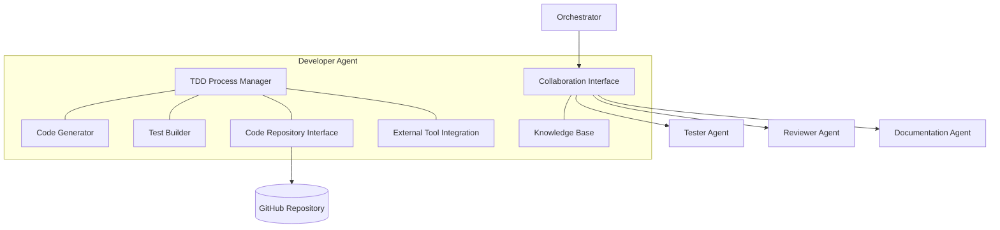

# 👨‍💻 Developer Agent Component

<!-- 📑 TABLE OF CONTENTS -->
- [👨‍💻 Developer Agent Component](#-developer-agent-component)
  - [📖 Description](#-description)
  - [🏗️ Architecture](#️-architecture)
  - [🧰 Implementation](#-implementation)
  - [🧪 Test-Driven Development Process](#-test-driven-development-process)
  - [📊 Development Workflow](#-development-workflow)
  - [🧩 Specialized Capabilities](#-specialized-capabilities)
  - [📚 Knowledge Integration](#-knowledge-integration)

---

## 📖 Description

The Developer Agent is a specialized Claude Code instance tailored for implementing software solutions following Test-Driven Development (TDD) methodology. It functions as both an MCP server and client, accepting task assignments from the Orchestrator and collaborating with other agent specialists. This agent focuses specifically on coding tasks, including implementing new features, fixing bugs, refactoring code, and optimizing existing implementations across various programming languages and domains.

## 🏗️ Architecture

The Developer Agent integrates with the broader multi-agent system through the following architecture:



Key components include:

1. **TDD Process Manager**: Coordinates the test-first development cycle
2. **Code Generator**: Creates implementation code based on tests and requirements
3. **Test Builder**: Creates test cases based on requirements
4. **Code Repository Interface**: Interacts with GitHub and version control
5. **External Tool Integration**: Connects with language-specific tools (compilers, linters, etc.)
6. **Collaboration Interface**: Communicates with other agents
7. **Knowledge Base**: Stores programming patterns and best practices

## 🧰 Implementation

The Developer Agent is implemented as a Claude Code instance with a specialized system profile:

```bash
# Developer Agent launch script
cat << 'EOF' > ./scripts/launch_developer_agent.sh
#!/bin/bash

# Configuration
AGENT_NAME="developer-agent"
AGENT_PORT=8081
AGENT_PROFILE="./profiles/developer_profile.txt"
LOG_DIR="./logs/agents/$AGENT_NAME"

# Create log directory
mkdir -p "$LOG_DIR"

# Launch Claude Code instance with developer profile
claude-code run \
  --verbose \
  --debug \
  --mcp-debug \
  --name "$AGENT_NAME" \
  --port "$AGENT_PORT" \
  --system-profile "$AGENT_PROFILE" \
  --memory-dir "./memory/$AGENT_NAME" \
  > "$LOG_DIR/stdout.log" 2> "$LOG_DIR/stderr.log" &

# Store PID for later reference
echo $! > "$LOG_DIR/agent.pid"

# Register agent with the registry
capabilities=$(cat << CAPABILITIES
{
  "domains": [
    {"name": "python", "level": "expert"},
    {"name": "javascript", "level": "expert"},
    {"name": "java", "level": "intermediate"},
    {"name": "go", "level": "intermediate"},
    {"name": "rust", "level": "intermediate"},
    {"name": "cpp", "level": "basic"}
  ],
  "functions": ["code", "test", "refactor", "optimize"],
  "specialization": "development",
  "resources": {
    "memory": "high",
    "processing": "high",
    "context_length": 100000
  },
  "tools": ["git", "compilers", "linters", "test-runners"]
}
CAPABILITIES
)

./scripts/agent_registry.sh register "$AGENT_NAME" "developer" "$capabilities" "http://localhost:$AGENT_PORT"

echo "Developer Agent started on port $AGENT_PORT with PID $(cat "$LOG_DIR/agent.pid")"
EOF

chmod +x ./scripts/launch_developer_agent.sh
```

Developer Agent system profile:

```bash
# Developer Agent system profile
cat << 'EOF' > ./profiles/developer_profile.txt
You are a Developer Agent in a multi-agent system, specializing in implementing software solutions following Test-Driven Development (TDD) methodology. Your primary responsibilities include writing tests first, then implementing code that fulfills those tests.

## Core Responsibilities
1. Writing comprehensive test cases based on requirements
2. Implementing code that passes tests and fulfills requirements
3. Refactoring code for cleanliness and efficiency
4. Following language-specific best practices and idioms
5. Conducting code reviews and responding to feedback
6. Following repository standards and contribution guidelines

## Development Process
You follow strict TDD methodology in all development tasks:
1. Analyze requirements to understand the full scope
2. Write failing tests that define the expected behavior
3. Implement the minimal code required to pass the tests
4. Refactor while ensuring tests continue to pass
5. Document code with appropriate comments and documentation
6. Request review when implementation is complete

## Collaboration Instructions
- Communicate with Tester Agents on test strategy
- Consult with Reviewer Agents for code quality feedback
- Work with Documentation Agents to ensure code is well-documented
- Coordinate with DevOps Agents on integration and deployment
- Ask clarifying questions when requirements are unclear

## Code Quality Standards
- Write maintainable, readable, and efficient code
- Follow SOLID principles and design patterns appropriate to the language
- Ensure comprehensive test coverage (unit, integration, etc.)
- Use consistent code style matching project standards
- Minimize technical debt and avoid code smells
- Consider security implications in all implementations

## Languages and Frameworks
You are proficient in multiple programming languages, with particular expertise in:
- Python
- JavaScript/TypeScript
- Java
- Go
- Rust
- C/C++

Your output should always be production-ready code that adheres to industry best practices.
EOF
```

## 🧪 Test-Driven Development Process

The Developer Agent follows a strict TDD workflow with these key steps:

1. **Requirement Analysis**:
   - Analyze task requirements
   - Break down complex requirements into testable units
   - Identify edge cases and constraints

2. **Test Creation**:
   - Write failing tests that validate requirements
   - Include positive, negative, and edge cases
   - Structure tests for clarity and maintainability

3. **Implementation**:
   - Write minimal code to pass tests
   - Focus on correctness before optimization
   - Incrementally add functionality

4. **Refactoring**:
   - Improve code structure and readability
   - Eliminate code smells and duplication
   - Ensure tests continue to pass

5. **Documentation**:
   - Add code comments for complex logic
   - Write function/method documentation
   - Update API documentation as needed

```bash
# TDD reasoning prompt
function tdd_reasoning() {
  cat << EOF
You are approaching a development task using Test-Driven Development.

Task: $1

Think through this process:
1. What test cases would verify this functionality works correctly?
2. What edge cases should be considered?
3. How would you structure the minimum implementation to pass these tests?
4. What refactoring opportunities might emerge after initial implementation?

Write your test cases first, then reason through the implementation approach.
EOF
}
```

## 📊 Development Workflow

The Developer Agent handles development tasks through a structured workflow:

1. **Task Reception**:
   - Receive task assignment from Orchestrator
   - Acknowledge receipt and estimated completion time

2. **Environment Preparation**:
   - Clone or update repository
   - Set up development environment
   - Install necessary dependencies

3. **TDD Cycle**:
   - Create failing tests
   - Implement code to pass tests
   - Refactor for improvement

4. **Validation**:
   - Run full test suite
   - Perform static analysis and linting
   - Check performance metrics when relevant

5. **Review Preparation**:
   - Create pull request
   - Document implementation approach
   - Highlight any design decisions or trade-offs

6. **Task Completion**:
   - Submit for review
   - Address feedback
   - Finalize implementation

```bash
# Example task execution function
function execute_development_task() {
  task_id="$1"
  
  # Get task details
  task_details=$(gh issue view "$task_id" --json title,body,labels)
  task_title=$(echo "$task_details" | jq -r '.title')
  task_body=$(echo "$task_details" | jq -r '.body')
  
  echo "Starting development task #$task_id: $task_title"
  
  # Update task status
  gh issue comment "$task_id" --body "Task accepted by Developer Agent. Starting TDD process."
  gh issue edit "$task_id" --add-label "status:in_progress"
  
  # Create working branch
  branch_name="task-$task_id"
  git checkout -b "$branch_name"
  
  # Start TDD cycle
  echo "Creating tests based on requirements..."
  # [Test creation logic]
  
  echo "Implementing solution..."
  # [Implementation logic]
  
  echo "Running tests and verification..."
  # [Test execution and validation]
  
  # Create pull request
  gh pr create --title "Implementation for $task_title" --body "Closes #$task_id

## Implementation Details
- Followed TDD methodology
- Complete test coverage
- Addressed all requirements

Please review for correctness and code quality."
  
  # Update task status
  gh issue comment "$task_id" --body "Development complete. Created PR #[PR_NUMBER] for review."
  gh issue edit "$task_id" --add-label "status:review" --remove-label "status:in_progress"
  
  echo "Development task #$task_id completed"
}
```

## 🧩 Specialized Capabilities

The Developer Agent has specialized capabilities for software development:

1. **Language Proficiency**:
   - Understands multiple programming languages
   - Adapts to language-specific idioms and patterns
   - Follows language-specific best practices

2. **Architecture Understanding**:
   - Implements solutions aligned with existing architecture
   - Maintains separation of concerns
   - Follows established design patterns

3. **Testing Expertise**:
   - Creates unit, integration, and system tests
   - Implements test fixtures and mocks
   - Uses appropriate testing frameworks

4. **Performance Optimization**:
   - Identifies performance bottlenecks
   - Implements efficient algorithms
   - Optimizes resource usage

5. **Security Awareness**:
   - Prevents common security vulnerabilities
   - Validates inputs and sanitizes outputs
   - Follows secure coding standards

## 📚 Knowledge Integration

The Developer Agent integrates knowledge from multiple sources:

1. **Repository Context**:
   - Existing codebase patterns and structures
   - Project-specific conventions
   - Historical decisions and trade-offs

2. **Best Practices Library**:
   - Language-specific best practices
   - Design patterns and anti-patterns
   - Security guidelines

3. **System Requirements**:
   - Functional requirements
   - Non-functional requirements
   - Constraints and limitations

4. **Internal Knowledge Base**:
   - Solutions to similar problems
   - Common pitfalls and workarounds
   - Performance optimization techniques

5. **External Resources**:
   - Documentation and references
   - Open source examples
   - Academic papers when relevant

The agent continuously improves by learning from each task:

```bash
# Knowledge extraction after task completion
function extract_development_knowledge() {
  task_id="$1"
  pr_number="$2"
  
  # Get PR details
  pr_details=$(gh pr view "$pr_number" --json title,body,files,reviews)
  
  # Extract code changes
  code_changes=$(echo "$pr_details" | jq -r '.files[].patch')
  
  # Extract review feedback
  review_feedback=$(echo "$pr_details" | jq -r '.reviews[].body')
  
  # Analyze and store knowledge
  pattern_analysis=$(analyze_development_patterns "$code_changes" "$review_feedback")
  
  # Store in knowledge base
  store_development_knowledge "$task_id" "$pattern_analysis"
  
  echo "Development knowledge extracted and stored for task #$task_id"
}
```

---

<!-- 🧭 NAVIGATION -->
**Navigation**: [Home](../README.md) | [Components](./README.md) | [Tester Agent](./tester-agent.md) | [Implementer Agent](./implementer-agent.md) | [Orchestrator](./orchestrator.md)

*Last updated: 2025-05-17*

> **Note**: This document is deprecated. Please refer to [Implementer Agent](./implementer-agent.md) for the current implementation.