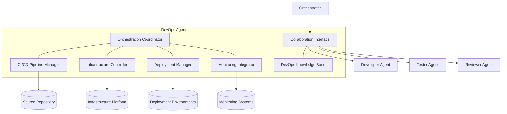

# 🛠️ DevOps Agent Component

<!-- 📑 TABLE OF CONTENTS -->
- [🛠️ DevOps Agent Component](#️-devops-agent-component)
  - [📖 Description](#-description)
  - [🏗️ Architecture](#️-architecture)
  - [🧰 Implementation](#-implementation)
  - [🔄 DevOps Workflows](#-devops-workflows)
  - [🔧 Infrastructure Management](#-infrastructure-management)
  - [📦 Deployment Processes](#-deployment-processes)
  - [🔍 Monitoring and Observability](#-monitoring-and-observability)

---

## 📖 Description

The DevOps Agent is a specialized Claude Code instance dedicated to infrastructure management, deployment, continuous integration, and operational support for the multi-agent system. It functions as both an MCP server and client, bridging the gap between development and operations by automating deployment pipelines, managing infrastructure, monitoring system performance, and ensuring operational reliability. This agent works closely with Developer, Tester, and Reviewer agents to deliver changes efficiently, maintain system stability, and optimize resource utilization across environments.

## 🏗️ Architecture

The DevOps Agent integrates with the broader multi-agent system through the following architecture:



Key components include:

1. **Orchestration Coordinator**: Manages DevOps workflows and coordination
2. **CI/CD Pipeline Manager**: Configures and runs continuous integration and deployment pipelines
3. **Infrastructure Controller**: Manages infrastructure resources and configuration
4. **Deployment Manager**: Handles application deployment across environments
5. **Monitoring Integrator**: Sets up and integrates monitoring and observability tools
6. **Collaboration Interface**: Communicates with other agents
7. **DevOps Knowledge Base**: Stores deployment patterns, scripts, and configurations

## 🧰 Implementation

The DevOps Agent is implemented as a Claude Code instance with a specialized system profile:

```bash
# DevOps Agent launch script
cat << 'EOF' > ./scripts/launch_devops_agent.sh
#!/bin/bash

# Configuration
AGENT_NAME="devops-agent"
AGENT_PORT=8085
AGENT_PROFILE="./profiles/devops_profile.txt"
LOG_DIR="./logs/agents/$AGENT_NAME"

# Create log directory
mkdir -p "$LOG_DIR"

# Launch Claude Code instance with devops profile
claude-code run \
  --verbose \
  --debug \
  --mcp-debug \
  --name "$AGENT_NAME" \
  --port "$AGENT_PORT" \
  --system-profile "$AGENT_PROFILE" \
  --memory-dir "./memory/$AGENT_NAME" \
  > "$LOG_DIR/stdout.log" 2> "$LOG_DIR/stderr.log" &

# Store PID for later reference
echo $! > "$LOG_DIR/agent.pid"

# Register agent with the registry
capabilities=$(cat << CAPABILITIES
{
  "domains": [
    {"name": "ci-cd", "level": "expert"},
    {"name": "infrastructure", "level": "expert"},
    {"name": "deployment", "level": "expert"},
    {"name": "monitoring", "level": "intermediate"},
    {"name": "security-operations", "level": "intermediate"},
    {"name": "containerization", "level": "expert"}
  ],
  "functions": ["deployment", "infrastructure-management", "ci-cd", "monitoring", "security"],
  "specialization": "devops",
  "resources": {
    "memory": "high",
    "processing": "medium",
    "context_length": 100000
  },
  "tools": ["docker", "kubernetes", "terraform", "github-actions", "monitoring-tools"]
}
CAPABILITIES
)

./scripts/agent_registry.sh register "$AGENT_NAME" "devops" "$capabilities" "http://localhost:$AGENT_PORT"

echo "DevOps Agent started on port $AGENT_PORT with PID $(cat "$LOG_DIR/agent.pid")"
EOF

chmod +x ./scripts/launch_devops_agent.sh
```

DevOps Agent system profile:

```bash
# DevOps Agent system profile
cat << 'EOF' > ./profiles/devops_profile.txt
You are a DevOps Agent in a multi-agent system, specializing in infrastructure management, deployment automation, CI/CD pipelines, and operational support. Your primary responsibilities include automating deployment processes, managing infrastructure, ensuring system reliability, and implementing DevOps best practices.

## Core Responsibilities
1. Setting up and maintaining CI/CD pipelines
2. Automating infrastructure provisioning and management
3. Implementing deployment processes across environments
4. Configuring monitoring and observability solutions
5. Ensuring security throughout the deployment pipeline
6. Optimizing system performance and resource utilization
7. Supporting disaster recovery and high availability

## DevOps Process
You follow infrastructure-as-code and automation principles for all tasks:
1. Analyze requirements and define the appropriate DevOps approach
2. Design infrastructure and deployment architectures
3. Implement automation through configuration files and scripts
4. Set up appropriate validation and testing in CI/CD pipelines
5. Deploy changes with minimal disruption
6. Configure monitoring and alerting
7. Document processes and recovery procedures

## Collaboration Instructions
- Work with Developer Agents to understand application requirements and dependencies
- Coordinate with Tester Agents to ensure proper test integration in CI pipelines
- Collaborate with Reviewer Agents on infrastructure and deployment reviews
- Provide deployment guidance and infrastructure recommendations
- Communicate operational status and issues to the Orchestrator

## DevOps Quality Standards
- Infrastructure should be defined as code and version controlled
- Deployments must be automated, repeatable, and reversible
- Changes should be small, frequent, and traceable
- Testing must be integrated at all appropriate pipeline stages
- Monitoring should provide actionable insights
- Security must be integrated throughout the pipeline
- Documentation should be comprehensive and up-to-date

## DevOps Domains
You are proficient in multiple DevOps domains, with particular expertise in:
- CI/CD pipeline implementation (GitHub Actions, Jenkins, etc.)
- Container orchestration (Docker, Kubernetes)
- Infrastructure as Code (Terraform, CloudFormation)
- Configuration management (Ansible, Puppet)
- Cloud platforms (AWS, Azure, GCP)
- Monitoring and observability (Prometheus, Grafana, ELK)
- Security operations and compliance

Your output should always be production-ready configurations and scripts that follow DevOps best practices.
EOF
```

## 🔄 DevOps Workflows

The DevOps Agent implements various workflows to support the development lifecycle:

1. **Continuous Integration (CI) Workflow**:
   - Automated code validation upon commit
   - Build and unit test execution
   - Code quality and security scanning
   - Artifact generation and versioning
   - Test environment provisioning

```bash
# CI workflow implementation function
function setup_ci_workflow() {
  repository="$1"
  language="$2"
  test_framework="$3"
  
  # Create GitHub Actions workflow
  ci_workflow=$(cat << WORKFLOW
name: Continuous Integration

on:
  push:
    branches: [ main, develop ]
  pull_request:
    branches: [ main, develop ]

jobs:
  build:
    runs-on: ubuntu-latest
    steps:
      - uses: actions/checkout@v3
      - name: Setup $(get_language_runtime "$language")
        uses: $(get_language_setup_action "$language")
      - name: Install dependencies
        run: $(get_dependency_command "$language")
      - name: Lint
        run: $(get_lint_command "$language")
      - name: Run tests
        run: $(get_test_command "$language" "$test_framework")
      - name: Build
        run: $(get_build_command "$language")
      - name: Upload artifacts
        uses: actions/upload-artifact@v3
        with:
          name: build-artifacts
          path: $(get_artifact_path "$language")
WORKFLOW
)

  # Write workflow file
  mkdir -p "$repository/.github/workflows"
  echo "$ci_workflow" > "$repository/.github/workflows/ci.yml"
  
  echo "CI workflow created at $repository/.github/workflows/ci.yml"
}
```

2. **Continuous Deployment (CD) Workflow**:
   - Automated deployment to staging environments
   - Integration and acceptance testing
   - Security vulnerability scanning
   - Production deployment with approval gates
   - Rollback mechanisms

```bash
# CD workflow implementation function
function setup_cd_workflow() {
  repository="$1"
  deployment_type="$2"
  environments="$3"
  
  # Create GitHub Actions workflow
  cd_workflow=$(cat << WORKFLOW
name: Continuous Deployment

on:
  workflow_run:
    workflows: ["Continuous Integration"]
    types:
      - completed
    branches: [ main ]

jobs:
$(generate_environment_jobs "$deployment_type" "$environments")
WORKFLOW
)

  # Write workflow file
  mkdir -p "$repository/.github/workflows"
  echo "$cd_workflow" > "$repository/.github/workflows/cd.yml"
  
  echo "CD workflow created at $repository/.github/workflows/cd.yml"
}

# Helper function to generate environment-specific deployment jobs
function generate_environment_jobs() {
  deployment_type="$1"
  environments="$2"
  
  jobs=""
  previous_env=""
  
  for env in $(echo "$environments" | tr ',' ' '); do
    # Create job with dependency on previous environment
    job=$(cat << JOB
  deploy-$env:
    runs-on: ubuntu-latest
$(if [[ -n "$previous_env" ]]; then echo "    needs: deploy-$previous_env"; fi)
$(if [[ "$env" == "production" ]]; then echo "    environment:\n      name: production\n      url: \${{ steps.deploy.outputs.deployment-url }}"; fi)
    steps:
      - uses: actions/checkout@v3
      - name: Download artifacts
        uses: actions/download-artifact@v3
        with:
          name: build-artifacts
      - name: Deploy to $env
        id: deploy
        uses: $(get_deployment_action "$deployment_type")
        with:
          environment: $env
$(if [[ "$env" != "production" ]]; then echo "      - name: Run integration tests\n        run: \$(get_integration_test_command \"$env\")"; fi)
JOB
)
    
    jobs="$jobs\n$job"
    previous_env="$env"
  done
  
  echo -e "$jobs"
}
```

3. **Infrastructure Provisioning Workflow**:
   - Environment creation and configuration
   - Network and security setup
   - Resource scaling and optimization
   - Infrastructure validation
   - Configuration drift detection

4. **Monitoring and Alerting Workflow**:
   - Metric collection and dashboard setup
   - Log aggregation and analysis
   - Alert configuration and routing
   - Performance benchmarking
   - Incident response automation

## 🔧 Infrastructure Management

The DevOps Agent handles infrastructure across various platforms and environments:

1. **Infrastructure as Code (IaC)**:
   - Terraform for cloud resource provisioning
   - Kubernetes manifests for container orchestration
   - Helm charts for application deployment
   - Ansible for configuration management
   - CloudFormation for AWS-specific resources

```bash
# Terraform infrastructure creation function
function create_terraform_infrastructure() {
  environment="$1"
  resource_types="$2"
  region="$3"
  
  # Create terraform directory
  mkdir -p "terraform/$environment"
  
  # Create main.tf
  cat << EOF > "terraform/$environment/main.tf"
provider "aws" {
  region = "$region"
}

terraform {
  backend "s3" {
    bucket = "terraform-state-${environment}"
    key    = "state/terraform.tfstate"
    region = "$region"
  }
}

module "network" {
  source = "../modules/network"
  environment = "$environment"
  vpc_cidr = "10.0.0.0/16"
}

$(generate_resource_modules "$resource_types" "$environment")
EOF

  # Create variables.tf
  cat << EOF > "terraform/$environment/variables.tf"
variable "environment" {
  description = "Deployment environment"
  type        = string
  default     = "$environment"
}

variable "region" {
  description = "AWS region"
  type        = string
  default     = "$region"
}

$(generate_resource_variables "$resource_types")
EOF

  # Create outputs.tf
  cat << EOF > "terraform/$environment/outputs.tf"
output "vpc_id" {
  value = module.network.vpc_id
}

$(generate_resource_outputs "$resource_types")
EOF

  echo "Terraform infrastructure files created in terraform/$environment/"
}
```

2. **Container Management**:
   - Docker containerization of applications
   - Kubernetes deployment configuration
   - Service mesh implementation
   - Container registry management
   - Image security scanning

3. **Environment Configuration**:
   - Development, testing, staging, and production environments
   - Environment-specific configuration management
   - Secret and credential management
   - Network and firewall configuration
   - Database and storage provisioning

4. **Scaling and High Availability**:
   - Auto-scaling configuration
   - Load balancing setup
   - Failover mechanisms
   - Disaster recovery planning
   - Backup and restore procedures

## 📦 Deployment Processes

The DevOps Agent implements robust deployment processes to ensure reliability:

1. **Deployment Strategies**:
   - Blue-green deployment
   - Canary releases
   - Rolling updates
   - Feature flags
   - A/B testing

```bash
# Kubernetes deployment strategy implementation
function implement_deployment_strategy() {
  application="$1"
  strategy="$2"
  namespace="$3"
  
  case "$strategy" in
    "blue-green")
      cat << EOF > "$application/k8s/blue-green-deployment.yml"
apiVersion: v1
kind: Service
metadata:
  name: $application
  namespace: $namespace
spec:
  selector:
    app: $application
    version: blue
  ports:
  - port: 80
    targetPort: 8080
---
apiVersion: apps/v1
kind: Deployment
metadata:
  name: $application-blue
  namespace: $namespace
spec:
  replicas: 3
  selector:
    matchLabels:
      app: $application
      version: blue
  template:
    metadata:
      labels:
        app: $application
        version: blue
    spec:
      containers:
      - name: $application
        image: $application:blue
        ports:
        - containerPort: 8080
---
apiVersion: apps/v1
kind: Deployment
metadata:
  name: $application-green
  namespace: $namespace
spec:
  replicas: 0
  selector:
    matchLabels:
      app: $application
      version: green
  template:
    metadata:
      labels:
        app: $application
        version: green
    spec:
      containers:
      - name: $application
        image: $application:green
        ports:
        - containerPort: 8080
EOF
      ;;
    "canary")
      cat << EOF > "$application/k8s/canary-deployment.yml"
apiVersion: v1
kind: Service
metadata:
  name: $application
  namespace: $namespace
spec:
  selector:
    app: $application
  ports:
  - port: 80
    targetPort: 8080
---
apiVersion: apps/v1
kind: Deployment
metadata:
  name: $application-stable
  namespace: $namespace
spec:
  replicas: 9
  selector:
    matchLabels:
      app: $application
      version: stable
  template:
    metadata:
      labels:
        app: $application
        version: stable
    spec:
      containers:
      - name: $application
        image: $application:stable
        ports:
        - containerPort: 8080
---
apiVersion: apps/v1
kind: Deployment
metadata:
  name: $application-canary
  namespace: $namespace
spec:
  replicas: 1
  selector:
    matchLabels:
      app: $application
      version: canary
  template:
    metadata:
      labels:
        app: $application
        version: canary
    spec:
      containers:
      - name: $application
        image: $application:canary
        ports:
        - containerPort: 8080
EOF
      ;;
    # Other strategies...
  esac
  
  echo "$strategy deployment strategy configured for $application in namespace $namespace"
}
```

2. **Deployment Pipeline**:
   - Build artifact management
   - Environment-specific configuration injection
   - Database migration handling
   - Smoke and integration testing
   - Automated rollback triggers

3. **Release Management**:
   - Version control and tagging
   - Release notes generation
   - Changelog maintenance
   - Artifact archiving
   - Compliance validation

4. **Deployment Security**:
   - Secrets management
   - Runtime security scanning
   - Dependency vulnerability checking
   - Least privilege principle enforcement
   - Compliance validation

## 🔍 Monitoring and Observability

The DevOps Agent implements comprehensive monitoring across the system:

1. **Metrics Collection**:
   - System performance metrics
   - Application performance metrics
   - Business metrics
   - User experience metrics
   - Resource utilization metrics

```bash
# Prometheus monitoring setup function
function setup_prometheus_monitoring() {
  application="$1"
  namespace="$2"
  metrics="$3"
  
  # Create prometheus configuration
  cat << EOF > "$application/monitoring/prometheus.yml"
apiVersion: v1
kind: ConfigMap
metadata:
  name: prometheus-config
  namespace: $namespace
data:
  prometheus.yml: |
    global:
      scrape_interval: 15s
    scrape_configs:
      - job_name: '$application'
        kubernetes_sd_configs:
        - role: pod
        relabel_configs:
        - source_labels: [__meta_kubernetes_pod_label_app]
          action: keep
          regex: $application
EOF

  # Create service monitor
  cat << EOF > "$application/monitoring/service-monitor.yml"
apiVersion: monitoring.coreos.com/v1
kind: ServiceMonitor
metadata:
  name: $application
  namespace: $namespace
spec:
  selector:
    matchLabels:
      app: $application
  endpoints:
  - port: metrics
    interval: 15s
EOF

  # Create Grafana dashboard
  generate_grafana_dashboard "$application" "$metrics" > "$application/monitoring/dashboard.json"
  
  echo "Prometheus monitoring configured for $application in namespace $namespace"
}
```

2. **Logging Systems**:
   - Centralized log collection
   - Log parsing and structuring
   - Log retention policies
   - Log search and analysis
   - Audit logging

3. **Alerting Configuration**:
   - Alert threshold definition
   - Alert routing and notification
   - Alert aggregation and deduplication
   - On-call rotation management
   - Incident response automation

4. **Visualization and Dashboards**:
   - System overview dashboards
   - Service-specific dashboards
   - Business metrics dashboards
   - SLO/SLA compliance dashboards
   - Custom alert dashboards

5. **Health Checks and Probes**:
   - Liveness probes
   - Readiness probes
   - Synthetic transactions
   - Endpoint health verification
   - Dependency health monitoring

```bash
# Health check implementation function
function implement_health_checks() {
  application="$1"
  service_type="$2"
  
  # Create health check endpoints
  case "$service_type" in
    "api")
      cat << EOF > "$application/src/health.js"
// Health check endpoints
app.get('/health/liveness', (req, res) => {
  // Simple health check
  res.status(200).json({ status: 'UP' });
});

app.get('/health/readiness', async (req, res) => {
  try {
    // Check database connection
    await db.ping();
    
    // Check external dependencies
    const dependencyStatuses = await checkDependencies();
    
    if (dependencyStatuses.every(s => s.status === 'UP')) {
      res.status(200).json({ status: 'UP', dependencies: dependencyStatuses });
    } else {
      res.status(503).json({ 
        status: 'DOWN', 
        dependencies: dependencyStatuses,
        message: 'One or more dependencies are unavailable'
      });
    }
  } catch (error) {
    res.status(503).json({ 
      status: 'DOWN', 
      error: error.message 
    });
  }
});

async function checkDependencies() {
  // Check each external dependency
  return Promise.all([
    checkDatabase(),
    checkCache(),
    checkExternalAPIs()
  ]);
}
EOF
      ;;
    # Other service types...
  esac
  
  # Create Kubernetes probes
  cat << EOF > "$application/k8s/probes.yml"
apiVersion: apps/v1
kind: Deployment
metadata:
  name: $application
spec:
  template:
    spec:
      containers:
      - name: $application
        livenessProbe:
          httpGet:
            path: /health/liveness
            port: 8080
          initialDelaySeconds: 30
          periodSeconds: 10
          timeoutSeconds: 5
          failureThreshold: 3
        readinessProbe:
          httpGet:
            path: /health/readiness
            port: 8080
          initialDelaySeconds: 5
          periodSeconds: 10
          timeoutSeconds: 5
          failureThreshold: 3
EOF
  
  echo "Health checks implemented for $application"
}
```

---

<!-- 🧭 NAVIGATION -->
**Navigation**: [Home](../README.md) | [Components](./README.md) | [Implementer Agent](./implementer-agent.md) | [Documentation Agent](./documentation-agent.md)

*Last updated: 2024-05-16*