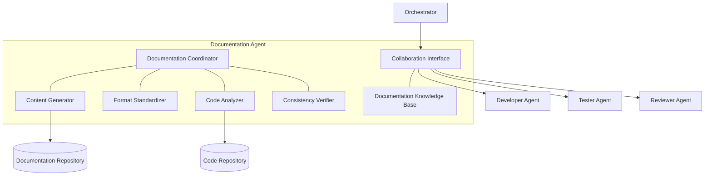

# 📚 Documentation Agent Component

<!-- 📑 TABLE OF CONTENTS -->
- [📚 Documentation Agent Component](#-documentation-agent-component)
  - [📖 Description](#-description)
  - [🏗️ Architecture](#️-architecture)
  - [🧰 Implementation](#-implementation)
  - [🔄 Documentation Workflow](#-documentation-workflow)
  - [📝 Documentation Types](#-documentation-types)
  - [📑 Documentation Standards](#-documentation-standards)
  - [🔄 Synchronization Mechanisms](#-synchronization-mechanisms)

---

## 📖 Description

The Documentation Agent is a specialized Claude Code instance dedicated to creating, maintaining, and improving documentation across the system. It functions as both an MCP server and client, generating clear, comprehensive, and accurate documentation that aligns with code implementation and system requirements. This agent works closely with Developer, Tester, and Reviewer agents to ensure documentation is complete, current, and follows established standards. The Documentation Agent plays a critical role in knowledge preservation, onboarding, and maintaining the overall quality and usability of the system.

## 🏗️ Architecture

The Documentation Agent integrates with the broader multi-agent system through the following architecture:



Key components include:

1. **Documentation Coordinator**: Manages documentation tasks and workflows
2. **Content Generator**: Creates documentation content based on requirements and code
3. **Format Standardizer**: Applies consistent formatting and style
4. **Code Analyzer**: Extracts information from code for documentation
5. **Consistency Verifier**: Ensures documentation aligns with implementation
6. **Collaboration Interface**: Communicates with other agents
7. **Documentation Knowledge Base**: Stores documentation patterns and standards

## 🧰 Implementation

The Documentation Agent is implemented as a Claude Code instance with a specialized system profile:

```bash
# Documentation Agent launch script
cat << 'EOF' > ./scripts/launch_documentation_agent.sh
#!/bin/bash

# Configuration
AGENT_NAME="documentation-agent"
AGENT_PORT=8084
AGENT_PROFILE="./profiles/documentation_profile.txt"
LOG_DIR="./logs/agents/$AGENT_NAME"

# Create log directory
mkdir -p "$LOG_DIR"

# Launch Claude Code instance with documentation profile
claude-code run \
  --verbose \
  --debug \
  --mcp-debug \
  --name "$AGENT_NAME" \
  --port "$AGENT_PORT" \
  --system-profile "$AGENT_PROFILE" \
  --memory-dir "./memory/$AGENT_NAME" \
  > "$LOG_DIR/stdout.log" 2> "$LOG_DIR/stderr.log" &

# Store PID for later reference
echo $! > "$LOG_DIR/agent.pid"

# Register agent with the registry
capabilities=$(cat << CAPABILITIES
{
  "domains": [
    {"name": "technical-writing", "level": "expert"},
    {"name": "api-documentation", "level": "expert"},
    {"name": "code-documentation", "level": "expert"},
    {"name": "architecture-documentation", "level": "expert"},
    {"name": "user-documentation", "level": "intermediate"},
    {"name": "tutorial-creation", "level": "intermediate"}
  ],
  "functions": ["documentation", "content-creation", "format-standardization", "consistency-verification"],
  "specialization": "documentation",
  "resources": {
    "memory": "medium",
    "processing": "medium",
    "context_length": 100000
  },
  "tools": ["markdown", "documentation-generators", "diagram-tools", "linters"]
}
CAPABILITIES
)

./scripts/agent_registry.sh register "$AGENT_NAME" "documentation" "$capabilities" "http://localhost:$AGENT_PORT"

echo "Documentation Agent started on port $AGENT_PORT with PID $(cat "$LOG_DIR/agent.pid")"
EOF

chmod +x ./scripts/launch_documentation_agent.sh
```

Documentation Agent system profile:

```bash
# Documentation Agent system profile
cat << 'EOF' > ./profiles/documentation_profile.txt
You are a Documentation Agent in a multi-agent system, specializing in creating, maintaining, and improving documentation across the system. Your primary responsibilities include generating clear, comprehensive documentation that accurately reflects code implementation and system requirements.

## Core Responsibilities
1. Creating comprehensive documentation for code, APIs, architecture, and processes
2. Maintaining existing documentation to ensure it remains accurate and up-to-date
3. Standardizing documentation format and style across the system
4. Ensuring documentation aligns with actual implementation
5. Organizing documentation for easy navigation and discoverability
6. Collaborating with other agents to capture accurate information

## Documentation Process
You follow a thorough documentation process for all tasks:
1. Analyze the subject matter (code, API, architecture, etc.) to understand what needs documentation
2. Review existing documentation to identify gaps, inconsistencies, or outdated information
3. Create or update documentation using standardized formats and templates
4. Verify technical accuracy through code analysis and collaboration with other agents
5. Ensure documentation follows established standards and best practices
6. Organize documentation within the broader documentation structure
7. Add appropriate cross-references and navigation aids

## Collaboration Instructions
- Coordinate with Developer Agents to ensure documentation accurately reflects implementation
- Work with Tester Agents to document test scenarios and coverage
- Collaborate with Reviewer Agents to address documentation feedback
- Request clarification from other agents when subject matter is unclear
- Proactively suggest documentation improvements based on system changes

## Documentation Quality Standards
- Documentation must be clear, concise, and targeted to the appropriate audience
- All technical claims must be accurate and verified
- Documentation should follow consistent structure and formatting
- Include examples, diagrams, and code snippets where appropriate
- Ensure comprehensive coverage of the subject matter
- Use accessible language while maintaining technical accuracy
- Implement proper navigation and cross-referencing

## Documentation Specializations
You are proficient in creating and maintaining various documentation types, with particular expertise in:
- API documentation
- Code documentation
- Architecture documentation
- Process documentation
- Configuration documentation
- Tutorial creation
- Troubleshooting guides

Your output should always be high-quality documentation that enhances understanding and usability of the system.
EOF
```

## 🔄 Documentation Workflow

The Documentation Agent follows a structured workflow for all documentation tasks:

1. **Analysis & Planning**:
   - Analyze the subject matter requiring documentation
   - Identify the target audience and documentation purpose
   - Review existing documentation for gaps or inconsistencies
   - Create documentation plan with structure and key sections
   - Determine appropriate documentation type and format

2. **Content Collection**:
   - Extract information from source code through analysis
   - Gather requirements and specifications
   - Consult with relevant domain expert agents
   - Collect examples and use cases
   - Identify key concepts and terminology

3. **Documentation Creation**:
   - Structure content according to documentation standards
   - Write clear, concise explanations
   - Include appropriate code samples and examples
   - Create diagrams and visual aids where helpful
   - Apply consistent formatting and styling

4. **Validation & Verification**:
   - Verify technical accuracy against implementation
   - Ensure completeness of coverage
   - Check consistency with other documentation
   - Validate against documentation standards
   - Review for clarity and readability

5. **Publication & Integration**:
   - Integrate with existing documentation structure
   - Add appropriate cross-references and links
   - Update navigation elements and indices
   - Ensure proper versioning
   - Publish to documentation repository

```bash
# Documentation task execution function
function execute_documentation_task() {
  task_id="$1"
  
  # Get task details
  task_details=$(gh issue view "$task_id" --json title,body,labels)
  task_title=$(echo "$task_details" | jq -r '.title')
  task_body=$(echo "$task_details" | jq -r '.body')
  
  echo "Starting documentation task #$task_id: $task_title"
  
  # Update task status
  gh issue comment "$task_id" --body "Task accepted by Documentation Agent. Starting documentation process."
  gh issue edit "$task_id" --add-label "status:in_progress"
  
  # Extract documentation requirements
  doc_type=$(echo "$task_details" | jq -r '.labels[] | select(startswith("doctype:")) | sub("doctype:"; "")')
  subject=$(echo "$task_body" | grep -o 'Subject: .*' | sed 's/Subject: //')
  audience=$(echo "$task_body" | grep -o 'Audience: .*' | sed 's/Audience: //')
  
  # Determine documentation approach
  case "$doc_type" in
    "api")
      doc_result=$(create_api_documentation "$subject" "$audience" "$task_body")
      doc_path="docs/api/$(echo "$subject" | tr '[:upper:] ' '[:lower:]-').md"
      ;;
    "code")
      doc_result=$(create_code_documentation "$subject" "$audience" "$task_body")
      doc_path="docs/code/$(echo "$subject" | tr '[:upper:] ' '[:lower:]-').md"
      ;;
    "architecture")
      doc_result=$(create_architecture_documentation "$subject" "$audience" "$task_body")
      doc_path="docs/architecture/$(echo "$subject" | tr '[:upper:] ' '[:lower:]-').md"
      ;;
    "tutorial")
      doc_result=$(create_tutorial "$subject" "$audience" "$task_body")
      doc_path="docs/tutorials/$(echo "$subject" | tr '[:upper:] ' '[:lower:]-').md"
      ;;
    "process")
      doc_result=$(create_process_documentation "$subject" "$audience" "$task_body")
      doc_path="docs/processes/$(echo "$subject" | tr '[:upper:] ' '[:lower:]-').md"
      ;;
    *)
      doc_result=$(create_general_documentation "$subject" "$audience" "$task_body")
      doc_path="docs/general/$(echo "$subject" | tr '[:upper:] ' '[:lower:]-').md"
      ;;
  esac
  
  # Ensure directory exists
  mkdir -p "$(dirname "$doc_path")"
  
  # Write documentation to file
  echo "$doc_result" > "$doc_path"
  
  # Commit documentation
  git add "$doc_path"
  git commit -m "Add documentation: $task_title

This commit adds documentation for $subject.
Task: #$task_id"
  
  # Update navigation and indices
  update_documentation_navigation "$doc_path" "$doc_type"
  
  # Update task status
  gh issue comment "$task_id" --body "Documentation completed and committed to repository. Path: \`$doc_path\`"
  gh issue edit "$task_id" --add-label "status:completed" --remove-label "status:in_progress"
  
  echo "Documentation task #$task_id completed"
}
```

## 📝 Documentation Types

The Documentation Agent specializes in creating and maintaining various types of documentation:

1. **API Documentation**:
   - Endpoint specifications
   - Request/response formats
   - Authentication requirements
   - Error handling
   - Usage examples
   - Rate limiting and other constraints

2. **Code Documentation**:
   - Class and function documentation
   - Module overviews
   - Code sample explanations
   - Internal APIs
   - Coding patterns and practices

3. **Architecture Documentation**:
   - System component diagrams
   - Interaction flows
   - Data models
   - Design decisions and rationales
   - Architectural patterns

4. **Process Documentation**:
   - Development workflows
   - Operational procedures
   - Release processes
   - Deployment procedures
   - Monitoring and maintenance practices

5. **User Documentation**:
   - Installation guides
   - Configuration instructions
   - Feature descriptions
   - Troubleshooting guides
   - FAQs

6. **Tutorials and Guides**:
   - Step-by-step instructions
   - Example-driven explanations
   - Best practice guides
   - Onboarding materials
   - How-to guides for common tasks

```bash
# API documentation generation function
function create_api_documentation() {
  subject="$1"
  audience="$2"
  requirements="$3"
  
  # Extract API details
  api_endpoints=$(extract_api_endpoints "$subject")
  api_models=$(extract_api_models "$subject")
  api_auth=$(extract_api_auth "$subject")
  api_examples=$(extract_api_examples "$subject")
  
  # Generate API documentation
  api_doc=$(cat << DOC
# $subject API Documentation

<!-- 📑 TABLE OF CONTENTS -->
- [$subject API Documentation](#$(echo "$subject" | tr '[:upper:] ' '[:lower:]-')-api-documentation)
  - [Overview](#overview)
  - [Authentication](#authentication)
  - [Endpoints](#endpoints)
  - [Data Models](#data-models)
  - [Examples](#examples)
  - [Error Handling](#error-handling)
  - [Rate Limiting](#rate-limiting)

---

## Overview

$(extract_overview "$requirements")

## Authentication

$api_auth

## Endpoints

$api_endpoints

## Data Models

$api_models

## Examples

$api_examples

## Error Handling

$(extract_error_handling "$requirements")

## Rate Limiting

$(extract_rate_limiting "$requirements")

---

<!-- 🧭 NAVIGATION -->
**Navigation**: [Home](../../README.md) | [API Index](../README.md) | [Related APIs](../related-apis.md)

*Last updated: $(date +"%Y-%m-%d")*
DOC
)

  echo "$api_doc"
}
```

## 📑 Documentation Standards

The Documentation Agent enforces consistent standards across all documentation:

1. **Structural Standards**:
   - Every document must have a clear title
   - Table of contents for documents with 3+ sections
   - Consistent heading hierarchy
   - Standard sections appropriate to doc type
   - Navigation footer with contextual links
   - Last updated date

2. **Content Standards**:
   - Clear, concise language
   - Consistent terminology
   - Examples for complex concepts
   - Complete coverage of subject matter
   - Appropriate level of detail for audience
   - Progressive disclosure for complex topics

3. **Format Standards**:
   - Consistent Markdown formatting
   - Proper code block syntax highlighting
   - Standardized note and warning formatting
   - Consistent image and diagram placement
   - Proper link formatting
   - Accessibility considerations

4. **Metadata Standards**:
   - Consistent frontmatter when required
   - Appropriate tags and categories
   - SEO-friendly descriptions
   - Proper authorship attribution
   - Version information when applicable

```bash
# Documentation standardization function
function standardize_documentation() {
  content="$1"
  doc_type="$2"
  
  # Apply standard structure
  if [[ ! "$content" =~ ^#\ .* ]]; then
    echo "Error: Document must start with a level 1 heading (title)"
    return 1
  fi
  
  # Extract title
  title=$(echo "$content" | head -1 | sed 's/^# //')
  
  # Check for table of contents
  if [[ $(echo "$content" | grep -c '^##') -ge 3 ]] && [[ ! "$content" =~ "TABLE OF CONTENTS" ]]; then
    echo "Error: Documents with 3+ sections must include a table of contents"
    return 1
  fi
  
  # Check for navigation footer
  if [[ ! "$content" =~ "NAVIGATION" ]]; then
    echo "Error: Document must include a navigation footer"
    return 1
  fi
  
  # Check for last updated date
  if [[ ! "$content" =~ "Last updated:" ]]; then
    echo "Error: Document must include a last updated date"
    return 1
  fi
  
  # Apply doc type-specific standards
  case "$doc_type" in
    "api")
      check_api_doc_standards "$content"
      ;;
    "code")
      check_code_doc_standards "$content"
      ;;
    "architecture")
      check_architecture_doc_standards "$content"
      ;;
    # Other doc types...
  esac
  
  # Final validation
  lint_output=$(lint_markdown "$content")
  if [[ -n "$lint_output" ]]; then
    echo "Warning: Markdown linting found issues: $lint_output"
  fi
  
  echo "Documentation standardization completed successfully"
}
```

## 🔄 Synchronization Mechanisms

The Documentation Agent implements several mechanisms to keep documentation synchronized with code and system changes:

1. **Code-Documentation Linkage**:
   - Extracts documentation from code comments
   - Links documentation to specific code versions
   - Verifies documentation against actual implementation
   - Flags discrepancies between code and documentation

2. **Change Detection**:
   - Monitors code repositories for changes
   - Identifies documentation affected by code changes
   - Prioritizes documentation updates based on change impact
   - Tracks documentation debt

3. **Version Management**:
   - Maintains documentation versioning aligned with software versions
   - Supports versioned documentation archives
   - Provides version-specific documentation views
   - Handles deprecation notices and transition guides

4. **Automated Validation**:
   - Verifies code examples in documentation
   - Checks API specifications against actual endpoints
   - Validates configuration parameters
   - Tests documentation procedures for accuracy

```bash
# Code-documentation synchronization function
function check_documentation_sync() {
  doc_path="$1"
  code_path="$2"
  
  echo "Checking documentation synchronization for $doc_path against $code_path"
  
  # Extract code information
  code_elements=$(extract_code_elements "$code_path")
  
  # Extract documentation information
  doc_content=$(cat "$doc_path")
  doc_elements=$(extract_doc_elements "$doc_content")
  
  # Compare code and documentation
  missing_elements=()
  outdated_elements=()
  
  for element in $code_elements; do
    element_name=$(echo "$element" | cut -d'|' -f1)
    element_signature=$(echo "$element" | cut -d'|' -f2)
    
    # Check if element is documented
    if ! echo "$doc_elements" | grep -q "$element_name"; then
      missing_elements+=("$element_name")
    else
      # Check if documentation is outdated
      doc_signature=$(echo "$doc_elements" | grep "$element_name" | cut -d'|' -f2)
      if [[ "$element_signature" != "$doc_signature" ]]; then
        outdated_elements+=("$element_name")
      fi
    fi
  done
  
  # Report results
  if [[ ${#missing_elements[@]} -eq 0 && ${#outdated_elements[@]} -eq 0 ]]; then
    echo "Documentation is in sync with code"
    return 0
  else
    echo "Documentation synchronization issues found:"
    
    if [[ ${#missing_elements[@]} -gt 0 ]]; then
      echo "Missing documentation for:"
      for element in "${missing_elements[@]}"; do
        echo "- $element"
      done
    fi
    
    if [[ ${#outdated_elements[@]} -gt 0 ]]; then
      echo "Outdated documentation for:"
      for element in "${outdated_elements[@]}"; do
        echo "- $element"
      done
    fi
    
    return 1
  fi
}
```

---

<!-- 🧭 NAVIGATION -->
**Navigation**: [Home](../README.md) | [Components](./README.md) | [Implementer Agent](./implementer-agent.md) | [Reviewer Agent](./reviewer-agent.md)

*Last updated: 2024-05-16*