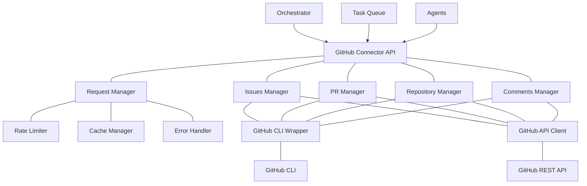

# 🔗 GitHub Connector Component

<!-- 📑 TABLE OF CONTENTS -->
- [🔗 GitHub Connector Component](#-github-connector-component)
  - [📖 Description](#-description)
  - [🏗️ Architecture](#️-architecture)
  - [🧰 Implementation](#-implementation)
  - [🔄 GitHub API Integration](#-github-api-integration)
  - [📋 Task Management](#-task-management)
  - [📊 Pull Request Workflow](#-pull-request-workflow)
  - [🔐 Authentication and Security](#-authentication-and-security)
  - [⚙️ Configuration](#️-configuration)

---

## 📖 Description

The GitHub Connector component provides a standardized interface for the multi-agent system to interact with GitHub repositories, issues, pull requests, and other GitHub resources. It centralizes all GitHub interactions, handles rate limiting, provides caching, and abstracts the GitHub CLI and API to present a clean, consistent interface to other components. This enables the system to use GitHub for task management, code storage, collaboration, and version control while shielding agents from the implementation details of the GitHub integration.

## 🏗️ Architecture

The GitHub Connector follows a layered architecture with specialized components for different GitHub resources:



Key components include:

1. **Request Manager**: Coordinates and optimizes GitHub requests
2. **Rate Limiter**: Prevents GitHub API rate limit errors
3. **Cache Manager**: Reduces API calls through caching
4. **Issues Manager**: Handles GitHub issue operations
5. **PR Manager**: Manages pull request workflows
6. **Repository Manager**: Handles repository operations
7. **GitHub CLI Wrapper**: Provides a clean interface to the GitHub CLI
8. **GitHub API Client**: Provides direct API access when needed

## 🧰 Implementation

The GitHub Connector is implemented using shell scripts that wrap the GitHub CLI:

```bash
# GitHub Connector implementation
cat << 'EOF' > ./scripts/github_connector.sh
#!/bin/bash

# Configuration
CONFIG_FILE="$(pwd)/github_connector.conf"
CACHE_DIR="$(pwd)/.github_cache"
LOG_FILE="$(pwd)/logs/github_connector.log"
RATE_LIMIT_FILE="$CACHE_DIR/rate_limits.json"
DEBUG=${GITHUB_CONNECTOR_DEBUG:-false}

# Initialize connector
function init_connector() {
  # Create cache directory
  mkdir -p "$CACHE_DIR"
  mkdir -p "$(dirname "$LOG_FILE")"
  
  # Check if gh CLI is installed
  if ! command -v gh &> /dev/null; then
    echo "Error: GitHub CLI (gh) is not installed. Please install it first." >&2
    return 1
  fi
  
  # Check if authenticated
  if ! gh auth status &> /dev/null; then
    echo "Error: Not authenticated with GitHub. Please run 'gh auth login' first." >&2
    return 1
  fi
  
  # Create default config if it doesn't exist
  if [[ ! -f "$CONFIG_FILE" ]]; then
    cat << CONFIG > "$CONFIG_FILE"
# GitHub Connector Configuration
CACHE_EXPIRY=300  # Cache expiry in seconds
RATE_LIMIT_BUFFER=50  # Number of requests to keep as buffer
RETRY_ATTEMPTS=3  # Number of retry attempts for failed requests
RETRY_DELAY=5  # Delay between retries in seconds
PARALLEL_REQUESTS=5  # Maximum number of parallel requests
DEFAULT_REPO="\${GITHUB_REPOSITORY:-}"  # Default repository
CONFIG
  fi
  
  # Load configuration
  source "$CONFIG_FILE"
  
  # Update rate limits
  update_rate_limits
  
  echo "GitHub Connector initialized"
  return 0
}

# Log message
function log_message() {
  level="$1"
  message="$2"
  
  timestamp=$(date -u +"%Y-%m-%dT%H:%M:%SZ")
  echo "[$timestamp] [$level] $message" >> "$LOG_FILE"
  
  if [[ "$level" == "ERROR" || "$DEBUG" == "true" ]]; then
    echo "[$level] $message" >&2
  fi
}

# Update rate limits
function update_rate_limits() {
  # Check if rate limit file exists and is recent (less than 5 minutes old)
  if [[ -f "$RATE_LIMIT_FILE" ]]; then
    file_age=$(($(date +%s) - $(stat -c %Y "$RATE_LIMIT_FILE" 2>/dev/null || stat -f %m "$RATE_LIMIT_FILE")))
    if [[ $file_age -lt 300 ]]; then
      # Use cached rate limits
      return 0
    fi
  fi
  
  # Get current rate limits
  rate_limits=$(gh api rate_limit 2>/dev/null)
  if [[ $? -eq 0 ]]; then
    echo "$rate_limits" > "$RATE_LIMIT_FILE"
    log_message "INFO" "Rate limits updated"
  else
    log_message "ERROR" "Failed to update rate limits"
    # Create a default rate limit file if it doesn't exist
    if [[ ! -f "$RATE_LIMIT_FILE" ]]; then
      echo '{"resources":{"core":{"limit":5000,"remaining":5000,"reset":0}}}' > "$RATE_LIMIT_FILE"
    fi
  fi
}

# Check rate limits
function check_rate_limit() {
  # Update rate limits if needed
  if [[ ! -f "$RATE_LIMIT_FILE" ]]; then
    update_rate_limits
  fi
  
  # Get remaining rate limit
  remaining=$(jq -r '.resources.core.remaining' "$RATE_LIMIT_FILE")
  limit=$(jq -r '.resources.core.limit' "$RATE_LIMIT_FILE")
  reset=$(jq -r '.resources.core.reset' "$RATE_LIMIT_FILE")
  
  # Check if we're close to the limit
  if [[ $remaining -lt $RATE_LIMIT_BUFFER ]]; then
    current_time=$(date +%s)
    wait_time=$((reset - current_time))
    
    if [[ $wait_time -gt 0 ]]; then
      log_message "WARNING" "Rate limit nearly reached ($remaining/$limit). Reset in $wait_time seconds."
      
      # If wait time is reasonable, wait for reset
      if [[ $wait_time -lt 300 ]]; then  # Less than 5 minutes
        log_message "INFO" "Waiting $wait_time seconds for rate limit reset..."
        sleep $wait_time
        update_rate_limits
      else
        log_message "WARNING" "Rate limit wait time too long ($wait_time seconds). Proceeding with caution."
      fi
    else
      # Reset time has passed, update rate limits
      update_rate_limits
    fi
  fi
}

# Perform GitHub CLI command with retries and rate limit checks
function gh_command() {
  command="$1"
  args="${@:2}"
  
  # Check rate limits before making request
  check_rate_limit
  
  # Try the command
  attempt=1
  while [[ $attempt -le $RETRY_ATTEMPTS ]]; do
    if [[ $DEBUG == "true" ]]; then
      log_message "DEBUG" "Executing: gh $command $args"
    fi
    
    result=$(gh $command $args 2>&1)
    exit_code=$?
    
    if [[ $exit_code -eq 0 ]]; then
      # Command succeeded
      if [[ $attempt -gt 1 ]]; then
        log_message "INFO" "Command succeeded after $attempt attempts"
      fi
      echo "$result"
      return 0
    else
      # Command failed
      if [[ $result == *"rate limit exceeded"* || $result == *"API rate limit exceeded"* ]]; then
        # Rate limit error
        log_message "WARNING" "Rate limit exceeded. Updating limits and waiting..."
        update_rate_limits
        reset=$(jq -r '.resources.core.reset' "$RATE_LIMIT_FILE")
        current_time=$(date +%s)
        wait_time=$((reset - current_time + 5))  # Add 5 seconds buffer
        
        if [[ $wait_time -gt 0 ]]; then
          log_message "INFO" "Waiting $wait_time seconds for rate limit reset..."
          sleep $wait_time
          update_rate_limits
        fi
      elif [[ $result == *"502 Bad Gateway"* || $result == *"504 Gateway Time-out"* || $result == *"Connection refused"* ]]; then
        # Temporary server error, retry after delay
        log_message "WARNING" "Temporary server error (attempt $attempt/$RETRY_ATTEMPTS): $result"
        sleep $((RETRY_DELAY * attempt))  # Exponential backoff
      else
        # Other error
        log_message "ERROR" "Command failed (attempt $attempt/$RETRY_ATTEMPTS): $result"
        if [[ $attempt -eq $RETRY_ATTEMPTS ]]; then
          echo "$result" >&2
          return $exit_code
        fi
        sleep $RETRY_DELAY
      fi
    fi
    
    attempt=$((attempt + 1))
  done
  
  # All attempts failed
  log_message "ERROR" "Command failed after $RETRY_ATTEMPTS attempts: gh $command $args"
  return 1
}

# Get cache key from command and args
function get_cache_key() {
  command="$1"
  args="${@:2}"
  
  # Create a hash of the command and args
  echo "$command $args" | md5sum | awk '{print $1}'
}

# Get cached result if available
function get_cached_result() {
  cache_key="$1"
  
  cache_file="$CACHE_DIR/$cache_key"
  if [[ -f "$cache_file" ]]; then
    file_age=$(($(date +%s) - $(stat -c %Y "$cache_file" 2>/dev/null || stat -f %m "$cache_file")))
    if [[ $file_age -lt $CACHE_EXPIRY ]]; then
      cat "$cache_file"
      return 0
    fi
  fi
  
  return 1
}

# Cache result
function cache_result() {
  cache_key="$1"
  result="$2"
  
  cache_file="$CACHE_DIR/$cache_key"
  echo "$result" > "$cache_file"
}

# Perform GitHub CLI command with caching
function gh_command_cached() {
  command="$1"
  args="${@:2}"
  
  # Use caching for read-only commands
  readonly_commands=("issue list" "issue view" "pr list" "pr view" "repo view" "api")
  
  is_readonly=false
  for cmd in "${readonly_commands[@]}"; do
    if [[ "$command $args" == "$cmd"* ]]; then
      is_readonly=true
      break
    fi
  done
  
  if [[ $is_readonly == true ]]; then
    # Get cache key
    cache_key=$(get_cache_key "$command" "$args")
    
    # Try to get from cache
    cached_result=$(get_cached_result "$cache_key")
    if [[ $? -eq 0 ]]; then
      if [[ $DEBUG == "true" ]]; then
        log_message "DEBUG" "Cache hit for: gh $command $args"
      fi
      echo "$cached_result"
      return 0
    fi
    
    # Not in cache, perform command
    result=$(gh_command "$command" "$args")
    exit_code=$?
    
    if [[ $exit_code -eq 0 ]]; then
      # Cache the result
      cache_result "$cache_key" "$result"
    fi
    
    echo "$result"
    return $exit_code
  else
    # Non-cacheable command
    gh_command "$command" "$args"
    return $?
  fi
}

# Clear cache
function clear_cache() {
  pattern="$1"  # Optional pattern to match cache keys
  
  if [[ -n "$pattern" ]]; then
    # Clear specific cache files
    find "$CACHE_DIR" -name "*${pattern}*" -type f -delete
    log_message "INFO" "Cleared cache files matching: $pattern"
  else
    # Clear all cache
    rm -f "$CACHE_DIR"/*
    log_message "INFO" "Cleared all cache files"
  fi
}

# Issue management functions

# List issues
function list_issues() {
  state="${1:-open}"  # open, closed, all
  labels="$2"  # Comma-separated list of labels
  limit="${3:-100}"  # Maximum number of issues to return
  repo="${4:-$DEFAULT_REPO}"  # Repository
  
  args="--state $state --limit $limit --json number,title,body,createdAt,updatedAt,closedAt,labels,assignees"
  
  if [[ -n "$labels" ]]; then
    args="$args --label $labels"
  fi
  
  if [[ -n "$repo" ]]; then
    args="$args -R $repo"
  fi
  
  gh_command_cached "issue list" "$args"
}

# Get issue
function get_issue() {
  issue_number="$1"
  repo="${2:-$DEFAULT_REPO}"  # Repository
  
  args="$issue_number --json number,title,body,createdAt,updatedAt,closedAt,labels,assignees,comments,timelineItems"
  
  if [[ -n "$repo" ]]; then
    args="$args -R $repo"
  fi
  
  gh_command_cached "issue view" "$args"
}

# Create issue
function create_issue() {
  title="$1"
  body="$2"
  labels="$3"  # Comma-separated list of labels
  assignees="$4"  # Comma-separated list of assignees
  repo="${5:-$DEFAULT_REPO}"  # Repository
  
  args="--title \"$title\" --body \"$body\""
  
  if [[ -n "$labels" ]]; then
    args="$args --label $labels"
  fi
  
  if [[ -n "$assignees" ]]; then
    IFS=',' read -ra assignee_array <<< "$assignees"
    for assignee in "${assignee_array[@]}"; do
      args="$args --assignee $assignee"
    done
  fi
  
  if [[ -n "$repo" ]]; then
    args="$args -R $repo"
  fi
  
  result=$(gh_command "issue create" $args)
  exit_code=$?
  
  if [[ $exit_code -eq 0 ]]; then
    # Extract issue number from URL
    issue_number=$(echo "$result" | grep -o '#[0-9]*' | tr -d '#')
    
    if [[ -n "$issue_number" ]]; then
      # Clear related cache
      clear_cache "issue list"
      
      echo "{\"number\": $issue_number, \"url\": \"$result\"}"
      return 0
    else
      log_message "ERROR" "Failed to extract issue number from result: $result"
      return 1
    fi
  else
    return $exit_code
  fi
}

# Update issue
function update_issue() {
  issue_number="$1"
  title="$2"  # Optional, use empty string to skip
  body="$3"  # Optional, use empty string to skip
  add_labels="$4"  # Comma-separated list of labels to add
  remove_labels="$5"  # Comma-separated list of labels to remove
  add_assignees="$6"  # Comma-separated list of assignees to add
  remove_assignees="$7"  # Comma-separated list of assignees to remove
  repo="${8:-$DEFAULT_REPO}"  # Repository
  
  args="$issue_number"
  
  if [[ -n "$title" ]]; then
    args="$args --title \"$title\""
  fi
  
  if [[ -n "$body" ]]; then
    args="$args --body \"$body\""
  fi
  
  if [[ -n "$add_labels" ]]; then
    args="$args --add-label $add_labels"
  fi
  
  if [[ -n "$remove_labels" ]]; then
    IFS=',' read -ra label_array <<< "$remove_labels"
    for label in "${label_array[@]}"; do
      args="$args --remove-label $label"
    done
  fi
  
  if [[ -n "$add_assignees" ]]; then
    IFS=',' read -ra assignee_array <<< "$add_assignees"
    for assignee in "${assignee_array[@]}"; do
      args="$args --add-assignee $assignee"
    done
  fi
  
  if [[ -n "$remove_assignees" ]]; then
    IFS=',' read -ra assignee_array <<< "$remove_assignees"
    for assignee in "${assignee_array[@]}"; do
      args="$args --remove-assignee $assignee"
    done
  fi
  
  if [[ -n "$repo" ]]; then
    args="$args -R $repo"
  fi
  
  result=$(gh_command "issue edit" $args)
  exit_code=$?
  
  if [[ $exit_code -eq 0 ]]; then
    # Clear related cache
    clear_cache "issue view $issue_number"
    clear_cache "issue list"
    
    echo "{\"number\": $issue_number, \"status\": \"updated\"}"
    return 0
  else
    return $exit_code
  fi
}

# Add comment to issue
function add_issue_comment() {
  issue_number="$1"
  body="$2"
  repo="${3:-$DEFAULT_REPO}"  # Repository
  
  args="$issue_number --body \"$body\""
  
  if [[ -n "$repo" ]]; then
    args="$args -R $repo"
  fi
  
  result=$(gh_command "issue comment" $args)
  exit_code=$?
  
  if [[ $exit_code -eq 0 ]]; then
    # Clear related cache
    clear_cache "issue view $issue_number"
    
    # Extract comment URL if available
    comment_url=$(echo "$result" | grep -o 'https://github.com/[^ ]*')
    
    echo "{\"number\": $issue_number, \"comment_url\": \"$comment_url\", \"status\": \"commented\"}"
    return 0
  else
    return $exit_code
  fi
}

# Close issue
function close_issue() {
  issue_number="$1"
  comment="$2"  # Optional comment to add when closing
  repo="${3:-$DEFAULT_REPO}"  # Repository
  
  # Add comment if provided
  if [[ -n "$comment" ]]; then
    add_issue_comment "$issue_number" "$comment" "$repo"
  fi
  
  args="$issue_number --state closed"
  
  if [[ -n "$repo" ]]; then
    args="$args -R $repo"
  fi
  
  result=$(gh_command "issue edit" $args)
  exit_code=$?
  
  if [[ $exit_code -eq 0 ]]; then
    # Clear related cache
    clear_cache "issue view $issue_number"
    clear_cache "issue list"
    
    echo "{\"number\": $issue_number, \"status\": \"closed\"}"
    return 0
  else
    return $exit_code
  fi
}

# Pull request management functions

# List pull requests
function list_prs() {
  state="${1:-open}"  # open, closed, merged, all
  limit="${2:-100}"  # Maximum number of PRs to return
  repo="${3:-$DEFAULT_REPO}"  # Repository
  
  args="--state $state --limit $limit --json number,title,body,createdAt,updatedAt,closedAt,mergedAt,labels,assignees,headRefName,baseRefName"
  
  if [[ -n "$repo" ]]; then
    args="$args -R $repo"
  fi
  
  gh_command_cached "pr list" "$args"
}

# Get pull request
function get_pr() {
  pr_number="$1"
  repo="${2:-$DEFAULT_REPO}"  # Repository
  
  args="$pr_number --json number,title,body,createdAt,updatedAt,closedAt,mergedAt,labels,assignees,headRefName,baseRefName,commits,files,reviews,comments"
  
  if [[ -n "$repo" ]]; then
    args="$args -R $repo"
  fi
  
  gh_command_cached "pr view" "$args"
}

# Create pull request
function create_pr() {
  title="$1"
  body="$2"
  base_branch="${3:-main}"  # Target branch
  head_branch="$4"  # Source branch (required)
  draft="${5:-false}"  # Whether to create as draft
  labels="$6"  # Comma-separated list of labels
  assignees="$7"  # Comma-separated list of assignees
  repo="${8:-$DEFAULT_REPO}"  # Repository
  
  args="--title \"$title\" --body \"$body\" --base $base_branch --head $head_branch"
  
  if [[ "$draft" == "true" ]]; then
    args="$args --draft"
  fi
  
  if [[ -n "$labels" ]]; then
    args="$args --label $labels"
  fi
  
  if [[ -n "$assignees" ]]; then
    IFS=',' read -ra assignee_array <<< "$assignees"
    for assignee in "${assignee_array[@]}"; do
      args="$args --assignee $assignee"
    done
  fi
  
  if [[ -n "$repo" ]]; then
    args="$args -R $repo"
  fi
  
  result=$(gh_command "pr create" $args)
  exit_code=$?
  
  if [[ $exit_code -eq 0 ]]; then
    # Extract PR number from URL
    pr_number=$(echo "$result" | grep -o '#[0-9]*' | tr -d '#')
    
    if [[ -n "$pr_number" ]]; then
      # Clear related cache
      clear_cache "pr list"
      
      echo "{\"number\": $pr_number, \"url\": \"$result\"}"
      return 0
    else
      log_message "ERROR" "Failed to extract PR number from result: $result"
      return 1
    fi
  else
    return $exit_code
  fi
}

# Update pull request
function update_pr() {
  pr_number="$1"
  title="$2"  # Optional, use empty string to skip
  body="$3"  # Optional, use empty string to skip
  add_labels="$4"  # Comma-separated list of labels to add
  remove_labels="$5"  # Comma-separated list of labels to remove
  add_assignees="$6"  # Comma-separated list of assignees to add
  remove_assignees="$7"  # Comma-separated list of assignees to remove
  repo="${8:-$DEFAULT_REPO}"  # Repository
  
  args="$pr_number"
  
  if [[ -n "$title" ]]; then
    args="$args --title \"$title\""
  fi
  
  if [[ -n "$body" ]]; then
    args="$args --body \"$body\""
  fi
  
  if [[ -n "$add_labels" ]]; then
    args="$args --add-label $add_labels"
  fi
  
  if [[ -n "$remove_labels" ]]; then
    IFS=',' read -ra label_array <<< "$remove_labels"
    for label in "${label_array[@]}"; do
      args="$args --remove-label $label"
    done
  fi
  
  if [[ -n "$add_assignees" ]]; then
    IFS=',' read -ra assignee_array <<< "$add_assignees"
    for assignee in "${assignee_array[@]}"; do
      args="$args --add-assignee $assignee"
    done
  fi
  
  if [[ -n "$remove_assignees" ]]; then
    IFS=',' read -ra assignee_array <<< "$remove_assignees"
    for assignee in "${assignee_array[@]}"; do
      args="$args --remove-assignee $assignee"
    done
  fi
  
  if [[ -n "$repo" ]]; then
    args="$args -R $repo"
  fi
  
  result=$(gh_command "pr edit" $args)
  exit_code=$?
  
  if [[ $exit_code -eq 0 ]]; then
    # Clear related cache
    clear_cache "pr view $pr_number"
    clear_cache "pr list"
    
    echo "{\"number\": $pr_number, \"status\": \"updated\"}"
    return 0
  else
    return $exit_code
  fi
}

# Add review to pull request
function add_pr_review() {
  pr_number="$1"
  body="$2"
  event="${3:-COMMENT}"  # APPROVE, REQUEST_CHANGES, COMMENT
  repo="${4:-$DEFAULT_REPO}"  # Repository
  
  args="$pr_number --body \"$body\" --$event"
  
  if [[ -n "$repo" ]]; then
    args="$args -R $repo"
  fi
  
  result=$(gh_command "pr review" $args)
  exit_code=$?
  
  if [[ $exit_code -eq 0 ]]; then
    # Clear related cache
    clear_cache "pr view $pr_number"
    
    echo "{\"number\": $pr_number, \"status\": \"reviewed\", \"event\": \"$event\"}"
    return 0
  else
    return $exit_code
  fi
}

# Merge pull request
function merge_pr() {
  pr_number="$1"
  merge_method="${2:-merge}"  # merge, squash, rebase
  delete_branch="${3:-false}"  # Whether to delete the branch after merging
  repo="${4:-$DEFAULT_REPO}"  # Repository
  
  args="$pr_number --$merge_method"
  
  if [[ "$delete_branch" == "true" ]]; then
    args="$args --delete-branch"
  fi
  
  if [[ -n "$repo" ]]; then
    args="$args -R $repo"
  fi
  
  result=$(gh_command "pr merge" $args)
  exit_code=$?
  
  if [[ $exit_code -eq 0 ]]; then
    # Clear related cache
    clear_cache "pr view $pr_number"
    clear_cache "pr list"
    
    echo "{\"number\": $pr_number, \"status\": \"merged\", \"method\": \"$merge_method\"}"
    return 0
  else
    return $exit_code
  fi
}

# Repository management functions

# Get repository information
function get_repo_info() {
  repo="${1:-$DEFAULT_REPO}"  # Repository
  
  args="--json name,description,defaultBranchRef,isPrivate,owner,parent"
  
  if [[ -n "$repo" ]]; then
    args="$args -R $repo"
  fi
  
  gh_command_cached "repo view" "$args"
}

# List repository branches
function list_branches() {
  repo="${1:-$DEFAULT_REPO}"  # Repository
  
  if [[ -n "$repo" ]]; then
    args="-R $repo"
  else
    args=""
  fi
  
  gh_command_cached "api" "repos/$repo/branches --jq '.[].name'"
}

# Create repository branch
function create_branch() {
  branch_name="$1"
  base_branch="${2:-main}"  # Base branch
  repo="${3:-$DEFAULT_REPO}"  # Repository
  
  args="$branch_name --track"
  
  if [[ -n "$repo" ]]; then
    args="$args -R $repo"
  fi
  
  # Ensure we're on the base branch
  gh_command "api" "-X POST repos/$repo/git/refs -f ref=refs/heads/$branch_name -f sha=$(gh api repos/$repo/git/refs/heads/$base_branch --jq .object.sha)"
  exit_code=$?
  
  if [[ $exit_code -eq 0 ]]; then
    # Clear related cache
    clear_cache "api repos/$repo/branches"
    
    echo "{\"name\": \"$branch_name\", \"base\": \"$base_branch\", \"status\": \"created\"}"
    return 0
  else
    return $exit_code
  fi
}

# API direct access
function call_api() {
  endpoint="$1"
  method="${2:-GET}"
  data="$3"  # JSON data for POST/PUT/PATCH requests
  
  args="$endpoint"
  
  if [[ "$method" != "GET" ]]; then
    args="$args -X $method"
    
    if [[ -n "$data" ]]; then
      args="$args -f \"$data\""
    fi
  fi
  
  if [[ "$method" == "GET" ]]; then
    gh_command_cached "api" "$args"
  else
    gh_command "api" "$args"
  fi
}

# Usage handling
case "$1" in
  "init")
    init_connector
    ;;
  "issue-list")
    list_issues "$2" "$3" "$4" "$5"
    ;;
  "issue-get")
    get_issue "$2" "$3"
    ;;
  "issue-create")
    create_issue "$2" "$3" "$4" "$5" "$6"
    ;;
  "issue-update")
    update_issue "$2" "$3" "$4" "$5" "$6" "$7" "$8" "$9"
    ;;
  "issue-comment")
    add_issue_comment "$2" "$3" "$4"
    ;;
  "issue-close")
    close_issue "$2" "$3" "$4"
    ;;
  "pr-list")
    list_prs "$2" "$3" "$4"
    ;;
  "pr-get")
    get_pr "$2" "$3"
    ;;
  "pr-create")
    create_pr "$2" "$3" "$4" "$5" "$6" "$7" "$8" "$9"
    ;;
  "pr-update")
    update_pr "$2" "$3" "$4" "$5" "$6" "$7" "$8" "$9"
    ;;
  "pr-review")
    add_pr_review "$2" "$3" "$4" "$5"
    ;;
  "pr-merge")
    merge_pr "$2" "$3" "$4" "$5"
    ;;
  "repo-info")
    get_repo_info "$2"
    ;;
  "repo-branches")
    list_branches "$2"
    ;;
  "repo-create-branch")
    create_branch "$2" "$3" "$4"
    ;;
  "api")
    call_api "$2" "$3" "$4"
    ;;
  "clear-cache")
    clear_cache "$2"
    ;;
  *)
    echo "Usage: $0 {init|issue-list|issue-get|issue-create|issue-update|issue-comment|issue-close|pr-list|pr-get|pr-create|pr-update|pr-review|pr-merge|repo-info|repo-branches|repo-create-branch|api|clear-cache}"
    exit 1
    ;;
esac
EOF

chmod +x ./scripts/github_connector.sh
```

## 🔄 GitHub API Integration

The GitHub Connector provides a robust integration with the GitHub API:

1. **Rate Limit Management**:
   - Tracks API rate limit consumption
   - Implements backoff strategies when approaching limits
   - Preemptively waits for reset when necessary
   - Distributes requests to stay within limits

2. **Error Handling**:
   - Implements intelligent retry mechanisms
   - Handles transient GitHub errors gracefully
   - Provides detailed error information
   - Logs API interaction issues

3. **Performance Optimizations**:
   - Implements efficient caching of API responses
   - Batches requests when possible to reduce overhead
   - Uses conditional requests (If-Modified-Since, ETag)
   - Optimizes payload size for better performance

4. **API Versioning**:
   - Handles GitHub API versioning changes
   - Supports multiple API versions if needed
   - Maintains backward compatibility
   - Updates to new API versions when appropriate

The connector provides both GitHub CLI-based access and direct API access:

```bash
# Example GitHub API interaction
function perform_github_api_request() {
  endpoint="$1"
  method="${2:-GET}"
  data="$3"
  
  # Check current rate limit
  remaining_limit=$(./scripts/github_connector.sh api "rate_limit" | jq -r '.resources.core.remaining')
  
  if [[ $remaining_limit -lt 20 ]]; then
    echo "Warning: Rate limit is getting low: $remaining_limit remaining requests" >&2
  fi
  
  # Make API call
  if [[ "$method" == "GET" ]]; then
    result=$(./scripts/github_connector.sh api "$endpoint")
  else
    result=$(./scripts/github_connector.sh api "$endpoint" "$method" "$data")
  fi
  
  exit_code=$?
  
  if [[ $exit_code -ne 0 ]]; then
    echo "Error: GitHub API request failed for $endpoint" >&2
    return $exit_code
  fi
  
  # Update the rate limit cache after request
  ./scripts/github_connector.sh clear-cache "rate_limit"
  
  echo "$result"
  return 0
}
```

## 📋 Task Management

The GitHub Connector provides comprehensive task management through GitHub Issues:

1. **Issue CRUD Operations**:
   - Create new issues with metadata
   - Read issue details and comments
   - Update issue properties
   - Close/reopen issues as needed

2. **Issue Metadata Management**:
   - Apply labels for categorization
   - Assign issues to agents
   - Add/remove milestone tracking
   - Manage issue relationships

3. **Issue Activity Tracking**:
   - Add process comments
   - Report progress status
   - Document findings
   - Record completion information

4. **Issue Queries and Filters**:
   - Find issues by various criteria
   - Filter by labels, assignees, status
   - Sort by priority, age, status
   - Search issue content

Example issue workflow functions:

```bash
# Create a new task
function create_task() {
  title="$1"
  description="$2"
  task_type="$3"  # "feature", "bug", "enhancement", etc.
  priority="$4"  # "high", "medium", "low"
  domain="$5"  # Domain area: "frontend", "backend", "data", etc.
  assignee="$6"  # Optional assignee
  
  # Prepare labels
  labels="task,type:$task_type,priority:$priority,domain:$domain,status:pending"
  
  # Create issue body with structured metadata
  body=$(cat << BODY
## Task Description
$description

## Acceptance Criteria
- [Criteria to be defined]

## Resources
- [Resources to be added]

## Notes
- Created by Task Management System
BODY
)
  
  # Create the issue
  result=$(./scripts/github_connector.sh issue-create "$title" "$body" "$labels" "$assignee")
  exit_code=$?
  
  if [[ $exit_code -eq 0 ]]; then
    task_id=$(echo "$result" | jq -r '.number')
    echo "Task created with ID #$task_id"
    return 0
  else
    echo "Error: Failed to create task"
    return $exit_code
  fi
}

# Update task status
function update_task_status() {
  task_id="$1"
  status="$2"  # "pending", "in_progress", "blocked", "completed"
  
  # Remove old status label and add new one
  result=$(./scripts/github_connector.sh issue-update "$task_id" "" "" "status:$status" "status:pending,status:in_progress,status:blocked,status:completed" "" "")
  exit_code=$?
  
  if [[ $exit_code -eq 0 ]]; then
    echo "Task #$task_id updated to status: $status"
    return 0
  else
    echo "Error: Failed to update task status"
    return $exit_code
  fi
}

# Assign task to agent
function assign_task() {
  task_id="$1"
  agent_id="$2"
  
  # Update task assignment
  result=$(./scripts/github_connector.sh issue-update "$task_id" "" "" "" "" "$agent_id" "")
  exit_code=$?
  
  if [[ $exit_code -eq 0 ]]; then
    # Update status to in_progress
    update_task_status "$task_id" "in_progress"
    
    # Add comment about assignment
    ./scripts/github_connector.sh issue-comment "$task_id" "Task assigned to agent `$agent_id`."
    
    echo "Task #$task_id assigned to agent $agent_id"
    return 0
  else
    echo "Error: Failed to assign task"
    return $exit_code
  fi
}
```

## 📊 Pull Request Workflow

The GitHub Connector supports the pull request workflow according to the system's PR policy:

1. **PR Policy Enforcement**:
   - PRs are only created when actual artifacts are committed to the repository
   - Reviewers have final authority to decide whether work merits a PR
   - If work doesn't meet quality standards, branches may be deleted without creating PRs
   - All branch disposition decisions are documented in GitHub issues

2. **PR Creation**:
   - Reviewers create PRs when work meets quality standards
   - Link PRs to issues for tracking
   - Set PR status (draft, ready)
   - Apply labels for categorization

3. **PR Review Process**:
   - Submit PR reviews
   - Approve or request changes
   - Add line-specific comments
   - Track review status

4. **PR Management**:
   - Update PR content and metadata
   - Address review comments
   - Handle merge conflicts
   - Close or merge PRs

5. **Branch Disposition**:
   - Merge branches with valuable work
   - Delete branches with substandard work
   - Document disposition decisions in issues

Example PR workflow functions:

```bash
# Create a pull request for a task (called by Reviewer after evaluating work quality)
function create_pr_for_task() {
  task_id="$1"
  branch_name="$2"
  base_branch="${3:-main}"
  reviewer_decision="$4"  # "approve" or "reject"
  
  # If the reviewer decides to reject the work, delete the branch
  if [[ "$reviewer_decision" == "reject" ]]; then
    # Document the decision in the task
    ./scripts/github_connector.sh issue-comment "$task_id" "⚠️ Reviewer has determined that work on branch '$branch_name' does not meet quality standards. Branch will be deleted without creating a PR."
    
    # Delete the branch
    ./scripts/github_connector.sh repo-delete-branch "$branch_name"
    
    # Update task status
    update_task_status "$task_id" "needs_rework"
    
    echo "Branch '$branch_name' deleted for task #$task_id per reviewer decision"
    return 0
  fi
  
  # Get task details
  task_details=$(./scripts/github_connector.sh issue-get "$task_id")
  task_title=$(echo "$task_details" | jq -r '.title')
  task_labels=$(echo "$task_details" | jq -r '.labels[].name' | grep -v "status:" | tr '\n' ',')
  
  # Create PR title and body
  pr_title="[$task_id] $task_title"
  pr_body=$(cat << BODY
## Task Reference
Resolves #$task_id

## Changes
- [Describe the changes made]

## Testing
- [Describe how these changes were tested]

## Notes
- [Any additional notes]

## Reviewer Assessment
✅ Reviewer has determined this work meets quality standards and merits inclusion in the codebase.
BODY
)
  
  # Create the PR
  result=$(./scripts/github_connector.sh pr-create "$pr_title" "$pr_body" "$base_branch" "$branch_name" "false" "$task_labels")
  exit_code=$?
  
  if [[ $exit_code -eq 0 ]]; then
    pr_number=$(echo "$result" | jq -r '.number')
    
    # Add comment to the task about the PR
    ./scripts/github_connector.sh issue-comment "$task_id" "✅ Reviewer approved work quality. Pull Request #$pr_number created for this task."
    
    # Update task status
    update_task_status "$task_id" "in_review"
    
    echo "PR #$pr_number created for task #$task_id"
    return 0
  else
    echo "Error: Failed to create PR"
    return $exit_code
  fi
}

# Handle PR review
function handle_pr_review() {
  pr_number="$1"
  review_type="$2"  # "approve", "request_changes", "comment"
  review_comment="$3"
  
  # Map review type to GitHub API event
  case "$review_type" in
    "approve")
      event="APPROVE"
      ;;
    "request_changes")
      event="REQUEST_CHANGES"
      ;;
    "comment")
      event="COMMENT"
      ;;
    *)
      echo "Error: Invalid review type: $review_type"
      return 1
      ;;
  esac
  
  # Submit the review
  result=$(./scripts/github_connector.sh pr-review "$pr_number" "$review_comment" "$event")
  exit_code=$?
  
  if [[ $exit_code -eq 0 ]]; then
    echo "PR #$pr_number reviewed: $review_type"
    
    # If approved, merge the PR
    if [[ "$review_type" == "approve" ]]; then
      merge_pr "$pr_number" "squash" "true"
    fi
    
    return 0
  else
    echo "Error: Failed to review PR"
    return $exit_code
  fi
}

# Merge PR
function merge_pr() {
  pr_number="$1"
  merge_method="${2:-squash}"  # "merge", "squash", "rebase"
  delete_branch="${3:-true}"  # Whether to delete the branch after merging
  
  # Merge the PR
  result=$(./scripts/github_connector.sh pr-merge "$pr_number" "$merge_method" "$delete_branch")
  exit_code=$?
  
  if [[ $exit_code -eq 0 ]]; then
    # Get PR details to find associated tasks
    pr_details=$(./scripts/github_connector.sh pr-get "$pr_number")
    
    # Extract task IDs from PR body using regex
    task_ids=$(echo "$pr_details" | jq -r '.body' | grep -o "#[0-9]\+" | tr -d '#')
    
    # Update associated tasks
    for task_id in $task_ids; do
      update_task_status "$task_id" "completed"
      ./scripts/github_connector.sh issue-comment "$task_id" "This task was completed through PR #$pr_number, which has been merged."
    done
    
    echo "PR #$pr_number merged successfully"
    return 0
  else
    echo "Error: Failed to merge PR"
    return $exit_code
  fi
}
```

## 🔐 Authentication and Security

The GitHub Connector implements robust security measures:

1. **Authentication Management**:
   - Uses GitHub CLI authentication
   - Supports token-based authentication
   - Handles credential rotation
   - Verifies authentication state

2. **Permission Controls**:
   - Respects GitHub repository permissions
   - Handles multi-tenant access controls
   - Prevents unauthorized operations
   - Implements least privilege principle

3. **Sensitive Data Protection**:
   - Masks sensitive data in logs
   - Prevents token exposure
   - Secures credentials in storage
   - Implements secure communication

4. **Audit Trail**:
   - Logs all GitHub operations
   - Records access patterns
   - Maintains operation history
   - Supports compliance requirements

```bash
# Verify authentication and permissions
function verify_authentication() {
  # Check if authenticated
  auth_status=$(gh auth status 2>&1)
  
  if [[ $? -ne 0 ]]; then
    echo "Error: Not authenticated with GitHub" >&2
    return 1
  fi
  
  # Extract logged-in user
  current_user=$(echo "$auth_status" | grep "Logged in to" | grep -o "as [^ ]*" | cut -d ' ' -f 2)
  
  if [[ -z "$current_user" ]]; then
    echo "Error: Failed to determine current user" >&2
    return 1
  fi
  
  # Verify repository access
  repo="${1:-$DEFAULT_REPO}"
  
  repo_access=$(gh repo view "$repo" --json name 2>&1)
  if [[ $? -ne 0 ]]; then
    echo "Error: No access to repository $repo" >&2
    return 1
  fi
  
  # Get permission level
  permission=$(gh api "repos/$repo/collaborators/$current_user/permission" --jq '.permission')
  
  echo "{\"user\": \"$current_user\", \"repository\": \"$repo\", \"permission\": \"$permission\"}"
  return 0
}
```

## ⚙️ Configuration

The GitHub Connector provides flexible configuration options:

1. **Repository Configuration**:
   - Default repository settings
   - Repository-specific customizations
   - Branch protection rules
   - Label management

2. **Rate Limit Configuration**:
   - Rate limit buffer settings
   - Retry strategies
   - Backoff parameters
   - Request prioritization

3. **Caching Configuration**:
   - Cache lifetime settings
   - Cache invalidation policies
   - Cache storage options
   - Cache size limits

4. **Integration Settings**:
   - Webhook configurations
   - Event handling preferences
   - Notification settings
   - Integration mode options

```bash
# Configuration management
function update_configuration() {
  config_key="$1"
  config_value="$2"
  
  # Read current configuration
  if [[ -f "$CONFIG_FILE" ]]; then
    current_config=$(cat "$CONFIG_FILE")
  else
    current_config="# GitHub Connector Configuration"
  fi
  
  # Update or add configuration key
  if grep -q "^$config_key=" <<< "$current_config"; then
    # Update existing key
    new_config=$(sed "s|^$config_key=.*|$config_key=$config_value|" <<< "$current_config")
  else
    # Add new key
    new_config="$current_config
$config_key=$config_value"
  fi
  
  # Write updated configuration
  echo "$new_config" > "$CONFIG_FILE"
  
  echo "Configuration updated: $config_key=$config_value"
}

# Load configuration with defaults
function load_configuration() {
  # Default configuration
  CACHE_EXPIRY=300
  RATE_LIMIT_BUFFER=50
  RETRY_ATTEMPTS=3
  RETRY_DELAY=5
  PARALLEL_REQUESTS=5
  DEFAULT_REPO="${GITHUB_REPOSITORY:-}"
  
  # Load from config file if it exists
  if [[ -f "$CONFIG_FILE" ]]; then
    source "$CONFIG_FILE"
  fi
  
  # Override with environment variables if set
  [[ -n "${GH_CACHE_EXPIRY:-}" ]] && CACHE_EXPIRY="$GH_CACHE_EXPIRY"
  [[ -n "${GH_RATE_LIMIT_BUFFER:-}" ]] && RATE_LIMIT_BUFFER="$GH_RATE_LIMIT_BUFFER"
  [[ -n "${GH_RETRY_ATTEMPTS:-}" ]] && RETRY_ATTEMPTS="$GH_RETRY_ATTEMPTS"
  [[ -n "${GH_RETRY_DELAY:-}" ]] && RETRY_DELAY="$GH_RETRY_DELAY"
  [[ -n "${GH_PARALLEL_REQUESTS:-}" ]] && PARALLEL_REQUESTS="$GH_PARALLEL_REQUESTS"
  [[ -n "${GH_DEFAULT_REPO:-}" ]] && DEFAULT_REPO="$GH_DEFAULT_REPO"
  
  export CACHE_EXPIRY RATE_LIMIT_BUFFER RETRY_ATTEMPTS RETRY_DELAY PARALLEL_REQUESTS DEFAULT_REPO
}
```

---

<!-- 🧭 NAVIGATION -->
**Navigation**: [Home](../README.md) | [Components](./README.md) | [Performance Metrics](./performance-metrics.md) | [Task Queue](./task-queue.md)

*Last updated: 2025-05-17*