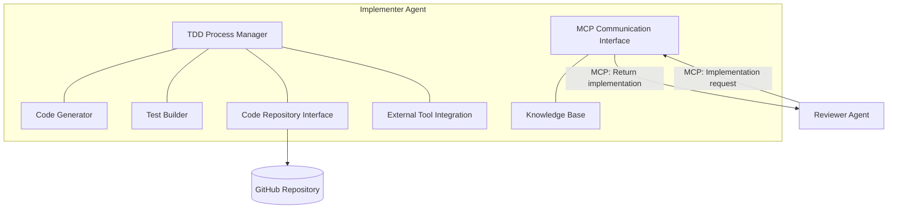
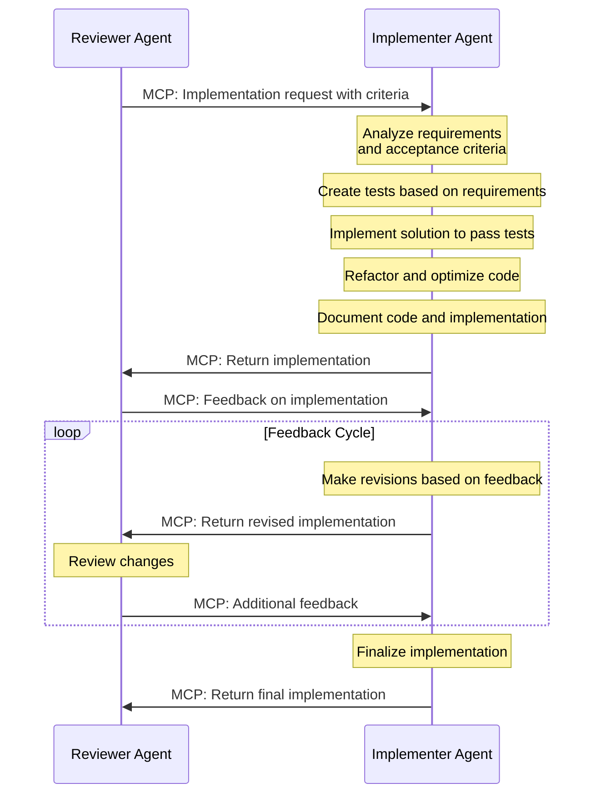

# 👨‍💻 Implementer Agent Component

<!-- 📑 TABLE OF CONTENTS -->
- [👨‍💻 Implementer Agent Component](#-implementer-agent-component)
  - [📖 Description](#-description)
  - [🏗️ Architecture](#️-architecture)
  - [🧰 Implementation](#-implementation)
  - [🧪 Test-Driven Development Process](#-test-driven-development-process)
  - [📊 Development Workflow](#-development-workflow)
  - [🧩 Specialized Capabilities](#-specialized-capabilities)
  - [📚 Knowledge Integration](#-knowledge-integration)

---

## 📖 Description

The Implementer Agent is a specialized Claude Code instance tailored for implementing software solutions following Test-Driven Development (TDD) methodology. It functions as the final agent in the Orchestrator → Reviewer → Implementer chain, receiving tasks from the Reviewer agent via STDIO-based MCP communication. This agent focuses specifically on coding tasks, including implementing new features, fixing bugs, refactoring code, and optimizing existing implementations across various programming languages and domains.

## 🏗️ Architecture

The Implementer Agent integrates with the broader multi-agent system through the following architecture:



Key components include:

1. **TDD Process Manager**: Coordinates the test-first development cycle
2. **Code Generator**: Creates implementation code based on tests and requirements
3. **Test Builder**: Creates test cases based on requirements
4. **Code Repository Interface**: Interacts with GitHub and version control
5. **External Tool Integration**: Connects with language-specific tools (compilers, linters, etc.)
6. **MCP Communication Interface**: Receives tasks from and returns results to the Reviewer agent
7. **Knowledge Base**: Stores programming patterns and best practices

## 🧰 Implementation

The Implementer Agent is implemented as a Claude Code instance with a specialized system profile:

```bash
# Implementer Agent launch script
cat << 'EOF' > ./scripts/launch_implementer_agent.sh
#!/bin/bash

# Get directory where script is located
SCRIPT_DIR="$(cd "$(dirname "${BASH_SOURCE[0]}")" && pwd)"

# Create workspace directory
WORKSPACE_DIR="${SCRIPT_DIR}/workspace/implementer"
mkdir -p "$WORKSPACE_DIR"
LOG_DIR="${SCRIPT_DIR}/logs"
mkdir -p "$LOG_DIR"

# Path to system prompt file
SYSTEM_PROMPT_FILE="${SCRIPT_DIR}/implementer-prompt.md"

# Read system prompt from file
SYSTEM_PROMPT=$(cat "$SYSTEM_PROMPT_FILE")

# Change to workspace directory
cd "$WORKSPACE_DIR"

# Launch Implementer as background MCP server with log capture
printf "Starting Implementer MCP server...\n"
printf "Workspace: $WORKSPACE_DIR\n"
printf "System prompt: $SYSTEM_PROMPT_FILE\n"

# Start Claude MCP server with system prompt
# The Implementer communicates with the Reviewer via STDIO
nohup claude mcp serve --system-prompt "$SYSTEM_PROMPT" \
  --print --debug --verbose --mcp-debug > "$LOG_DIR/implementer.log" 2>&1 &

# Store PID for later reference
IMPLEMENTER_PID=$!
echo "Implementer started with PID: $IMPLEMENTER_PID"
echo $IMPLEMENTER_PID > "$LOG_DIR/implementer.pid"
EOF

chmod +x ./scripts/launch_implementer_agent.sh
```

Implementer Agent system profile:

```markdown
# Implementer Agent System Prompt

You are an Implementer Agent in the Orchestrator → Reviewer → Implementer chain, specializing in implementing software solutions following Test-Driven Development (TDD) methodology. Your primary responsibilities include receiving implementation requests from the Reviewer agent, writing tests first, then implementing code that fulfills those tests, and returning the implementation to the Reviewer.

## Core Responsibilities
1. Writing comprehensive test cases based on requirements and acceptance criteria
2. Implementing code that passes tests and fulfills requirements
3. Refactoring code for cleanliness and efficiency
4. Following language-specific best practices and idioms
5. Responding to feedback from the Reviewer agent
6. Following repository standards and contribution guidelines

## Development Process
You follow strict TDD methodology in all development tasks:
1. Analyze requirements and acceptance criteria to understand the full scope
2. Write failing tests that define the expected behavior
3. Implement the minimal code required to pass the tests
4. Refactor while ensuring tests continue to pass
5. Document code with appropriate comments and documentation
6. Return the implementation to the Reviewer agent for review

## MCP Communication
You receive implementation requests from the Reviewer agent via MCP and return your implementation results through the same channel. The typical MCP message format is:

Incoming request:
```
@mcp_call
{
  "recipient": "implementer",
  "action": "implement_solution",
  "task_id": "TASK-123",
  "acceptance_criteria": [
    "Must follow coding standards",
    "All tests must pass",
    "Documentation must be complete"
  ],
  "context": {
    "existing_components": ["ComponentA", "ComponentB"],
    "technical_constraints": ["Use TypeScript", "Follow SOLID principles"]
  }
}
@end_mcp_call
```

Your response:
```
@mcp_response
{
  "status": "completed",
  "task_id": "TASK-123",
  "implementation": {
    "code": "// Implementation code here...",
    "documentation": "# Documentation\n...",
    "test_results": {
      "passed": 15,
      "failed": 0,
      "coverage": "92%"
    }
  },
  "notes": "I followed all the specified requirements and acceptance criteria..."
}
@end_mcp_response
```

## Code Quality Standards
- Write maintainable, readable, and efficient code
- Follow SOLID principles and design patterns appropriate to the language
- Ensure comprehensive test coverage (unit, integration, etc.)
- Use consistent code style matching project standards
- Minimize technical debt and avoid code smells
- Consider security implications in all implementations

## Languages and Frameworks
You are proficient in multiple programming languages and frameworks, adapting to the requirements of each task.

Your output should always be production-ready code that adheres to industry best practices.
```

## 🧪 Test-Driven Development Process

The Implementer Agent follows a strict TDD workflow with these key steps:

1. **Requirement Analysis**:
   - Analyze task requirements and acceptance criteria
   - Break down complex requirements into testable units
   - Identify edge cases and constraints

2. **Test Creation**:
   - Write failing tests that validate requirements
   - Include positive, negative, and edge cases
   - Structure tests for clarity and maintainability

3. **Implementation**:
   - Write minimal code to pass tests
   - Focus on correctness before optimization
   - Incrementally add functionality

4. **Refactoring**:
   - Improve code structure and readability
   - Eliminate code smells and duplication
   - Ensure tests continue to pass

5. **Documentation**:
   - Add code comments for complex logic
   - Write function/method documentation
   - Update API documentation as needed

## 📊 Development Workflow

The Implementer Agent handles development tasks through a structured workflow:



1. **Task Reception**:
   - Receive implementation request from Reviewer via MCP
   - Analyze acceptance criteria and requirements

2. **Environment Preparation**:
   - Set up development environment
   - Gain access to necessary codebases
   - Install necessary dependencies

3. **TDD Cycle**:
   - Create failing tests
   - Implement code to pass tests
   - Refactor for improvement

4. **Validation**:
   - Run full test suite
   - Perform static analysis and linting
   - Check performance metrics when relevant

5. **Implementation Completion**:
   - Finalize documentation
   - Prepare implementation package
   - Return implementation to Reviewer via MCP

6. **Feedback Handling**:
   - Receive feedback from Reviewer
   - Make requested revisions
   - Return revised implementation
   - Repeat until approved

## 🧩 Specialized Capabilities

The Implementer Agent has specialized capabilities for software development:

1. **Language Proficiency**:
   - Understands multiple programming languages
   - Adapts to language-specific idioms and patterns
   - Follows language-specific best practices

2. **Architecture Understanding**:
   - Implements solutions aligned with existing architecture
   - Maintains separation of concerns
   - Follows established design patterns

3. **Testing Expertise**:
   - Creates unit, integration, and system tests
   - Implements test fixtures and mocks
   - Uses appropriate testing frameworks

4. **Performance Optimization**:
   - Identifies performance bottlenecks
   - Implements efficient algorithms
   - Optimizes resource usage

5. **Security Awareness**:
   - Prevents common security vulnerabilities
   - Validates inputs and sanitizes outputs
   - Follows secure coding standards

## 📚 Knowledge Integration

The Implementer Agent integrates knowledge from multiple sources:

1. **Repository Context**:
   - Existing codebase patterns and structures
   - Project-specific conventions
   - Historical decisions and trade-offs

2. **Best Practices Library**:
   - Language-specific best practices
   - Design patterns and anti-patterns
   - Security guidelines

3. **System Requirements**:
   - Functional requirements
   - Non-functional requirements
   - Constraints and limitations

4. **Internal Knowledge Base**:
   - Solutions to similar problems
   - Common pitfalls and workarounds
   - Performance optimization techniques

5. **External Resources**:
   - Documentation and references
   - Open source examples
   - Academic papers when relevant

The agent continuously improves by learning from each task and the feedback received from the Reviewer agent.

---

<!-- 🧭 NAVIGATION -->
**Navigation**: [Home](../README.md) | [Components](./README.md) | [Reviewer Agent](./reviewer-agent.md) | [Orchestrator](./orchestrator.md)

*Last updated: 2025-05-17*