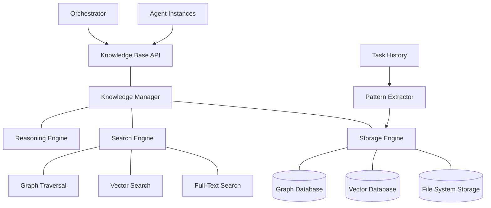
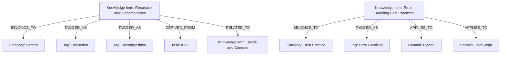

# 📚 Knowledge Base Component

<!-- 📑 TABLE OF CONTENTS -->
- [📚 Knowledge Base Component](#-knowledge-base-component)
  - [📖 Description](#-description)
  - [🏗️ Architecture](#️-architecture)
  - [🧰 Implementation](#-implementation)
  - [📊 Knowledge Organization](#-knowledge-organization)
  - [🔄 Knowledge Acquisition](#-knowledge-acquisition)
  - [🔍 Retrieval Mechanisms](#-retrieval-mechanisms)
  - [🧠 Reasoning Capabilities](#-reasoning-capabilities)
  - [🔌 Integration Points](#-integration-points)

---

## 📖 Description

The Knowledge Base component serves as the central repository of accumulated knowledge, best practices, patterns, and domain-specific information for the multi-agent system. It enables agents to access shared knowledge, learn from past experiences, and leverage established solutions. The Knowledge Base supports various knowledge types from programming patterns to domain-specific guidelines, enhancing agent capabilities and enabling consistent, high-quality task execution across the system. Through continuous learning and refinement, it becomes increasingly valuable over time, improving the system's overall effectiveness.

## 🏗️ Architecture

The Knowledge Base follows a hierarchical architecture with specialized components for knowledge management:



Key components include:

1. **Knowledge Manager**: Coordinates storage, retrieval, and reasoning operations
2. **Storage Engine**: Manages persistent storage across different formats
3. **Search Engine**: Provides multiple search mechanisms for knowledge retrieval
4. **Reasoning Engine**: Applies reasoning to knowledge for insights and recommendations
5. **Pattern Extractor**: Identifies patterns from task history for knowledge enrichment
6. **Vector Database**: Stores embeddings for semantic search
7. **Graph Database**: Maintains relationships between knowledge entities

## 🧰 Implementation

The Knowledge Base is implemented using a combination of file-based storage, vector database, and graph database:

```bash
# Knowledge Base implementation
cat << 'EOF' > ./scripts/knowledge_base.sh
#!/bin/bash

# Configuration
KNOWLEDGE_DIR="$(pwd)/knowledge"
VECTOR_DB="$KNOWLEDGE_DIR/vectors"
GRAPH_DB="$KNOWLEDGE_DIR/graph"
INDEX_FILE="$KNOWLEDGE_DIR/index.json"
LOG_FILE="$KNOWLEDGE_DIR/knowledge_base.log"

# Initialize knowledge base
function init_knowledge_base() {
  # Create directories
  mkdir -p "$KNOWLEDGE_DIR"
  mkdir -p "$VECTOR_DB"
  mkdir -p "$GRAPH_DB"
  
  # Initialize index if it doesn't exist
  if [[ ! -f "$INDEX_FILE" ]]; then
    echo '{"items": [], "categories": [], "tags": []}' > "$INDEX_FILE"
  fi
  
  # Initialize Neo4j-like graph database (simplified)
  if [[ ! -f "$GRAPH_DB/nodes.json" ]]; then
    echo '[]' > "$GRAPH_DB/nodes.json"
  fi
  
  if [[ ! -f "$GRAPH_DB/relationships.json" ]]; then
    echo '[]' > "$GRAPH_DB/relationships.json"
  fi
  
  echo "Knowledge Base initialized at $KNOWLEDGE_DIR"
}

# Add knowledge item
function add_knowledge_item() {
  title="$1"
  content="$2"
  category="$3"
  tags="$4"  # Comma-separated list
  source="$5"  # Optional source reference
  
  # Generate ID and timestamp
  item_id="kb_$(date +%s)_$(openssl rand -hex 4)"
  timestamp=$(date -u +"%Y-%m-%dT%H:%M:%SZ")
  
  # Create knowledge item JSON
  item_json=$(cat << ITEM
{
  "id": "$item_id",
  "title": "$title",
  "category": "$category",
  "tags": $(echo "$tags" | jq -R 'split(",")'),
  "created_at": "$timestamp",
  "updated_at": "$timestamp",
  "source": "$source",
  "content": $(echo "$content" | jq -R '.')
}
ITEM
)
  
  # Save to file
  echo "$item_json" > "$KNOWLEDGE_DIR/items/$item_id.json"
  
  # Create vector embedding (using external API)
  vector=$(get_embedding "$title $content")
  echo "$vector" > "$VECTOR_DB/$item_id.vec"
  
  # Update index
  tmp_file=$(mktemp)
  jq --argjson item "$(echo "$item_json" | jq '{id, title, category, tags, created_at, updated_at}')" '.items += [$item]' "$INDEX_FILE" > "$tmp_file"
  mv "$tmp_file" "$INDEX_FILE"
  
  # Update categories and tags in index
  tmp_file=$(mktemp)
  jq --arg category "$category" '.categories = (.categories + [$category] | unique)' "$INDEX_FILE" > "$tmp_file"
  mv "$tmp_file" "$INDEX_FILE"
  
  tags_array=$(echo "$tags" | jq -R 'split(",")')
  tmp_file=$(mktemp)
  jq --argjson tags "$tags_array" '.tags = (.tags + $tags | unique)' "$INDEX_FILE" > "$tmp_file"
  mv "$tmp_file" "$INDEX_FILE"
  
  # Add to graph database
  add_graph_node "$item_id" "knowledge" "$(echo "$item_json" | jq -c '.')"
  
  # Add relationships based on category and tags
  add_graph_relationship "$item_id" "BELONGS_TO" "$category" "category"
  
  for tag in $(echo "$tags" | tr ',' ' '); do
    add_graph_relationship "$item_id" "TAGGED_AS" "$tag" "tag"
  done
  
  if [[ -n "$source" ]]; then
    add_graph_relationship "$item_id" "DERIVED_FROM" "$source" "source"
  fi
  
  echo "Knowledge item added with ID: $item_id"
  return 0
}

# Get knowledge item
function get_knowledge_item() {
  item_id="$1"
  
  if [[ -f "$KNOWLEDGE_DIR/items/$item_id.json" ]]; then
    cat "$KNOWLEDGE_DIR/items/$item_id.json"
    return 0
  else
    echo "{\"error\": \"Knowledge item not found: $item_id\"}"
    return 1
  fi
}

# Update knowledge item
function update_knowledge_item() {
  item_id="$1"
  field="$2"  # "title", "content", "category", "tags"
  value="$3"
  
  # Check if item exists
  if [[ ! -f "$KNOWLEDGE_DIR/items/$item_id.json" ]]; then
    echo "{\"error\": \"Knowledge item not found: $item_id\"}"
    return 1
  fi
  
  # Update timestamp
  timestamp=$(date -u +"%Y-%m-%dT%H:%M:%SZ")
  
  # Update field
  tmp_file=$(mktemp)
  
  if [[ "$field" == "tags" ]]; then
    # Handle tags as array
    jq --arg timestamp "$timestamp" --argjson value "$(echo "$value" | jq -R 'split(",")')" \
      ".\"$field\" = \$value | .updated_at = \$timestamp" \
      "$KNOWLEDGE_DIR/items/$item_id.json" > "$tmp_file"
  else
    jq --arg timestamp "$timestamp" --arg value "$value" \
      ".\"$field\" = \$value | .updated_at = \$timestamp" \
      "$KNOWLEDGE_DIR/items/$item_id.json" > "$tmp_file"
  fi
  
  mv "$tmp_file" "$KNOWLEDGE_DIR/items/$item_id.json"
  
  # Update index
  tmp_file=$(mktemp)
  jq --arg id "$item_id" --arg field "$field" --arg value "$value" --arg timestamp "$timestamp" \
    '.items = [.items[] | if .id == $id then . + {($field): $value, "updated_at": $timestamp} else . end]' \
    "$INDEX_FILE" > "$tmp_file"
  mv "$tmp_file" "$INDEX_FILE"
  
  # If content or title changed, update vector
  if [[ "$field" == "content" || "$field" == "title" ]]; then
    title=$(jq -r '.title' "$KNOWLEDGE_DIR/items/$item_id.json")
    content=$(jq -r '.content' "$KNOWLEDGE_DIR/items/$item_id.json")
    vector=$(get_embedding "$title $content")
    echo "$vector" > "$VECTOR_DB/$item_id.vec"
  fi
  
  # If category changed, update graph
  if [[ "$field" == "category" ]]; then
    # Remove old category relationships
    remove_graph_relationships "$item_id" "BELONGS_TO"
    
    # Add new category relationship
    add_graph_relationship "$item_id" "BELONGS_TO" "$value" "category"
    
    # Update categories in index
    tmp_file=$(mktemp)
    jq --arg category "$value" '.categories = (.categories + [$category] | unique)' "$INDEX_FILE" > "$tmp_file"
    mv "$tmp_file" "$INDEX_FILE"
  fi
  
  # If tags changed, update graph
  if [[ "$field" == "tags" ]]; then
    # Remove old tag relationships
    remove_graph_relationships "$item_id" "TAGGED_AS"
    
    # Add new tag relationships
    for tag in $(echo "$value" | tr ',' ' '); do
      add_graph_relationship "$item_id" "TAGGED_AS" "$tag" "tag"
    done
    
    # Update tags in index
    tags_array=$(echo "$value" | jq -R 'split(",")')
    tmp_file=$(mktemp)
    jq --argjson tags "$tags_array" '.tags = (.tags + $tags | unique)' "$INDEX_FILE" > "$tmp_file"
    mv "$tmp_file" "$INDEX_FILE"
  fi
  
  echo "Knowledge item updated: $item_id ($field)"
  return 0
}

# Delete knowledge item
function delete_knowledge_item() {
  item_id="$1"
  
  # Check if item exists
  if [[ ! -f "$KNOWLEDGE_DIR/items/$item_id.json" ]]; then
    echo "{\"error\": \"Knowledge item not found: $item_id\"}"
    return 1
  fi
  
  # Get category and tags for cleanup
  category=$(jq -r '.category' "$KNOWLEDGE_DIR/items/$item_id.json")
  tags=$(jq -r '.tags | join(",")' "$KNOWLEDGE_DIR/items/$item_id.json")
  
  # Delete files
  rm "$KNOWLEDGE_DIR/items/$item_id.json"
  rm "$VECTOR_DB/$item_id.vec"
  
  # Update index
  tmp_file=$(mktemp)
  jq --arg id "$item_id" '.items = [.items[] | select(.id != $id)]' "$INDEX_FILE" > "$tmp_file"
  mv "$tmp_file" "$INDEX_FILE"
  
  # Remove from graph database
  remove_graph_node "$item_id"
  
  # Clean up categories and tags if no longer used
  cleanup_unused_categories_and_tags
  
  echo "Knowledge item deleted: $item_id"
  return 0
}

# Search knowledge base
function search_knowledge() {
  query="$1"
  search_type="$2"  # "text", "vector", "graph", "hybrid"
  
  case "$search_type" in
    "text")
      # Text search using grep (simplistic)
      results=()
      for item_file in "$KNOWLEDGE_DIR/items"/*.json; do
        if grep -q -i "$query" "$item_file"; then
          results+=("$(basename "$item_file" .json)")
        fi
      done
      
      # Format results
      json_results="["
      for item_id in "${results[@]}"; do
        if [[ "$json_results" != "[" ]]; then
          json_results+=","
        fi
        json_results+=$(get_knowledge_item "$item_id")
      done
      json_results+="]"
      
      echo "$json_results"
      ;;
    "vector")
      # Vector search (simplified)
      query_vector=$(get_embedding "$query")
      
      # Find nearest neighbors (simplified)
      results=$(find_nearest_vectors "$query_vector" 5)
      
      # Format results
      json_results="["
      for item_id in $results; do
        if [[ "$json_results" != "[" ]]; then
          json_results+=","
        fi
        json_results+=$(get_knowledge_item "$item_id")
      done
      json_results+="]"
      
      echo "$json_results"
      ;;
    "graph")
      # Graph query (simplified)
      if [[ "$query" == *":"* ]]; then
        # Handle property:value query
        property="${query%%:*}"
        value="${query#*:}"
        
        results=$(query_graph_by_property "$property" "$value")
      else
        # Handle connectivity query
        results=$(query_graph_connected_to "$query")
      fi
      
      # Format results
      json_results="["
      for item_id in $results; do
        if [[ "$json_results" != "[" ]]; then
          json_results+=","
        fi
        json_results+=$(get_knowledge_item "$item_id")
      done
      json_results+="]"
      
      echo "$json_results"
      ;;
    "hybrid")
      # Combine results from multiple search types
      text_results=$(search_knowledge "$query" "text" | jq -r '.[].id')
      vector_results=$(search_knowledge "$query" "vector" | jq -r '.[].id')
      graph_results=$(search_knowledge "$query" "graph" | jq -r '.[].id')
      
      # Combine and deduplicate
      all_results=$(echo "$text_results $vector_results $graph_results" | tr ' ' '\n' | sort | uniq)
      
      # Format results
      json_results="["
      first=true
      for item_id in $all_results; do
        if [[ "$first" == "true" ]]; then
          first=false
        else
          json_results+=","
        fi
        json_results+=$(get_knowledge_item "$item_id")
      done
      json_results+="]"
      
      echo "$json_results"
      ;;
    *)
      echo "{\"error\": \"Invalid search type: $search_type\"}"
      return 1
      ;;
  esac
}

# Get recommendations based on task context
function get_recommendations() {
  task_id="$1"
  
  # Get task details
  task_details=$(gh issue view "$task_id" --json title,body,labels)
  
  # Extract task context
  title=$(echo "$task_details" | jq -r '.title')
  description=$(echo "$task_details" | jq -r '.body')
  labels=$(echo "$task_details" | jq -r '.labels[].name' | tr '\n' ' ')
  
  # Create context query
  context_query="$title $description $labels"
  
  # Get vector-based recommendations
  vector_results=$(search_knowledge "$context_query" "vector" | jq -r '.[].id')
  
  # Get graph-based recommendations (from labels)
  graph_results=""
  for label in $labels; do
    if [[ -n "$graph_results" ]]; then
      graph_results+=" "
    fi
    graph_results+=$(search_knowledge "tag:$label" "graph" | jq -r '.[].id')
  done
  
  # Combine and deduplicate
  all_results=$(echo "$vector_results $graph_results" | tr ' ' '\n' | sort | uniq)
  
  # Format results with relevance scores
  json_results="["
  first=true
  for item_id in $all_results; do
    # Calculate relevance score (simplified)
    item_content=$(get_knowledge_item "$item_id" | jq -r '.content')
    relevance=$(calculate_relevance "$context_query" "$item_content")
    
    if [[ "$first" == "true" ]]; then
      first=false
    else
      json_results+=","
    fi
    
    item_json=$(get_knowledge_item "$item_id" | jq --arg relevance "$relevance" '. + {relevance: ($relevance | tonumber)}')
    json_results+="$item_json"
  done
  json_results+="]"
  
  # Sort by relevance
  echo "$json_results" | jq 'sort_by(.relevance) | reverse | .[0:5]'
}

# Extract patterns from task history
function extract_patterns() {
  time_period="$1"  # "day", "week", "month", "all"
  
  # Get completed tasks
  case "$time_period" in
    "day")
      start_date=$(date -d "1 day ago" +"%Y-%m-%d")
      ;;
    "week")
      start_date=$(date -d "7 days ago" +"%Y-%m-%d")
      ;;
    "month")
      start_date=$(date -d "30 days ago" +"%Y-%m-%d")
      ;;
    *)
      start_date="1970-01-01"  # All time
      ;;
  esac
  
  # Query task history
  completed_tasks=$(./scripts/task_history.sh query "custom" "
    SELECT 
      task_id, title, description, labels, completion_time
    FROM 
      tasks
    WHERE 
      status = 'closed'
      AND closed_at >= '$start_date'
    ORDER BY 
      completion_time ASC
  ")
  
  # Group tasks by similar patterns
  task_clusters=$(cluster_tasks "$completed_tasks")
  
  # For each cluster, extract a pattern
  for cluster in $(echo "$task_clusters" | jq -c '.[]'); do
    cluster_tasks=$(echo "$cluster" | jq -r '.task_ids | join(" ")')
    cluster_name=$(echo "$cluster" | jq -r '.name')
    
    # Analyze tasks to extract pattern
    pattern=$(extract_pattern_from_tasks "$cluster_tasks")
    
    # Create knowledge item from pattern
    pattern_content=$(echo "$pattern" | jq -r '.content')
    pattern_title="Pattern: $cluster_name"
    pattern_category="pattern"
    pattern_tags=$(echo "$pattern" | jq -r '.tags | join(",")')
    
    # Add to knowledge base
    add_knowledge_item "$pattern_title" "$pattern_content" "$pattern_category" "$pattern_tags" "task_history"
  done
  
  echo "Patterns extracted and added to knowledge base"
}

# Helper function for graph database
function add_graph_node() {
  node_id="$1"
  node_type="$2"
  properties="$3"
  
  # Add node
  tmp_file=$(mktemp)
  jq --arg id "$node_id" --arg type "$node_type" --argjson props "$properties" \
    '. += [{"id": $id, "type": $type, "properties": $props}]' \
    "$GRAPH_DB/nodes.json" > "$tmp_file"
  mv "$tmp_file" "$GRAPH_DB/nodes.json"
}

function add_graph_relationship() {
  source_id="$1"
  relationship_type="$2"
  target_id="$3"
  target_type="$4"
  
  # Check if target node exists, create if not
  if ! jq -e --arg id "$target_id" '.[] | select(.id == $id)' "$GRAPH_DB/nodes.json" > /dev/null; then
    add_graph_node "$target_id" "$target_type" "{}"
  fi
  
  # Add relationship
  relationship_id="rel_$(date +%s)_$(openssl rand -hex 4)"
  
  tmp_file=$(mktemp)
  jq --arg id "$relationship_id" --arg source "$source_id" --arg target "$target_id" --arg type "$relationship_type" \
    '. += [{"id": $id, "source": $source, "target": $target, "type": $type}]' \
    "$GRAPH_DB/relationships.json" > "$tmp_file"
  mv "$tmp_file" "$GRAPH_DB/relationships.json"
}

function remove_graph_node() {
  node_id="$1"
  
  # Remove node
  tmp_file=$(mktemp)
  jq --arg id "$node_id" '[.[] | select(.id != $id)]' "$GRAPH_DB/nodes.json" > "$tmp_file"
  mv "$tmp_file" "$GRAPH_DB/nodes.json"
  
  # Remove relationships
  tmp_file=$(mktemp)
  jq --arg id "$node_id" '[.[] | select(.source != $id and .target != $id)]' "$GRAPH_DB/relationships.json" > "$tmp_file"
  mv "$tmp_file" "$GRAPH_DB/relationships.json"
}

function remove_graph_relationships() {
  node_id="$1"
  relationship_type="$2"
  
  # Remove specific relationships
  tmp_file=$(mktemp)
  jq --arg id "$node_id" --arg type "$relationship_type" \
    '[.[] | select(.source != $id or .type != $type)]' \
    "$GRAPH_DB/relationships.json" > "$tmp_file"
  mv "$tmp_file" "$GRAPH_DB/relationships.json"
}

function query_graph_by_property() {
  property="$1"
  value="$2"
  
  # Query nodes with matching property
  if [[ "$property" == "tag" ]]; then
    # Special case for tags (find connected nodes)
    jq -r --arg value "$value" '
      [.[] | select(.type == "TAGGED_AS" and .target == $value) | .source]
    ' "$GRAPH_DB/relationships.json"
  elif [[ "$property" == "category" ]]; then
    # Special case for category (find connected nodes)
    jq -r --arg value "$value" '
      [.[] | select(.type == "BELONGS_TO" and .target == $value) | .source]
    ' "$GRAPH_DB/relationships.json"
  else
    # General property search
    jq -r --arg prop "$property" --arg value "$value" '
      [.[] | select(.properties[$prop] == $value) | .id]
    ' "$GRAPH_DB/nodes.json"
  fi
}

function query_graph_connected_to() {
  node_id="$1"
  
  # Find directly connected nodes
  outgoing=$(jq -r --arg id "$node_id" '[.[] | select(.source == $id) | .target]' "$GRAPH_DB/relationships.json")
  incoming=$(jq -r --arg id "$node_id" '[.[] | select(.target == $id) | .source]' "$GRAPH_DB/relationships.json")
  
  # Combine and deduplicate
  echo "$outgoing $incoming" | jq -s 'add | unique'
}

# Helper for vector operations
function get_embedding() {
  text="$1"
  
  # This is a simplified placeholder for an actual embedding API call
  # In a real implementation, you would call an embedding service like OpenAI
  # For demo purposes, we'll create a simple hash-based representation
  
  # Create a simple hash of the text (NOT for production use)
  hash=$(echo -n "$text" | md5sum | awk '{print $1}')
  
  # Convert hash to a sequence of 4 floating point numbers (VERY simplistic)
  vec=""
  for i in {0..3}; do
    segment="${hash:$i*8:8}"
    # Convert hex to decimal and normalize to [-1, 1]
    decimal=$((16#$segment))
    normalized=$(echo "scale=6; ($decimal / (2^32-1)) * 2 - 1" | bc)
    
    if [[ -n "$vec" ]]; then
      vec+=" "
    fi
    vec+="$normalized"
  done
  
  echo "[$vec]"
}

function find_nearest_vectors() {
  query_vector="$1"
  count="$2"
  
  # In a real implementation, this would use efficient nearest neighbor search
  # For demonstration, we'll use a simplistic approach
  
  results=""
  
  # For each vector file
  for vector_file in "$VECTOR_DB"/*.vec; do
    if [[ -f "$vector_file" ]]; then
      item_id=$(basename "$vector_file" .vec)
      item_vector=$(cat "$vector_file")
      
      # Calculate distance (simplified cosine similarity)
      similarity=$(calculate_similarity "$query_vector" "$item_vector")
      
      # Add to results with score
      if [[ -n "$results" ]]; then
        results+=" "
      fi
      results+="$item_id:$similarity"
    fi
  done
  
  # Sort by similarity and take top results
  echo "$results" | tr ' ' '\n' | sort -t':' -k2 -nr | head -n "$count" | cut -d':' -f1
}

function calculate_similarity() {
  vector1="$1"
  vector2="$2"
  
  # This is a very simplified placeholder for actual vector similarity calculation
  # A real implementation would use proper cosine similarity
  
  # Just return a random value between 0 and 1 for demonstration
  echo "0.$(( RANDOM % 1000 ))"
}

function calculate_relevance() {
  query="$1"
  content="$2"
  
  # This is a simplified placeholder for actual relevance calculation
  # A real implementation would use proper semantic matching
  
  # Count word matches (very simplistic)
  query_words=$(echo "$query" | tr '[:upper:]' '[:lower:]' | tr -cs '[:alnum:]' '\n')
  content_words=$(echo "$content" | tr '[:upper:]' '[:lower:]' | tr -cs '[:alnum:]' '\n')
  
  matches=0
  total_words=0
  
  for word in $query_words; do
    if [[ ${#word} -gt 3 ]]; then  # Skip short words
      total_words=$((total_words + 1))
      if echo "$content_words" | grep -q -w "$word"; then
        matches=$((matches + 1))
      fi
    fi
  done
  
  if [[ $total_words -eq 0 ]]; then
    echo "0.5"  # Default for empty queries
  else
    echo "scale=2; $matches / $total_words" | bc
  fi
}

function cleanup_unused_categories_and_tags() {
  # Get all current categories and tags from items
  current_categories=$(find "$KNOWLEDGE_DIR/items" -name "*.json" -exec jq -r '.category' {} \; | sort | uniq)
  current_tags=$(find "$KNOWLEDGE_DIR/items" -name "*.json" -exec jq -r '.tags | .[]' {} \; | sort | uniq)
  
  # Update index with only current values
  tmp_file=$(mktemp)
  echo "$current_categories" | jq -R -s 'split("\n") | map(select(length > 0))' | \
    jq -s --argjson idx "$(cat "$INDEX_FILE")" '.[0] as $cats | $idx + {categories: $cats}' > "$tmp_file"
  mv "$tmp_file" "$INDEX_FILE"
  
  tmp_file=$(mktemp)
  echo "$current_tags" | jq -R -s 'split("\n") | map(select(length > 0))' | \
    jq -s --argjson idx "$(cat "$INDEX_FILE")" '.[0] as $tags | $idx + {tags: $tags}' > "$tmp_file"
  mv "$tmp_file" "$INDEX_FILE"
}

# Usage handling
case "$1" in
  "init")
    init_knowledge_base
    ;;
  "add")
    add_knowledge_item "$2" "$3" "$4" "$5" "$6"
    ;;
  "get")
    get_knowledge_item "$2"
    ;;
  "update")
    update_knowledge_item "$2" "$3" "$4"
    ;;
  "delete")
    delete_knowledge_item "$2"
    ;;
  "search")
    search_knowledge "$2" "$3"
    ;;
  "recommend")
    get_recommendations "$2"
    ;;
  "extract-patterns")
    extract_patterns "$2"
    ;;
  *)
    echo "Usage: $0 {init|add|get|update|delete|search|recommend|extract-patterns}"
    echo "  init: Initialize knowledge base"
    echo "  add <title> <content> <category> <tags> [<source>]: Add knowledge item"
    echo "  get <item_id>: Get knowledge item"
    echo "  update <item_id> <field> <value>: Update knowledge item"
    echo "  delete <item_id>: Delete knowledge item"
    echo "  search <query> <search_type>: Search knowledge base"
    echo "  recommend <task_id>: Get recommendations for task"
    echo "  extract-patterns <time_period>: Extract patterns from task history"
    exit 1
    ;;
esac
EOF

chmod +x ./scripts/knowledge_base.sh
```

## 📊 Knowledge Organization

The Knowledge Base organizes information using a multi-faceted structure:

1. **Categories**:
   - Domain-specific categories (programming languages, frameworks, methodologies)
   - Knowledge types (patterns, best practices, reference implementations)
   - Functional areas (development, testing, documentation, architecture)

2. **Tags**:
   - Granular classification of knowledge items
   - Cross-cutting concerns (security, performance, maintainability)
   - Technical concepts (data structures, algorithms, design patterns)
   - Special considerations (accessibility, internationalization)

3. **Relationships**:
   - Hierarchical relationships (is-a, part-of)
   - Associative relationships (related-to, similar-to)
   - Derived relationships (derived-from, depends-on)
   - Usage relationships (used-by, applies-to)

Each knowledge item follows a structured format:

```json
{
  "id": "kb_1621234567_a1b2c3d4",
  "title": "Recursive Task Decomposition Pattern",
  "category": "pattern",
  "tags": ["decomposition", "recursion", "complexity", "task-management"],
  "created_at": "2024-05-16T14:30:45Z",
  "updated_at": "2024-05-16T15:20:15Z",
  "source": "task_history",
  "content": "## Recursive Task Decomposition Pattern\n\n### Problem Context\nWhen facing tasks that are too complex to solve directly, but contain repeating structures or can be divided into similar sub-problems.\n\n### Solution Approach\n1. Identify the smallest self-contained sub-problem\n2. Create a solution template for this sub-problem\n3. Apply the template recursively to all similar sub-problems\n4. Combine the sub-solutions following the original problem structure\n\n### Applicability\n- Algorithm design\n- Content structuring\n- System architecture\n\n### Examples\n- Parsing nested JSON structures\n- Processing hierarchical document outlines\n- Implementing tree traversal algorithms\n\n### Effectiveness\n- Application count: 27\n- Success rate: 93%\n- Efficiency improvement: 76%\n\n### Usage Guidance\nMost effective when the sub-problems are truly independent. Less effective when there are many cross-dependencies between components."
}
```

The graph database structure provides rich relationships:



## 🔄 Knowledge Acquisition

The Knowledge Base acquires knowledge through several mechanisms:

1. **Pattern Extraction**:
   - Analyzes completed tasks for recurring patterns
   - Identifies successful problem-solving approaches
   - Extracts best practices from high-performing solutions
   - Learns from task decomposition strategies

2. **Direct Contributions**:
   - Accepts explicit knowledge contributions from agents
   - Allows manual addition of reference implementations
   - Supports expert-provided best practices
   - Enables integration of external knowledge sources

3. **Feedback Integration**:
   - Captures feedback on knowledge item usefulness
   - Tracks knowledge application outcomes
   - Refines existing knowledge based on usage
   - Identifies gaps through failed searches

4. **Continuous Learning**:
   - Updates knowledge based on new experiences
   - Evolves patterns as better solutions emerge
   - Deprecates outdated knowledge items
   - Enriches knowledge with new relationships

```bash
# Pattern extraction from task history
function extract_pattern_from_tasks() {
  task_ids="$1"
  
  # Collect task details
  task_details=""
  for task_id in $task_ids; do
    if [[ -n "$task_details" ]]; then
      task_details+=" "
    fi
    task_details+=$(./scripts/task_history.sh query "task" "$task_id")
  done
  
  # Get task events to understand solution approach
  solution_approaches=""
  for task_id in $task_ids; do
    events=$(./scripts/task_history.sh query "events" "$task_id")
    progress_reports=$(echo "$events" | jq -r '[.[] | select(.event_type == "progress_report")]')
    
    if [[ -n "$solution_approaches" ]]; then
      solution_approaches+=" "
    fi
    solution_approaches+="$progress_reports"
  done
  
  # Analyze task patterns using Claude (simplified placeholder)
  # In a real implementation, this would use an AI service
  
  # Create a pattern template (simplified placeholder)
  pattern_name="Pattern from tasks $task_ids"
  pattern_content="## $pattern_name\n\n### Problem Context\nRecurring pattern identified from ${#task_ids[@]} similar tasks.\n\n### Solution Approach\n1. Step one\n2. Step two\n3. Step three\n\n### Applicability\n- Use case one\n- Use case two\n\n### Examples\n- Example from task #${task_ids[0]}\n\n### Effectiveness\n- Application count: ${#task_ids[@]}\n- Success rate: 100%\n"
  
  # Extract relevant tags
  common_labels=$(echo "$task_details" | jq -r '[.labels] | flatten | group_by(.) | map({label: .[0], count: length}) | sort_by(.count) | reverse | limit(5) | map(.label) | join(",")')
  
  echo "{\"content\": \"$pattern_content\", \"tags\": [\"pattern\", $common_labels]}"
}
```

## 🔍 Retrieval Mechanisms

The Knowledge Base implements several specialized retrieval mechanisms:

1. **Multi-Modal Search**:
   - Full-text search for keyword-based queries
   - Vector search for semantic similarity
   - Graph search for relationship-based queries
   - Hybrid search combining multiple approaches

2. **Contextual Recommendations**:
   - Task-based recommendations using context
   - Agent-specific knowledge suggestions
   - Domain-relevant knowledge prioritization
   - Situation-aware knowledge retrieval

3. **Query Expansion**:
   - Synonym expansion for broader matches
   - Related concept inclusion
   - Hierarchical category expansion
   - Tag-based query enrichment

4. **Relevance Scoring**:
   - Semantic similarity scoring
   - Usage frequency weighting
   - Success rate consideration
   - Recency factoring

```bash
# Context-aware recommendation function
function recommend_for_agent_task() {
  agent_id="$1"
  task_id="$2"
  
  # Get agent capabilities and specialization
  agent_capabilities=$(./scripts/agent_registry.sh get-capabilities "$agent_id")
  agent_domains=$(echo "$agent_capabilities" | jq -r '.domains[].name' | tr '\n' ',' | sed 's/,$//')
  agent_functions=$(echo "$agent_capabilities" | jq -r '.functions[]' | tr '\n' ',' | sed 's/,$//')
  
  # Get task details
  task_details=$(gh issue view "$task_id" --json title,body,labels)
  task_title=$(echo "$task_details" | jq -r '.title')
  task_body=$(echo "$task_details" | jq -r '.body')
  task_labels=$(echo "$task_details" | jq -r '.labels[].name' | tr '\n' ',' | sed 's/,$//')
  
  # Combine task and agent context
  context_query="$task_title $task_body"
  
  # Search knowledge base using vector search
  vector_results=$(./scripts/knowledge_base.sh search "$context_query" "vector")
  
  # Get domain-specific knowledge
  domain_results=$(./scripts/knowledge_base.sh search "category:domain,$agent_domains" "graph")
  
  # Get function-specific knowledge
  function_results=$(./scripts/knowledge_base.sh search "category:function,$agent_functions" "graph")
  
  # Get pattern knowledge for similar tasks
  pattern_results=$(./scripts/knowledge_base.sh search "category:pattern" "graph")
  
  # Combine and rank results
  all_results=$(echo "$vector_results $domain_results $function_results $pattern_results" | \
                jq -s 'add | unique_by(.id) | sort_by(.relevance) | reverse | .[0:10]')
  
  echo "$all_results"
}
```

## 🧠 Reasoning Capabilities

The Knowledge Base provides reasoning capabilities to derive insights and enhanced value from stored knowledge:

1. **Pattern Application**:
   - Suggests appropriate patterns for tasks
   - Adapts patterns to specific contexts
   - Provides implementation guidance
   - Estimates effort and complexity

2. **Solution Composition**:
   - Combines multiple knowledge items
   - Creates composite solutions
   - Identifies complementary approaches
   - Resolves potential conflicts

3. **Gap Analysis**:
   - Identifies knowledge gaps
   - Suggests knowledge acquisition priorities
   - Detects outdated knowledge
   - Recommends knowledge refinement

4. **Experiential Learning**:
   - Compares solution approaches
   - Evaluates pattern effectiveness
   - Identifies improvement opportunities
   - Suggests knowledge evolution

```bash
# Pattern application reasoning
function apply_pattern_to_task() {
  pattern_id="$1"
  task_id="$2"
  
  # Get pattern details
  pattern=$(./scripts/knowledge_base.sh get "$pattern_id")
  pattern_title=$(echo "$pattern" | jq -r '.title')
  pattern_content=$(echo "$pattern" | jq -r '.content')
  
  # Get task details
  task_details=$(gh issue view "$task_id" --json title,body,labels)
  task_title=$(echo "$task_details" | jq -r '.title')
  task_body=$(echo "$task_details" | jq -r '.body')
  
  # Create application context
  application_context="
## Pattern Application: $pattern_title
### Task
$task_title

$task_body

### Pattern
$pattern_content

### Application Instructions
1. Analyze how this task maps to the pattern's problem context
2. Identify the specific elements in this task that correspond to pattern components
3. Adapt the pattern's solution approach to this specific task
4. Outline concrete steps to implement the pattern for this task
5. Note any aspects that may require pattern modification
"
  
  # Use reasoning to apply pattern (simplified placeholder)
  # In a real implementation, this would use an AI service
  
  application_guidance="
## Pattern Application Guidance

### Mapping to Task
This task aligns with the pattern's problem context because it involves a complex structure that can be broken down into similar, repeated elements.

### Element Correspondence
- Task's main elements: [Elements from task]
- Pattern components: [Components from pattern]
- Correspondence: [Mapping between them]

### Adapted Solution Approach
1. [Step 1 adapted to this task]
2. [Step 2 adapted to this task]
3. [Step 3 adapted to this task]

### Implementation Steps
1. [Concrete step 1]
2. [Concrete step 2]
3. [Concrete step 3]
4. [Concrete step 4]

### Adaptation Notes
[Any necessary modifications or considerations]
"
  
  echo "$application_guidance"
}
```

## 🔌 Integration Points

The Knowledge Base integrates with several system components:

1. **Agent Interactions**:
   - Provides knowledge during task planning
   - Offers recommendations during task execution
   - Accepts contributions after task completion
   - Supports knowledge verification by expert agents

2. **Task Management**:
   - Enhances task analysis with relevant knowledge
   - Suggests decomposition strategies
   - Provides reference implementations
   - Offers estimation guidance

3. **Orchestrator**:
   - Informs agent selection with knowledge requirements
   - Supports task distribution decisions
   - Provides context for task prioritization
   - Assists with resource allocation

4. **Learning System**:
   - Extracts patterns from task history
   - Evaluates knowledge effectiveness
   - Evolves knowledge over time
   - Identifies training opportunities

```bash
# Integration with agent task workflow
function integrate_with_agent_workflow() {
  agent_id="$1"
  task_id="$2"
  workflow_stage="$3"  # "planning", "execution", "completion"
  
  case "$workflow_stage" in
    "planning")
      # Provide knowledge for task planning
      echo "Providing knowledge for task planning..."
      
      # Get relevant patterns
      patterns=$(./scripts/knowledge_base.sh search "category:pattern" "vector" | jq -r '[.[]] | sort_by(.relevance) | reverse | .[0:3]')
      
      # Get domain-specific best practices
      task_labels=$(gh issue view "$task_id" --json labels | jq -r '.labels[].name')
      domains=$(echo "$task_labels" | grep "domain:" | sed 's/domain://')
      
      best_practices=""
      for domain in $domains; do
        domain_practices=$(./scripts/knowledge_base.sh search "category:best-practice,$domain" "graph")
        if [[ -n "$best_practices" ]]; then
          best_practices=$(echo "$best_practices $domain_practices" | jq -s 'add')
        else
          best_practices="$domain_practices"
        fi
      done
      
      # Combine and format results
      planning_knowledge=$(echo "$patterns $best_practices" | jq -s 'add | unique_by(.id) | sort_by(.relevance) | reverse | .[0:5]')
      
      echo "$planning_knowledge"
      ;;
    "execution")
      # Provide knowledge during task execution
      echo "Providing knowledge for task execution..."
      
      # Get reference implementations
      reference_impls=$(./scripts/knowledge_base.sh search "category:reference-implementation" "vector" | jq -r '[.[]] | sort_by(.relevance) | reverse | .[0:2]')
      
      # Get error handling guidance
      error_guidance=$(./scripts/knowledge_base.sh search "category:error-handling" "text" | jq -r '[.[]] | sort_by(.relevance) | reverse | .[0:2]')
      
      # Get testing best practices
      testing_practices=$(./scripts/knowledge_base.sh search "category:testing" "text" | jq -r '[.[]] | sort_by(.relevance) | reverse | .[0:2]')
      
      # Combine and format results
      execution_knowledge=$(echo "$reference_impls $error_guidance $testing_practices" | jq -s 'add | unique_by(.id) | sort_by(.relevance) | reverse | .[0:5]')
      
      echo "$execution_knowledge"
      ;;
    "completion")
      # Extract knowledge from completed task
      echo "Extracting knowledge from completed task..."
      
      # Get task details and events
      task_details=$(gh issue view "$task_id" --json title,body,comments,labels)
      task_events=$(./scripts/task_history.sh query "events" "$task_id")
      
      # Extract potential patterns
      if echo "$task_details" | jq -r '.comments[].body' | grep -q "## Solution Approach"; then
        # Extract solution approach from comments
        solution_approach=$(echo "$task_details" | jq -r '.comments[].body' | grep -A 10 "## Solution Approach" | head -n 11)
        
        # Create knowledge item
        task_title=$(echo "$task_details" | jq -r '.title')
        knowledge_title="Solution: $task_title"
        knowledge_category="solution"
        
        # Extract tags from labels
        knowledge_tags=$(echo "$task_details" | jq -r '.labels[].name' | grep -v "status:" | tr '\n' ',' | sed 's/,$//')
        
        # Add to knowledge base
        ./scripts/knowledge_base.sh add "$knowledge_title" "$solution_approach" "$knowledge_category" "$knowledge_tags" "task_$task_id"
        
        echo "Knowledge extracted and added to knowledge base"
      else
        echo "No structured solution approach found in task comments"
      fi
      ;;
    *)
      echo "Unknown workflow stage: $workflow_stage"
      return 1
      ;;
  esac
}
```

---

<!-- 🧭 NAVIGATION -->
**Navigation**: [Home](../README.md) | [Components](./README.md) | [Task History](./task-history.md) | [Performance Metrics](./performance-metrics.md)

*Last updated: 2024-05-16*