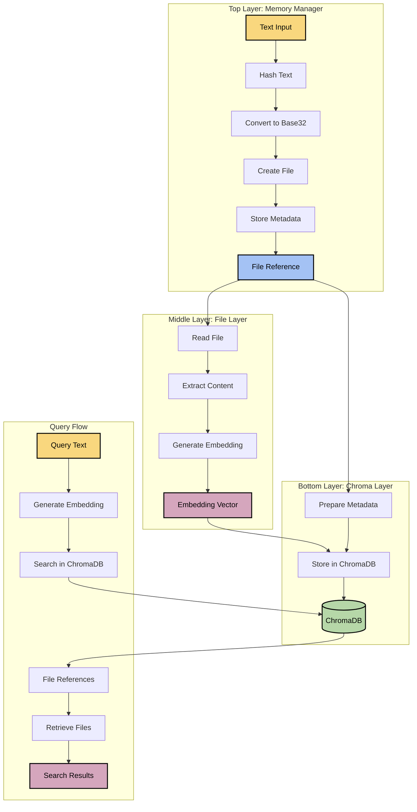

# 🧠 Layered Memory System Architecture

## 📑 Table of Contents
- [Overview](#overview)
- [System Architecture](#system-architecture)
- [Layer Design](#layer-design)
- [Data Flow](#data-flow)
- [API Specification](#api-specification)
- [Component Interactions](#component-interactions)
- [Storage Design](#storage-design)
- [Implementation Considerations](#implementation-considerations)
- [Extension Points](#extension-points)

## Overview

The Layered Memory System is a modular architecture for storing, retrieving, and searching text through vector embeddings. It implements the Chain of Responsibility pattern with three distinct layers, each with a specific responsibility in the processing pipeline.

The system prioritizes separation of concerns, flexibility, and efficient storage by:
1. Converting text to permanent file storage with content-based naming
2. Generating embeddings from file content for semantic search
3. Storing only file references in the vector database, not the content itself

This approach allows for efficient storage, clear data flow, and easy replacement of individual components.

## System Architecture



## Layer Design

### 1. Top Layer: Memory Manager

The Memory Manager is the entry point to the system and handles the conversion of text to files.

#### Responsibilities:
- Receive raw text input from users or systems
- Generate a unique filename based on the content's SHA256 hash
- Convert the hash to base32 for filename safety
- Store text in files within the designated memories directory
- Manage metadata about the stored text
- Pass file references to the File Layer

#### Key Components:
- **Text Hasher**: Generates SHA256 hash of input text
- **Base32 Converter**: Converts binary hash to base32 string
- **File Manager**: Creates and manages files in the memories directory
- **Metadata Manager**: Tracks metadata associated with text memories

### 2. Middle Layer: File Layer

The File Layer processes files and generates embeddings from their content.

#### Responsibilities:
- Receive file paths from the Memory Manager
- Read and process file content
- Generate vector embeddings for the content
- Collect and enhance file metadata (size, modification date, etc.)
- Pass file references and embeddings to the Chroma Layer

#### Key Components:
- **File Reader**: Reads content from files
- **Embedding Generator**: Creates vector embeddings from text content
- **Metadata Enhancer**: Adds file-specific metadata
- **Error Handler**: Manages file access and processing errors

### 3. Bottom Layer: Chroma Layer

The Chroma Layer interacts directly with ChromaDB to store and retrieve embeddings and file references.

#### Responsibilities:
- Receive file references and embeddings from the File Layer
- Store data in ChromaDB collections
- Query ChromaDB using embedding vectors
- Return file references and metadata for search results
- Manage ChromaDB connections and collections

#### Key Components:
- **ChromaDB Client**: Connects to ChromaDB server
- **Collection Manager**: Creates and manages collections
- **Query Processor**: Handles similarity search in the vector space
- **Result Formatter**: Structures query results for consumption

## Data Flow

### Storage Flow

1. **Text Reception (Memory Manager)**
   - System receives text to store
   - Calculates SHA256 hash of the text
   - Converts hash to base32 string
   - Creates a text file with the base32 string as filename
   - Passes file reference to File Layer

2. **File Processing (File Layer)**
   - Receives file reference from Memory Manager
   - Reads content from the file
   - Generates embedding vector for the content
   - Collects file metadata (size, timestamps, etc.)
   - Passes file reference, metadata, and embedding to Chroma Layer

3. **Vector Storage (Chroma Layer)**
   - Receives file reference, metadata, and embedding from File Layer
   - Prepares metadata structure for ChromaDB
   - Stores the embedding with file reference in ChromaDB
   - Returns success/failure status and entry ID

### Query Flow

1. **Query Reception (Memory Manager)**
   - System receives query text
   - Passes query to File Layer for processing

2. **Query Processing (File Layer)**
   - Receives query text from Memory Manager
   - Generates embedding vector for the query
   - Passes query embedding to Chroma Layer

3. **Vector Search (Chroma Layer)**
   - Receives query embedding from File Layer
   - Performs similarity search in ChromaDB
   - Retrieves matching file references and metadata
   - Returns search results to File Layer

4. **Result Processing (File Layer → Memory Manager)**
   - File Layer receives search results with file references
   - Optionally reads content from referenced files
   - Returns enriched results to Memory Manager
   - Memory Manager formats and presents final results

## API Specification

### MemoryManager API

```python
def store(text: str, metadata: Optional[Dict[str, Any]] = None) -> Dict[str, Any]:
    """
    Store text in memory.
    
    Args:
        text: Text to store
        metadata: Optional metadata to associate with the text
        
    Returns:
        Information about the stored memory (id, file_path, etc.)
    """

def retrieve(id: str) -> Dict[str, Any]:
    """
    Retrieve a memory by its ID.
    
    Args:
        id: ID of the memory to retrieve
        
    Returns:
        Memory data including content and metadata
    """

def query(query_text: str, n_results: int = 5, include_content: bool = True) -> Dict[str, Any]:
    """
    Query memories using text.
    
    Args:
        query_text: Text to search for
        n_results: Number of results to return
        include_content: Whether to include memory content in results
        
    Returns:
        Query results including memory data
    """

def list_memories(limit: int = 100) -> List[Dict[str, Any]]:
    """
    List all stored memories.
    
    Args:
        limit: Maximum number of memories to retrieve
        
    Returns:
        List of memory entries with metadata
    """

def count() -> int:
    """
    Get the total number of stored memories.
    
    Returns:
        Count of memories
    """
```

### FileLayer API

```python
def generate_embedding(content: str) -> List[float]:
    """
    Generate an embedding for the given content.
    
    Args:
        content: Text content to generate embedding for
        
    Returns:
        Embedding vector as a list of floats
    """

def process_file(
    file_path: str,
    id: Optional[str] = None,
    metadata: Optional[Dict[str, Any]] = None
) -> str:
    """
    Process a file, generate embedding, and store in ChromaDB.
    
    Args:
        file_path: Path to the file to process
        id: Optional ID for the ChromaDB entry
        metadata: Optional metadata to store with the entry
        
    Returns:
        ID of the stored entry
    """

def query(
    query_text: str,
    n_results: int = 5,
    include_content: bool = False
) -> Dict[str, Any]:
    """
    Query the system using text.
    
    Args:
        query_text: Text to search for
        n_results: Number of results to return
        include_content: Whether to include file content in results
        
    Returns:
        Query results including file paths and optionally content
    """
```

### ChromaLayer API

```python
def store(
    file_path: str,
    embedding: List[float],
    metadata: Optional[Dict[str, Any]] = None,
    id: Optional[str] = None,
) -> str:
    """
    Store a file reference with its embedding in ChromaDB.
    
    Args:
        file_path: Path to the file
        embedding: Pre-computed embedding vector
        metadata: Optional metadata to store
        id: Optional ID for the entry
        
    Returns:
        ID of the stored entry
    """

def query(
    embedding: List[float],
    n_results: int = 5,
    include_metadata: bool = True,
    include_distances: bool = True,
) -> Dict[str, Any]:
    """
    Query ChromaDB using an embedding vector.
    
    Args:
        embedding: Query embedding vector
        n_results: Number of results to return
        include_metadata: Whether to include metadata in results
        include_distances: Whether to include distances in results
        
    Returns:
        Query results from ChromaDB
    """

def get_by_id(id: str) -> Dict[str, Any]:
    """
    Retrieve an entry by its ID.
    
    Args:
        id: ID of the entry to retrieve
        
    Returns:
        Entry data including metadata and embedding
    """

def get_all(limit: int = 100) -> List[Dict[str, Any]]:
    """
    Get all entries in the collection.
    
    Args:
        limit: Maximum number of entries to retrieve
        
    Returns:
        List of entries with their metadata
    """

def count() -> int:
    """
    Get the number of entries in the collection.
    
    Returns:
        Count of entries
    """
```

## Component Interactions

The system uses the Chain of Responsibility pattern, where:

1. Each layer only knows about the layer directly below it
2. Requests flow down through the layers, with each layer handling its specific responsibility
3. Results flow back up through the layers, with each layer potentially enriching the data

### Key Interactions:

- **MemoryManager → FileLayer**: Passes file paths, receives processed results
- **FileLayer → ChromaLayer**: Passes file references with embeddings, receives search results
- **ChromaLayer → ChromaDB**: Interacts with the vector database for storage and retrieval

## Storage Design

### File Storage

- **Location**: All memory files are stored in the `./memories/` directory
- **Naming**: Files are named using base32-encoded SHA256 hash of their content
- **Format**: Plain text files with `.txt` extension
- **Organization**: Flat structure with no subdirectories

### Metadata Storage

- **File Metadata**: Size, modification time, name
- **Content Metadata**: Character count, optional user-provided metadata
- **ChromaDB Metadata**: Always includes file path, plus any additional metadata

### Vector Database

- **Database**: ChromaDB
- **Collection**: Configurable, defaults to "memory_collection"
- **Entries**: File references, embeddings, and metadata
- **Connections**: Supports both HTTP and in-memory clients

## Implementation Considerations

### Embedding Generation

The current implementation uses a stub for embedding generation:
- Creates reproducible random vectors based on content hash
- Vectors are 384-dimensional (common for models like all-MiniLM-L6-v2)
- Vectors are normalized to unit length

This should be replaced with a proper embedding model implementation:
```python
def generate_embedding(content: str) -> List[float]:
    # Real implementation would use an actual embedding model
    from sentence_transformers import SentenceTransformer
    
    model = SentenceTransformer('all-MiniLM-L6-v2')
    embedding = model.encode(content)
    
    return embedding.tolist()
```

### File Handling

- Uses standard file operations (`open`, `read`, `write`)
- UTF-8 encoding for all text operations
- Handles file not found and other I/O errors

### ChromaDB Integration

- Supports different ChromaDB client types (HTTP, persistent, ephemeral)
- Configurable connection parameters (host, port, SSL)
- Optional embedding function for ChromaDB

## Extension Points

The architecture is designed for extensibility:

1. **Embedding Models**: Replace the stub with any embedding model
2. **File Formats**: Extend to support different file types (PDF, DOCX, etc.)
3. **Storage Backends**: Replace ChromaDB with other vector databases
4. **Processing Pipeline**: Add pre/post-processing steps at any layer
5. **Caching**: Add caching layers for embeddings or file content

---

🧭 **Navigation**:
- [Home](/README.md)
- [Architecture Documentation](/docs/architecture/README.md)
- [Components](/docs/architecture/components/README.md)

Last updated: May 20, 2025