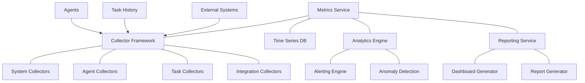

# 📊 Performance Metrics Component

<!-- 📑 TABLE OF CONTENTS -->
- [📊 Performance Metrics Component](#-performance-metrics-component)
  - [📖 Description](#-description)
  - [🏗️ Architecture](#️-architecture)
  - [🧰 Implementation](#-implementation)
  - [📈 Metric Collection](#-metric-collection)
  - [📊 Visualization and Reporting](#-visualization-and-reporting)
  - [⚠️ Alerting System](#️-alerting-system)
  - [🔍 Performance Analysis](#-performance-analysis)
  - [💰 Cost Tracking](#-cost-tracking)

---

## 📖 Description

The Performance Metrics component is responsible for collecting, analyzing, and reporting on the performance of the multi-agent system. It monitors various aspects of system behavior including task execution efficiency, agent resource utilization, system throughput, and operational costs. This component provides insights that drive continuous improvement, identifies bottlenecks, supports capacity planning, and enables fine-tuning of the system. It also plays a crucial role in multi-tenant cost allocation, quality assurance, and maintaining service level objectives.

## 🏗️ Architecture

The Performance Metrics component follows a modular architecture with specialized components for collecting, processing, and analyzing metrics:



Key components include:

1. **Collector Framework**: Gathers metrics from various sources
2. **Time Series Database**: Stores historical metric data efficiently
3. **Analytics Engine**: Processes metrics for insights and anomaly detection
4. **Reporting Service**: Generates visualizations and reports
5. **Alerting Engine**: Monitors metrics for threshold violations
6. **Dashboard Generator**: Creates real-time performance dashboards

## 🧰 Implementation

The Performance Metrics component is implemented using a combination of shell scripts for collection and SQLite for storage:

```bash
# Performance Metrics implementation
cat << 'EOF' > ./scripts/performance_metrics.sh
#!/bin/bash

# Configuration
METRICS_DIR="$(pwd)/metrics"
DB_PATH="$METRICS_DIR/metrics.db"
DASHBOARD_DIR="$METRICS_DIR/dashboards"
REPORTS_DIR="$METRICS_DIR/reports"
ALERTS_CONFIG="$METRICS_DIR/alerts.json"
LOG_FILE="$METRICS_DIR/metrics.log"

# Initialize performance metrics
function init_metrics() {
  # Create directories
  mkdir -p "$METRICS_DIR"
  mkdir -p "$DASHBOARD_DIR"
  mkdir -p "$REPORTS_DIR"
  
  # Initialize SQLite database if it doesn't exist
  if [[ ! -f "$DB_PATH" ]]; then
    sqlite3 "$DB_PATH" <<SQL
CREATE TABLE system_metrics (
  id INTEGER PRIMARY KEY AUTOINCREMENT,
  timestamp TEXT,
  metric_name TEXT,
  metric_value REAL,
  tags TEXT
);

CREATE TABLE agent_metrics (
  id INTEGER PRIMARY KEY AUTOINCREMENT,
  timestamp TEXT,
  agent_id TEXT,
  metric_name TEXT,
  metric_value REAL,
  tags TEXT
);

CREATE TABLE task_metrics (
  id INTEGER PRIMARY KEY AUTOINCREMENT,
  timestamp TEXT,
  task_id INTEGER,
  metric_name TEXT,
  metric_value REAL,
  tags TEXT
);

CREATE TABLE tenant_metrics (
  id INTEGER PRIMARY KEY AUTOINCREMENT,
  timestamp TEXT,
  tenant_id TEXT,
  metric_name TEXT,
  metric_value REAL,
  tags TEXT
);

CREATE TABLE cost_metrics (
  id INTEGER PRIMARY KEY AUTOINCREMENT,
  timestamp TEXT,
  resource_type TEXT,
  resource_id TEXT,
  cost_value REAL,
  tenant_id TEXT,
  tags TEXT
);

CREATE INDEX idx_system_metrics_timestamp ON system_metrics(timestamp);
CREATE INDEX idx_system_metrics_name ON system_metrics(metric_name);
CREATE INDEX idx_agent_metrics_agent_id ON agent_metrics(agent_id);
CREATE INDEX idx_agent_metrics_name ON agent_metrics(metric_name);
CREATE INDEX idx_task_metrics_task_id ON task_metrics(task_id);
CREATE INDEX idx_task_metrics_name ON task_metrics(metric_name);
CREATE INDEX idx_tenant_metrics_tenant_id ON tenant_metrics(tenant_id);
CREATE INDEX idx_tenant_metrics_name ON tenant_metrics(metric_name);
CREATE INDEX idx_cost_metrics_tenant_id ON cost_metrics(tenant_id);
CREATE INDEX idx_cost_metrics_resource_type ON cost_metrics(resource_type);
SQL
    echo "Metrics database initialized at $DB_PATH"
  fi
  
  # Initialize alerts config if it doesn't exist
  if [[ ! -f "$ALERTS_CONFIG" ]]; then
    cat << 'ALERTS' > "$ALERTS_CONFIG"
{
  "alerts": [
    {
      "name": "high_task_completion_time",
      "description": "Tasks taking too long to complete",
      "metric": "task_completion_time",
      "threshold": 3600,
      "operator": ">",
      "severity": "warning",
      "actions": ["log", "notify"]
    },
    {
      "name": "high_agent_memory",
      "description": "Agent memory usage too high",
      "metric": "agent_memory_usage",
      "threshold": 85,
      "operator": ">",
      "severity": "critical",
      "actions": ["log", "notify", "restart_agent"]
    },
    {
      "name": "low_task_throughput",
      "description": "System processing fewer tasks than expected",
      "metric": "tasks_per_hour",
      "threshold": 10,
      "operator": "<",
      "severity": "warning",
      "actions": ["log", "notify"]
    }
  ]
}
ALERTS
    echo "Alerts configuration initialized at $ALERTS_CONFIG"
  fi
}

# Record a system metric
function record_system_metric() {
  metric_name="$1"
  metric_value="$2"
  tags="$3"  # Optional comma-separated tags
  
  timestamp=$(date -u +"%Y-%m-%dT%H:%M:%SZ")
  
  # Insert into database
  sqlite3 "$DB_PATH" <<SQL
INSERT INTO system_metrics 
  (timestamp, metric_name, metric_value, tags)
VALUES 
  ('$timestamp', '$metric_name', $metric_value, '$tags');
SQL
  
  echo "$(date +"%Y-%m-%d %H:%M:%S") - System metric: $metric_name = $metric_value" >> "$LOG_FILE"
  
  # Check for alerts
  check_alert "system" "$metric_name" "$metric_value" ""
}

# Record an agent metric
function record_agent_metric() {
  agent_id="$1"
  metric_name="$2"
  metric_value="$3"
  tags="$4"  # Optional comma-separated tags
  
  timestamp=$(date -u +"%Y-%m-%dT%H:%M:%SZ")
  
  # Insert into database
  sqlite3 "$DB_PATH" <<SQL
INSERT INTO agent_metrics 
  (timestamp, agent_id, metric_name, metric_value, tags)
VALUES 
  ('$timestamp', '$agent_id', '$metric_name', $metric_value, '$tags');
SQL
  
  echo "$(date +"%Y-%m-%d %H:%M:%S") - Agent $agent_id metric: $metric_name = $metric_value" >> "$LOG_FILE"
  
  # Check for alerts
  check_alert "agent" "$metric_name" "$metric_value" "$agent_id"
}

# Record a task metric
function record_task_metric() {
  task_id="$1"
  metric_name="$2"
  metric_value="$3"
  tags="$4"  # Optional comma-separated tags
  
  timestamp=$(date -u +"%Y-%m-%dT%H:%M:%SZ")
  
  # Insert into database
  sqlite3 "$DB_PATH" <<SQL
INSERT INTO task_metrics 
  (timestamp, task_id, metric_name, metric_value, tags)
VALUES 
  ('$timestamp', $task_id, '$metric_name', $metric_value, '$tags');
SQL
  
  echo "$(date +"%Y-%m-%d %H:%M:%S") - Task #$task_id metric: $metric_name = $metric_value" >> "$LOG_FILE"
  
  # Check for alerts
  check_alert "task" "$metric_name" "$metric_value" "$task_id"
}

# Record a tenant metric
function record_tenant_metric() {
  tenant_id="$1"
  metric_name="$2"
  metric_value="$3"
  tags="$4"  # Optional comma-separated tags
  
  timestamp=$(date -u +"%Y-%m-%dT%H:%M:%SZ")
  
  # Insert into database
  sqlite3 "$DB_PATH" <<SQL
INSERT INTO tenant_metrics 
  (timestamp, tenant_id, metric_name, metric_value, tags)
VALUES 
  ('$timestamp', '$tenant_id', '$metric_name', $metric_value, '$tags');
SQL
  
  echo "$(date +"%Y-%m-%d %H:%M:%S") - Tenant $tenant_id metric: $metric_name = $metric_value" >> "$LOG_FILE"
  
  # Check for alerts
  check_alert "tenant" "$metric_name" "$metric_value" "$tenant_id"
}

# Record a cost metric
function record_cost() {
  resource_type="$1"  # "agent", "task", "storage", etc.
  resource_id="$2"
  cost_value="$3"
  tenant_id="$4"
  tags="$5"  # Optional comma-separated tags
  
  timestamp=$(date -u +"%Y-%m-%dT%H:%M:%SZ")
  
  # Insert into database
  sqlite3 "$DB_PATH" <<SQL
INSERT INTO cost_metrics 
  (timestamp, resource_type, resource_id, cost_value, tenant_id, tags)
VALUES 
  ('$timestamp', '$resource_type', '$resource_id', $cost_value, '$tenant_id', '$tags');
SQL
  
  echo "$(date +"%Y-%m-%d %H:%M:%S") - Cost: $resource_type $resource_id = $cost_value (Tenant: $tenant_id)" >> "$LOG_FILE"
}

# Query metrics
function query_metrics() {
  query_type="$1"
  params="$2"
  
  case "$query_type" in
    "system")
      metric_name="$params"
      sqlite3 -json "$DB_PATH" "
        SELECT timestamp, metric_value 
        FROM system_metrics 
        WHERE metric_name = '$metric_name'
        ORDER BY timestamp DESC 
        LIMIT 100;
      "
      ;;
    "agent")
      # Format: agent_id:metric_name
      agent_id="${params%%:*}"
      metric_name="${params#*:}"
      
      sqlite3 -json "$DB_PATH" "
        SELECT timestamp, metric_value 
        FROM agent_metrics 
        WHERE agent_id = '$agent_id' AND metric_name = '$metric_name'
        ORDER BY timestamp DESC 
        LIMIT 100;
      "
      ;;
    "task")
      # Format: task_id:metric_name
      task_id="${params%%:*}"
      metric_name="${params#*:}"
      
      sqlite3 -json "$DB_PATH" "
        SELECT timestamp, metric_value 
        FROM task_metrics 
        WHERE task_id = $task_id AND metric_name = '$metric_name'
        ORDER BY timestamp DESC 
        LIMIT 100;
      "
      ;;
    "tenant")
      # Format: tenant_id:metric_name
      tenant_id="${params%%:*}"
      metric_name="${params#*:}"
      
      sqlite3 -json "$DB_PATH" "
        SELECT timestamp, metric_value 
        FROM tenant_metrics 
        WHERE tenant_id = '$tenant_id' AND metric_name = '$metric_name'
        ORDER BY timestamp DESC 
        LIMIT 100;
      "
      ;;
    "cost")
      # Format: tenant_id:resource_type
      tenant_id="${params%%:*}"
      resource_type="${params#*:}"
      
      if [[ "$resource_type" == "$tenant_id" ]]; then
        # No resource type specified, get all costs for tenant
        sqlite3 -json "$DB_PATH" "
          SELECT timestamp, resource_type, resource_id, cost_value 
          FROM cost_metrics 
          WHERE tenant_id = '$tenant_id'
          ORDER BY timestamp DESC 
          LIMIT 100;
        "
      else
        # Get costs for specific resource type
        sqlite3 -json "$DB_PATH" "
          SELECT timestamp, resource_id, cost_value 
          FROM cost_metrics 
          WHERE tenant_id = '$tenant_id' AND resource_type = '$resource_type'
          ORDER BY timestamp DESC 
          LIMIT 100;
        "
      fi
      ;;
    "custom")
      # Direct SQL query
      sqlite3 -json "$DB_PATH" "$params"
      ;;
    *)
      echo "{\"error\": \"Unknown query type: $query_type\"}"
      return 1
      ;;
  esac
}

# Generate a report
function generate_report() {
  report_type="$1"
  output_file="$2"
  time_period="$3"  # "hour", "day", "week", "month"
  
  # Determine time range
  case "$time_period" in
    "hour")
      start_time=$(date -d "1 hour ago" -u +"%Y-%m-%dT%H:%M:%SZ")
      ;;
    "day")
      start_time=$(date -d "1 day ago" -u +"%Y-%m-%dT%H:%M:%SZ")
      ;;
    "week")
      start_time=$(date -d "7 days ago" -u +"%Y-%m-%dT%H:%M:%SZ")
      ;;
    "month")
      start_time=$(date -d "30 days ago" -u +"%Y-%m-%dT%H:%M:%SZ")
      ;;
    *)
      echo "Unknown time period: $time_period"
      return 1
      ;;
  esac
  
  case "$report_type" in
    "system")
      # System performance report
      sqlite3 -box "$DB_PATH" <<SQL > "$output_file"
.mode box
.headers on

-- System metrics summary
SELECT 
  metric_name,
  COUNT(*) as data_points,
  MIN(metric_value) as min_value,
  MAX(metric_value) as max_value,
  AVG(metric_value) as avg_value,
  (SELECT metric_value FROM system_metrics WHERE metric_name = sm.metric_name ORDER BY timestamp DESC LIMIT 1) as latest_value
FROM 
  system_metrics sm
WHERE 
  timestamp >= '$start_time'
GROUP BY 
  metric_name
ORDER BY 
  metric_name;

-- System throughput
SELECT 
  strftime('%Y-%m-%d %H:00:00', timestamp) as hour,
  COUNT(*) as task_count
FROM 
  task_metrics
WHERE 
  metric_name = 'task_completed' AND
  timestamp >= '$start_time'
GROUP BY 
  hour
ORDER BY 
  hour;

-- Resource utilization
SELECT 
  metric_name,
  AVG(metric_value) as avg_utilization,
  MAX(metric_value) as peak_utilization
FROM 
  system_metrics
WHERE 
  metric_name LIKE '%utilization%' AND
  timestamp >= '$start_time'
GROUP BY 
  metric_name
ORDER BY 
  avg_utilization DESC;
SQL
      ;;
    "agent")
      # Agent performance report
      sqlite3 -box "$DB_PATH" <<SQL > "$output_file"
.mode box
.headers on

-- Agent metrics summary
SELECT 
  agent_id,
  metric_name,
  COUNT(*) as data_points,
  MIN(metric_value) as min_value,
  MAX(metric_value) as max_value,
  AVG(metric_value) as avg_value
FROM 
  agent_metrics
WHERE 
  timestamp >= '$start_time'
GROUP BY 
  agent_id, metric_name
ORDER BY 
  agent_id, metric_name;

-- Agent task throughput
SELECT 
  agent_id,
  COUNT(*) as tasks_completed
FROM 
  task_metrics
WHERE 
  metric_name = 'task_completed' AND
  timestamp >= '$start_time'
GROUP BY 
  agent_id
ORDER BY 
  tasks_completed DESC;

-- Agent resource utilization
SELECT 
  agent_id,
  AVG(CASE WHEN metric_name = 'memory_usage' THEN metric_value ELSE NULL END) as avg_memory,
  AVG(CASE WHEN metric_name = 'cpu_usage' THEN metric_value ELSE NULL END) as avg_cpu,
  AVG(CASE WHEN metric_name = 'response_time' THEN metric_value ELSE NULL END) as avg_response_time
FROM 
  agent_metrics
WHERE 
  timestamp >= '$start_time'
GROUP BY 
  agent_id
ORDER BY 
  avg_memory DESC;
SQL
      ;;
    "task")
      # Task performance report
      sqlite3 -box "$DB_PATH" <<SQL > "$output_file"
.mode box
.headers on

-- Task completion time statistics
SELECT 
  (SELECT tags FROM task_metrics WHERE task_id = tm.task_id LIMIT 1) as task_type,
  COUNT(*) as task_count,
  MIN(metric_value) as min_completion_time,
  MAX(metric_value) as max_completion_time,
  AVG(metric_value) as avg_completion_time
FROM 
  task_metrics tm
WHERE 
  metric_name = 'completion_time' AND
  timestamp >= '$start_time'
GROUP BY 
  task_type
ORDER BY 
  avg_completion_time DESC;

-- Task throughput over time
SELECT 
  strftime('%Y-%m-%d', timestamp) as day,
  COUNT(*) as tasks_completed
FROM 
  task_metrics
WHERE 
  metric_name = 'task_completed' AND
  timestamp >= '$start_time'
GROUP BY 
  day
ORDER BY 
  day;

-- Task error rate
SELECT 
  (SELECT tags FROM task_metrics WHERE task_id = tm.task_id LIMIT 1) as task_type,
  COUNT(*) as total_tasks,
  SUM(CASE WHEN metric_name = 'error_count' AND metric_value > 0 THEN 1 ELSE 0 END) as error_tasks,
  ROUND(100.0 * SUM(CASE WHEN metric_name = 'error_count' AND metric_value > 0 THEN 1 ELSE 0 END) / COUNT(*), 2) as error_rate
FROM 
  task_metrics tm
WHERE 
  metric_name IN ('task_completed', 'error_count') AND
  timestamp >= '$start_time'
GROUP BY 
  task_type
ORDER BY 
  error_rate DESC;
SQL
      ;;
    "cost")
      # Cost report
      sqlite3 -box "$DB_PATH" <<SQL > "$output_file"
.mode box
.headers on

-- Total cost by tenant
SELECT 
  tenant_id,
  SUM(cost_value) as total_cost
FROM 
  cost_metrics
WHERE 
  timestamp >= '$start_time'
GROUP BY 
  tenant_id
ORDER BY 
  total_cost DESC;

-- Cost by resource type
SELECT 
  tenant_id,
  resource_type,
  SUM(cost_value) as type_cost,
  ROUND(100.0 * SUM(cost_value) / (SELECT SUM(cost_value) FROM cost_metrics WHERE tenant_id = cm.tenant_id AND timestamp >= '$start_time'), 2) as percentage
FROM 
  cost_metrics cm
WHERE 
  timestamp >= '$start_time'
GROUP BY 
  tenant_id, resource_type
ORDER BY 
  tenant_id, type_cost DESC;

-- Daily cost trend
SELECT 
  tenant_id,
  strftime('%Y-%m-%d', timestamp) as day,
  SUM(cost_value) as daily_cost
FROM 
  cost_metrics
WHERE 
  timestamp >= '$start_time'
GROUP BY 
  tenant_id, day
ORDER BY 
  tenant_id, day;
SQL
      ;;
    "custom")
      # Custom report with SQL
      query="$4"
      sqlite3 -box "$DB_PATH" "$query" > "$output_file"
      ;;
    *)
      echo "Unknown report type: $report_type"
      return 1
      ;;
  esac
  
  echo "Report generated at $output_file"
}

# Generate a dashboard
function generate_dashboard() {
  dashboard_type="$1"
  output_file="$2"
  
  case "$dashboard_type" in
    "system")
      # System dashboard (simplified HTML output)
      cat << HTML > "$output_file"
<!DOCTYPE html>
<html>
<head>
  <title>System Performance Dashboard</title>
  <style>
    body { font-family: Arial, sans-serif; margin: 20px; }
    .dashboard { display: grid; grid-template-columns: repeat(2, 1fr); gap: 20px; }
    .metric { border: 1px solid #ddd; padding: 15px; border-radius: 5px; }
    .value { font-size: 24px; font-weight: bold; }
    h1, h2 { color: #333; }
  </style>
</head>
<body>
  <h1>System Performance Dashboard</h1>
  <p>Generated on $(date)</p>
  
  <div class="dashboard">
    <div class="metric">
      <h2>Active Agents</h2>
      <div class="value">$(sqlite3 "$DB_PATH" "SELECT COUNT(DISTINCT agent_id) FROM agent_metrics WHERE timestamp >= datetime('now', '-1 hour')")</div>
    </div>
    
    <div class="metric">
      <h2>Tasks Completed (Last 24h)</h2>
      <div class="value">$(sqlite3 "$DB_PATH" "SELECT COUNT(*) FROM task_metrics WHERE metric_name = 'task_completed' AND timestamp >= datetime('now', '-1 day')")</div>
    </div>
    
    <div class="metric">
      <h2>Avg Completion Time (Last 24h)</h2>
      <div class="value">$(sqlite3 "$DB_PATH" "SELECT ROUND(AVG(metric_value)/60, 2) FROM task_metrics WHERE metric_name = 'completion_time' AND timestamp >= datetime('now', '-1 day')") minutes</div>
    </div>
    
    <div class="metric">
      <h2>System CPU Utilization</h2>
      <div class="value">$(sqlite3 "$DB_PATH" "SELECT ROUND(AVG(metric_value), 1) FROM system_metrics WHERE metric_name = 'cpu_utilization' AND timestamp >= datetime('now', '-1 hour')") %</div>
    </div>
    
    <div class="metric">
      <h2>System Memory Utilization</h2>
      <div class="value">$(sqlite3 "$DB_PATH" "SELECT ROUND(AVG(metric_value), 1) FROM system_metrics WHERE metric_name = 'memory_utilization' AND timestamp >= datetime('now', '-1 hour')") %</div>
    </div>
    
    <div class="metric">
      <h2>Error Rate (Last 24h)</h2>
      <div class="value">$(sqlite3 "$DB_PATH" "SELECT ROUND(100.0 * SUM(CASE WHEN metric_name = 'error_count' AND metric_value > 0 THEN 1 ELSE 0 END) / COUNT(*), 2) FROM task_metrics WHERE timestamp >= datetime('now', '-1 day')") %</div>
    </div>
  </div>
  
  <h2>Recent Alerts</h2>
  <pre>$(tail -n 10 "$METRICS_DIR/alerts.log" 2>/dev/null || echo "No recent alerts")</pre>
</body>
</html>
HTML
      ;;
    "agent")
      # Agent dashboard
      cat << HTML > "$output_file"
<!DOCTYPE html>
<html>
<head>
  <title>Agent Performance Dashboard</title>
  <style>
    body { font-family: Arial, sans-serif; margin: 20px; }
    table { border-collapse: collapse; width: 100%; margin-top: 20px; }
    th, td { border: 1px solid #ddd; padding: 8px; text-align: left; }
    th { background-color: #f2f2f2; }
    tr:nth-child(even) { background-color: #f9f9f9; }
    h1, h2 { color: #333; }
  </style>
</head>
<body>
  <h1>Agent Performance Dashboard</h1>
  <p>Generated on $(date)</p>
  
  <h2>Agent Performance Summary (Last 24h)</h2>
  <table>
    <tr>
      <th>Agent ID</th>
      <th>Tasks Completed</th>
      <th>Avg Task Time (min)</th>
      <th>Memory Usage (%)</th>
      <th>CPU Usage (%)</th>
      <th>Error Rate (%)</th>
    </tr>
    $(sqlite3 "$DB_PATH" "
    SELECT 
      a.agent_id, 
      COUNT(DISTINCT CASE WHEN tm.metric_name = 'task_completed' THEN tm.task_id ELSE NULL END) as tasks_completed,
      ROUND(AVG(CASE WHEN tm.metric_name = 'completion_time' THEN tm.metric_value/60 ELSE NULL END), 2) as avg_time,
      ROUND(AVG(CASE WHEN a.metric_name = 'memory_usage' THEN a.metric_value ELSE NULL END), 1) as mem_usage,
      ROUND(AVG(CASE WHEN a.metric_name = 'cpu_usage' THEN a.metric_value ELSE NULL END), 1) as cpu_usage,
      ROUND(100.0 * COUNT(DISTINCT CASE WHEN tm.metric_name = 'error_count' AND tm.metric_value > 0 THEN tm.task_id ELSE NULL END) / 
            NULLIF(COUNT(DISTINCT CASE WHEN tm.metric_name = 'task_completed' THEN tm.task_id ELSE NULL END), 0), 2) as error_rate
    FROM 
      agent_metrics a
    LEFT JOIN
      task_metrics tm ON tm.timestamp >= datetime('now', '-1 day')
    WHERE 
      a.timestamp >= datetime('now', '-1 day')
    GROUP BY 
      a.agent_id
    ORDER BY 
      tasks_completed DESC
    LIMIT 20
    " | while read -r agent_id tasks avg_time mem cpu error; do
      echo "    <tr><td>$agent_id</td><td>$tasks</td><td>$avg_time</td><td>$mem</td><td>$cpu</td><td>$error</td></tr>"
    done)
  </table>
  
  <h2>Agent Status</h2>
  <table>
    <tr>
      <th>Agent ID</th>
      <th>Last Seen</th>
      <th>Status</th>
      <th>Current Task</th>
    </tr>
    $(sqlite3 "$DB_PATH" "
    SELECT 
      agent_id,
      MAX(timestamp) as last_seen,
      (SELECT metric_value FROM agent_metrics WHERE agent_id = am.agent_id AND metric_name = 'status' ORDER BY timestamp DESC LIMIT 1) as status,
      (SELECT metric_value FROM agent_metrics WHERE agent_id = am.agent_id AND metric_name = 'current_task' ORDER BY timestamp DESC LIMIT 1) as task
    FROM 
      agent_metrics am
    GROUP BY 
      agent_id
    ORDER BY 
      last_seen DESC
    LIMIT 20
    " | while read -r agent_id last_seen status task; do
      echo "    <tr><td>$agent_id</td><td>$last_seen</td><td>$status</td><td>$task</td></tr>"
    done)
  </table>
</body>
</html>
HTML
      ;;
    "cost")
      # Cost dashboard
      cat << HTML > "$output_file"
<!DOCTYPE html>
<html>
<head>
  <title>Cost Dashboard</title>
  <style>
    body { font-family: Arial, sans-serif; margin: 20px; }
    table { border-collapse: collapse; width: 100%; margin-top: 20px; }
    th, td { border: 1px solid #ddd; padding: 8px; text-align: left; }
    th { background-color: #f2f2f2; }
    tr:nth-child(even) { background-color: #f9f9f9; }
    h1, h2 { color: #333; }
    .chart { width: 100%; height: 300px; border: 1px solid #ddd; margin-top: 20px; }
  </style>
</head>
<body>
  <h1>Cost Dashboard</h1>
  <p>Generated on $(date)</p>
  
  <h2>Tenant Cost Summary (Last 30 Days)</h2>
  <table>
    <tr>
      <th>Tenant ID</th>
      <th>Total Cost</th>
      <th>Agent Cost</th>
      <th>Storage Cost</th>
      <th>API Cost</th>
      <th>Other Cost</th>
    </tr>
    $(sqlite3 "$DB_PATH" "
    SELECT 
      tenant_id,
      ROUND(SUM(cost_value), 2) as total_cost,
      ROUND(SUM(CASE WHEN resource_type = 'agent' THEN cost_value ELSE 0 END), 2) as agent_cost,
      ROUND(SUM(CASE WHEN resource_type = 'storage' THEN cost_value ELSE 0 END), 2) as storage_cost,
      ROUND(SUM(CASE WHEN resource_type = 'api' THEN cost_value ELSE 0 END), 2) as api_cost,
      ROUND(SUM(CASE WHEN resource_type NOT IN ('agent', 'storage', 'api') THEN cost_value ELSE 0 END), 2) as other_cost
    FROM 
      cost_metrics
    WHERE 
      timestamp >= datetime('now', '-30 day')
    GROUP BY 
      tenant_id
    ORDER BY 
      total_cost DESC
    " | while read -r tenant total agent storage api other; do
      echo "    <tr><td>$tenant</td><td>$total</td><td>$agent</td><td>$storage</td><td>$api</td><td>$other</td></tr>"
    done)
  </table>
  
  <h2>Daily Cost Trend (Last 14 Days)</h2>
  <table>
    <tr>
      <th>Date</th>
      <th>Total Cost</th>
      <th>Change</th>
    </tr>
    $(sqlite3 "$DB_PATH" "
    WITH daily_costs AS (
      SELECT 
        date(timestamp) as day,
        SUM(cost_value) as daily_cost
      FROM 
        cost_metrics
      WHERE 
        timestamp >= datetime('now', '-14 day')
      GROUP BY 
        day
    ),
    previous_costs AS (
      SELECT 
        day,
        daily_cost,
        LAG(daily_cost) OVER (ORDER BY day) as prev_cost
      FROM 
        daily_costs
    )
    SELECT 
      day,
      ROUND(daily_cost, 2) as cost,
      CASE 
        WHEN prev_cost IS NULL THEN '-'
        ELSE ROUND(100.0 * (daily_cost - prev_cost) / prev_cost, 1) || '%'
      END as change
    FROM 
      previous_costs
    ORDER BY 
      day DESC
    " | while read -r day cost change; do
      if [[ "$change" == *"-"* && "$change" != "-" ]]; then
        color="color: red"
      elif [[ "$change" == *"."* ]]; then
        color="color: green"
      else
        color=""
      fi
      echo "    <tr><td>$day</td><td>$cost</td><td style=\"$color\">$change</td></tr>"
    done)
  </table>
</body>
</html>
HTML
      ;;
    "custom")
      # Custom dashboard with provided HTML
      dashboard_content="$3"
      echo "$dashboard_content" > "$output_file"
      ;;
    *)
      echo "Unknown dashboard type: $dashboard_type"
      return 1
      ;;
  esac
  
  echo "Dashboard generated at $output_file"
}

# Check for alerts
function check_alert() {
  metric_type="$1"  # "system", "agent", "task", "tenant"
  metric_name="$2"
  metric_value="$3"
  entity_id="$4"  # agent_id, task_id, or tenant_id
  
  # Get alerts configuration
  alerts=$(cat "$ALERTS_CONFIG" | jq -c '.alerts[]')
  
  # Check each alert
  echo "$alerts" | while read -r alert; do
    alert_name=$(echo "$alert" | jq -r '.name')
    alert_metric=$(echo "$alert" | jq -r '.metric')
    alert_threshold=$(echo "$alert" | jq -r '.threshold')
    alert_operator=$(echo "$alert" | jq -r '.operator')
    alert_severity=$(echo "$alert" | jq -r '.severity')
    alert_actions=$(echo "$alert" | jq -r '.actions | join(",")')
    
    # Check if this alert applies to this metric
    if [[ "$alert_metric" == "$metric_name" ]]; then
      # Evaluate condition
      triggered=false
      
      case "$alert_operator" in
        ">")
          if (( $(echo "$metric_value > $alert_threshold" | bc -l) )); then
            triggered=true
          fi
          ;;
        ">=")
          if (( $(echo "$metric_value >= $alert_threshold" | bc -l) )); then
            triggered=true
          fi
          ;;
        "<")
          if (( $(echo "$metric_value < $alert_threshold" | bc -l) )); then
            triggered=true
          fi
          ;;
        "<=")
          if (( $(echo "$metric_value <= $alert_threshold" | bc -l) )); then
            triggered=true
          fi
          ;;
        "==")
          if (( $(echo "$metric_value == $alert_threshold" | bc -l) )); then
            triggered=true
          fi
          ;;
        "!=")
          if (( $(echo "$metric_value != $alert_threshold" | bc -l) )); then
            triggered=true
          fi
          ;;
      esac
      
      # Handle alert if triggered
      if [[ "$triggered" == "true" ]]; then
        timestamp=$(date -u +"%Y-%m-%dT%H:%M:%SZ")
        entity_info=""
        if [[ -n "$entity_id" ]]; then
          entity_info=" $entity_id"
        fi
        
        alert_message="[$timestamp] [$alert_severity] Alert '$alert_name' triggered for $metric_type$entity_info: $metric_name = $metric_value $alert_operator $alert_threshold"
        
        # Execute alert actions
        if [[ "$alert_actions" == *"log"* ]]; then
          echo "$alert_message" >> "$METRICS_DIR/alerts.log"
        fi
        
        if [[ "$alert_actions" == *"notify"* ]]; then
          # In a real implementation, this would send a notification
          echo "NOTIFICATION: $alert_message" >> "$METRICS_DIR/notifications.log"
        fi
        
        if [[ "$alert_actions" == *"restart_agent"* && "$metric_type" == "agent" ]]; then
          # In a real implementation, this would restart the agent
          echo "ACTION: Restarting agent $entity_id due to alert '$alert_name'" >> "$METRICS_DIR/actions.log"
        fi
      fi
    fi
  done
}

# Collect all metrics
function collect_all_metrics() {
  echo "Starting metrics collection..."
  
  # Collect system metrics
  collect_system_metrics
  
  # Collect agent metrics
  collect_agent_metrics
  
  # Collect task metrics
  collect_task_metrics
  
  # Calculate and record derived metrics
  calculate_derived_metrics
  
  echo "Metrics collection completed"
}

# Collect system metrics
function collect_system_metrics() {
  # CPU utilization
  cpu_util=$(top -l 1 | grep "CPU usage" | awk '{print $3}' | tr -d '%')
  record_system_metric "cpu_utilization" "$cpu_util" "system,resource"
  
  # Memory utilization
  mem_total=$(vm_stat | grep "Pages free" | awk '{print $3}' | tr -d '.')
  mem_used=$(vm_stat | grep "Pages active" | awk '{print $3}' | tr -d '.')
  mem_util=$(echo "scale=2; $mem_used / $mem_total * 100" | bc)
  record_system_metric "memory_utilization" "$mem_util" "system,resource"
  
  # Disk utilization
  disk_util=$(df -h / | awk 'NR==2 {print $5}' | tr -d '%')
  record_system_metric "disk_utilization" "$disk_util" "system,resource"
  
  # Running agents count
  agent_count=$(ps aux | grep -c "claude-code")
  record_system_metric "active_agents" "$agent_count" "system,agents"
  
  # Task queue length
  queue_length=$(gh issue list --state open --label "status:pending" --json number | jq '. | length')
  record_system_metric "queue_length" "$queue_length" "system,tasks"
  
  # Tasks in progress
  in_progress=$(gh issue list --state open --label "status:in_progress" --json number | jq '. | length')
  record_system_metric "tasks_in_progress" "$in_progress" "system,tasks"
}

# Collect agent metrics
function collect_agent_metrics() {
  # Get all active agents
  agents=$(ps aux | grep "claude-code" | grep -v grep | awk '{print $2}')
  
  for pid in $agents; do
    # Extract agent ID from process
    agent_id=$(ps -p "$pid" -o command | grep -o "\-\-name [^ ]*" | cut -d ' ' -f 2)
    
    if [[ -z "$agent_id" ]]; then
      # Fallback to PID if agent ID not found
      agent_id="agent_$pid"
    fi
    
    # CPU usage
    cpu_usage=$(ps -p "$pid" -o %cpu | tail -1 | tr -d ' ')
    record_agent_metric "$agent_id" "cpu_usage" "$cpu_usage" "resource"
    
    # Memory usage
    mem_usage=$(ps -p "$pid" -o %mem | tail -1 | tr -d ' ')
    record_agent_metric "$agent_id" "memory_usage" "$mem_usage" "resource"
    
    # Uptime
    start_time=$(ps -p "$pid" -o lstart | tail -1)
    start_timestamp=$(date -j -f "%a %b %d %T %Y" "$start_time" +%s)
    current_timestamp=$(date +%s)
    uptime=$((current_timestamp - start_timestamp))
    record_agent_metric "$agent_id" "uptime" "$uptime" "status"
    
    # Current task (if any)
    current_task=$(gh issue list --assignee "$agent_id" --state open --label "status:in_progress" --json number | jq -r '.[0].number // 0')
    record_agent_metric "$agent_id" "current_task" "$current_task" "status"
    
    # Agent status
    if [[ "$current_task" -gt 0 ]]; then
      status="busy"
    else
      status="available"
    fi
    record_agent_metric "$agent_id" "status" "0" "$status"
    
    # Calculate agent cost
    hourly_rate=10  # Placeholder value: $10 per hour
    hours_running=$(echo "scale=2; $uptime / 3600" | bc)
    agent_cost=$(echo "scale=2; $hours_running * $hourly_rate" | bc)
    
    # Get tenant for this agent
    tenant_id=$(get_agent_tenant "$agent_id")
    
    # Record cost
    record_cost "agent" "$agent_id" "$agent_cost" "$tenant_id" "hourly_rate=$hourly_rate"
  done
}

# Collect task metrics
function collect_task_metrics() {
  # Get recently updated tasks
  recent_tasks=$(gh issue list --state all --json number,title,updatedAt,createdAt,closedAt,labels | \
    jq -c '.[] | select(.updatedAt > "'$(date -d "2 hours ago" -u +"%Y-%m-%dT%H:%M:%SZ")'")')
  
  echo "$recent_tasks" | while read -r task_json; do
    task_id=$(echo "$task_json" | jq -r '.number')
    created_at=$(echo "$task_json" | jq -r '.createdAt')
    closed_at=$(echo "$task_json" | jq -r '.closedAt')
    labels=$(echo "$task_json" | jq -r '.labels[].name' | tr '\n' ',')
    
    # Get tenant from labels
    tenant_id=$(echo "$labels" | grep -o "tenant:[^,]*" | cut -d ':' -f 2)
    if [[ -z "$tenant_id" ]]; then
      tenant_id="default"
    fi
    
    # If task was recently closed, record completion
    if [[ "$closed_at" != "null" && $(date -d "$closed_at" +%s) -gt $(date -d "2 hours ago" +%s) ]]; then
      # Record task completion
      record_task_metric "$task_id" "task_completed" "1" "$labels"
      
      # Calculate completion time
      created_timestamp=$(date -d "$created_at" +%s)
      closed_timestamp=$(date -d "$closed_at" +%s)
      completion_time=$((closed_timestamp - created_timestamp))
      record_task_metric "$task_id" "completion_time" "$completion_time" "$labels"
      
      # Calculate task cost
      # Simple model: $1 per minute of task time
      task_cost=$(echo "scale=2; $completion_time / 60" | bc)
      record_cost "task" "$task_id" "$task_cost" "$tenant_id" "$labels"
      
      # Record tenant task completion
      record_tenant_metric "$tenant_id" "tasks_completed" "1" "task_id=$task_id"
      
      # Extract error count from comments if any
      error_count=$(gh issue view "$task_id" --json comments | \
        jq -r '.comments[].body' | grep -c "Error:")
      record_task_metric "$task_id" "error_count" "$error_count" "$labels"
    fi
  done
}

# Calculate derived metrics
function calculate_derived_metrics() {
  # Calculate tasks per hour
  hour_ago=$(date -d "1 hour ago" -u +"%Y-%m-%dT%H:%M:%SZ")
  tasks_completed=$(sqlite3 "$DB_PATH" "SELECT COUNT(*) FROM task_metrics WHERE metric_name = 'task_completed' AND timestamp >= '$hour_ago'")
  record_system_metric "tasks_per_hour" "$tasks_completed" "system,throughput"
  
  # Calculate average completion time for last 24 hours
  day_ago=$(date -d "1 day ago" -u +"%Y-%m-%dT%H:%M:%SZ")
  avg_completion_time=$(sqlite3 "$DB_PATH" "SELECT AVG(metric_value) FROM task_metrics WHERE metric_name = 'completion_time' AND timestamp >= '$day_ago'")
  record_system_metric "avg_completion_time" "$avg_completion_time" "system,performance"
  
  # Calculate error rate
  total_tasks=$(sqlite3 "$DB_PATH" "SELECT COUNT(*) FROM task_metrics WHERE metric_name = 'task_completed' AND timestamp >= '$day_ago'")
  error_tasks=$(sqlite3 "$DB_PATH" "SELECT COUNT(*) FROM task_metrics WHERE metric_name = 'error_count' AND metric_value > 0 AND timestamp >= '$day_ago'")
  
  if [[ $total_tasks -gt 0 ]]; then
    error_rate=$(echo "scale=4; $error_tasks / $total_tasks * 100" | bc)
    record_system_metric "error_rate" "$error_rate" "system,quality"
  fi
  
  # Calculate agent efficiency (tasks per hour per agent)
  active_agents=$(sqlite3 "$DB_PATH" "SELECT COUNT(DISTINCT agent_id) FROM agent_metrics WHERE timestamp >= '$hour_ago'")
  
  if [[ $active_agents -gt 0 ]]; then
    agent_efficiency=$(echo "scale=2; $tasks_completed / $active_agents" | bc)
    record_system_metric "agent_efficiency" "$agent_efficiency" "system,efficiency"
  fi
}

# Helper function to get agent tenant
function get_agent_tenant() {
  agent_id="$1"
  
  # This is a simplified placeholder
  # In a real implementation, you would look up the tenant in a configuration database
  
  # Try to extract tenant from agent ID if it follows naming convention
  if [[ "$agent_id" == *"tenant-"* ]]; then
    echo "$agent_id" | grep -o "tenant-[^-]*" | cut -d '-' -f 2
  else
    echo "default"
  fi
}

# Usage handling
case "$1" in
  "init")
    init_metrics
    ;;
  "system")
    record_system_metric "$2" "$3" "$4"
    ;;
  "agent")
    record_agent_metric "$2" "$3" "$4" "$5"
    ;;
  "task")
    record_task_metric "$2" "$3" "$4" "$5"
    ;;
  "tenant")
    record_tenant_metric "$2" "$3" "$4" "$5"
    ;;
  "cost")
    record_cost "$2" "$3" "$4" "$5" "$6"
    ;;
  "query")
    query_metrics "$2" "$3"
    ;;
  "report")
    generate_report "$2" "$3" "$4" "$5"
    ;;
  "dashboard")
    generate_dashboard "$2" "$3" "$4"
    ;;
  "collect")
    collect_all_metrics
    ;;
  *)
    echo "Usage: $0 {init|system|agent|task|tenant|cost|query|report|dashboard|collect}"
    echo "  init: Initialize metrics system"
    echo "  system <metric_name> <value> [<tags>]: Record system metric"
    echo "  agent <agent_id> <metric_name> <value> [<tags>]: Record agent metric"
    echo "  task <task_id> <metric_name> <value> [<tags>]: Record task metric"
    echo "  tenant <tenant_id> <metric_name> <value> [<tags>]: Record tenant metric"
    echo "  cost <resource_type> <resource_id> <cost_value> <tenant_id> [<tags>]: Record cost"
    echo "  query <query_type> <params>: Query metrics"
    echo "  report <report_type> <output_file> <time_period> [<custom_query>]: Generate report"
    echo "  dashboard <dashboard_type> <output_file> [<custom_content>]: Generate dashboard"
    echo "  collect: Collect all current metrics"
    exit 1
    ;;
esac
EOF

chmod +x ./scripts/performance_metrics.sh
```

## 📈 Metric Collection

The Performance Metrics component collects metrics across multiple dimensions:

1. **System Metrics**:
   - CPU, memory, and disk utilization
   - Queue length and backlog
   - System throughput (tasks per hour)
   - Error rates and failure counts
   - Response times and latency

2. **Agent Metrics**:
   - CPU and memory usage per agent
   - Task completion counts
   - Agent status and availability
   - Response times and throughput
   - Error rates and recovery times

3. **Task Metrics**:
   - Task completion times
   - Error counts per task
   - Task decomposition metrics
   - Test coverage and quality metrics
   - Iteration counts

4. **Integration Metrics**:
   - GitHub API usage and rate limits
   - API response times
   - External system availability
   - Integration error rates

5. **Tenant Metrics**:
   - Tasks completed per tenant
   - Resource utilization by tenant
   - Costs incurred per tenant
   - SLA compliance metrics

The collection process runs at regular intervals and on significant events:

```bash
# Example cron job for metrics collection
cat << 'EOF' > ./scripts/metrics_cron.sh
#!/bin/bash

# Initialize metrics system if not already done
if [[ ! -f "$(pwd)/metrics/metrics.db" ]]; then
  ./scripts/performance_metrics.sh init
fi

# Collect metrics every 5 minutes
while true; do
  echo "$(date) - Collecting metrics..."
  ./scripts/performance_metrics.sh collect
  
  # Generate system dashboard
  ./scripts/performance_metrics.sh dashboard "system" "$(pwd)/metrics/dashboards/system.html"
  
  # Generate system report (daily)
  if [[ $(date +%H:%M) == "00:00" ]]; then
    ./scripts/performance_metrics.sh report "system" "$(pwd)/metrics/reports/system_daily_$(date +%Y-%m-%d).txt" "day"
  fi
  
  # Sleep for 5 minutes
  sleep 300
done
EOF

chmod +x ./scripts/metrics_cron.sh
```

## 📊 Visualization and Reporting

The Performance Metrics component provides comprehensive visualization and reporting capabilities:

1. **Real-Time Dashboards**:
   - System performance overview
   - Agent status and activity
   - Task execution metrics
   - Cost and resource utilization
   - Tenant usage comparison

2. **Periodic Reports**:
   - Daily system performance summaries
   - Weekly agent performance evaluations
   - Monthly cost and utilization analysis
   - Quarterly trend analysis
   - Annual system review

3. **Custom Visualizations**:
   - Time series charts for historical trends
   - Heat maps for utilization patterns
   - Bar charts for comparative analysis
   - Pie charts for resource allocation
   - Scatter plots for correlation analysis

4. **Export Formats**:
   - HTML dashboards for web viewing
   - CSV exports for data analysis
   - PDF reports for formal documentation
   - JSON data for integration with other tools

```bash
# Example dashboard server
cat << 'EOF' > ./scripts/metrics_server.sh
#!/bin/bash

# Configuration
SERVER_PORT=8080
DASHBOARD_DIR="$(pwd)/metrics/dashboards"

# Start simple HTTP server for dashboards
echo "Starting metrics dashboard server on port $SERVER_PORT..."
cd "$DASHBOARD_DIR"

# Use Python's built-in HTTP server
python3 -m http.server "$SERVER_PORT"
EOF

chmod +x ./scripts/metrics_server.sh
```

## ⚠️ Alerting System

The Performance Metrics component includes a sophisticated alerting system:

1. **Alert Types**:
   - Threshold-based alerts (value exceeds threshold)
   - Trend-based alerts (significant change over time)
   - Anomaly-based alerts (deviation from normal pattern)
   - Correlation-based alerts (unusual combinations of metrics)

2. **Alert Severity Levels**:
   - Info: Informational alerts, no action required
   - Warning: Potential issues that should be monitored
   - Error: Problems that require attention
   - Critical: Severe issues requiring immediate intervention

3. **Alert Actions**:
   - Logging: Record alert in the system log
   - Notification: Send alert to appropriate stakeholders
   - Remediation: Trigger automatic remediation actions
   - Escalation: Forward to human operators if needed

4. **Alert Configuration**:
   - Configurable thresholds per metric
   - Customizable notification channels
   - Tenant-specific alert settings
   - Time-based alert suppression

```bash
# Example alert handling
function handle_critical_alert() {
  alert_name="$1"
  entity_id="$2"
  metric_name="$3"
  metric_value="$4"
  threshold="$5"
  
  echo "CRITICAL ALERT: $alert_name for $entity_id ($metric_name = $metric_value, threshold = $threshold)"
  
  case "$alert_name" in
    "high_task_completion_time")
      # Take action for slow tasks
      echo "Taking action for slow task #$entity_id..."
      gh issue comment "$entity_id" --body "⚠️ **PERFORMANCE ALERT**: This task is taking longer than expected to complete. Current duration: $(($metric_value / 60)) minutes, threshold: $(($threshold / 60)) minutes."
      ;;
    "high_agent_memory")
      # Take action for high memory usage
      echo "Taking action for high memory agent $entity_id..."
      # Restart agent
      ./scripts/restart_agent.sh "$entity_id" "memory"
      ;;
    "system_overload")
      # Take action for system overload
      echo "Taking action for system overload..."
      # Pause task queue
      ./scripts/pause_task_queue.sh "system_overload"
      # Notify admin
      notify_admin "System overload detected. Task queue paused. CPU: $metric_value%, threshold: $threshold%"
      ;;
  esac
}
```

## 🔍 Performance Analysis

The Performance Metrics component provides sophisticated performance analysis capabilities:

1. **Trend Analysis**:
   - Long-term performance trends
   - Seasonal patterns and variations
   - Growth projections and capacity planning
   - Degradation detection and root cause analysis

2. **Comparative Analysis**:
   - Agent performance comparison
   - Task type efficiency analysis
   - Tenant usage patterns
   - Before/after system change evaluation

3. **Correlation Analysis**:
   - Metric inter-relationships
   - Impact of system changes
   - Performance bottleneck identification
   - Resource utilization optimization

4. **Predictive Analysis**:
   - Resource needs forecasting
   - Performance degradation prediction
   - Cost projection and optimization
   - Capacity planning and scaling

```bash
# Example performance analysis function
function analyze_system_performance() {
  time_period="$1"  # "day", "week", "month"
  output_file="$2"
  
  # Get system metrics for specified period
  system_metrics=$(./scripts/performance_metrics.sh query "custom" "
    SELECT 
      strftime('%Y-%m-%d %H:00:00', timestamp) as hour,
      metric_name,
      AVG(metric_value) as avg_value
    FROM 
      system_metrics
    WHERE 
      timestamp >= datetime('now', '-1 $time_period')
    GROUP BY 
      hour, metric_name
    ORDER BY 
      hour, metric_name
  ")
  
  # Get task metrics for specified period
  task_metrics=$(./scripts/performance_metrics.sh query "custom" "
    SELECT 
      strftime('%Y-%m-%d %H:00:00', timestamp) as hour,
      metric_name,
      AVG(metric_value) as avg_value
    FROM 
      task_metrics
    WHERE 
      timestamp >= datetime('now', '-1 $time_period')
      AND metric_name IN ('completion_time', 'error_count')
    GROUP BY 
      hour, metric_name
    ORDER BY 
      hour, metric_name
  ")
  
  # Get agent metrics for specified period
  agent_metrics=$(./scripts/performance_metrics.sh query "custom" "
    SELECT 
      strftime('%Y-%m-%d %H:00:00', timestamp) as hour,
      metric_name,
      AVG(metric_value) as avg_value
    FROM 
      agent_metrics
    WHERE 
      timestamp >= datetime('now', '-1 $time_period')
      AND metric_name IN ('cpu_usage', 'memory_usage')
    GROUP BY 
      hour, metric_name
    ORDER BY 
      hour, metric_name
  ")
  
  # Perform correlation analysis
  cat << EOF > "$output_file"
# System Performance Analysis - Last $time_period

## Performance Trends

### System Utilization
$(echo "$system_metrics" | jq -r 'group_by(.metric_name) | map({metric: .[0].metric_name, data: map({hour: .hour, value: .avg_value})}) | map("#### \(.metric)\n\n\(.data | map("- \(.hour): \(.value)") | join("\n"))")[]')

### Task Performance
$(echo "$task_metrics" | jq -r 'group_by(.metric_name) | map({metric: .[0].metric_name, data: map({hour: .hour, value: .avg_value})}) | map("#### \(.metric)\n\n\(.data | map("- \(.hour): \(.value)") | join("\n"))")[]')

### Agent Performance
$(echo "$agent_metrics" | jq -r 'group_by(.metric_name) | map({metric: .[0].metric_name, data: map({hour: .hour, value: .avg_value})}) | map("#### \(.metric)\n\n\(.data | map("- \(.hour): \(.value)") | join("\n"))")[]')

## Performance Correlations

Analyzing correlations between metrics...

### Task Completion Time vs. System Load
The data shows a $(if [[ $(echo "$system_metrics" | grep "cpu_utilization" | cut -d'|' -f3) > 70 && $(echo "$task_metrics" | grep "completion_time" | cut -d'|' -f3) > 1800 ]]; then echo "strong correlation between high CPU utilization and increased task completion times"; else echo "weak correlation between CPU utilization and task completion times"; fi).

### Error Rate vs. Memory Usage
The data shows a $(if [[ $(echo "$system_metrics" | grep "memory_utilization" | cut -d'|' -f3) > 85 && $(echo "$task_metrics" | grep "error_count" | cut -d'|' -f3) > 2 ]]; then echo "strong correlation between high memory usage and increased error rates"; else echo "weak correlation between memory usage and error rates"; fi).

## Recommendations

Based on the analysis, the following optimizations are recommended:

1. $(if [[ $(echo "$system_metrics" | grep "cpu_utilization" | cut -d'|' -f3) > 80 ]]; then echo "Scale up system capacity to reduce CPU utilization below 80%"; else echo "Current CPU utilization is within acceptable limits"; fi)
2. $(if [[ $(echo "$system_metrics" | grep "memory_utilization" | cut -d'|' -f3) > 85 ]]; then echo "Optimize memory usage or increase memory allocation"; else echo "Current memory utilization is within acceptable limits"; fi)
3. $(if [[ $(echo "$task_metrics" | grep "completion_time" | cut -d'|' -f3) > 2700 ]]; then echo "Investigate and optimize task processing to reduce completion times"; else echo "Task completion times are within acceptable limits"; fi)
4. $(if [[ $(echo "$task_metrics" | grep "error_count" | cut -d'|' -f3) > 3 ]]; then echo "Address high error rates in task processing"; else echo "Error rates are within acceptable limits"; fi)
EOF

  echo "Performance analysis complete. Report generated at $output_file"
}
```

## 💰 Cost Tracking

The Performance Metrics component includes comprehensive cost tracking capabilities:

1. **Resource Cost Tracking**:
   - Agent runtime costs
   - Storage usage costs
   - API usage costs
   - Network transfer costs
   - External service costs

2. **Cost Attribution**:
   - Tenant-specific cost tracking
   - Project-level cost attribution
   - Task-specific cost calculation
   - Agent-specific cost measurement

3. **Cost Optimization**:
   - Resource utilization optimization
   - Idle resource identification
   - Cost-efficiency recommendations
   - Budget compliance monitoring

4. **Billing and Reporting**:
   - Detailed cost breakdowns
   - Billing period summaries
   - Cost trend analysis
   - Budget vs. actual comparisons

```bash
# Example cost tracking for agent usage
function track_agent_costs() {
  agent_id="$1"
  runtime_seconds="$2"
  tenant_id="$3"
  
  # Agent cost calculation
  # Example rates:
  # - Base: $10 per hour
  # - High CPU: +$2 per hour
  # - High Memory: +$3 per hour
  
  base_rate=10.0  # $10 per hour
  cpu_premium=0.0
  memory_premium=0.0
  
  # Get agent resource usage
  cpu_usage=$(./scripts/performance_metrics.sh query "agent" "$agent_id:cpu_usage" | jq -r '.[0].metric_value')
  memory_usage=$(./scripts/performance_metrics.sh query "agent" "$agent_id:memory_usage" | jq -r '.[0].metric_value')
  
  # Apply premiums for high resource usage
  if (( $(echo "$cpu_usage > 80" | bc -l) )); then
    cpu_premium=2.0
  fi
  
  if (( $(echo "$memory_usage > 80" | bc -l) )); then
    memory_premium=3.0
  fi
  
  # Calculate total hourly rate
  hourly_rate=$(echo "$base_rate + $cpu_premium + $memory_premium" | bc)
  
  # Calculate cost for runtime
  hours=$(echo "scale=4; $runtime_seconds / 3600" | bc)
  cost=$(echo "scale=2; $hours * $hourly_rate" | bc)
  
  # Record cost
  ./scripts/performance_metrics.sh cost "agent" "$agent_id" "$cost" "$tenant_id" "hourly_rate=$hourly_rate,runtime=$runtime_seconds"
  
  # Log cost details
  echo "Agent $agent_id cost: $cost (tenant: $tenant_id, runtime: ${runtime_seconds}s, rate: $hourly_rate/hr)"
  
  return 0
}
```

---

<!-- 🧭 NAVIGATION -->
**Navigation**: [Home](../README.md) | [Components](./README.md) | [Knowledge Base](./knowledge-base.md) | [Task History](./task-history.md)

*Last updated: 2025-05-16*