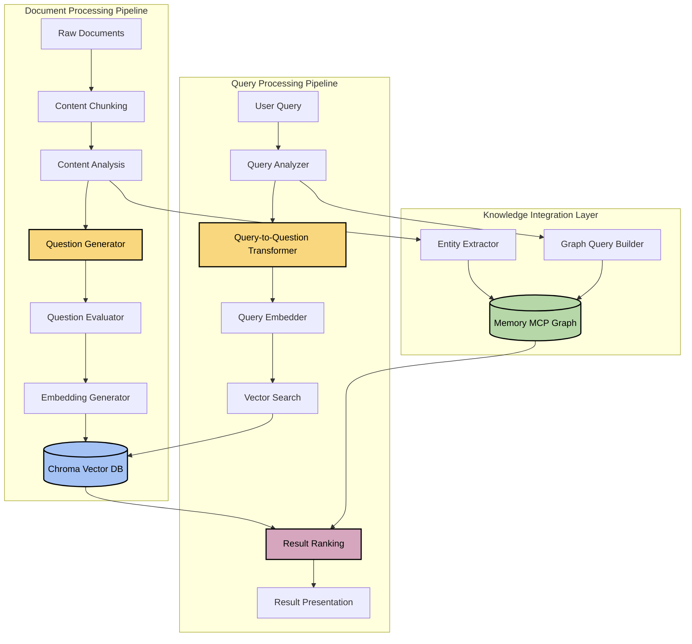

# 🔍 Question-Based Embedding Architecture

## 📑 Table of Contents
- [Overview](#overview)
- [System Architecture](#system-architecture)
- [Component Design](#component-design)
- [Data Flow](#data-flow)
- [API Specification](#api-specification)
- [Implementation Plan](#implementation-plan)
- [Performance Considerations](#performance-considerations)
- [Testing Strategy](#testing-strategy)

## Overview

The Question-Based Embedding (QBE) component transforms traditional RAG implementation by using questions as the fundamental unit of embeddings rather than raw content. This approach aligns user intent with document content by representing both in a consistent question format, leading to more relevant search results.

### Key Benefits

- Better intent matching between queries and content
- Standardized representation of diverse information
- Natural mapping to user search behavior
- Enhanced capture of hierarchical relationships
- Reduced semantic ambiguity in search results

## System Architecture



## Component Design

### 1. Document Processing Pipeline

#### Content Chunker
- **Purpose**: Split documents into optimally sized chunks for processing
- **Input**: Raw documents (markdown, text, HTML)
- **Output**: Document chunks of configurable size (default: 1000 tokens)
- **Implementation**:
  - Uses recursive chunking strategy with overlap
  - Preserves semantic boundaries (paragraphs, sections)
  - Maintains document metadata and structure

#### Content Analyzer
- **Purpose**: Extract key concepts, topics, and relationships from content
- **Input**: Document chunks
- **Output**: Content analysis metadata
- **Implementation**:
  - Performs topic extraction using LLM
  - Identifies key entities, actions, and concepts
  - Analyzes content structure and information hierarchy

#### Question Generator
- **Purpose**: Create representative questions from content
- **Input**: Content chunks and analysis metadata
- **Output**: Set of generated questions for each chunk
- **Implementation**:
  - Generates 3-5 questions per chunk covering different aspects:
    - Factual questions ("What is X?")
    - Relationship questions ("How does X relate to Y?")
    - Purpose questions ("Why would someone use X?")
    - Process questions ("How does X work?")
  - Uses prompt engineering to guide question generation
  - Applies content-specific templates based on document type

#### Question Evaluator
- **Purpose**: Filter and prioritize generated questions
- **Input**: Raw generated questions
- **Output**: Filtered, deduplicated questions with quality scores
- **Implementation**:
  - Deduplicates semantically similar questions
  - Ranks questions by estimated relevance and coverage
  - Filters out low-quality or non-specific questions
  - Ensures comprehensive coverage of content topics

#### Embedding Generator
- **Purpose**: Create vector embeddings from questions
- **Input**: Evaluated questions
- **Output**: Vector embeddings for each question
- **Implementation**:
  - Uses OpenAI embedding model (text-embedding-3-small)
  - Processes questions in batch for efficiency
  - Attaches metadata including:
    - Original content reference
    - Question type
    - Question quality score
    - Source document metadata

### 2. Query Processing Pipeline

#### Query Analyzer
- **Purpose**: Understand user query intent and structure
- **Input**: Raw user query
- **Output**: Query analysis with intent classification
- **Implementation**:
  - Classifies query type (factual, relationship, how-to, etc.)
  - Identifies key entities and concepts
  - Determines if query is already in question form

#### Query-to-Question Transformer
- **Purpose**: Convert non-question queries to question format
- **Input**: User query and analysis
- **Output**: Question-format queries (1-3 variations)
- **Implementation**:
  - Transforms keyword searches into appropriate questions
  - Expands ambiguous queries into multiple specific questions
  - Preserves original query intent and scope
  - Handles different query types with specialized transformations

#### Query Embedder
- **Purpose**: Create embeddings of transformed questions
- **Input**: Question-format queries
- **Output**: Vector embeddings for search
- **Implementation**:
  - Uses same embedding model as document processing
  - Ensures consistent vector space representation
  - Handles batch processing for multiple question variations

#### Vector Search
- **Purpose**: Perform similarity search in vector database
- **Input**: Query embeddings
- **Output**: Ranked search results
- **Implementation**:
  - Configurable similarity threshold and max results
  - Supports hybrid filtering with metadata
  - Retrieves both question and corresponding content

#### Result Ranker
- **Purpose**: Combine and prioritize results from multiple sources
- **Input**: Vector search results and knowledge graph results
- **Output**: Final ranked result set
- **Implementation**:
  - Reranks based on combined relevance scoring
  - Removes duplicates and near-duplicates
  - Applies context-aware relevance boosting
  - Integrates results from knowledge graph for comprehensive answers

#### Result Presenter
- **Purpose**: Format results for user consumption
- **Input**: Ranked result set
- **Output**: Formatted results with appropriate context
- **Implementation**:
  - Highlights matching content sections
  - Provides question context for retrieved information
  - Includes source references and confidence scores
  - Formats results based on client requirements

### 3. Knowledge Integration Layer

#### Entity Extractor
- **Purpose**: Extract entities and relationships for knowledge graph
- **Input**: Content analysis data
- **Output**: Graph entities and relationships
- **Implementation**:
  - Identifies key entities in content
  - Extracts relationships between entities
  - Maps to knowledge graph schema

#### Graph Query Builder
- **Purpose**: Create knowledge graph queries from user input
- **Input**: Query analysis
- **Output**: Structured graph queries
- **Implementation**:
  - Converts user intent to graph traversal patterns
  - Handles entity resolution and disambiguation
  - Supports relationship-focused queries

## Data Flow

### Document Indexing Flow

1. Content is chunked into processable segments
2. Each chunk is analyzed for key concepts and entities
3. Multiple questions are generated for each chunk (3-5 per chunk)
4. Generated questions are evaluated and filtered
5. High-quality questions are embedded into vectors
6. Vectors are stored in Chroma DB with metadata
7. Key entities and relationships are stored in Memory MCP graph

### Query Processing Flow

1. User submits query to the system
2. Query analyzer classifies and extracts key information
3. Non-question queries are transformed into question format
4. Multiple question variations may be generated for ambiguous queries
5. Questions are embedded using the same model as document processing
6. Vector search retrieves similar question embeddings
7. Knowledge graph is queried for related information
8. Results from both sources are combined and ranked
9. Final results are formatted and presented to the user

## API Specification

### Question Generator API

```python
def generate_questions(
    content: str,
    content_type: str,
    analysis_metadata: dict,
    question_count: int = 5
) -> List[QuestionItem]:
    """
    Generate representative questions from content.
    
    Args:
        content: The text content to generate questions from
        content_type: Type of content (documentation, code, issue, etc.)
        analysis_metadata: Topic and entity analysis of the content
        question_count: Target number of questions to generate
        
    Returns:
        List of QuestionItem objects containing:
        - question_text: The generated question
        - question_type: Categorization of question type
        - confidence: Estimated quality score (0-1)
        - source_mapping: Reference to source content
    """
```

### Query Transformer API

```python
def transform_query(
    query: str,
    query_analysis: dict,
    max_variations: int = 3
) -> List[str]:
    """
    Transform a user query into question format.
    
    Args:
        query: Original user query text
        query_analysis: Analysis of query intent and structure
        max_variations: Maximum number of question variations to generate
        
    Returns:
        List of transformed questions in priority order
    """
```

### Vector Search API

```python
def search_question_embeddings(
    query_embedding: List[float],
    filters: dict = None,
    limit: int = 10,
    threshold: float = 0.7
) -> List[SearchResult]:
    """
    Search for similar question embeddings.
    
    Args:
        query_embedding: Vector embedding of query question
        filters: Optional metadata filters to apply
        limit: Maximum number of results to return
        threshold: Minimum similarity score threshold
        
    Returns:
        List of SearchResult objects containing:
        - question: The matched question
        - content: The associated document content
        - similarity: Cosine similarity score
        - metadata: Associated metadata
    """
```

## Implementation Plan

### Phase 1: Core Components

1. Develop question generation module
   - Implement prompt engineering for question generation
   - Create evaluation metrics for question quality
   - Build filtering and deduplication logic

2. Implement query transformation
   - Design intent classification system
   - Create query-to-question transformation templates
   - Build variation generator for ambiguous queries

3. Set up vector database integration
   - Configure Chroma DB for question embeddings
   - Establish embedding generation pipeline
   - Implement efficient batch processing

### Phase 2: Integration

1. Connect with existing document processing pipeline
   - Integrate content chunking and analysis
   - Add question generation to indexing workflow
   - Implement metadata preservation

2. Integrate with Memory MCP graph
   - Develop entity extraction module
   - Implement relationship mapping
   - Create graph query builder

3. Build result combination system
   - Implement multi-source ranking algorithm
   - Develop deduplication and consolidation logic
   - Create context-aware result formatting

### Phase 3: Optimization and Scaling

1. Performance optimization
   - Implement caching for common queries
   - Optimize batch processing for embeddings
   - Fine-tune similarity thresholds

2. Quality improvements
   - Develop feedback loop for question quality
   - Implement continuous learning for transformations
   - Add contextual boosting for relevance

3. Scaling enhancements
   - Add distributed processing support
   - Implement efficient model serving
   - Optimize for large document collections

## Performance Considerations

### Latency Optimization

- **Embedding Caching**: Cache question embeddings to avoid regeneration
- **Batch Processing**: Process questions and queries in batches
- **Async Processing**: Use asynchronous processing for non-blocking operations
- **Model Optimization**: Use optimized embedding models for lower latency
- **Indexing Optimization**: Implement efficient indexing strategies in Chroma

### Quality vs. Resource Tradeoffs

- Configure question generation depth based on content importance
- Adjust question count per chunk based on content density
- Use tiered embedding models (high quality for critical content)
- Implement progressive loading for large result sets

### Estimated Resource Requirements

- **Storage**: ~1.5x increase compared to direct content embedding
- **Processing**: 2-3x more compute during indexing phase
- **Memory**: 1.5-2x more RAM for question caching and processing
- **API Calls**: Increased LLM API usage for question generation and transformation

## Testing Strategy

### Functional Testing

- Unit tests for each component
- Integration tests for pipeline workflows
- End-to-end tests for complete query-to-result flow
- Regression testing for embedding quality

### Quality Evaluation

- Relevance assessment using standard IR metrics
- A/B testing against baseline direct embedding approach
- Manual evaluation of question generation quality
- User feedback collection on result relevance

### Performance Testing

- Latency measurements for different query types
- Throughput testing for batch processing
- Resource utilization monitoring
- Scalability testing with increasing document volumes

---

🧭 **Navigation**:
- [Home](/README.md)
- [Architecture Documentation](/docs/architecture/README.md)
- [Components](/docs/architecture/components/README.md)
- [Question-Based Embedding Discussion](/docs/logs/2025-05-19/question-based-embedding-discussion.md)
- [RAG Implementation Analysis](/docs/logs/2025-05-19/rag-implementation-analysis.md)

Last updated: May 20, 2025