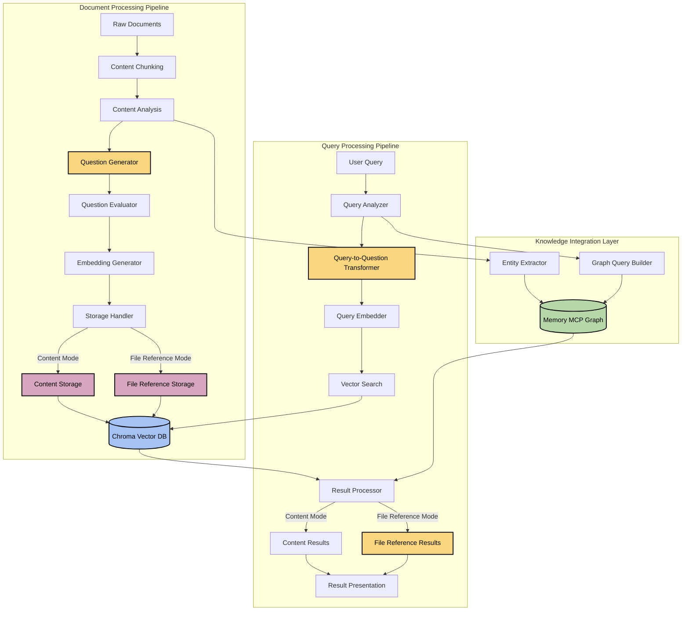

# 🔍 Question-Based Embedding Architecture

## 📑 Table of Contents
- [Overview](#overview)
- [System Architecture](#system-architecture)
- [Component Design](#component-design)
- [Storage Modes](#storage-modes)
- [Data Flow](#data-flow)
- [API Specification](#api-specification)
- [Implementation Plan](#implementation-plan)
- [Performance Considerations](#performance-considerations)
- [Testing Strategy](#testing-strategy)

## Overview

The Question-Based Embedding (QBE) component transforms traditional RAG implementation by using questions as the fundamental unit of embeddings rather than raw content. This approach aligns user intent with document content by representing both in a consistent question format, leading to more relevant search results.

### Key Benefits

- Better intent matching between queries and content
- Standardized representation of diverse information
- Natural mapping to user search behavior
- Enhanced capture of hierarchical relationships
- Reduced semantic ambiguity in search results

## System Architecture

The architecture consists of two main processing pipelines with support for two storage modes:



## Component Design

### 1. Document Processing Pipeline

#### Content Chunker
- **Purpose**: Split documents into optimally sized chunks for processing
- **Input**: Raw documents (markdown, text, HTML) or file paths
- **Output**: Document chunks of configurable size (default: 1000 tokens) with metadata
- **Implementation**:
  - Uses recursive chunking strategy with overlap
  - Preserves semantic boundaries (paragraphs, sections)
  - Maintains document metadata and structure
  - Supports both direct content and file path inputs

#### Content Analyzer
- **Purpose**: Extract key concepts, topics, and relationships from content
- **Input**: Document chunks
- **Output**: Content analysis metadata
- **Implementation**:
  - Performs topic extraction using LLM
  - Identifies key entities, actions, and concepts
  - Analyzes content structure and information hierarchy

#### Question Generator
- **Purpose**: Create representative questions from content
- **Input**: Content chunks and analysis metadata
- **Output**: Set of generated questions for each chunk
- **Implementation**:
  - Generates 3-5 questions per chunk covering different aspects:
    - Factual questions ("What is X?")
    - Relationship questions ("How does X relate to Y?")
    - Purpose questions ("Why would someone use X?")
    - Process questions ("How does X work?")
  - Uses prompt engineering to guide question generation
  - Applies content-specific templates based on document type

#### Question Evaluator
- **Purpose**: Filter and prioritize generated questions
- **Input**: Raw generated questions
- **Output**: Filtered, deduplicated questions with quality scores
- **Implementation**:
  - Deduplicates semantically similar questions
  - Ranks questions by estimated relevance and coverage
  - Filters out low-quality or non-specific questions
  - Ensures comprehensive coverage of content topics

#### Embedding Generator
- **Purpose**: Create vector embeddings from questions
- **Input**: Evaluated questions
- **Output**: Vector embeddings for each question
- **Implementation**:
  - Uses Sentence Transformers models (e.g., all-MiniLM-L6-v2)
  - Processes questions in batch for efficiency
  - Attaches metadata including:
    - Original content reference or file path
    - Question type
    - Question quality score
    - Source document metadata

#### Storage Handler
- **Purpose**: Store embeddings and metadata in appropriate format
- **Input**: Question embeddings with metadata
- **Output**: Stored data in vector database
- **Implementation**:
  - Supports two storage modes:
    - Content Storage: Stores full content with embeddings
    - File Reference Storage: Stores file references with embeddings
  - Prepares metadata appropriate for each mode
  - Optimizes storage format for efficient retrieval

### 2. Query Processing Pipeline

#### Query Analyzer
- **Purpose**: Understand user query intent and structure
- **Input**: Raw user query
- **Output**: Query analysis with intent classification
- **Implementation**:
  - Classifies query type (factual, relationship, how-to, etc.)
  - Identifies key entities and concepts
  - Determines if query is already in question form

#### Query-to-Question Transformer
- **Purpose**: Convert non-question queries to question format
- **Input**: User query and analysis
- **Output**: Question-format queries (1-3 variations)
- **Implementation**:
  - Transforms keyword searches into appropriate questions
  - Expands ambiguous queries into multiple specific questions
  - Preserves original query intent and scope
  - Handles different query types with specialized transformations

#### Query Embedder
- **Purpose**: Create embeddings of transformed questions
- **Input**: Question-format queries
- **Output**: Vector embeddings for search
- **Implementation**:
  - Uses same embedding model as document processing
  - Ensures consistent vector space representation
  - Handles batch processing for multiple question variations

#### Vector Search
- **Purpose**: Perform similarity search in vector database
- **Input**: Query embeddings
- **Output**: Ranked search results
- **Implementation**:
  - Configurable similarity threshold and max results
  - Supports hybrid filtering with metadata
  - Retrieves both question and corresponding content or file references

#### Result Processor
- **Purpose**: Process and enhance search results based on storage mode
- **Input**: Raw vector search results
- **Output**: Processed results with appropriate context
- **Implementation**:
  - For Content Mode: Formats content chunks with metadata
  - For File Reference Mode: Resolves file references
  - Optionally retrieves file content when required
  - Combines results from knowledge graph if available

#### Result Presenter
- **Purpose**: Format results for user consumption
- **Input**: Processed result set
- **Output**: Formatted results with appropriate context
- **Implementation**:
  - For Content Mode: Highlights matching content sections
  - For File Reference Mode: Organizes by file path with metadata
  - Includes source references and confidence scores
  - Formats results based on client requirements

### 3. File Reference Components

#### FileReference
- **Purpose**: Represent and manage file references
- **Input**: File path and optional chunk information
- **Output**: Structured file reference with metadata
- **Implementation**:
  - Stores absolute file paths for reliability
  - Maintains chunk position information (index, offset, length)
  - Captures file metadata (size, type, modification date)
  - Provides content retrieval methods when needed

#### FileProcessor
- **Purpose**: Process files and directories for indexing
- **Input**: File paths or directory paths
- **Output**: File chunks with references
- **Implementation**:
  - Reads and processes individual files
  - Supports directory traversal with pattern matching
  - Creates appropriate chunk boundaries
  - Generates unique identifiers for files and chunks

## Storage Modes

The architecture supports two distinct storage modes for flexibility in different use cases:

### Content Storage Mode

In this mode, document content is processed and stored directly in the vector database.

**Characteristics:**
- Full content is stored alongside embeddings
- Results include actual content chunks
- No additional I/O needed during retrieval
- Higher storage requirements

**Ideal for:**
- Smaller document collections
- Content that changes infrequently
- When file paths are unstable or irrelevant
- Quick retrieval without external dependencies

### File Reference Mode

In this mode, only references to files are stored, not the actual content.

**Characteristics:**
- Only file paths and metadata are stored
- Results include file references that can be resolved
- Requires I/O for content retrieval
- Significantly lower storage requirements

**Ideal for:**
- Large document collections
- Content that changes frequently
- When file organization is stable
- When separation of content and metadata is desired

## Data Flow

### Document Indexing Flow

#### Content Storage Mode
1. Content is chunked into processable segments
2. Each chunk is analyzed for key concepts and entities
3. Multiple questions are generated for each chunk (3-5 per chunk)
4. Generated questions are evaluated and filtered
5. High-quality questions are embedded into vectors
6. Vectors and content chunks are stored in Chroma DB
7. Key entities and relationships are stored in Memory MCP graph

#### File Reference Mode
1. Files are identified from paths or directories
2. Each file is chunked into processable segments
3. Each chunk is analyzed with file reference tracking
4. Multiple questions are generated for each chunk
5. Generated questions are evaluated and filtered
6. High-quality questions are embedded into vectors
7. Vectors and file references are stored in Chroma DB
8. File metadata is preserved for later retrieval

### Query Processing Flow

1. User submits query to the system
2. Query analyzer classifies and extracts key information
3. Non-question queries are transformed into question format
4. Multiple question variations may be generated for ambiguous queries
5. Questions are embedded using the same model as document processing
6. Vector search retrieves similar question embeddings
7. Results are processed based on storage mode:
   - Content Mode: Content chunks are returned directly
   - File Reference Mode: File references are resolved, optionally retrieving content
8. Results are formatted and presented to the user

## API Specification

### Question Generator API

```python
def generate_questions(
    content: str,
    content_type: str,
    analysis_metadata: dict,
    question_count: int = 5
) -> List[QuestionItem]:
    """
    Generate representative questions from content.
    
    Args:
        content: The text content to generate questions from
        content_type: Type of content (documentation, code, issue, etc.)
        analysis_metadata: Topic and entity analysis of the content
        question_count: Target number of questions to generate
        
    Returns:
        List of QuestionItem objects containing:
        - question_text: The generated question
        - question_type: Categorization of question type
        - confidence: Estimated quality score (0-1)
        - source_mapping: Reference to source content
    """
```

### Query Transformer API

```python
def transform_query(
    query: str,
    query_analysis: dict,
    max_variations: int = 3
) -> List[str]:
    """
    Transform a user query into question format.
    
    Args:
        query: Original user query text
        query_analysis: Analysis of query intent and structure
        max_variations: Maximum number of question variations to generate
        
    Returns:
        List of transformed questions in priority order
    """
```

### File Reference API

```python
class FileReference:
    """Represents a reference to a file with metadata."""
    
    def __init__(
        self,
        file_path: str,
        chunk_index: Optional[int] = None,
        chunk_offset: Optional[int] = None,
        chunk_length: Optional[int] = None,
        metadata: Optional[Dict[str, Any]] = None
    ):
        """Initialize a file reference."""
        
    def get_content(self) -> str:
        """Get the content from the referenced file."""
        
    def to_dict(self) -> Dict[str, Any]:
        """Convert to dictionary representation."""
        
    @classmethod
    def from_dict(cls, data: Dict[str, Any]) -> 'FileReference':
        """Create a FileReference from a dictionary."""
```

### ChromaFileReferenceClient API

```python
def process_file(
    collection_name: str,
    file_path: str,
    content_type: str = "documentation",
    questions_per_chunk: int = 3,
    additional_metadata: Optional[Dict[str, Any]] = None
) -> List[QuestionItem]:
    """
    Process a file and store question embeddings with file references in Chroma.
    
    Args:
        collection_name: Name of the collection to store in
        file_path: Path to the file to process
        content_type: Type of content (documentation, code, architecture, etc.)
        questions_per_chunk: Number of questions to generate per chunk
        additional_metadata: Optional additional metadata to store with references
        
    Returns:
        List of generated questions
    """

def search(
    collection_name: str,
    query: str,
    transform_query: bool = True,
    n_results: int = 5,
    include_distances: bool = True,
    return_contents: bool = False
) -> Dict[str, Any]:
    """
    Search for relevant files using question-based embedding.
    
    Args:
        collection_name: Name of the collection to search
        query: Search query text
        transform_query: Whether to transform the query to question format
        n_results: Number of results to return
        include_distances: Whether to include similarity distances in results
        return_contents: Whether to read and return file contents
        
    Returns:
        Search results dictionary with file references and optionally contents
    """
```

## Implementation Plan

### Phase 1: Core Components (Completed)

1. Develop question generation module
   - Implement prompt engineering for question generation
   - Create evaluation metrics for question quality
   - Build filtering and deduplication logic

2. Implement query transformation
   - Design intent classification system
   - Create query-to-question transformation templates
   - Build variation generator for ambiguous queries

3. Set up vector database integration
   - Configure Chroma DB for question embeddings
   - Establish embedding generation pipeline
   - Implement efficient batch processing

### Phase 2: Content Storage Mode (Completed)

1. Connect with existing document processing pipeline
   - Integrate content chunking and analysis
   - Add question generation to indexing workflow
   - Implement metadata preservation

2. Build content storing system
   - Implement content chunk storage with embeddings
   - Create efficient retrieval methods
   - Add context-aware content presentation

### Phase 3: File Reference Mode (Completed)

1. Develop file reference components
   - Create FileReference class for file path management
   - Implement FileProcessor for file and directory handling
   - Add chunk tracking within files

2. Build file reference storage
   - Implement file reference storage with embeddings
   - Create file reference resolution methods
   - Support optional content retrieval

3. Enhance result processing
   - Implement mode-specific result processors
   - Add metadata handling for file references
   - Create flexible content retrieval options

### Phase 4: Knowledge Graph Integration (Planned)

1. Integrate with Memory MCP graph
   - Develop entity extraction module
   - Implement relationship mapping
   - Create graph query builder

2. Build result combination system
   - Implement multi-source ranking algorithm
   - Develop deduplication and consolidation logic
   - Create context-aware result formatting

### Phase 5: Optimization and Scaling (Planned)

1. Performance optimization
   - Implement caching for common queries
   - Optimize batch processing for embeddings
   - Fine-tune similarity thresholds

2. Quality improvements
   - Develop feedback loop for question quality
   - Implement continuous learning for transformations
   - Add contextual boosting for relevance

3. Scaling enhancements
   - Add distributed processing support
   - Implement efficient model serving
   - Optimize for large document collections

## Performance Considerations

### Latency Optimization

- **Embedding Caching**: Cache question embeddings to avoid regeneration
- **Batch Processing**: Process questions and queries in batches
- **Async Processing**: Use asynchronous processing for non-blocking operations
- **Model Optimization**: Use optimized embedding models for lower latency
- **Indexing Optimization**: Implement efficient indexing strategies in Chroma

### Storage Mode Tradeoffs

- **Content Storage Mode**: Higher storage requirements but faster retrieval
- **File Reference Mode**: Lower storage requirements but requires I/O for content retrieval
- **Hybrid Approaches**: Store partial content with references for balance
- **Caching Strategies**: Cache frequently accessed file contents in file reference mode

### Estimated Resource Requirements

- **Content Storage Mode**:
  - Storage: ~2.5x increase compared to raw content
  - Processing: 2-3x more compute during indexing phase
  - Memory: Higher RAM usage for storing content in database
  - API Calls: Increased LLM API usage for question generation

- **File Reference Mode**:
  - Storage: ~0.3x compared to content storage mode
  - Processing: Similar indexing overhead, but I/O during retrieval
  - Memory: Lower RAM usage in database, higher during retrieval
  - API Calls: Same LLM usage for indexing, potentially more for retrieval

## Testing Strategy

### Functional Testing

- Unit tests for each component
- Integration tests for pipeline workflows
- End-to-end tests for complete query-to-result flow
- Regression testing for embedding quality

### Quality Evaluation

- Relevance assessment using standard IR metrics
- A/B testing against baseline direct embedding approach
- Manual evaluation of question generation quality
- User feedback collection on result relevance

### Mode-Specific Testing

- **Content Storage Mode**:
  - Tests for content storage accuracy
  - Content retrieval performance tests
  - Content update propagation tests

- **File Reference Mode**:
  - File reference accuracy tests
  - File path resolution tests
  - Content retrieval error handling
  - Directory traversal and pattern matching tests

### Performance Testing

- Latency measurements for different query types
- Throughput testing for batch processing
- Resource utilization monitoring
- Scalability testing with increasing document volumes
- Comparative performance between storage modes

---

🧭 **Navigation**:
- [Home](/README.md)
- [Architecture Documentation](/docs/architecture/README.md)
- [Components](/docs/architecture/components/README.md)
- [Question-Based Embedding Discussion](/docs/logs/2025-05-19/question-based-embedding-discussion.md)
- [File Reference Requirements](/docs/logs/2025-05-20/qbe-file-reference-requirements.md)

Last updated: May 20, 2025