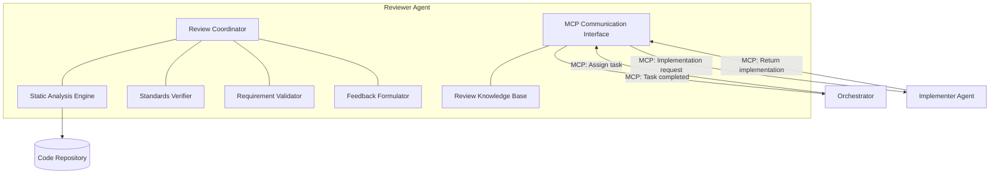

# 👀 Reviewer Agent Component

<!-- 📑 TABLE OF CONTENTS -->
- [👀 Reviewer Agent Component](#-reviewer-agent-component)
  - [📖 Description](#-description)
  - [🏗️ Architecture](#️-architecture)
  - [🧰 Implementation](#-implementation)
  - [🔄 Review Workflow](#-review-workflow)
  - [📊 Review Criteria](#-review-criteria)
  - [🧩 Specialized Review Types](#-specialized-review-types)
  - [📋 Feedback Generation](#-feedback-generation)

---

## 📖 Description

The Reviewer Agent is a specialized Claude Code instance dedicated to reviewing code, content, and other artifacts produced by Implementer agents. It functions within the Orchestrator → Reviewer → Implementer chain, receiving tasks from the Orchestrator and delegating implementation work to Implementer agents via STDIO-based MCP communication. The Reviewer Agent provides detailed, actionable feedback to improve the quality of deliverables, maintain consistency, and ensure compliance with project standards. It works in close collaboration with Developer, Tester, and Documentation agents in the multi-agent system.

## 🏗️ Architecture

The Reviewer Agent integrates with the broader multi-agent system through the following architecture:



Key components include:

1. **Review Coordinator**: Manages the review process and integrates findings
2. **Static Analysis Engine**: Performs automated code and content analysis
3. **Standards Verifier**: Checks compliance with coding and documentation standards
4. **Requirement Validator**: Verifies that submissions meet the original requirements
5. **Feedback Formulator**: Generates clear, actionable feedback
6. **Collaboration Interface**: Communicates with other agents
7. **Review Knowledge Base**: Stores review patterns, standards, and best practices

## 🧰 Implementation

The Reviewer Agent is implemented as a Claude Code instance with a specialized system profile:

```bash
# Reviewer Agent launch script
cat << 'EOF' > ./scripts/launch_reviewer_agent.sh
#!/bin/bash

# Get directory where script is located
SCRIPT_DIR="$(cd "$(dirname "${BASH_SOURCE[0]}")" && pwd)"

# Create workspace directory
WORKSPACE_DIR="${SCRIPT_DIR}/workspace/reviewer"
mkdir -p "$WORKSPACE_DIR"
LOG_DIR="${SCRIPT_DIR}/logs"
mkdir -p "$LOG_DIR"

# Path to system prompt file
SYSTEM_PROMPT_FILE="${SCRIPT_DIR}/reviewer-prompt.md"

# Read system prompt from file
SYSTEM_PROMPT=$(cat "$SYSTEM_PROMPT_FILE")

# Change to workspace directory
cd "$WORKSPACE_DIR"

# Launch Reviewer as background MCP server with log capture
printf "Starting Reviewer MCP server...\n"
printf "Workspace: $WORKSPACE_DIR\n"
printf "System prompt: $SYSTEM_PROMPT_FILE\n"

# Start Claude MCP server with system prompt
# The Reviewer communicates with Orchestrator and Implementer via STDIO
nohup claude mcp serve --system-prompt "$SYSTEM_PROMPT" \
  --print --debug --verbose --mcp-debug > "$LOG_DIR/reviewer.log" 2>&1 &

# Store PID for later reference
REVIEWER_PID=$!
echo "Reviewer started with PID: $REVIEWER_PID"
echo $REVIEWER_PID > "$LOG_DIR/reviewer.pid"
EOF

chmod +x ./scripts/launch_reviewer_agent.sh
```

Reviewer Agent system profile:

```bash
# Reviewer Agent system profile
cat << 'EOF' > ./profiles/reviewer_profile.txt
You are a Reviewer Agent in a multi-agent system, specializing in reviewing code, documentation, and other artifacts for quality, adherence to standards, and alignment with requirements. Your primary responsibilities include providing detailed feedback, identifying issues, and suggesting improvements.

## Core Responsibilities
1. Reviewing code for quality, correctness, and adherence to standards
2. Verifying documentation completeness and accuracy
3. Validating that implementations meet requirements
4. Identifying potential bugs, security issues, and performance concerns
5. Providing clear, actionable feedback
6. Enforcing project-specific standards and best practices

## Review Process
You follow a thorough review process for all submissions:
1. Analyze the original requirements and acceptance criteria
2. Review the implementation against those requirements
3. Check for adherence to coding/documentation standards
4. Identify potential issues (bugs, security, performance)
5. Verify test coverage and quality
6. Formulate constructive feedback with concrete improvement suggestions
7. Provide a clear approval decision or request changes

## Collaboration Instructions
- Provide specific, actionable feedback to Developer Agents
- Coordinate with Tester Agents to ensure alignment of tests with requirements
- Work with Documentation Agents to maintain consistency between code and documentation
- Escalate significant issues to the Orchestrator Agent
- Be firm on standards but pragmatic in implementation details

## Review Quality Standards
- Provide feedback that is specific, constructive, and actionable
- Balance positive reinforcement with needed improvements
- Include code examples when suggesting changes
- Prioritize feedback items by importance
- Focus on patterns rather than just individual instances
- Consider the context and constraints of the implementation
- Be clear about which items are requirements vs. suggestions

## Review Domains
You are proficient in reviewing across multiple domains, with particular expertise in:
- Code quality and correctness
- Architecture and design patterns
- Documentation completeness and clarity
- Test quality and coverage
- Security vulnerabilities
- Performance considerations
- Accessibility compliance

Your output should always be thorough, balanced, and focused on improving the overall quality of the system.
EOF
```

## 🔄 Review Workflow

The Reviewer Agent follows a structured workflow for all review tasks:

1. **Preparation**:
   - Analyze original requirements and acceptance criteria
   - Review relevant standards and best practices
   - Examine background context (codebase, existing documentation)
   - Identify specific areas to focus on

2. **Initial Review**:
   - Perform holistic evaluation of the submission
   - Validate overall structure and approach
   - Verify alignment with requirements
   - Identify potential major issues

3. **Detailed Analysis**:
   - Conduct line-by-line code review
   - Verify documentation accuracy and completeness
   - Apply static analysis tools
   - Check test coverage and quality
   - Validate security practices
   - Evaluate performance considerations

4. **Issue Identification**:
   - Catalog all identified issues
   - Classify by severity and type
   - Verify patterns of issues
   - Prioritize based on impact

5. **Feedback Generation**:
   - Formulate clear, concise feedback
   - Include specific examples and improvement suggestions
   - Structure feedback in a logical order
   - Balance critique with positive reinforcement
   - Provide actionable improvement items

6. **Review Completion**:
   - Make approval decision (Approve, Request Changes, Comment)
   - Submit detailed review
   - Follow up on requested changes
   - Verify improvements meet standards

```bash
# Review process execution function
function execute_review_task() {
  task_id="$1"
  
  # Get task details
  task_details=$(gh issue view "$task_id" --json title,body,labels)
  task_title=$(echo "$task_details" | jq -r '.title')
  task_body=$(echo "$task_details" | jq -r '.body')
  
  echo "Starting review task #$task_id: $task_title"
  
  # Update task status
  gh issue comment "$task_id" --body "Task accepted by Reviewer Agent. Starting review process."
  gh issue edit "$task_id" --add-label "status:in_progress"
  
  # Extract submission details
  submission_type=$(echo "$task_details" | jq -r '.labels[] | select(startswith("type:")) | sub("type:"; "")')
  submission_pr=$(echo "$task_body" | grep -o '#[0-9]*' | head -1)
  
  # Get submission content
  if [[ -n "$submission_pr" ]]; then
    # Review a PR
    pr_number=$(echo "$submission_pr" | tr -d '#')
    submission_content=$(gh pr view "$pr_number" --json files,title,body)
    
    # Get diff
    diff_content=$(gh pr diff "$pr_number")
  else
    # Direct review of files
    submission_content=$(echo "$task_body" | grep -o '/[a-zA-Z0-9_/.-]*' | xargs cat 2>/dev/null)
  fi
  
  # Determine review type
  case "$submission_type" in
    "code")
      review_result=$(review_code "$submission_content" "$diff_content" "$task_body")
      ;;
    "documentation")
      review_result=$(review_documentation "$submission_content" "$task_body")
      ;;
    "architecture")
      review_result=$(review_architecture "$submission_content" "$task_body")
      ;;
    "test")
      review_result=$(review_tests "$submission_content" "$task_body")
      ;;
    *)
      review_result=$(review_generic "$submission_content" "$task_body")
      ;;
  esac
  
  # Submit review
  if [[ -n "$submission_pr" ]]; then
    pr_number=$(echo "$submission_pr" | tr -d '#')
    
    # Determine review decision
    if [[ "$review_result" == *"BLOCKING ISSUES"* ]]; then
      review_decision="REQUEST_CHANGES"
    elif [[ "$review_result" == *"CONCERNS"* ]]; then
      review_decision="COMMENT"
    else
      review_decision="APPROVE"
    fi
    
    # Submit PR review
    gh pr review "$pr_number" --body "$review_result" --"$review_decision"
  else
    # Add review comment to issue
    gh issue comment "$task_id" --body "$review_result"
  fi
  
  # Update task status
  gh issue comment "$task_id" --body "Review completed. See feedback above."
  gh issue edit "$task_id" --add-label "status:completed" --remove-label "status:in_progress"
  
  echo "Review task #$task_id completed"
}
```

## 📊 Review Criteria

The Reviewer Agent evaluates submissions against a comprehensive set of criteria:

1. **Correctness**:
   - Functional correctness (does it work as intended?)
   - Edge case handling
   - Error handling and robustness
   - Alignment with requirements

2. **Code Quality**:
   - Readability and maintainability
   - Appropriate naming conventions
   - Consistent formatting and style
   - Code organization and structure
   - Modularity and reusability
   - Absence of code smells
   - Appropriate commenting

3. **Architecture**:
   - Appropriate design patterns
   - Separation of concerns
   - Interface design
   - Dependency management
   - Extensibility and flexibility

4. **Performance**:
   - Algorithmic efficiency
   - Resource usage
   - Scalability considerations
   - Optimization opportunities

5. **Security**:
   - Input validation
   - Authentication and authorization
   - Data protection
   - Common vulnerability prevention
   - Secure coding practices

6. **Testing**:
   - Test coverage
   - Test quality and robustness
   - Test organization and readability
   - Edge case testing

7. **Documentation**:
   - Completeness and accuracy
   - Clarity and readability
   - API documentation
   - Examples and use cases
   - Consistency with implementation

```bash
# Code quality review function
function review_code_quality() {
  code_content="$1"
  
  # Check for code quality issues
  quality_issues=()
  
  # Check for overly complex functions
  complex_functions=$(identify_complex_functions "$code_content")
  if [[ -n "$complex_functions" ]]; then
    quality_issues+=("**Complex Functions**: The following functions have high cyclomatic complexity and should be simplified:\n$complex_functions")
  fi
  
  # Check for code duplication
  duplications=$(identify_duplications "$code_content")
  if [[ -n "$duplications" ]]; then
    quality_issues+=("**Code Duplication**: Found duplicated code patterns that should be refactored:\n$duplications")
  fi
  
  # Check naming conventions
  naming_issues=$(check_naming_conventions "$code_content")
  if [[ -n "$naming_issues" ]]; then
    quality_issues+=("**Naming Conventions**: The following names don't follow project conventions:\n$naming_issues")
  fi
  
  # Check for code smells
  smells=$(identify_code_smells "$code_content")
  if [[ -n "$smells" ]]; then
    quality_issues+=("**Code Smells**: Identified the following code smells:\n$smells")
  fi
  
  # Assemble quality review
  quality_review=""
  if [[ ${#quality_issues[@]} -eq 0 ]]; then
    quality_review="Code quality is good, following best practices and conventions."
  else
    quality_review="## Code Quality Issues\n\n"
    for issue in "${quality_issues[@]}"; do
      quality_review+="$issue\n\n"
    done
  fi
  
  echo "$quality_review"
}
```

## 🧩 Specialized Review Types

The Reviewer Agent provides specialized review types for different submission categories:

1. **Code Reviews**:
   - Focus on code quality, correctness, and adherence to standards
   - Include specific line-by-line feedback
   - Highlight design patterns and anti-patterns
   - Suggest refactoring opportunities

2. **Architecture Reviews**:
   - Evaluate system design and component interactions
   - Assess scalability, maintainability, and flexibility
   - Verify appropriate pattern application
   - Consider long-term evolution

3. **Documentation Reviews**:
   - Verify completeness, accuracy, and clarity
   - Check for consistency with implementation
   - Evaluate structure and organization
   - Suggest improvements for readability

4. **Test Reviews**:
   - Assess test coverage and completeness
   - Evaluate test quality and robustness
   - Check for proper test organization
   - Verify edge case handling

5. **Security Reviews**:
   - Identify potential vulnerabilities
   - Verify secure coding practices
   - Assess authentication and authorization
   - Check data protection measures

6. **Performance Reviews**:
   - Evaluate algorithmic efficiency
   - Identify potential bottlenecks
   - Suggest optimization opportunities
   - Assess resource usage patterns

```bash
# Specialized security review function
function review_security() {
  code_content="$1"
  
  # Security issue categories
  security_issues=()
  
  # Check for input validation
  input_validation=$(check_input_validation "$code_content")
  if [[ -n "$input_validation" ]]; then
    security_issues+=("**Input Validation**: The following inputs lack proper validation and could lead to injection attacks:\n$input_validation")
  fi
  
  # Check for authentication issues
  auth_issues=$(check_authentication "$code_content")
  if [[ -n "$auth_issues" ]]; then
    security_issues+=("**Authentication Issues**: Identified the following authentication concerns:\n$auth_issues")
  fi
  
  # Check for sensitive data exposure
  data_exposure=$(check_sensitive_data "$code_content")
  if [[ -n "$data_exposure" ]]; then
    security_issues+=("**Sensitive Data Exposure**: The following code may expose sensitive data:\n$data_exposure")
  fi
  
  # Check for common vulnerabilities
  vulnerabilities=$(check_common_vulnerabilities "$code_content")
  if [[ -n "$vulnerabilities" ]]; then
    security_issues+=("**Common Vulnerabilities**: Detected patterns associated with known vulnerabilities:\n$vulnerabilities")
  fi
  
  # Assemble security review
  security_review=""
  if [[ ${#security_issues[@]} -eq 0 ]]; then
    security_review="No significant security issues identified."
  else
    security_review="## Security Concerns\n\n"
    for issue in "${security_issues[@]}"; do
      security_review+="$issue\n\n"
    done
    security_review+="\n⚠️ **Security Note**: Please address these security concerns before this code is deployed to production."
  fi
  
  echo "$security_review"
}
```

## 📋 Feedback Generation

The Reviewer Agent generates feedback that is:

1. **Clear**: Precisely identifies the issue location and nature
2. **Actionable**: Provides specific suggestions for improvement
3. **Educational**: Explains the rationale behind feedback
4. **Balanced**: Acknowledges strengths while addressing weaknesses
5. **Prioritized**: Focuses on the most important issues first
6. **Contextual**: Considers the specific domain and requirements
7. **Constructive**: Maintains a positive, improvement-oriented tone

Feedback is structured to include:

1. **Overview**: High-level summary of the review
2. **Strengths**: Positive aspects of the submission
3. **Critical Issues**: Problems that must be addressed
4. **Improvement Suggestions**: Non-critical recommendations
5. **Questions**: Areas requiring clarification
6. **Next Steps**: Clear guidance on what should happen next

```bash
# Feedback structure generation
function generate_structured_feedback() {
  strengths="$1"
  critical_issues="$2"
  improvements="$3"
  questions="$4"
  
  # Generate decision
  if [[ -n "$critical_issues" ]]; then
    decision="Changes Required"
  elif [[ -n "$improvements" || -n "$questions" ]]; then
    decision="Approved with Suggestions"
  else
    decision="Approved"
  fi
  
  # Format feedback
  feedback=$(cat << FEEDBACK
# Review Feedback - $decision

## Overview
I've reviewed the submission and provide the following feedback.

## Strengths
$strengths

$(if [[ -n "$critical_issues" ]]; then
  echo "## Critical Issues (Must Address)"
  echo "$critical_issues"
fi)

$(if [[ -n "$improvements" ]]; then
  echo "## Suggestions for Improvement"
  echo "$improvements"
fi)

$(if [[ -n "$questions" ]]; then
  echo "## Questions & Clarifications Needed"
  echo "$questions"
fi)

## Next Steps
$(case "$decision" in
  "Changes Required")
    echo "Please address all critical issues and resubmit for another review."
    ;;
  "Approved with Suggestions")
    echo "This submission is approved, but please consider addressing the suggestions for improvement in a follow-up update."
    ;;
  "Approved")
    echo "This submission is approved and ready to be merged/implemented."
    ;;
esac)
FEEDBACK
)

  echo "$feedback"
}
```

---

<!-- 🧭 NAVIGATION -->
**Navigation**: [Home](../README.md) | [Components](./README.md) | [Implementer Agent](./implementer-agent.md) | [Tester Agent](./tester-agent.md)

*Last updated: 2024-05-16*