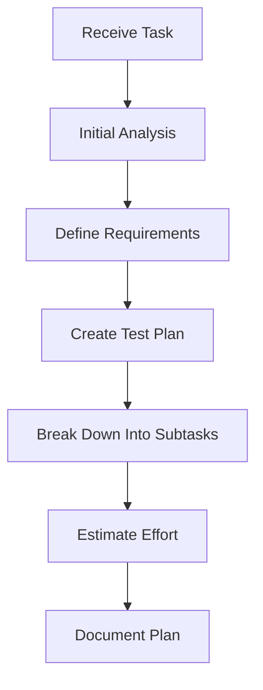
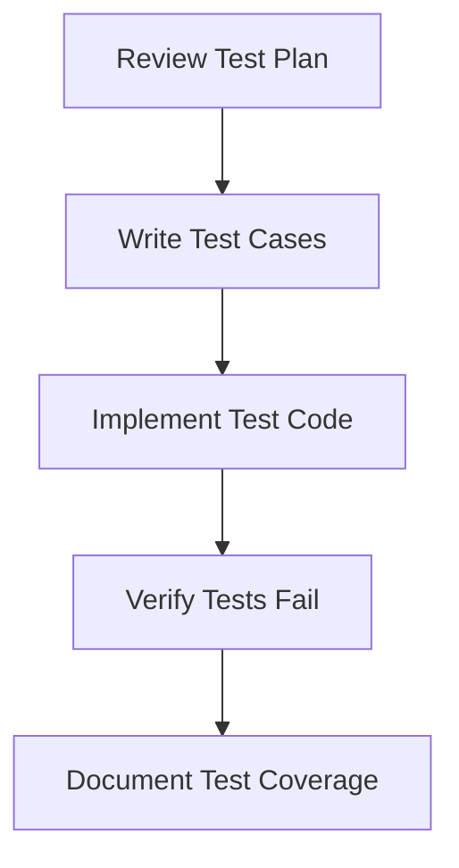
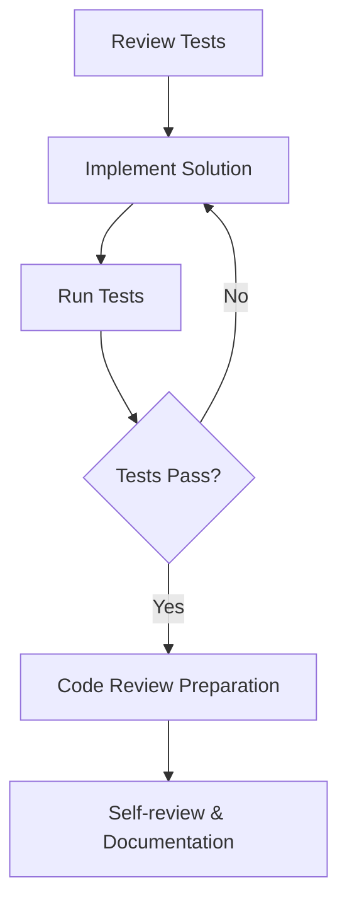
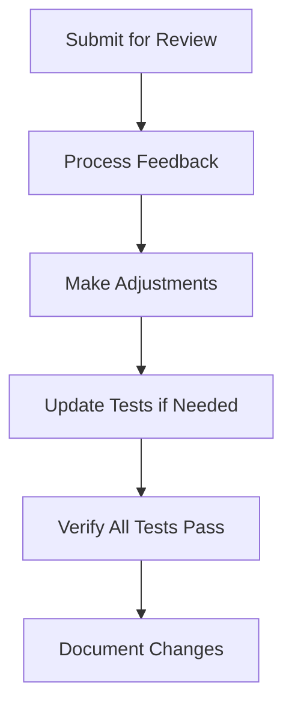
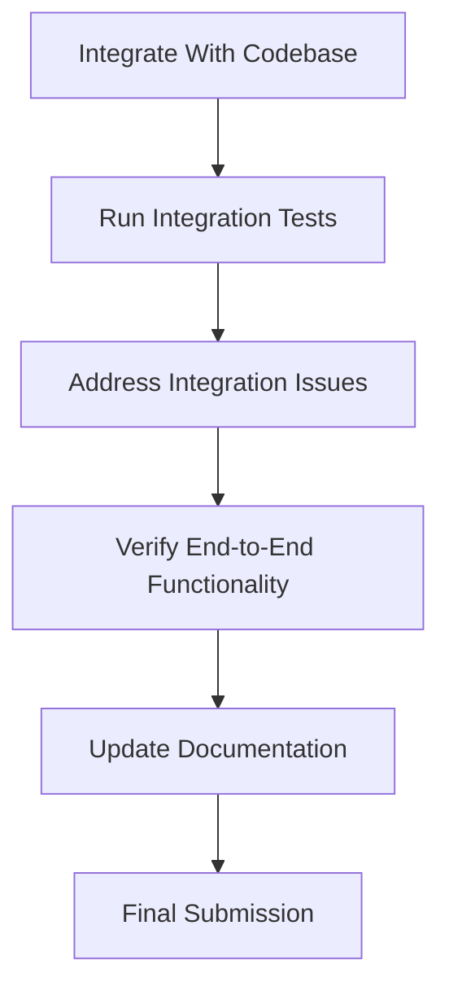

# 🔄 Agent Task Execution Process

<!-- 📑 TABLE OF CONTENTS -->
- [🔄 Agent Task Execution Process](#-agent-task-execution-process)
  - [📋 Overview](#-overview)
  - [🎯 Process Principles](#-process-principles)
  - [🔄 Task Execution Workflow](#-task-execution-workflow)
  - [⚙️ Process Customization](#️-process-customization)
  - [📊 Process Monitoring](#-process-monitoring)
  - [🧪 Quality Assurance](#-quality-assurance)
  - [📝 Process Documentation](#-process-documentation)

---

## 📋 Overview

The Agent Task Execution Process defines how agents approach and execute assigned tasks. This process is designed to be matched to each agent's specific capabilities and role, ensuring that tasks are completed efficiently and correctly while adhering to best practices like Test-Driven Development (TDD).

## 🎯 Process Principles

1. **Agent-Process Alignment**: Each agent's task execution process must align with its capabilities, knowledge domains, and role specialization.

2. **Process-Task Matching**: The process applied to a task should be appropriate for the task type, complexity, and requirements.

3. **TDD Integration**: All development processes must incorporate Test-Driven Development principles, adapted as needed for the specific task domain.

4. **Consistent Documentation**: All process steps must generate appropriate documentation for knowledge sharing and future reference.

5. **Feedback Integration**: Processes must include steps for receiving, evaluating, and incorporating feedback.

## 🔄 Task Execution Workflow

> **Note:** All agents must follow the [standardized Agent Task Workflow](./agent-task-workflow.md) for task handling, including analysis, decomposition, documentation, and yielding back to the orchestrator. The process below defines how agents execute their assigned portion of work within that workflow.

The general task execution workflow includes these phases, with agent-specific adaptations:

### 1. Task Analysis & Planning

- **Input**: Task description, requirements, constraints
- **Activities**: 
  - Understand task requirements and constraints
  - Create a clear plan with subtasks
  - Define acceptance criteria
  - Create test plan following TDD principles
- **Output**: Task execution plan, test specifications
- **Agent Customization**: Analysis depth and planning approach varies by agent type
  - *Developer Agents*: Detailed technical breakdown with architecture considerations
  - *Tester Agents*: Comprehensive test coverage planning
  - *Documentation Agents*: Content structure and reference planning

### 2. Test Creation

- **Input**: Test specifications, acceptance criteria
- **Activities**:
  - Create test cases covering all requirements
  - Implement automated tests
  - Verify tests correctly fail (TDD principle)
  - Document test approach and coverage
- **Output**: Test suite, testing documentation
- **Agent Customization**: Test creation approaches vary by agent specialization
  - *Backend Agents*: API tests, integration tests, unit tests
  - *Frontend Agents*: UI tests, component tests, accessibility tests
  - *Security Agents*: Security-focused tests, penetration testing

### 3. Implementation

- **Input**: Test suite, task requirements
- **Activities**:
  - Implement solution to make tests pass
  - Refactor for quality and maintainability
  - Document implementation decisions
  - Prepare for code review
- **Output**: Working implementation, implementation documentation
- **Agent Customization**: Implementation approaches match agent specialties
  - *Frontend Agents*: UI/UX considerations, accessibility, browser compatibility
  - *Backend Agents*: Performance, security, scalability considerations
  - *ML Agents*: Model training, validation, metrics evaluation

### 4. Review & Refinement

- **Input**: Initial implementation, reviewer feedback
- **Activities**:
  - Submit work for review by appropriate agents
  - Address feedback
  - Update tests if requirements change
  - Document changes and decisions
- **Output**: Refined implementation, updated documentation
- **Agent Customization**: Review processes vary by agent type
  - *Security Agents*: Security vulnerability assessment
  - *Performance Agents*: Performance benchmarking and optimization
  - *Accessibility Agents*: Accessibility compliance review

### 5. Integration & Verification

- **Input**: Reviewed implementation
- **Activities**:
  - Integrate solution with broader codebase
  - Ensure all tests pass in integrated environment
  - Verify end-to-end functionality
  - Finalize documentation
- **Output**: Integrated solution, comprehensive documentation
- **Agent Customization**: Integration approaches match system areas
  - *DevOps Agents*: Deployment, CI/CD pipeline integration
  - *API Agents*: API versioning, compatibility testing
  - *UI Agents*: Design system compliance, visual regression testing

## ⚙️ Process Customization

The Analyzer Agent customizes the task execution process based on:

1. **Agent Capabilities**: The process leverages the assigned agent's strengths
2. **Task Requirements**: Process steps are tailored to the specific task type
3. **Domain Specifics**: Domain-specific best practices are incorporated
4. **Complexity Factors**: Process detail and rigor scales with task complexity

Customization parameters include:

| Parameter | Description | Examples |
|-----------|-------------|----------|
| Process Detail | Level of detail in each phase | Lightweight, Standard, Comprehensive |
| Documentation Requirements | Documentation scope and detail | Minimal, Standard, Extensive |
| Review Stages | Number and type of review points | Self-review, Peer-review, Multi-stage |
| Testing Approach | Testing methodology detail | Basic TDD, BDD, Comprehensive TDD |
| Collaboration Model | How agents collaborate on the task | Solo, Paired, Team-based |

## 📊 Process Monitoring

The Orchestrator Agent monitors process execution through:

1. **Milestone Tracking**: Key process milestones are tracked and reported
2. **Quality Metrics**: Code quality, test coverage, and other metrics are measured
3. **Time Tracking**: Actual time spent in each phase is compared to estimates
4. **Blockers Identification**: Process impediments are identified and addressed
5. **Process Compliance**: Adherence to the defined process is verified

## 🧪 Quality Assurance

Quality assurance mechanisms are embedded in the process:

1. **TDD Enforcement**: Tests must be written before implementation
2. **Code Review**: All implementations undergo appropriate review
3. **Static Analysis**: Automated code quality and security analysis
4. **Documentation Standards**: Documentation must meet defined standards
5. **Performance Verification**: Performance criteria must be satisfied

## 📝 Process Documentation

Each execution of the process generates:

1. **Process Artifacts**: Test plans, tests, code, documentation
2. **Decision Records**: Key decisions made during execution
3. **Lessons Learned**: Insights for process improvement
4. **Metrics Report**: Performance and quality metrics
5. **Process Improvement Suggestions**: Feedback for process refinement

---

<!-- 🧭 NAVIGATION -->
**Navigation**: [Home](../README.md) | [Component Index](./README.md) | [Agent Task Workflow](./agent-task-workflow.md) | [Analyzer Agent](./analyzer.md) | [Orchestrator Agent](./orchestrator.md)

*Last updated: 2025-05-16*