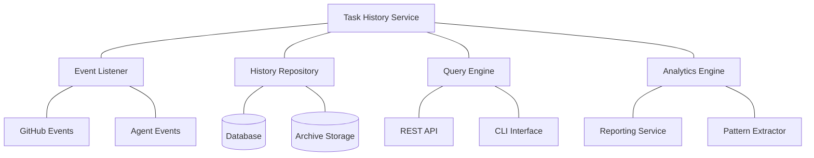

# 📜 Task History Component

<!-- 📑 TABLE OF CONTENTS -->
- [📜 Task History Component](#-task-history-component)
  - [📖 Description](#-description)
  - [🏗️ Architecture](#️-architecture)
  - [🧰 Implementation](#-implementation)
  - [🔄 Data Capturing](#-data-capturing)
  - [🔍 Query Capabilities](#-query-capabilities)
  - [📊 Analytics and Reporting](#-analytics-and-reporting)
  - [🔒 Security and Privacy](#-security-and-privacy)
  - [📦 Storage and Retention](#-storage-and-retention)

---

## 📖 Description

The Task History component maintains a comprehensive, searchable record of all tasks processed by the multi-agent system. It captures detailed information about task execution, including inputs, outputs, agent assignments, completion times, and outcomes. This historical data enables analysis of system performance, supports continuous improvement efforts, provides audit capabilities, and serves as valuable training data for enhancing agent capabilities. The Task History component is essential for understanding system behavior over time and improving future task handling.

## 🏗️ Architecture

The Task History component follows a layered architecture that efficiently captures, stores, and provides access to historical task data:



Key components include:

1. **Event Listener**: Captures task-related events from GitHub and agents
2. **History Repository**: Stores and manages task history records
3. **Query Engine**: Provides flexible access to historical data
4. **Analytics Engine**: Analyzes task data for insights and reporting
5. **REST API and CLI Interface**: Provide access to task history data
6. **Reporting Service**: Generates reports and visualizations
7. **Pattern Extractor**: Identifies recurring patterns in task execution

## 🧰 Implementation

The Task History component is implemented using a combination of GitHub API, local database, and shell scripts:

```bash
# Task History implementation
cat << 'EOF' > ./scripts/task_history.sh
#!/bin/bash

# Configuration
HISTORY_DIR="$(pwd)/history"
DB_PATH="$HISTORY_DIR/tasks.db"
ARCHIVE_DIR="$HISTORY_DIR/archive"
LOG_FILE="$HISTORY_DIR/task_history.log"

# Initialize task history
function init_task_history() {
  # Create directories
  mkdir -p "$HISTORY_DIR"
  mkdir -p "$ARCHIVE_DIR"
  
  # Initialize SQLite database if it doesn't exist
  if [[ ! -f "$DB_PATH" ]]; then
    sqlite3 "$DB_PATH" <<SQL
CREATE TABLE tasks (
  task_id INTEGER PRIMARY KEY,
  title TEXT,
  description TEXT,
  created_at TEXT,
  updated_at TEXT,
  closed_at TEXT,
  status TEXT,
  labels TEXT,
  assignee TEXT,
  completion_time INTEGER,
  metadata TEXT
);

CREATE TABLE task_events (
  event_id INTEGER PRIMARY KEY AUTOINCREMENT,
  task_id INTEGER,
  event_type TEXT,
  timestamp TEXT,
  agent_id TEXT,
  details TEXT,
  FOREIGN KEY (task_id) REFERENCES tasks(task_id)
);

CREATE TABLE task_metrics (
  metric_id INTEGER PRIMARY KEY AUTOINCREMENT,
  task_id INTEGER,
  metric_name TEXT,
  metric_value REAL,
  timestamp TEXT,
  FOREIGN KEY (task_id) REFERENCES tasks(task_id)
);

CREATE INDEX idx_tasks_status ON tasks(status);
CREATE INDEX idx_tasks_assignee ON tasks(assignee);
CREATE INDEX idx_task_events_task_id ON task_events(task_id);
CREATE INDEX idx_task_events_event_type ON task_events(event_type);
CREATE INDEX idx_task_metrics_task_id ON task_metrics(task_id);
CREATE INDEX idx_task_metrics_metric_name ON task_metrics(metric_name);
SQL
    echo "Task history database initialized at $DB_PATH"
  fi
}

# Record a new task
function record_task() {
  task_id="$1"
  
  # Get task details from GitHub
  task_details=$(gh issue view "$task_id" --json number,title,body,createdAt,updatedAt,closedAt,state,labels,assignees)
  
  # Extract task information
  title=$(echo "$task_details" | jq -r '.title')
  description=$(echo "$task_details" | jq -r '.body')
  created_at=$(echo "$task_details" | jq -r '.createdAt')
  updated_at=$(echo "$task_details" | jq -r '.updatedAt')
  closed_at=$(echo "$task_details" | jq -r '.closedAt')
  status=$(echo "$task_details" | jq -r '.state')
  labels=$(echo "$task_details" | jq -r '.labels | map(.name) | join(",")')
  assignee=$(echo "$task_details" | jq -r '.assignees[0].login // ""')
  metadata=$(echo "$task_details" | jq -r '.')
  
  # Insert into database
  sqlite3 "$DB_PATH" <<SQL
INSERT OR REPLACE INTO tasks 
  (task_id, title, description, created_at, updated_at, closed_at, status, labels, assignee, metadata)
VALUES 
  ($task_id, '$title', '$(echo "$description" | sed "s/'/''/g")', '$created_at', '$updated_at', '$closed_at', '$status', '$labels', '$assignee', '$(echo "$metadata" | sed "s/'/''/g")');
SQL
  
  echo "Task #$task_id recorded in history"
}

# Record a task event
function record_task_event() {
  task_id="$1"
  event_type="$2"  # "created", "updated", "assigned", "started", "completed", etc.
  agent_id="$3"
  details="$4"
  
  # Insert into database
  sqlite3 "$DB_PATH" <<SQL
INSERT INTO task_events 
  (task_id, event_type, timestamp, agent_id, details)
VALUES 
  ($task_id, '$event_type', '$(date -u +"%Y-%m-%dT%H:%M:%SZ")', '$agent_id', '$(echo "$details" | sed "s/'/''/g")');
SQL
  
  echo "Event '$event_type' recorded for task #$task_id"
  
  # Update task record if needed
  if [[ "$event_type" == "completed" ]]; then
    # Calculate completion time
    created_at=$(sqlite3 "$DB_PATH" "SELECT created_at FROM tasks WHERE task_id = $task_id;")
    created_ts=$(date -d "$created_at" +%s 2>/dev/null || date -j -f "%Y-%m-%dT%H:%M:%SZ" "$created_at" +%s)
    completed_ts=$(date +%s)
    completion_time=$((completed_ts - created_ts))
    
    # Update task record
    sqlite3 "$DB_PATH" <<SQL
UPDATE tasks 
SET 
  status = 'closed',
  closed_at = '$(date -u +"%Y-%m-%dT%H:%M:%SZ")',
  completion_time = $completion_time
WHERE 
  task_id = $task_id;
SQL
  fi
}

# Record a task metric
function record_task_metric() {
  task_id="$1"
  metric_name="$2"
  metric_value="$3"
  
  # Insert into database
  sqlite3 "$DB_PATH" <<SQL
INSERT INTO task_metrics 
  (task_id, metric_name, metric_value, timestamp)
VALUES 
  ($task_id, '$metric_name', $metric_value, '$(date -u +"%Y-%m-%dT%H:%M:%SZ")');
SQL
  
  echo "Metric '$metric_name' = $metric_value recorded for task #$task_id"
}

# Query task history
function query_task_history() {
  query_type="$1"
  params="$2"
  
  case "$query_type" in
    "task")
      task_id="$params"
      sqlite3 -json "$DB_PATH" "SELECT * FROM tasks WHERE task_id = $task_id;"
      ;;
    "events")
      task_id="$params"
      sqlite3 -json "$DB_PATH" "SELECT * FROM task_events WHERE task_id = $task_id ORDER BY timestamp;"
      ;;
    "metrics")
      task_id="$params"
      sqlite3 -json "$DB_PATH" "SELECT * FROM task_metrics WHERE task_id = $task_id ORDER BY timestamp;"
      ;;
    "recent")
      limit="${params:-10}"
      sqlite3 -json "$DB_PATH" "SELECT * FROM tasks ORDER BY created_at DESC LIMIT $limit;"
      ;;
    "by_status")
      status="$params"
      sqlite3 -json "$DB_PATH" "SELECT * FROM tasks WHERE status = '$status' ORDER BY created_at DESC;"
      ;;
    "by_agent")
      agent_id="$params"
      sqlite3 -json "$DB_PATH" "SELECT t.* FROM tasks t JOIN task_events e ON t.task_id = e.task_id WHERE e.agent_id = '$agent_id' GROUP BY t.task_id ORDER BY t.created_at DESC;"
      ;;
    "completion_time")
      sqlite3 -json "$DB_PATH" "SELECT task_id, title, completion_time FROM tasks WHERE completion_time IS NOT NULL ORDER BY completion_time DESC;"
      ;;
    "custom")
      sqlite3 -json "$DB_PATH" "$params"
      ;;
    *)
      echo "Unknown query type: $query_type"
      return 1
      ;;
  esac
}

# Generate task history report
function generate_report() {
  report_type="$1"
  output_file="$2"
  
  case "$report_type" in
    "summary")
      sqlite3 -box "$DB_PATH" <<SQL > "$output_file"
.mode box
.headers on

-- Task summary
SELECT 
  COUNT(*) AS total_tasks,
  SUM(CASE WHEN status = 'closed' THEN 1 ELSE 0 END) AS completed_tasks,
  SUM(CASE WHEN status = 'open' THEN 1 ELSE 0 END) AS open_tasks,
  ROUND(AVG(completion_time) / 60, 2) AS avg_completion_minutes
FROM 
  tasks;

-- Tasks by status
SELECT 
  status, 
  COUNT(*) AS count 
FROM 
  tasks 
GROUP BY 
  status;

-- Top agents by task count
SELECT 
  agent_id, 
  COUNT(*) AS task_count 
FROM 
  task_events 
WHERE 
  event_type = 'assigned' 
GROUP BY 
  agent_id 
ORDER BY 
  task_count DESC 
LIMIT 5;

-- Average completion time by month
SELECT 
  strftime('%Y-%m', created_at) AS month, 
  ROUND(AVG(completion_time) / 60, 2) AS avg_completion_minutes,
  COUNT(*) AS task_count
FROM 
  tasks 
WHERE 
  completion_time IS NOT NULL 
GROUP BY 
  month 
ORDER BY 
  month DESC;
SQL
      ;;
    "performance")
      sqlite3 -box "$DB_PATH" <<SQL > "$output_file"
.mode box
.headers on

-- Agent performance metrics
SELECT 
  e.agent_id, 
  COUNT(DISTINCT e.task_id) AS tasks_assigned,
  SUM(CASE WHEN t.status = 'closed' THEN 1 ELSE 0 END) AS tasks_completed,
  ROUND(AVG(CASE WHEN t.status = 'closed' THEN t.completion_time ELSE NULL END) / 60, 2) AS avg_completion_minutes
FROM 
  task_events e
JOIN 
  tasks t ON e.task_id = t.task_id
WHERE 
  e.event_type = 'assigned'
GROUP BY 
  e.agent_id
ORDER BY 
  tasks_completed DESC;

-- Task complexity vs completion time
SELECT 
  labels, 
  COUNT(*) AS task_count,
  ROUND(AVG(completion_time) / 60, 2) AS avg_completion_minutes
FROM 
  tasks
WHERE 
  completion_time IS NOT NULL
  AND labels LIKE '%complexity:%'
GROUP BY 
  labels
ORDER BY 
  avg_completion_minutes DESC;
SQL
      ;;
    "custom")
      query="$3"
      sqlite3 -box "$DB_PATH" "$query" > "$output_file"
      ;;
    *)
      echo "Unknown report type: $report_type"
      return 1
      ;;
  esac
  
  echo "Report generated at $output_file"
}

# Archive old task data
function archive_tasks() {
  cutoff_date="$1"  # Format: YYYY-MM-DD
  
  # Convert to SQLite date format
  cutoff_date="${cutoff_date}T00:00:00Z"
  
  # Get tasks to archive
  tasks_to_archive=$(sqlite3 -json "$DB_PATH" "SELECT * FROM tasks WHERE closed_at < '$cutoff_date' AND status = 'closed';")
  
  if [[ -z "$tasks_to_archive" || "$tasks_to_archive" == "[]" ]]; then
    echo "No tasks to archive before $cutoff_date"
    return 0
  fi
  
  # Create archive file
  archive_file="$ARCHIVE_DIR/archive_$(date +%Y%m%d_%H%M%S).json"
  echo "$tasks_to_archive" > "$archive_file"
  
  # Get task IDs
  task_ids=$(echo "$tasks_to_archive" | jq -r '.[].task_id')
  
  # Archive task events and metrics
  for task_id in $task_ids; do
    # Get events and metrics
    events=$(sqlite3 -json "$DB_PATH" "SELECT * FROM task_events WHERE task_id = $task_id;")
    metrics=$(sqlite3 -json "$DB_PATH" "SELECT * FROM task_metrics WHERE task_id = $task_id;")
    
    # Add to archive file
    tmp_file=$(mktemp)
    jq --argjson events "$events" --argjson metrics "$metrics" \
      'map(if .task_id == $task_id then . + {events: $events, metrics: $metrics} else . end)' \
      "$archive_file" > "$tmp_file"
    mv "$tmp_file" "$archive_file"
    
    # Delete from database
    sqlite3 "$DB_PATH" <<SQL
BEGIN TRANSACTION;
DELETE FROM task_events WHERE task_id = $task_id;
DELETE FROM task_metrics WHERE task_id = $task_id;
DELETE FROM tasks WHERE task_id = $task_id;
COMMIT;
SQL
  done
  
  # Compress archive
  gzip "$archive_file"
  
  echo "Archived $(echo "$task_ids" | wc -w | tr -d ' ') tasks to ${archive_file}.gz"
}

# Usage handling
case "$1" in
  "init")
    init_task_history
    ;;
  "record-task")
    record_task "$2"
    ;;
  "record-event")
    record_task_event "$2" "$3" "$4" "$5"
    ;;
  "record-metric")
    record_task_metric "$2" "$3" "$4"
    ;;
  "query")
    query_task_history "$2" "$3"
    ;;
  "report")
    generate_report "$2" "$3" "$4"
    ;;
  "archive")
    archive_tasks "$2"
    ;;
  *)
    echo "Usage: $0 {init|record-task|record-event|record-metric|query|report|archive}"
    echo "  init: Initialize task history repository"
    echo "  record-task <task_id>: Record a task"
    echo "  record-event <task_id> <event_type> <agent_id> <details>: Record a task event"
    echo "  record-metric <task_id> <metric_name> <metric_value>: Record a task metric"
    echo "  query <query_type> <params>: Query task history"
    echo "  report <report_type> <output_file> [<custom_query>]: Generate a report"
    echo "  archive <cutoff_date>: Archive tasks closed before the cutoff date (YYYY-MM-DD)"
    exit 1
    ;;
esac
EOF

chmod +x ./scripts/task_history.sh
```

## 🔄 Data Capturing

The Task History component captures several types of data throughout the task lifecycle:

1. **Basic Task Information**:
   - Task ID and title
   - Full description
   - Creation, update, and completion dates
   - Current status
   - Labels and tags
   - Assigned agents

2. **Task Events**:
   - Status changes (created, assigned, started, completed)
   - Agent assignments and reassignments
   - Decomposition events
   - Question handling
   - Pull request creation and reviews
   - Comments and feedback

3. **Task Metrics**:
   - Time to completion
   - Agent utilization
   - Decomposition count
   - Test coverage
   - Review iterations
   - Questions asked
   - Pattern matches

4. **Task Artifacts**:
   - Code changes
   - Documentation updates
   - Test results
   - Performance benchmarks
   - Review comments

Data is captured through event listeners that monitor GitHub issues and agent actions:

```bash
# Task event capturing function
function capture_task_events() {
  # Initialize tracking
  ./scripts/task_history.sh init
  
  # Monitor GitHub issues for changes
  while true; do
    # Get recent issue activity (last 10 minutes)
    recent_time=$(date -d "10 minutes ago" -u +"%Y-%m-%dT%H:%M:%SZ")
    recent_issues=$(gh issue list --search "updated:>$recent_time" --json number,title,updatedAt)
    
    # Process each issue
    echo "$recent_issues" | jq -c '.[]' | while read -r issue; do
      issue_number=$(echo "$issue" | jq -r '.number')
      
      # Record or update task
      ./scripts/task_history.sh record-task "$issue_number"
      
      # Check for events
      issue_timeline=$(gh issue view "$issue_number" --json comments,timelineItems)
      
      # Process timeline events
      echo "$issue_timeline" | jq -c '.timelineItems[]' | while read -r event; do
        event_type=$(echo "$event" | jq -r '.event')
        created_at=$(echo "$event" | jq -r '.createdAt')
        
        # Only process recent events
        if [[ "$created_at" > "$recent_time" ]]; then
          # Record appropriate event
          case "$event_type" in
            "assigned")
              assignee=$(echo "$event" | jq -r '.assignee.login')
              ./scripts/task_history.sh record-event "$issue_number" "assigned" "$assignee" "{\"assignee\": \"$assignee\"}"
              ;;
            "labeled")
              label=$(echo "$event" | jq -r '.label.name')
              ./scripts/task_history.sh record-event "$issue_number" "labeled" "system" "{\"label\": \"$label\"}"
              
              # Record status changes
              if [[ "$label" == status:* ]]; then
                status=${label#status:}
                ./scripts/task_history.sh record-event "$issue_number" "status_change" "system" "{\"status\": \"$status\"}"
              fi
              ;;
            "closed")
              ./scripts/task_history.sh record-event "$issue_number" "completed" "system" "{\"state\": \"closed\"}"
              ;;
            # Additional event types...
          esac
        fi
      done
      
      # Process comments for agent reports
      echo "$issue_timeline" | jq -c '.comments[]' | while read -r comment; do
        author=$(echo "$comment" | jq -r '.author.login')
        created_at=$(echo "$comment" | jq -r '.createdAt')
        body=$(echo "$comment" | jq -r '.body')
        
        # Only process recent comments
        if [[ "$created_at" > "$recent_time" ]]; then
          # Look for agent reports
          if [[ "$body" == *"## Task Progress Report"* ]]; then
            # Extract metrics if present
            if [[ "$body" == *"### Metrics"* ]]; then
              # Try to extract common metrics
              if [[ "$body" =~ Time\ spent:\ ([0-9]+)\ minutes ]]; then
                time_spent="${BASH_REMATCH[1]}"
                ./scripts/task_history.sh record-metric "$issue_number" "time_spent" "$time_spent"
              fi
              
              if [[ "$body" =~ Test\ coverage:\ ([0-9]+)% ]]; then
                test_coverage="${BASH_REMATCH[1]}"
                ./scripts/task_history.sh record-metric "$issue_number" "test_coverage" "$test_coverage"
              fi
              
              # Additional metrics...
            fi
            
            ./scripts/task_history.sh record-event "$issue_number" "progress_report" "$author" "{\"report\": \"$(echo "$body" | sed "s/'/''/g")\"}"
          fi
        fi
      done
    done
    
    # Wait before checking again
    sleep 300  # 5 minutes
  done
}
```

## 🔍 Query Capabilities

The Task History component provides extensive query capabilities for retrieving and analyzing historical data:

1. **Task-Based Queries**:
   - Retrieve complete task history by ID
   - Get all tasks with a specific status
   - Find tasks assigned to a particular agent
   - Search tasks by label or tag
   - Filter tasks by time period

2. **Event-Based Queries**:
   - Get all events for a specific task
   - Retrieve events of a specific type
   - Find events by agent
   - Get timeline of events for a task

3. **Metric-Based Queries**:
   - Retrieve specific metrics for a task
   - Analyze metric trends over time
   - Compare metrics across different task types
   - Identify performance outliers

4. **Aggregate Queries**:
   - Calculate average completion time by task type
   - Analyze agent performance metrics
   - Identify common task patterns
   - Measure system throughput over time

The Query API supports both predefined queries for common scenarios and custom SQL queries for advanced analysis:

```bash
# Example query functions
function query_agent_performance() {
  agent_id="$1"
  time_period="$2"  # "day", "week", "month", "all"
  
  # Determine date range
  case "$time_period" in
    "day")
      start_date=$(date -d "1 day ago" -u +"%Y-%m-%dT%H:%M:%SZ")
      ;;
    "week")
      start_date=$(date -d "7 days ago" -u +"%Y-%m-%dT%H:%M:%SZ")
      ;;
    "month")
      start_date=$(date -d "30 days ago" -u +"%Y-%m-%dT%H:%M:%SZ")
      ;;
    *)
      start_date="1970-01-01T00:00:00Z"  # All time
      ;;
  esac
  
  # Run query
  ./scripts/task_history.sh query "custom" "
    SELECT 
      COUNT(DISTINCT t.task_id) as total_tasks,
      SUM(CASE WHEN t.status = 'closed' THEN 1 ELSE 0 END) as completed_tasks,
      ROUND(AVG(CASE WHEN t.status = 'closed' THEN t.completion_time ELSE NULL END) / 60, 2) as avg_completion_minutes,
      (SELECT COUNT(*) FROM task_events WHERE agent_id = '$agent_id' AND event_type = 'progress_report') as progress_reports,
      (SELECT COUNT(*) FROM task_metrics WHERE task_id IN (SELECT DISTINCT task_id FROM task_events WHERE agent_id = '$agent_id')) as metrics_recorded
    FROM 
      tasks t
    JOIN 
      task_events e ON t.task_id = e.task_id
    WHERE 
      e.agent_id = '$agent_id'
      AND t.created_at >= '$start_date'
    GROUP BY 
      e.agent_id
  "
}

function query_task_complexity() {
  # Analyze completion time by complexity labels
  ./scripts/task_history.sh query "custom" "
    SELECT 
      CASE 
        WHEN labels LIKE '%complexity:high%' THEN 'High'
        WHEN labels LIKE '%complexity:medium%' THEN 'Medium'
        WHEN labels LIKE '%complexity:low%' THEN 'Low'
        ELSE 'Unspecified'
      END as complexity,
      COUNT(*) as task_count,
      ROUND(AVG(completion_time) / 60, 2) as avg_completion_minutes,
      ROUND(MIN(completion_time) / 60, 2) as min_completion_minutes,
      ROUND(MAX(completion_time) / 60, 2) as max_completion_minutes
    FROM 
      tasks
    WHERE 
      status = 'closed'
      AND completion_time IS NOT NULL
    GROUP BY 
      complexity
    ORDER BY 
      CASE complexity
        WHEN 'High' THEN 1
        WHEN 'Medium' THEN 2
        WHEN 'Low' THEN 3
        ELSE 4
      END
  "
}
```

## 📊 Analytics and Reporting

The Task History component supports sophisticated analytics and reporting capabilities:

1. **Standard Reports**:
   - System performance summary
   - Agent performance comparison
   - Task completion trends
   - Issue resolution time by type
   - Resource utilization analysis

2. **Visualization Options**:
   - Time-series charts for performance metrics
   - Distribution graphs for completion times
   - Heat maps for agent activity
   - Gantt charts for task timelines
   - Network graphs for task relationships

3. **Insights Generation**:
   - Performance bottleneck identification
   - Agent specialization recommendations
   - Task estimation improvements
   - Pattern recognition for common issues
   - Resource allocation optimization

```bash
# Report generation examples
function generate_monthly_report() {
  month="$1"  # Format: YYYY-MM
  output_dir="$2"
  
  # Create output directory
  mkdir -p "$output_dir"
  
  # Generate system summary
  ./scripts/task_history.sh report "custom" "$output_dir/system_summary.txt" "
    SELECT 
      COUNT(*) AS total_tasks,
      SUM(CASE WHEN status = 'closed' THEN 1 ELSE 0 END) AS completed_tasks,
      ROUND(AVG(CASE WHEN status = 'closed' THEN completion_time ELSE NULL END) / 60, 2) AS avg_completion_minutes,
      COUNT(DISTINCT (SELECT agent_id FROM task_events WHERE task_id = tasks.task_id AND event_type = 'assigned' LIMIT 1)) AS active_agents
    FROM 
      tasks
    WHERE 
      strftime('%Y-%m', created_at) = '$month';
  "
  
  # Generate agent performance report
  ./scripts/task_history.sh report "custom" "$output_dir/agent_performance.txt" "
    SELECT 
      e.agent_id, 
      COUNT(DISTINCT e.task_id) AS tasks_assigned,
      SUM(CASE WHEN t.status = 'closed' THEN 1 ELSE 0 END) AS tasks_completed,
      ROUND(AVG(CASE WHEN t.status = 'closed' THEN t.completion_time ELSE NULL END) / 60, 2) AS avg_completion_minutes
    FROM 
      task_events e
    JOIN 
      tasks t ON e.task_id = t.task_id
    WHERE 
      e.event_type = 'assigned'
      AND strftime('%Y-%m', t.created_at) = '$month'
    GROUP BY 
      e.agent_id
    ORDER BY 
      tasks_completed DESC;
  "
  
  # Generate domain performance report
  ./scripts/task_history.sh report "custom" "$output_dir/domain_performance.txt" "
    SELECT 
      CASE
        WHEN t.labels LIKE '%domain:%' THEN 
          SUBSTR(t.labels, INSTR(t.labels, 'domain:') + 7, 
            CASE 
              WHEN INSTR(SUBSTR(t.labels, INSTR(t.labels, 'domain:') + 7), ',') = 0
              THEN LENGTH(SUBSTR(t.labels, INSTR(t.labels, 'domain:') + 7))
              ELSE INSTR(SUBSTR(t.labels, INSTR(t.labels, 'domain:') + 7), ',') - 1
            END)
        ELSE 'unspecified'
      END AS domain,
      COUNT(*) AS task_count,
      ROUND(AVG(CASE WHEN t.status = 'closed' THEN t.completion_time ELSE NULL END) / 60, 2) AS avg_completion_minutes
    FROM 
      tasks t
    WHERE 
      strftime('%Y-%m', t.created_at) = '$month'
    GROUP BY 
      domain
    ORDER BY 
      task_count DESC;
  "
  
  # Create visualization data files (for later processing)
  ./scripts/task_history.sh query "custom" "
    SELECT 
      strftime('%Y-%m-%d', created_at) AS date,
      COUNT(*) AS created_count
    FROM 
      tasks
    WHERE 
      strftime('%Y-%m', created_at) = '$month'
    GROUP BY 
      date
    ORDER BY 
      date;
  " > "$output_dir/daily_creation.json"
  
  ./scripts/task_history.sh query "custom" "
    SELECT 
      strftime('%Y-%m-%d', closed_at) AS date,
      COUNT(*) AS closed_count
    FROM 
      tasks
    WHERE 
      strftime('%Y-%m', closed_at) = '$month'
      AND status = 'closed'
    GROUP BY 
      date
    ORDER BY 
      date;
  " > "$output_dir/daily_completion.json"
  
  echo "Monthly report for $month generated in $output_dir"
}
```

## 🔒 Security and Privacy

The Task History component implements robust security and privacy measures:

1. **Access Control**:
   - Role-based access to historical data
   - Fine-grained permissions for different query types
   - Authentication for all data access
   - Tenant isolation for multi-tenant deployments

2. **Data Protection**:
   - Encrypted storage for sensitive task information
   - Secure API endpoints with TLS
   - Data anonymization options for analytics
   - Secure backup procedures

3. **Audit Trail**:
   - Logging of all access to historical data
   - Record of report generation and exports
   - Tracking of query patterns and usage
   - Alert mechanisms for suspicious activity

4. **Compliance Features**:
   - Data retention policies with automatic enforcement
   - Privacy-preserving analytics options
   - Support for data subject access requests
   - Configurable data minimization

```bash
# Data access control function
function check_data_access() {
  requestor="$1"
  task_id="$2"
  access_type="$3"  # "read", "write", "report"
  
  # Get requestor's role
  requestor_role=$(get_agent_role "$requestor")
  
  # Check if requestor is admin
  if [[ "$requestor_role" == "admin" ]]; then
    return 0  # Full access
  fi
  
  # Check if requestor is orchestrator
  if [[ "$requestor_role" == "orchestrator" ]]; then
    return 0  # Full access
  fi
  
  # Check if requestor is the assigned agent
  assigned_agent=$(sqlite3 "$DB_PATH" "
    SELECT agent_id 
    FROM task_events 
    WHERE task_id = $task_id 
      AND event_type = 'assigned' 
    ORDER BY timestamp DESC 
    LIMIT 1;
  ")
  
  if [[ "$requestor" == "$assigned_agent" ]]; then
    # Agent can read their own tasks and write events
    if [[ "$access_type" == "read" || "$access_type" == "write" ]]; then
      return 0
    fi
  fi
  
  # Check for analyst role
  if [[ "$requestor_role" == "analyst" && "$access_type" == "report" ]]; then
    return 0  # Analysts can generate reports
  fi
  
  # Access denied
  return 1
}

# Log access to historical data
function log_data_access() {
  requestor="$1"
  resource_type="$2"  # "task", "event", "report"
  resource_id="$3"
  action="$4"
  
  echo "$(date -u +"%Y-%m-%dT%H:%M:%SZ"),$requestor,$resource_type,$resource_id,$action" >> "$HISTORY_DIR/access.log"
}
```

## 📦 Storage and Retention

The Task History component implements efficient storage and manages retention of historical data:

1. **Tiered Storage**:
   - Active tasks in primary database (SQLite)
   - Recent completed tasks in primary database
   - Historical tasks in compressed archives
   - Long-term storage in cold storage

2. **Data Lifecycle Management**:
   - Configurable retention periods by task type
   - Automatic archiving of old task data
   - Scheduled data aggregation for older tasks
   - Purging of unnecessary details after retention period

3. **Storage Optimization**:
   - Compression of archived data
   - Efficient indexing for fast queries
   - Metadata extraction for reduced storage needs
   - Selective archiving of essential fields only

4. **Data Recovery**:
   - Backup procedures for task history database
   - Recovery tools for accessing archived data
   - Data integrity verification mechanisms
   - Consistency checks during data operations

```bash
# Data lifecycle management script
function manage_data_lifecycle() {
  echo "Starting data lifecycle management..."
  
  # Archive tasks older than 90 days
  ninety_days_ago=$(date -d "90 days ago" +"%Y-%m-%d")
  ./scripts/task_history.sh archive "$ninety_days_ago"
  
  # Compress older archive files (older than 1 month)
  one_month_ago=$(date -d "30 days ago" +"%s")
  
  find "$ARCHIVE_DIR" -name "archive_*.json" -type f | while read -r archive_file; do
    # Get file creation time
    file_time=$(stat -c %Y "$archive_file" 2>/dev/null || stat -f %m "$archive_file")
    
    if [[ $file_time -lt $one_month_ago ]]; then
      echo "Compressing older archive file: $archive_file"
      gzip -9 "$archive_file"
    fi
  done
  
  # Move archives older than 1 year to cold storage (if configured)
  if [[ -n "$COLD_STORAGE_DIR" ]]; then
    one_year_ago=$(date -d "365 days ago" +"%s")
    
    find "$ARCHIVE_DIR" -name "archive_*.json.gz" -type f | while read -r archive_file; do
      # Get file creation time
      file_time=$(stat -c %Y "$archive_file" 2>/dev/null || stat -f %m "$archive_file")
      
      if [[ $file_time -lt $one_year_ago ]]; then
        echo "Moving archive to cold storage: $archive_file"
        mkdir -p "$COLD_STORAGE_DIR"
        mv "$archive_file" "$COLD_STORAGE_DIR/"
      fi
    done
  fi
  
  # Vacuum the database to reclaim space
  sqlite3 "$DB_PATH" "VACUUM;"
  
  echo "Data lifecycle management completed"
}
```

---

<!-- 🧭 NAVIGATION -->
**Navigation**: [Home](../README.md) | [Components](./README.md) | [Agent State Store](./agent-state-store.md) | [Knowledge Base](./knowledge-base.md)

*Last updated: 2024-05-16*