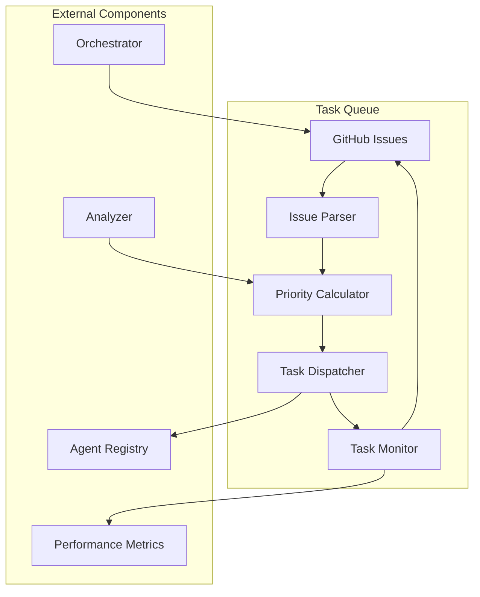

# 📋 Task Queue Component

<!-- 📑 TABLE OF CONTENTS -->
- [📋 Task Queue Component](#-task-queue-component)
  - [📖 Description](#-description)
  - [🏗️ Architecture](#️-architecture)
  - [🔄 Workflow](#-workflow)
  - [🧰 Implementation](#-implementation)
  - [📊 Queue Prioritization](#-queue-prioritization)
  - [🔀 Task Distribution](#-task-distribution)
  - [📈 Monitoring and Metrics](#-monitoring-and-metrics)

---

## 📖 Description

The Task Queue component is a critical part of the multi-agent system that handles the prioritization, scheduling, and distribution of tasks across available agent resources. It implements a Kanban-style pull-based approach where agents request work based on their availability and specialization. The queue ensures efficient resource utilization, prevents overloading of individual agents, and maintains task priority based on configurable parameters.

## 🏗️ Architecture

The Task Queue leverages GitHub Issues as its primary storage mechanism, using a combination of labels, milestones, and custom fields to maintain task states, priorities, and relationships:



The core components of the Task Queue include:

1. **Issue Parser**: Converts GitHub Issues into structured task objects
2. **Priority Calculator**: Determines task priority based on multiple factors
3. **Task Dispatcher**: Matches available tasks to appropriate agents
4. **Task Monitor**: Tracks task status and handles timeouts/failures

## 🔄 Workflow

The Task Queue process flow follows these steps:

1. New tasks are created as GitHub Issues with appropriate metadata
2. The Issue Parser periodically scans for new or updated issues
3. The Priority Calculator assigns a numerical priority score to each task
4. When an agent requests work, the Task Dispatcher selects the highest priority task matching the agent's capabilities
5. The Task Monitor tracks task execution status and handles exceptions
6. Completed tasks are marked as closed and moved to the task history

```bash
# Example of task queue processing
function process_task_queue() {
  # Get all open issues with appropriate labels
  open_issues=$(gh issue list --state open --label "task" --json number,title,labels,assignees)
  
  # Parse and prioritize tasks
  prioritized_tasks=$(prioritize_tasks "$open_issues")
  
  # Get available agents
  available_agents=$(get_available_agents)
  
  # Match tasks to agents
  for agent in $available_agents; do
    agent_capability=$(get_agent_capability "$agent")
    suitable_task=$(find_suitable_task "$prioritized_tasks" "$agent_capability")
    
    if [[ -n "$suitable_task" ]]; then
      # Assign task to agent
      task_id=$(echo "$suitable_task" | jq -r '.number')
      gh issue edit "$task_id" --add-assignee "$agent"
      
      # Update task status
      gh issue comment "$task_id" --body "Task assigned to agent $agent"
      
      # Notify agent about new task
      notify_agent "$agent" "$task_id"
    fi
  done
}
```

## 🧰 Implementation

The Task Queue is implemented using shell scripts and the GitHub CLI, with the following key features:

1. **Issue Monitoring**: Uses `gh issue list` with JQ filtering for efficient task discovery
2. **Status Management**: Leverages GitHub issue states, labels, and comments for tracking
3. **Agent Notification**: Uses HTTP callbacks to notify agents of new task assignments
4. **Timeout Handling**: Implements dead-man-switch monitoring for stalled tasks

```bash
# Task queue monitoring script
cat << 'EOF' > ./scripts/monitor_task_queue.sh
#!/bin/bash

# Configuration
POLL_INTERVAL=60  # seconds
MAX_TASK_AGE=86400  # 24 hours in seconds
WEBHOOK_URL="http://localhost:8080/task-event"

# Monitor tasks for timeouts
function check_task_timeouts() {
  # Get tasks in progress
  in_progress=$(gh issue list --state open --label "status:in_progress" --json number,updatedAt)
  
  # Check for timed out tasks
  for task in $(echo "$in_progress" | jq -c '.[]'); do
    task_id=$(echo "$task" | jq -r '.number')
    last_updated=$(echo "$task" | jq -r '.updatedAt')
    
    # Calculate age in seconds
    last_updated_ts=$(date -d "$last_updated" +%s)
    current_ts=$(date +%s)
    age_seconds=$((current_ts - last_updated_ts))
    
    if [[ $age_seconds -gt $MAX_TASK_AGE ]]; then
      echo "Task #$task_id has timed out (no updates in $(($age_seconds / 3600)) hours)"
      
      # Unassign and reset status
      gh issue edit "$task_id" --remove-assignee "@me" --remove-label "status:in_progress" --add-label "status:timeout"
      gh issue comment "$task_id" --body "⚠️ Task timed out after $age_seconds seconds without updates. Returning to queue."
      
      # Notify monitoring system
      curl -s -X POST "$WEBHOOK_URL" -H "Content-Type: application/json" \
        -d "{\"event\":\"task_timeout\",\"task_id\":$task_id,\"age_seconds\":$age_seconds}"
    fi
  done
}

# Main monitoring loop
while true; do
  echo "Checking task queue at $(date)"
  process_task_queue
  check_task_timeouts
  sleep $POLL_INTERVAL
done
EOF

chmod +x ./scripts/monitor_task_queue.sh
```

## 📊 Queue Prioritization

Tasks are prioritized based on the following factors:

1. **Explicit Priority Label**: `priority:high`, `priority:medium`, `priority:low`
2. **Age of Task**: Older tasks get priority boosts to prevent starvation
3. **Dependencies**: Tasks with no blocking dependencies get higher priority
4. **Tenant SLA**: Tasks for tenants with stricter SLAs get priority
5. **Task Type**: Critical fixes get higher priority than enhancements
6. **Resource Availability**: Tasks matching available agent capabilities get boosts

The prioritization algorithm computes a weighted score:

```bash
function calculate_priority_score() {
  task_json="$1"
  
  # Base priority from label
  priority_label=$(echo "$task_json" | jq -r '.labels[] | select(startswith("priority:")) | sub("priority:"; "")')
  case "$priority_label" in
    "high")   base_priority=100 ;;
    "medium") base_priority=50 ;;
    "low")    base_priority=10 ;;
    *)        base_priority=30 ;; # Default to medium-low if not specified
  esac
  
  # Age factor (1 point per hour, max 48)
  created_at=$(echo "$task_json" | jq -r '.createdAt')
  created_ts=$(date -d "$created_at" +%s)
  current_ts=$(date +%s)
  age_hours=$(( (current_ts - created_ts) / 3600 ))
  age_factor=$(( age_hours > 48 ? 48 : age_hours ))
  
  # Dependency factor
  has_dependencies=$(echo "$task_json" | jq -r '.body' | grep -c "depends on #")
  dependency_factor=$(( has_dependencies > 0 ? 0 : 20 ))
  
  # Calculate final score
  total_score=$((base_priority + age_factor + dependency_factor))
  
  echo "$total_score"
}
```

## 🔀 Task Distribution

The Task Dispatcher component ensures efficient task distribution by:

1. **Agent Capability Matching**: Ensures tasks are assigned to agents with appropriate skills
2. **Load Balancing**: Prevents individual agents from being overloaded
3. **Agent Affinity**: Prefers assigning related tasks to the same agent for context retention
4. **Resource Constraints**: Considers agent memory and processing constraints
5. **Tenant Isolation**: Ensures tasks for different tenants are properly isolated

## 📈 Monitoring and Metrics

The Task Queue collects and reports the following metrics:

1. **Queue Length**: Total tasks waiting for processing
2. **Wait Time**: Average and maximum wait times for tasks
3. **Throughput**: Tasks processed per hour/day
4. **Success Rate**: Percentage of tasks completed successfully
5. **Timeout Rate**: Percentage of tasks that time out
6. **Agent Utilization**: Percentage of time agents are actively processing tasks
7. **Priority Distribution**: Distribution of tasks by priority level

These metrics are used for continuous improvement of the queuing and dispatching algorithms.

---

<!-- 🧭 NAVIGATION -->
**Navigation**: [Home](../README.md) | [Components](./README.md) | [Orchestrator](./orchestrator.md) | [Agent Registry](./agent-registry.md)

*Last updated: 2024-05-16*