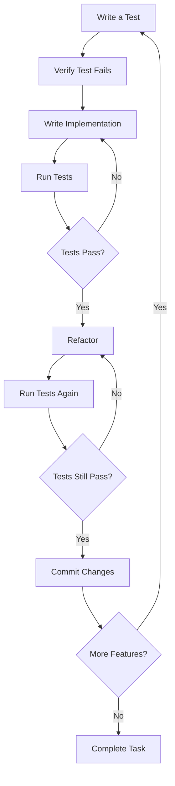

# 🧪 Test-Driven Development (TDD) Workflow

<!-- 📑 TABLE OF CONTENTS -->
- [🧪 Test-Driven Development (TDD) Workflow](#-test-driven-development-tdd-workflow)
  - [📋 Overview](#-overview)
  - [🔄 Core TDD Cycle](#-core-tdd-cycle)
  - [🛠️ Domain-Specific Adaptations](#️-domain-specific-adaptations)
  - [🤖 Agent Role Adaptations](#-agent-role-adaptations)
  - [📊 TDD Metrics & Verification](#-tdd-metrics--verification)
  - [🧩 TDD Integration Points](#-tdd-integration-points)
  - [📝 Documentation Requirements](#-documentation-requirements)

---

## 📋 Overview

This document defines the Test-Driven Development (TDD) workflow that all agents must follow when working on development tasks. TDD is a core requirement of our multi-agent system, ensuring high-quality, well-tested code across all development activities. The workflow is adaptable to different domains and agent specializations while maintaining the fundamental TDD principles.

## 🔄 Core TDD Cycle

The fundamental TDD cycle consists of these steps:



### 1. Write a Test

- Create a test that defines the expected behavior
- The test should be minimal but complete for one specific functionality
- The test should be descriptive and clear about what it's testing
- Include appropriate assertions and edge cases

```typescript
// Example: Test for a user authentication function
test('authenticateUser should return true with correct credentials', () => {
  // Arrange
  const username = 'testuser';
  const password = 'correctpassword';
  const expectedResult = true;
  
  // Act
  const result = authenticateUser(username, password);
  
  // Assert
  expect(result).toBe(expectedResult);
});
```

### 2. Verify Test Fails

- Run the test to ensure it fails
- This confirms that the test is actually testing something
- A passing test at this stage indicates a problem with the test

```bash
# Example: Running the test to verify failure
npm test -- -t "authenticateUser should return true with correct credentials"

# Expected output should indicate failure since function is not implemented
```

### 3. Write Implementation

- Write the minimum code needed to make the test pass
- Focus on functionality, not optimization
- Only address the requirements in the test
- Do not implement features not covered by tests

```typescript
// Example: Minimal implementation to make the test pass
function authenticateUser(username: string, password: string): boolean {
  // Minimal implementation - will be improved in later cycles
  return (username === 'testuser' && password === 'correctpassword');
}
```

### 4. Run Tests

- Verify that the implementation passes the test
- If tests fail, return to implementation step
- Don't proceed until all tests pass

```bash
# Example: Running the test to verify success
npm test -- -t "authenticateUser should return true with correct credentials"

# Expected output should indicate success
```

### 5. Refactor

- Improve the code while preserving functionality
- Focus on code quality, maintainability, and performance
- Apply coding standards and best practices
- Do not add new functionality during refactoring

```typescript
// Example: Refactored implementation with better structure
function authenticateUser(username: string, password: string): boolean {
  if (!username || !password) {
    return false;
  }
  
  // In a real system, this would check against a database
  const validCredentials = {
    'testuser': 'correctpassword'
  };
  
  return validCredentials[username] === password;
}
```

### 6. Verify Refactored Code

- Run tests again to ensure refactoring didn't break anything
- If tests fail, fix the refactored code

```bash
# Example: Running all tests after refactoring
npm test
```

### 7. Commit Changes

- Commit the test and implementation
- Include descriptive commit message
- Reference related task/issue

```bash
# Example: Commit message
git commit -m "Implement user authentication with TDD approach

- Added test for basic authentication
- Implemented authentication function
- Refactored for better error handling

Refs #123"
```

### 8. Repeat for Next Feature

- Continue cycle for next piece of functionality
- Each cycle should address a small, well-defined feature

## 🛠️ Domain-Specific Adaptations

The core TDD process is adapted for different domains:

### Frontend/UI Development

1. **Component Testing**:
   - Start with component behavior tests
   - Progress to visual/rendering tests
   - Include accessibility tests

2. **UI Test Frameworks**:
   - Use React Testing Library, Vue Test Utils, etc.
   - Include snapshot testing where appropriate
   - Incorporate visual regression testing

3. **UI TDD Workflow Additions**:
   - Mock API responses before implementation
   - Include responsive design tests
   - Test user interactions and state changes

### Backend/API Development

1. **API Testing Approach**:
   - Start with contract tests
   - Continue with functional tests
   - Include performance and security tests

2. **Backend Test Types**:
   - Write unit tests for business logic
   - Create integration tests for component interactions
   - Develop API tests for endpoints

3. **Data-Focused Testing**:
   - Test data validation
   - Verify database interactions
   - Include data migration tests

### DevOps/Infrastructure

1. **Infrastructure as Code Testing**:
   - Write validation tests for configuration
   - Create deployment verification tests
   - Include rollback tests

2. **DevOps TDD Workflow**:
   - Test infrastructure before deployment
   - Verify monitoring and alerting
   - Include security compliance tests

3. **CI/CD Pipeline Testing**:
   - Test automation steps
   - Verify environment configurations
   - Include deployment verification tests

## 🤖 Agent Role Adaptations

Different agent roles implement TDD with specific emphases:

### Implementer Agents

- Focus on comprehensive test coverage
- Emphasize edge cases and error handling
- Include performance considerations in tests
- Document test cases thoroughly
- Create both unit and integration tests

```typescript
// Implementer Agent TDD Example
test('authenticateUser handles invalid inputs appropriately', () => {
  expect(authenticateUser('', 'password')).toBe(false);
  expect(authenticateUser('username', '')).toBe(false);
  expect(authenticateUser('', '')).toBe(false);
  expect(authenticateUser(null, 'password')).toBe(false);
  expect(authenticateUser('username', null)).toBe(false);
});
```

### Tester Agents

- Develop more exhaustive test suites
- Include boundary testing and negative testing
- Focus on quality attributes (performance, security)
- Create scenario-based tests
- Implement end-to-end testing

```typescript
// Tester Agent TDD Example
describe('User Authentication Security Tests', () => {
  test('should reject password with incorrect case', () => {
    expect(authenticateUser('testuser', 'CorrectPassword')).toBe(false);
  });
  
  test('should lock account after three failed attempts', () => {
    // Fail three times
    authenticateUser('testuser', 'wrong1');
    authenticateUser('testuser', 'wrong2');
    authenticateUser('testuser', 'wrong3');
    
    // Even correct password should be rejected now
    expect(authenticateUser('testuser', 'correctpassword')).toBe(false);
    expect(getAccountStatus('testuser')).toBe('locked');
  });
});
```

### Security Agents

- Emphasize security vulnerability testing
- Include penetration test scenarios
- Focus on authorization and authentication
- Test data protection mechanisms
- Implement compliance verification tests

```typescript
// Security Agent TDD Example
test('should prevent SQL injection in authentication', () => {
  const maliciousInput = "' OR '1'='1";
  expect(authenticateUser(maliciousInput, maliciousInput)).toBe(false);
  
  // Verify no unexpected side effects occurred
  expect(getSystemState()).toBe('normal');
});
```

### Documentation Agents

- Create tests that verify documentation examples
- Implement tests for API documentation accuracy
- Focus on clarity and completeness in test descriptions
- Include test coverage reports in documentation
- Create user-friendly test outputs

```typescript
// Documentation Agent TDD Example
// This test verifies the example in the API documentation works as described
test('API documentation example works correctly', () => {
  // Example from docs: authenticateUser('user', 'pass') => boolean
  const exampleResult = authenticateUser('testuser', 'correctpassword');
  expect(typeof exampleResult).toBe('boolean');
  expect(exampleResult).toBe(true);
});
```

## 📊 TDD Metrics & Verification

The TDD process includes metrics for assessment and verification:

### Test Quality Metrics

1. **Coverage Metrics**:
   - Line coverage: ≥90% required
   - Branch coverage: ≥85% required
   - Function coverage: 100% required

2. **Test Effectiveness**:
   - Mutation testing score: ≥80% required
   - Defect detection rate

3. **Test Maintainability**:
   - Test-to-code ratio: 1:1 to 2:1 target
   - Test complexity score

### TDD Process Verification

1. **Temporal Verification**:
   - Test timestamps must precede implementation
   - Red-Green-Refactor cycle timestamps

2. **Commit Verification**:
   - Tests must be committed with implementation
   - Commit messages must reference TDD cycle

3. **Workflow Adherence**:
   - Required test failure evidence
   - Refactoring evidence
   - Incremental development pattern

### TDD Compliance Checks

```typescript
// Example: TDD compliance verification function
function verifyTDDCompliance(taskId) {
  // Get all commits for task
  const commits = getCommitsForTask(taskId);
  
  // Check for test-first pattern
  for (const feature of getFeatures(taskId)) {
    const testCommit = findTestCommit(commits, feature);
    const implCommit = findImplementationCommit(commits, feature);
    
    if (!testCommit || !implCommit || testCommit.timestamp >= implCommit.timestamp) {
      return {
        compliant: false,
        reason: `Feature ${feature} does not follow test-first pattern`
      };
    }
    
    // Verify test initially failed
    if (!hasTestFailureEvidence(feature)) {
      return {
        compliant: false,
        reason: `No evidence that test for ${feature} initially failed`
      };
    }
  }
  
  return { compliant: true };
}
```

## 🧩 TDD Integration Points

TDD integrates with other system components:

### GitHub Integration

1. **Issue Requirements**:
   - TDD approach must be documented in issue
   - Test plan must be included

2. **Pull Request Validation**:
   - TDD compliance verified before merge
   - Test coverage reports included
   - Test failure/success evidence required

3. **Code Review Workflow**:
   - Tests reviewed before implementation
   - TDD sequence verified

### Agent Communication

1. **TDD Progress Reporting**:
   - Agents report test creation
   - Agents report test results
   - Agents report refactoring activities

2. **TDD Collaboration**:
   - Test sharing between agents
   - Collaborative test development
   - Test review requests

3. **TDD Knowledge Sharing**:
   - Test pattern libraries
   - TDD best practices documentation
   - Domain-specific testing approaches

### CI/CD Pipeline

1. **Automated TDD Verification**:
   - TDD compliance checks in CI
   - Automatic test execution
   - Coverage reports generation

2. **Pipeline Gates**:
   - Required test coverage thresholds
   - Test quality metrics
   - TDD compliance status

## 📝 Documentation Requirements

TDD requires specific documentation:

### Test Documentation

1. **Test Plan**:
   - Feature test coverage
   - Test categories and scenarios
   - Expected outcomes

2. **Test Cases**:
   - Purpose and description
   - Input parameters and expected outputs
   - Edge cases and error scenarios

3. **Testing Approach**:
   - Testing framework and tools
   - Mocking and stubbing approach
   - Test data management

### TDD Process Documentation

1. **Cycle Evidence**:
   - Red phase (test failure) evidence
   - Green phase (test passing) evidence
   - Refactoring decisions and results

2. **Development Journal**:
   - TDD approach for each feature
   - Challenges and solutions
   - Lessons learned

3. **TDD Metrics Report**:
   - Coverage statistics
   - Test quality metrics
   - TDD efficiency metrics

---

<!-- 🧭 NAVIGATION -->
**Navigation**: [Home](../README.md) | [Component Index](./README.md) | [Task Execution Process](./task-execution-process.md) | [Agent-Task Matching](./agent-task-matching.md)

*Last updated: 2025-05-17*