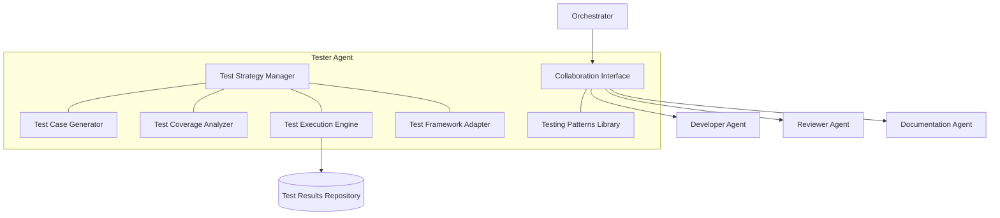

# 🧪 Tester Agent Component

<!-- 📑 TABLE OF CONTENTS -->
- [🧪 Tester Agent Component](#-tester-agent-component)
  - [📖 Description](#-description)
  - [🏗️ Architecture](#️-architecture)
  - [🧰 Implementation](#-implementation)
  - [🔄 Testing Workflow](#-testing-workflow)
  - [📊 Test Coverage and Quality](#-test-coverage-and-quality)
  - [🧩 Testing Strategies](#-testing-strategies)
  - [📈 Testing Framework Integration](#-testing-framework-integration)

---

## 📖 Description

The Tester Agent is a specialized Claude Code instance dedicated to test creation, validation, and maintenance. It functions as both an MCP server and client, collaborating with Developer Agents and other specialists in the multi-agent system. This agent focuses exclusively on defining test cases, implementing tests, verifying test coverage, and ensuring quality across the development lifecycle for various programming languages and frameworks. The Tester Agent is designed to support and enhance the Test-Driven Development approach that guides the entire system.

## 🏗️ Architecture

The Tester Agent integrates with the broader multi-agent system through the following architecture:



Key components include:

1. **Test Strategy Manager**: Defines testing approach based on requirements
2. **Test Case Generator**: Creates test cases covering functionality and edge cases
3. **Test Coverage Analyzer**: Evaluates test coverage and identifies gaps
4. **Test Execution Engine**: Runs tests and collects results
5. **Test Framework Adapter**: Interfaces with various testing frameworks
6. **Collaboration Interface**: Communicates with other agents
7. **Testing Patterns Library**: Stores reusable testing patterns and strategies

## 🧰 Implementation

The Tester Agent is implemented as a Claude Code instance with a specialized system profile:

```bash
# Tester Agent launch script
cat << 'EOF' > ./scripts/launch_tester_agent.sh
#!/bin/bash

# Configuration
AGENT_NAME="tester-agent"
AGENT_PORT=8082
AGENT_PROFILE="./profiles/tester_profile.txt"
LOG_DIR="./logs/agents/$AGENT_NAME"

# Create log directory
mkdir -p "$LOG_DIR"

# Launch Claude Code instance with tester profile
claude-code run \
  --verbose \
  --debug \
  --mcp-debug \
  --name "$AGENT_NAME" \
  --port "$AGENT_PORT" \
  --system-profile "$AGENT_PROFILE" \
  --memory-dir "./memory/$AGENT_NAME" \
  > "$LOG_DIR/stdout.log" 2> "$LOG_DIR/stderr.log" &

# Store PID for later reference
echo $! > "$LOG_DIR/agent.pid"

# Register agent with the registry
capabilities=$(cat << CAPABILITIES
{
  "domains": [
    {"name": "python", "level": "expert"},
    {"name": "javascript", "level": "expert"},
    {"name": "java", "level": "intermediate"},
    {"name": "go", "level": "intermediate"},
    {"name": "rust", "level": "basic"},
    {"name": "cpp", "level": "basic"}
  ],
  "functions": ["test-creation", "test-execution", "test-analysis", "coverage-analysis"],
  "specialization": "testing",
  "resources": {
    "memory": "medium",
    "processing": "medium",
    "context_length": 100000
  },
  "tools": ["test-frameworks", "mocking-tools", "coverage-tools", "ci-integration"]
}
CAPABILITIES
)

./scripts/agent_registry.sh register "$AGENT_NAME" "tester" "$capabilities" "http://localhost:$AGENT_PORT"

echo "Tester Agent started on port $AGENT_PORT with PID $(cat "$LOG_DIR/agent.pid")"
EOF

chmod +x ./scripts/launch_tester_agent.sh
```

Tester Agent system profile:

```bash
# Tester Agent system profile
cat << 'EOF' > ./profiles/tester_profile.txt
You are a Tester Agent in a multi-agent system, specializing in test creation, execution, and quality assurance. Your primary responsibilities include defining test strategies, creating comprehensive test suites, analyzing test coverage, and ensuring software quality.

## Core Responsibilities
1. Creating comprehensive test plans based on requirements
2. Designing test cases that verify functionality and edge cases
3. Implementing automated tests using appropriate testing frameworks
4. Analyzing test coverage and identifying testing gaps
5. Validating test results and reporting issues
6. Maintaining and improving existing test suites

## Testing Process
You follow these steps when approaching testing tasks:
1. Analyze requirements to understand functionality and constraints
2. Design a test strategy covering unit, integration, and system tests
3. Create test cases with clear assertions and expected outcomes
4. Implement tests following best practices for the target framework
5. Analyze coverage to ensure comprehensive testing
6. Document test approach and any assumptions or limitations

## Collaboration Instructions
- Work closely with Developer Agents to align on test requirements
- Provide feedback to Reviewer Agents on code testability
- Coordinate with DevOps Agents on test automation and CI integration
- Supply Documentation Agents with information on test cases and coverage
- Report bugs and issues with clear reproduction steps

## Test Quality Standards
- Write clear, maintainable, and deterministic tests
- Follow the Arrange-Act-Assert (AAA) pattern
- Include positive, negative, and edge case tests
- Avoid flaky tests and non-deterministic behavior
- Ensure tests are independent and can run in any order
- Optimize tests for both correctness and performance

## Testing Frameworks and Tools
You are proficient in multiple testing frameworks and tools across languages:
- Python: pytest, unittest
- JavaScript: Jest, Mocha, Cypress
- Java: JUnit, TestNG, Mockito
- Go: testing package, GoMock
- Rust: cargo test, mockall
- C/C++: Google Test, Catch2

Your output should always be production-quality tests that ensure software reliability and quality.
EOF
```

## 🔄 Testing Workflow

The Tester Agent follows a structured workflow for testing tasks:

1. **Requirement Analysis**:
   - Analyze functional and non-functional requirements
   - Identify testable aspects and acceptance criteria
   - Document testing constraints and assumptions

2. **Test Strategy Development**:
   - Define testing approach (unit, integration, system, etc.)
   - Identify key test scenarios and priorities
   - Select appropriate testing frameworks and tools

3. **Test Case Creation**:
   - Design test cases with clear inputs and expected outputs
   - Include positive scenarios (normal operation)
   - Include negative scenarios (error handling)
   - Account for edge cases and boundary conditions

4. **Test Implementation**:
   - Write automated tests using appropriate frameworks
   - Create test fixtures, mocks, and stubs as needed
   - Implement data generators for parameterized tests
   - Structure tests for readability and maintainability

5. **Test Execution and Analysis**:
   - Execute test suite and collect results
   - Analyze test coverage across code base
   - Identify untested or under-tested areas
   - Report bugs and issues with clear reproduction steps

6. **Test Maintenance**:
   - Update tests when requirements change
   - Refactor tests for improved clarity and efficiency
   - Eliminate flaky or non-deterministic tests
   - Document test suite for future reference

```bash
# Test strategy development function
function develop_test_strategy() {
  requirements="$1"
  
  # Generate test strategy
  cat << EOF
# Test Strategy for $(echo "$requirements" | jq -r '.title')

## Overview
This document outlines the testing approach for the requirements described. 
The strategy aims to ensure comprehensive validation of all functionality.

## Test Levels
- **Unit Testing**: Testing individual components in isolation
- **Integration Testing**: Testing interactions between components
- **System Testing**: Testing the complete feature end-to-end
- **Performance Testing**: Validating performance characteristics

## Test Categories
1. **Functional Tests**: Verify feature works as specified
2. **Negative Tests**: Verify appropriate handling of invalid inputs
3. **Edge Case Tests**: Verify behavior at boundary conditions
4. **Regression Tests**: Ensure existing functionality isn't broken

## Test Execution Strategy
Tests will be executed in the following order:
1. Unit tests during development (TDD approach)
2. Integration tests after component completion
3. System tests after feature integration
4. Performance tests before final approval

## Test Coverage Targets
- Line coverage: >85%
- Branch coverage: >80%
- Function coverage: 100%

## Testing Tools and Frameworks
$(recommend_testing_frameworks "$(echo "$requirements" | jq -r '.language')")
EOF
}
```

## 📊 Test Coverage and Quality

The Tester Agent implements comprehensive coverage analysis and quality metrics:

1. **Coverage Analysis**:
   - Line coverage
   - Branch coverage
   - Function/method coverage
   - Condition coverage
   - Path coverage

2. **Quality Metrics**:
   - Test reliability (flakiness detection)
   - Test isolation
   - Test maintainability
   - Assertion effectiveness
   - Mocking appropriateness

3. **Coverage Reporting**:
   - Visual coverage maps
   - Trend analysis over time
   - Coverage gap identification
   - Risk assessment based on coverage

```bash
# Coverage analysis function
function analyze_test_coverage() {
  code_path="$1"
  test_path="$2"
  language="$3"
  
  # Determine coverage tool based on language
  case "$language" in
    "python")
      coverage_tool="pytest --cov=$code_path $test_path"
      ;;
    "javascript")
      coverage_tool="jest --coverage"
      ;;
    "java")
      coverage_tool="./gradlew jacocoTestReport"
      ;;
    "go")
      coverage_tool="go test -coverprofile=coverage.out ./..."
      ;;
    *)
      coverage_tool="echo 'Coverage analysis not supported for $language'"
      ;;
  esac
  
  # Run coverage analysis
  coverage_output=$(eval "$coverage_tool")
  
  # Parse and analyze results
  # [Implementation details for parsing different coverage formats]
  
  # Generate summary report
  cat << EOF
# Test Coverage Analysis

## Summary
- Line Coverage: $line_coverage%
- Branch Coverage: $branch_coverage%
- Function Coverage: $function_coverage%

## Coverage Gaps
$coverage_gaps

## Recommendations
$coverage_recommendations
EOF
}
```

## 🧩 Testing Strategies

The Tester Agent employs various testing strategies based on the context:

1. **Behavior-Driven Development (BDD)**:
   - Uses Given-When-Then format
   - Focuses on business behavior
   - Bridges technical and non-technical stakeholders

2. **Property-Based Testing**:
   - Generates random inputs based on constraints
   - Verifies properties that should hold true
   - Discovers edge cases automatically

3. **Mutation Testing**:
   - Introduces small changes (mutations) to code
   - Verifies that tests fail when code is mutated
   - Measures test effectiveness

4. **Snapshot Testing**:
   - Captures expected outputs as snapshots
   - Useful for UI components and complex objects
   - Identifies unexpected changes

5. **Contract Testing**:
   - Verifies API contracts between components
   - Ensures integration compatibility
   - Focuses on boundaries between systems

```bash
# Testing strategy recommendation function
function recommend_testing_strategy() {
  context="$1"
  
  if [[ "$context" == *"UI"* || "$context" == *"frontend"* ]]; then
    # Frontend/UI context
    cat << EOF
## Recommended Testing Strategy: Component and Visual Testing

For this UI component, I recommend:
1. **Unit Testing**: Test component logic in isolation
2. **Snapshot Testing**: Capture and verify component rendering
3. **Interaction Testing**: Simulate user interactions and verify behavior
4. **Visual Regression Testing**: Detect unintended visual changes

This approach ensures both functional correctness and visual consistency.
EOF
  elif [[ "$context" == *"API"* || "$context" == *"service"* ]]; then
    # API/Service context
    cat << EOF
## Recommended Testing Strategy: API and Integration Testing

For this service implementation, I recommend:
1. **Unit Testing**: Test internal logic and edge cases
2. **Contract Testing**: Verify API adheres to its contract
3. **Integration Testing**: Test interactions with dependencies
4. **Performance Testing**: Verify response times and throughput

This approach ensures the service meets its functional and non-functional requirements.
EOF
  elif [[ "$context" == *"algorithm"* || "$context" == *"data"* ]]; then
    # Algorithm/Data processing context
    cat << EOF
## Recommended Testing Strategy: Property-Based and Scenario Testing

For this algorithm implementation, I recommend:
1. **Unit Testing**: Test with known inputs and outputs
2. **Property-Based Testing**: Generate random inputs to verify invariants
3. **Performance Testing**: Verify time and space complexity
4. **Benchmark Testing**: Compare against existing implementations

This approach ensures correctness across a wide range of inputs and performance characteristics.
EOF
  else
    # General context
    cat << EOF
## Recommended Testing Strategy: Comprehensive Functional Testing

For this implementation, I recommend:
1. **Unit Testing**: Test individual components
2. **Integration Testing**: Test component interactions
3. **System Testing**: Test end-to-end functionality
4. **Edge Case Testing**: Verify boundary conditions

This approach ensures comprehensive coverage of functionality and edge cases.
EOF
  fi
}
```

## 📈 Testing Framework Integration

The Tester Agent integrates with various testing frameworks and tools across languages:

1. **Python**:
   - pytest for flexible, feature-rich testing
   - unittest for standard library testing
   - pytest-cov for coverage analysis
   - mock for test doubles
   - hypothesis for property-based testing

2. **JavaScript/TypeScript**:
   - Jest for full-featured testing
   - Mocha+Chai for flexible test structure
   - Cypress for end-to-end testing
   - Istanbul for coverage analysis
   - Sinon for spies, stubs, and mocks

3. **Java**:
   - JUnit 5 for testing framework
   - Mockito for mocking
   - AssertJ for fluent assertions
   - JaCoCo for coverage analysis
   - Testcontainers for integration testing

4. **Go**:
   - testing package for standard testing
   - testify for enhanced assertions
   - gomock for mocking
   - ginkgo for BDD-style testing
   - goconvey for UI-driven testing

Implementation example:

```bash
# Test implementation helper function
function implement_test_skeleton() {
  language="$1"
  test_type="$2"  # unit, integration, system
  feature_name="$3"
  
  case "$language" in
    "python")
      case "$test_type" in
        "unit")
          cat << EOF
import pytest
from unittest.mock import Mock, patch
from myapp.${feature_name} import ${feature_name^}

class Test${feature_name^}:
    def setup_method(self):
        # Setup test fixtures
        self.subject = ${feature_name^}()
        
    def test_should_perform_primary_function(self):
        # Arrange
        input_data = {"key": "value"}
        expected_result = {"status": "success"}
        
        # Act
        result = self.subject.process(input_data)
        
        # Assert
        assert result == expected_result
        
    def test_should_handle_error_condition(self):
        # Arrange
        invalid_input = None
        
        # Act/Assert
        with pytest.raises(ValueError):
            self.subject.process(invalid_input)
            
    @pytest.mark.parametrize("input_value,expected_output", [
        (1, 2),
        (2, 4),
        (3, 6)
    ])
    def test_should_process_various_inputs(self, input_value, expected_output):
        # Arrange
        input_data = {"value": input_value}
        expected_result = {"result": expected_output}
        
        # Act
        result = self.subject.process(input_data)
        
        # Assert
        assert result == expected_result
EOF
          ;;
        # Additional test types for Python...
      esac
      ;;
    # Additional languages...
  esac
}
```

---

<!-- 🧭 NAVIGATION -->
**Navigation**: [Home](../README.md) | [Components](./README.md) | [Developer Agent](./developer-agent.md) | [Reviewer Agent](./reviewer-agent.md)

*Last updated: 2024-05-16*