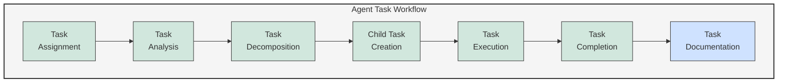

# 🔄 Agent Task Workflow Diagram

This diagram illustrates the flow of tasks through the multi-agent system, from assignment to completion.

## Process Stages

1. **Task Assignment**:
   - Tasks are assigned to agents by the Orchestrator
   - Assignment is based on agent capabilities and availability
   - Assignment includes all necessary context and requirements

2. **Task Analysis**:
   - Agent analyzes the task requirements and constraints
   - Determines approach and required resources
   - Identifies dependencies and prerequisites

3. **Task Decomposition**:
   - Complex tasks are broken down into smaller, manageable subtasks
   - Decomposition follows the principle of single responsibility
   - Each subtask has clear acceptance criteria

4. **Child Task Creation**:
   - Subtasks are created in the task management system
   - Child tasks maintain relationships to parent tasks
   - Child tasks may be assigned to different specialized agents

5. **Task Execution**:
   - Tasks are executed according to defined approach
   - Implementation follows test-driven development
   - Regular progress updates are provided

6. **Task Completion**:
   - Final deliverables are submitted
   - Quality assurance checks are performed
   - Task is marked as completed

7. **Task Documentation**:
   - Process and decisions are documented
   - Knowledge gained is captured for future use
   - Documentation is updated in the knowledge base

---

<!-- 🧭 NAVIGATION -->
**Navigation**: [Home](../README.md) | [Architecture](../README.md) | [Diagrams](./README.md)

*Last updated: 2025-05-17*