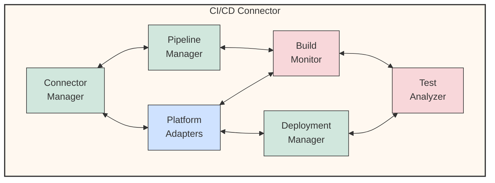

# 🔄 CI/CD Connector Component Diagram

This diagram illustrates the internal structure of the CI/CD Connector component.

## Component Descriptions

1. **Connector Manager**:
   - Coordinates all CI/CD integration activities
   - Manages authentication and permissions
   - Provides high-level CI/CD operations API

2. **Pipeline Manager**:
   - Creates and configures CI/CD pipelines
   - Manages pipeline triggers and events
   - Controls pipeline execution flow

3. **Platform Adapters**:
   - Integrates with various CI/CD platforms (GitHub Actions, Jenkins, etc.)
   - Normalizes platform-specific features
   - Handles platform-specific configuration

4. **Build Monitor**:
   - Tracks build status and progress
   - Collects build metrics and logs
   - Provides real-time build feedback

5. **Deployment Manager**:
   - Handles deployment to different environments
   - Manages deployment strategies (rolling, blue-green, etc.)
   - Coordinates deployment approvals

6. **Test Analyzer**:
   - Processes test results from CI/CD pipelines
   - Analyzes test coverage and quality
   - Identifies test failures and patterns

---

<!-- 🧭 NAVIGATION -->
**Navigation**: [Home](../README.md) | [Architecture](../README.md) | [Diagrams](./README.md) | [Components](../components/cicd-connector.md)

*Last updated: 2025-05-17*