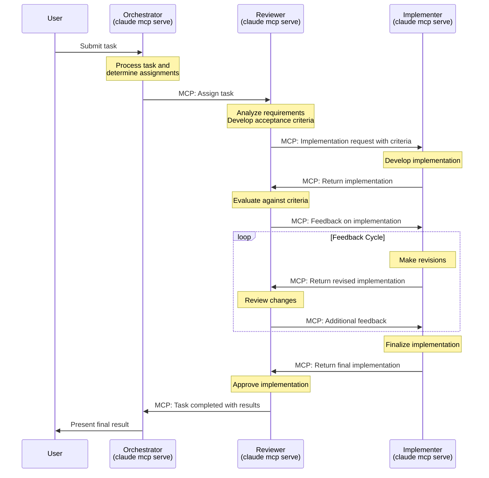
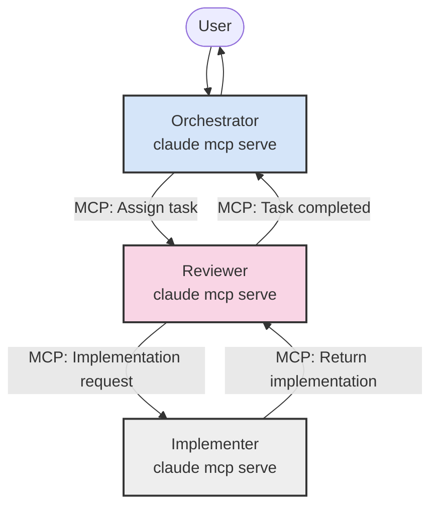

# Consolidated MCP Workflow Documentation

*Last Updated: May 16, 2025*

## Orchestrator → Reviewer → Implementer Chain

This document consolidates all workflow information for our three-agent architecture using Claude MCP through STDIO.

## Complete MCP Workflow with Orchestrator Chain



## Multi-Agent Architecture with MCP



## Multi-Agent Launch Script

```bash
#!/bin/bash
# launch-agent-team.sh

# Get directory where script is located
SCRIPT_DIR="$(cd "$(dirname "${BASH_SOURCE[0]}")" && pwd)"

# Create workspace and log directories
WORKSPACE_DIR="${SCRIPT_DIR}/workspace"
LOG_DIR="${SCRIPT_DIR}/logs"
mkdir -p "$WORKSPACE_DIR/orchestrator" "$WORKSPACE_DIR/reviewer" "$WORKSPACE_DIR/implementer"
mkdir -p "$LOG_DIR"

# System prompt files
ORCHESTRATOR_PROMPT="${SCRIPT_DIR}/orchestrator-prompt.md"
REVIEWER_PROMPT="${SCRIPT_DIR}/reviewer-prompt.md"
IMPLEMENTER_PROMPT="${SCRIPT_DIR}/implementer-prompt.md"

# Check if system prompt files exist
for PROMPT_FILE in "$ORCHESTRATOR_PROMPT" "$REVIEWER_PROMPT" "$IMPLEMENTER_PROMPT"; do
  if [ ! -f "$PROMPT_FILE" ]; then
    echo "System prompt file not found: $PROMPT_FILE"
    exit 1
  fi
done

# Launch Implementer MCP Server
echo "Starting Implementer MCP server..."
cd "$WORKSPACE_DIR/implementer"
nohup claude mcp serve --system-prompt "$(cat "$IMPLEMENTER_PROMPT")" \
  --print --debug --verbose --mcp-debug > "$LOG_DIR/implementer.log" 2>&1 &
IMPLEMENTER_PID=$!
echo "Implementer started with PID: $IMPLEMENTER_PID"

# Launch Reviewer MCP Server
echo "Starting Reviewer MCP server..."
cd "$WORKSPACE_DIR/reviewer"
nohup claude mcp serve --system-prompt "$(cat "$REVIEWER_PROMPT")" \
  --print --debug --verbose --mcp-debug > "$LOG_DIR/reviewer.log" 2>&1 &
REVIEWER_PID=$!
echo "Reviewer started with PID: $REVIEWER_PID"

# Wait for agents to initialize
sleep 5

# Launch Orchestrator in interactive terminal
echo "Starting Orchestrator in interactive mode..."
cd "$WORKSPACE_DIR/orchestrator"
osascript -e "tell application \"Terminal\" to do script \"cd '$WORKSPACE_DIR/orchestrator' && claude mcp serve --system-prompt '$(cat "$ORCHESTRATOR_PROMPT")' --interactive --print --debug --verbose\""

echo "Agent team launched successfully!"
echo "Orchestrator: Interactive terminal"
echo "Reviewer: PID $REVIEWER_PID, log: $LOG_DIR/reviewer.log"
echo "Implementer: PID $IMPLEMENTER_PID, log: $LOG_DIR/implementer.log"
echo ""
echo "To stop background agents, run: kill $REVIEWER_PID $IMPLEMENTER_PID"
```

## MCP Communication Between Agents

When agents communicate via MCP through STDIO, the messages follow these patterns:

### Orchestrator to Reviewer (Task Assignment)

```
@mcp_call
{
  "recipient": "reviewer",
  "action": "assign_task",
  "task": {
    "id": "TASK-123",
    "title": "Implement feature X",
    "description": "Create a component that...",
    "requirements": [
      "Must handle edge cases",
      "Should integrate with existing systems",
      "Performance criteria..."
    ],
    "priority": "high",
    "deadline": "2025-05-20"
  }
}
@end_mcp_call
```

### Reviewer to Implementer (Implementation Request)

```
@mcp_call
{
  "recipient": "implementer",
  "action": "implement_solution",
  "task_id": "TASK-123",
  "acceptance_criteria": [
    "Must follow coding standards",
    "All tests must pass",
    "Documentation must be complete"
  ],
  "context": {
    "existing_components": ["ComponentA", "ComponentB"],
    "technical_constraints": ["Use TypeScript", "Follow SOLID principles"]
  }
}
@end_mcp_call
```

### Implementer to Reviewer (Implementation Response)

```
@mcp_response
{
  "status": "completed",
  "task_id": "TASK-123",
  "implementation": {
    "code": "// Implementation code here...",
    "documentation": "# Documentation\n...",
    "test_results": {
      "passed": 15,
      "failed": 0,
      "coverage": "92%"
    }
  },
  "notes": "I followed all the specified requirements and acceptance criteria..."
}
@end_mcp_response
```

### Reviewer to Orchestrator (Task Completion)

```
@mcp_response
{
  "status": "completed",
  "task_id": "TASK-123",
  "result": {
    "implementation": {
      "summary": "Implemented feature X with the following components...",
      "files_changed": ["src/components/FeatureX.js", "src/utils/featureX.js"],
      "testing_summary": "All tests passing with 92% coverage"
    },
    "review_summary": "Implementation meets all requirements and follows best practices",
    "notes": "Feature is ready for deployment"
  }
}
@end_mcp_response
```

## Directory Structure for Multi-Agent Setup

```
project/
├── launch-agent-team.sh            # Launch script for all agents
├── orchestrator-prompt.md          # System prompt for Orchestrator
├── reviewer-prompt.md              # System prompt for Reviewer
├── implementer-prompt.md           # System prompt for Implementer
├── workspace/                      # Parent workspace directory
│   ├── orchestrator/               # Orchestrator's working directory
│   ├── reviewer/                   # Reviewer's working directory
│   └── implementer/                # Implementer's working directory
└── logs/                           # Log directory
    ├── orchestrator.log            # Orchestrator logs
    ├── reviewer.log                # Reviewer logs
    └── implementer.log             # Implementer logs
```

## STDIO-Based MCP Communication 

All agents communicate through standard input/output (STDIO):

1. The Orchestrator agent runs in interactive mode, communicating with the user through the terminal and with the Reviewer agent through STDIO.

2. The Reviewer agent runs as a background process, receiving messages from the Orchestrator and sending messages to the Implementer through STDIO.

3. The Implementer agent runs as a background process, receiving messages from the Reviewer and returning implementation results through STDIO.

This STDIO-based approach ensures a simple and reliable communication mechanism without requiring network configuration or complex infrastructure.

## Best Practices Based on Actual Implementation

1. **Complete MCP Chain**: All interactions between agents happen via MCP, including task assignment
2. **Hierarchical Agent Structure**: Orchestrator → Reviewer → Implementer chain of responsibility
3. **Separate Workspaces**: Each agent operates in its own workspace directory
4. **System Prompts from Files**: Load system prompts from external files for easier management
5. **Background Processes**: Run non-interactive agents as background processes with logs
6. **Interactive Mode**: Run the user-facing agent (Orchestrator) in interactive mode
7. **Standardized Message Format**: Use consistent JSON structure for MCP messages
8. **Process Management**: Track process IDs for proper cleanup
9. **Initialization Time**: Allow time for agents to initialize before interaction

This workflow accurately reflects how a complete Claude MCP multi-agent system is implemented in practice, based on actual script examples.

---

🧭 **Navigation**
- [Architecture Diagrams Home](./README.md)
- [Component Documentation](../components/README.md)
- [MCP Protocol](../interfaces/mcp-protocol.md)
- [Agent Naming Decision](../decisions/006-simplified-agent-naming.md)
- [Orchestrator Component](../components/orchestrator.md)
- [Reviewer Agent](../components/reviewer-agent.md)
- [Implementer Agent](../components/implementer-agent.md)