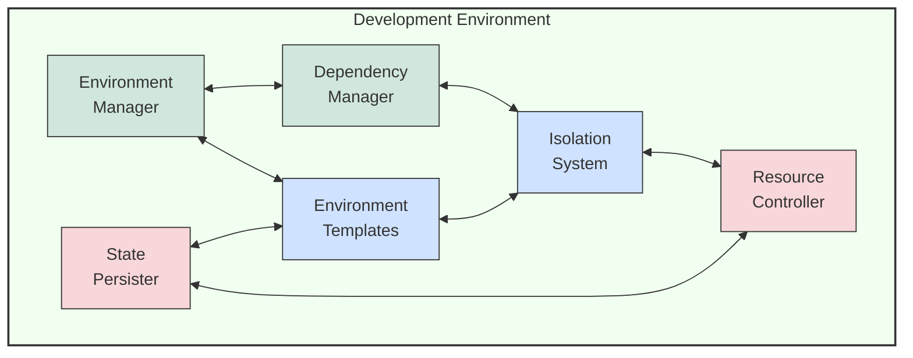

# 🛠️ Development Environment Component Diagram

This diagram illustrates the internal structure of the Development Environment component.

## Component Descriptions

1. **Environment Manager**:
   - Coordinates overall environment lifecycle
   - Handles environment creation, updates, and teardown
   - Delegates specialized tasks to other components

2. **Dependency Manager**:
   - Manages software dependencies within environments
   - Resolves dependency conflicts and compatibility
   - Maintains dependency caching for efficiency

3. **Environment Templates**:
   - Provides standardized environment definitions
   - Supports multiple programming languages and frameworks
   - Contains pre-configured developer tooling

4. **Isolation System**:
   - Ensures environment isolation using containers or VMs
   - Prevents cross-environment conflicts
   - Manages network and resource isolation

5. **State Persister**:
   - Maintains environment state across sessions
   - Handles checkpointing and rollback capabilities
   - Provides state export/import functionality

6. **Resource Controller**:
   - Manages compute, memory, and storage resources
   - Implements resource limiting and scaling
   - Monitors resource usage and optimizes allocation

---

<!-- 🧭 NAVIGATION -->
**Navigation**: [Home](../README.md) | [Architecture](../README.md) | [Diagrams](./README.md) | [Components](../components/development-environment.md)

*Last updated: 2025-05-17*