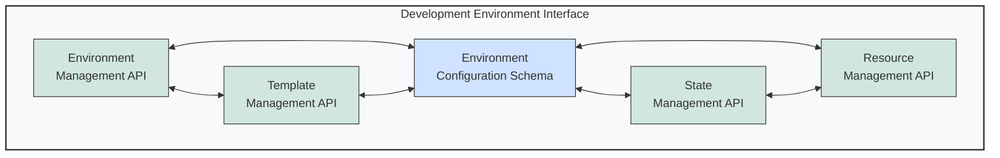

# 🔌 Development Environment Interface Diagram

This diagram illustrates the API interfaces provided by the Development Environment component.

## Interface Descriptions

1. **Environment Management API**:
   - Creates, updates, and deletes development environments
   - Provides environment status and information
   - Controls environment lifecycle operations
   - Methods include: `createEnvironment()`, `updateEnvironment()`, `deleteEnvironment()`, `getEnvironmentStatus()`

2. **Template Management API**:
   - Manages environment templates
   - Supports template creation and customization
   - Enables template sharing and versioning
   - Methods include: `listTemplates()`, `createTemplate()`, `updateTemplate()`, `deleteTemplate()`

3. **Environment Configuration Schema**:
   - Defines JSON schema for environment configurations
   - Validates configuration parameters
   - Provides default configurations
   - Includes: environment type, resources, dependencies, tools, networking

4. **State Management API**:
   - Persists and restores environment state
   - Manages checkpoints and snapshots
   - Supports state export and import
   - Methods include: `saveState()`, `loadState()`, `listSnapshots()`, `createSnapshot()`

5. **Resource Management API**:
   - Allocates and releases computing resources
   - Monitors resource usage
   - Implements scaling and throttling
   - Methods include: `allocateResources()`, `releaseResources()`, `getResourceUsage()`, `setResourceLimits()`

---

<!-- 🧭 NAVIGATION -->
**Navigation**: [Home](../README.md) | [Architecture](../README.md) | [Diagrams](./README.md) | [Interfaces](../interfaces/development-environment-interface.md)

*Last updated: 2025-05-17*