# Orchestrator Use Cases and Workflows

*Last Updated: May 17, 2025*

## 📑 Table of Contents
- [Overview](#overview)
- [UML Use Case Diagrams](#uml-use-case-diagrams)
  - [Core Orchestrator Use Cases](#core-orchestrator-use-cases)
  - [Task Decomposition Use Cases](#task-decomposition-use-cases)
  - [Task Implementation Use Cases](#task-implementation-use-cases)
  - [Task Completion Use Cases](#task-completion-use-cases)
- [Primary Use Cases](#primary-use-cases)
  - [Task Intake from GitHub](#task-intake-from-github)
  - [Task Breakdown with Decomposition Pair](#task-breakdown-with-decomposition-pair)
  - [Task Assignment to Implementation Teams](#task-assignment-to-implementation-teams)
  - [Task Completion and Status Tracking](#task-completion-and-status-tracking)
- [Workflow Diagrams](#workflow-diagrams)
  - [Complete Task Lifecycle](#complete-task-lifecycle)
  - [Task Decomposition Flow](#task-decomposition-flow)
  - [Multi-Agent Orchestration](#multi-agent-orchestration)
- [Pull Request Policy](#pull-request-policy)
- [Edge Cases](#edge-cases)

## Overview

The Orchestrator is the central coordination component in the multi-agent system. It manages the task lifecycle by pulling tasks from GitHub and dispatching them to specialized agent pairs. Each agent pair follows the Reviewer-Implementer pattern but with different specializations (Decomposition, Code, Documentation, Testing, etc.). The Orchestrator monitors agent pair status and can resume stalled pairs when needed. All task tracking happens through GitHub, with agent pairs updating task statuses directly. This document outlines the use cases, actors, and workflows for the Orchestrator and the agent pairs it coordinates.

## UML Use Case Diagrams

### Core Orchestrator Use Cases

#### User Use Cases

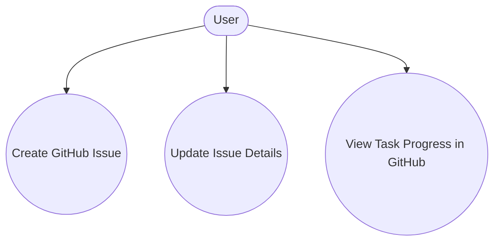

#### Orchestrator Use Cases

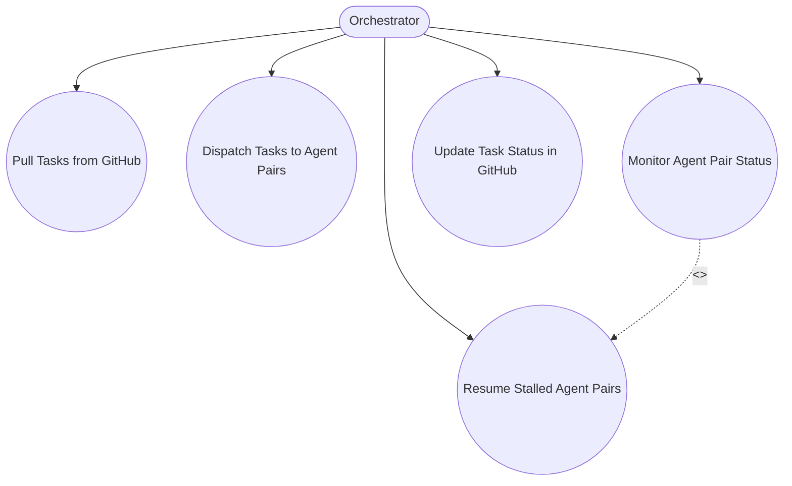

### Task Decomposition Use Cases

#### Agent Pair Pattern

All specialized agents follow the general Agent Pair pattern (Reviewer-Implementer) and work within the scope of gitflow branches (feature/, fix/, release/, etc.):

- **Reviewer**: 
  - Always starts by creating acceptance criteria (text or code tests) and documents them in the task
  - Creates the appropriate gitflow branch (feature/X, fix/Y, etc.) for the task
  - Builds/compiles code and runs tests, linters, etc. where applicable
  - Uses all available means to evaluate correctness against the acceptance criteria
  - Handles pull request creation and management

- **Implementer**: 
  - Always implements against the given criteria provided by the Reviewer
  - May build/compile and run tests during implementation
  - Works within the gitflow branch created by the Reviewer
  - Commits changes to the designated branch following gitflow conventions

#### Decomposition Pair Structure

The Decomposition Pair specializes this pattern for task analysis:
- **Decomposition-Reviewer**: Creates criteria for proper task analysis, evaluates tasks, determines complexity, decides on decomposition
- **Decomposition-Implementer**: Implements the technical aspects of task decomposition according to the criteria

#### Decomposition-Reviewer Use Cases

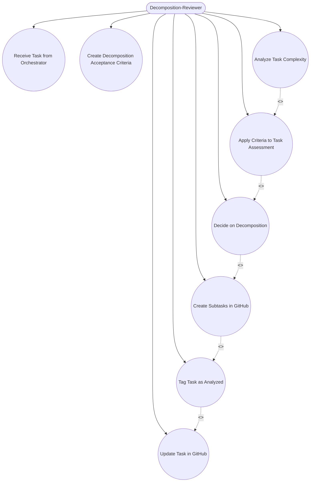

### Task Implementation Use Cases

#### Orchestrator Implementation Use Cases

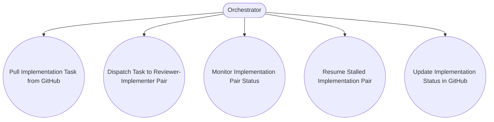

#### Reviewer Agent Use Cases

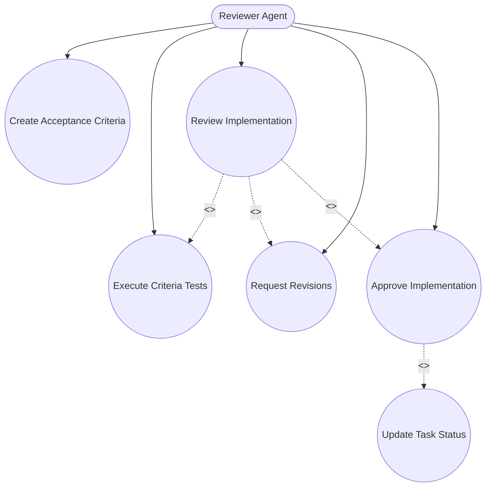

#### Implementer Agent Use Cases

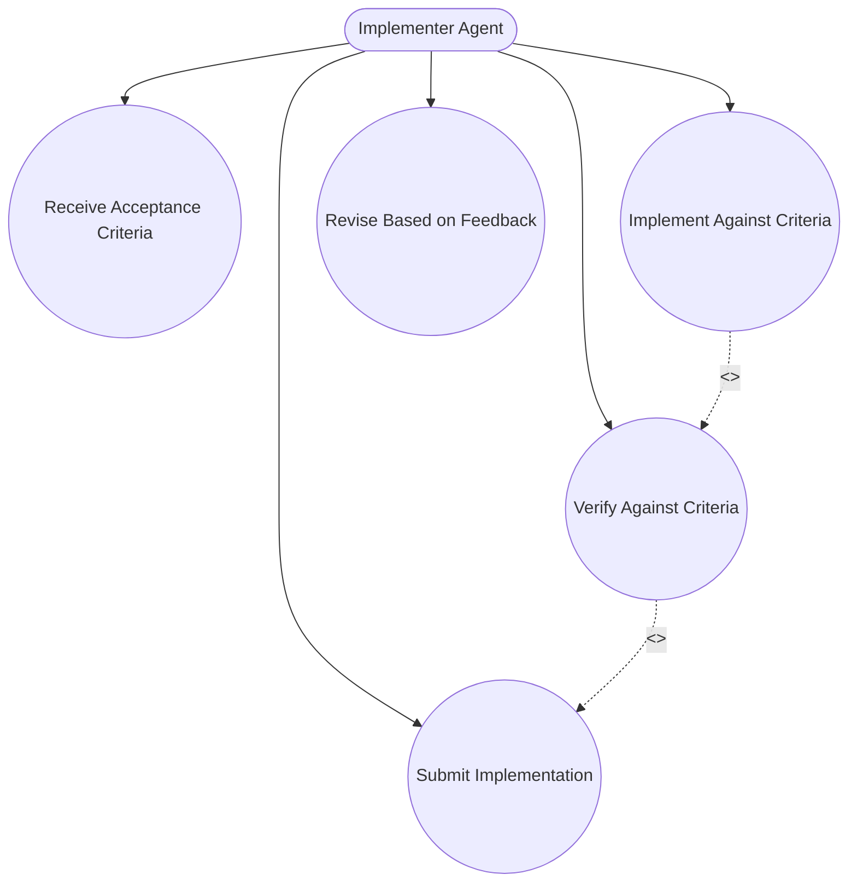

### Task Completion Use Cases

#### Orchestrator Completion Use Cases

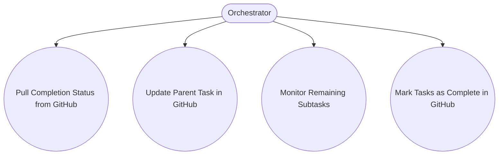

#### User Completion Use Cases

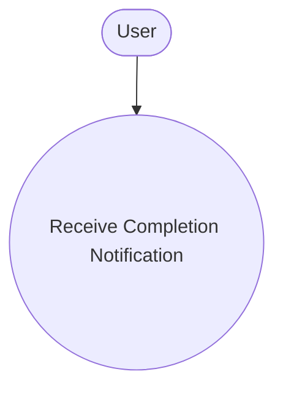

## Primary Use Cases

### Task Intake from GitHub

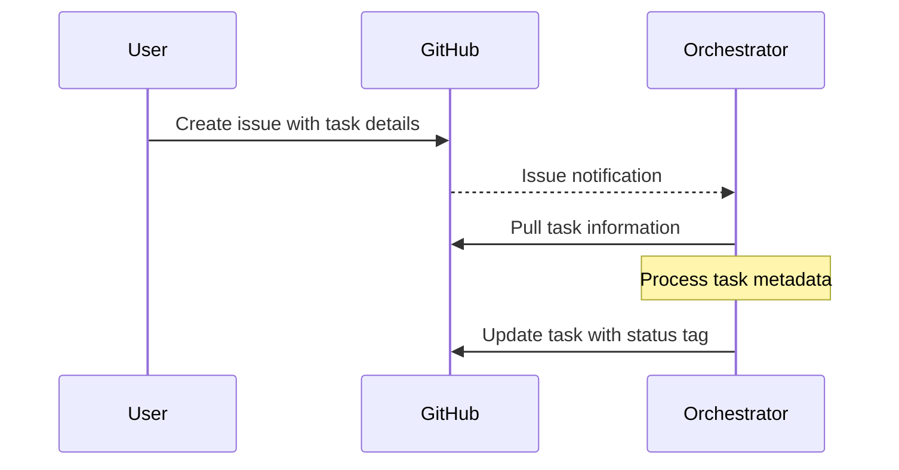

The Orchestrator's first responsibility is to pull tasks from GitHub:

1. User creates a GitHub issue with task details
2. GitHub notification triggers Orchestrator
3. Orchestrator pulls the task information from GitHub
4. Orchestrator processes the task metadata
5. Orchestrator updates the task with appropriate status tags

### Task Breakdown with Decomposition Pair

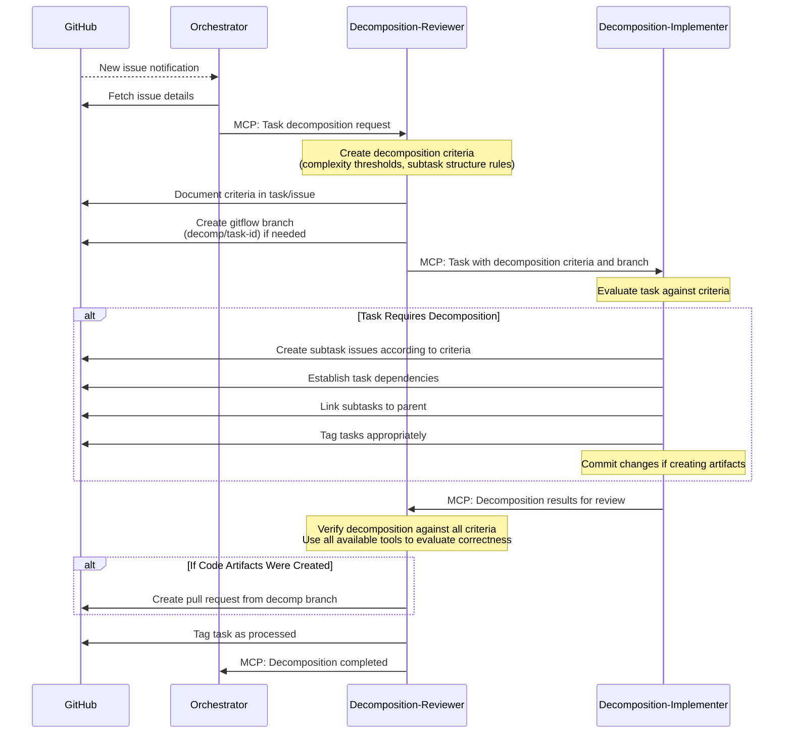

For new tasks, the Orchestrator delegates task breakdown to a specialized Decomposition Pair working within the gitflow workflow:

1. Orchestrator detects new GitHub issue requiring assessment
2. Orchestrator assigns the task to the Decomposition-Reviewer
3. Decomposition-Reviewer begins by creating decomposition criteria:
   - Defines thresholds for task complexity
   - Establishes rules for when and how to break down tasks
   - Sets requirements for proper subtask structure and relationships
4. Decomposition-Reviewer documents these criteria in the GitHub issue/task
5. Decomposition-Reviewer creates a gitflow branch (e.g., decomp/task-id)
6. Decomposition-Reviewer sends these criteria and branch info to the Decomposition-Implementer
6. Decomposition-Implementer evaluates the task against the criteria
7. If decomposition is needed, Decomposition-Implementer:
   - Creates subtask issues in GitHub according to criteria
   - Establishes dependencies between subtasks
   - Links subtasks to the parent issue
   - Tags tasks appropriately
   - Commits all changes to the decomposition branch
8. Decomposition-Implementer submits results to Decomposition-Reviewer
9. Decomposition-Reviewer verifies the decomposition meets all acceptance criteria
   - Uses all available tools and methods to evaluate correctness
   - Ensures all criteria are satisfied
10. Decomposition-Reviewer tags the original task as processed
11. Decomposition-Reviewer notifies Orchestrator that decomposition is complete

> **Note**: Pull Requests are only created when actual artifacts (such as code, documentation, or images) have been committed to the repository. For decomposition activities that only involve analyzing tasks and creating/linking GitHub issues, no PR is needed. See the [Pull Request Policy](#pull-request-policy) section for details.

### Task Assignment to Implementation Teams

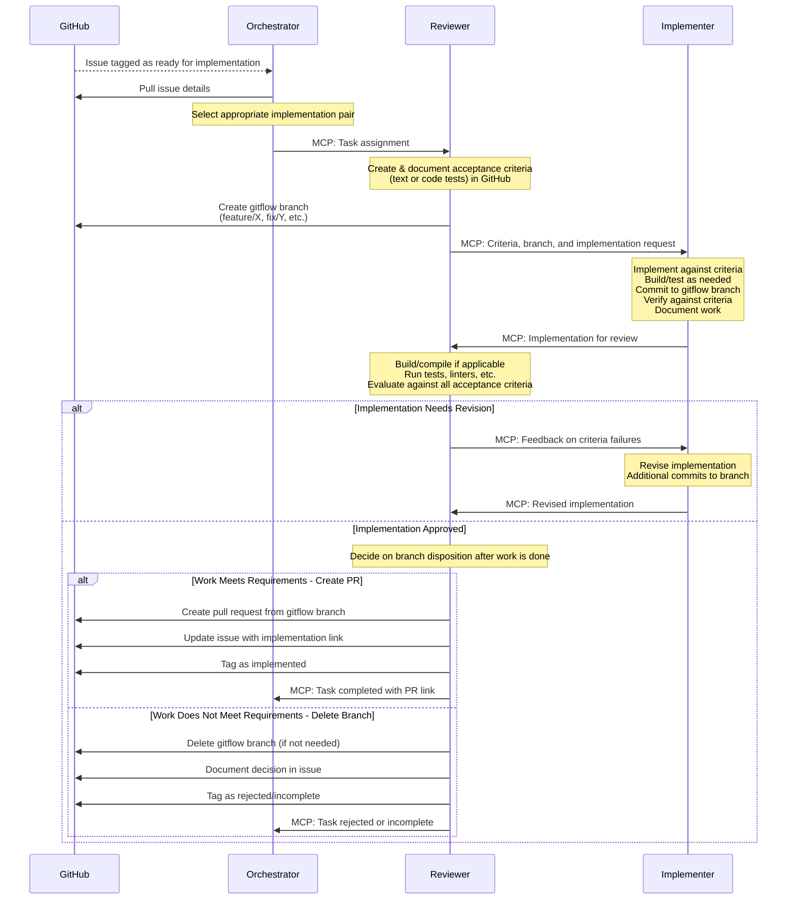

Once a task is analyzed and ready for implementation:

1. Orchestrator selects the appropriate Reviewer-Implementer pair based on:
   - Task domain and requirements
   - Agent capabilities and availability
   - Current workload balancing
2. Orchestrator assigns the task to the selected Reviewer
3. The Reviewer-Implementer pair works on the task following gitflow conventions:
   - Reviewer starts by creating acceptance criteria (text or code tests)
   - Reviewer documents these criteria in the GitHub issue/task
   - Reviewer creates the appropriate gitflow branch (feature/X, fix/Y, etc.)
   - Reviewer sends criteria, branch info, and implementation request to Implementer
   - Implementer implements solution against the given criteria
   - Implementer may build/compile and run tests during implementation
   - Implementer commits changes to the gitflow branch
   - Implementer verifies against criteria before submitting
   - Reviewer builds/compiles the code if applicable
   - Reviewer runs tests, linters, and other available tools
   - Reviewer evaluates implementation against all acceptance criteria
   - Reviewer provides feedback on criteria failures if needed
   - Implementer makes additional commits to address feedback
4. After the Implementer's work is complete, the Reviewer evaluates and decides:
   - If the work meets requirements and produces valuable artifacts:
     - Reviewer creates a pull request from the gitflow branch
     - Reviewer updates the GitHub issue with implementation link
     - Reviewer tags the issue as implemented
     - Reviewer notifies Orchestrator that the task is completed with PR link
   - If the work does not meet requirements or is not valuable:
     - Reviewer may delete the gitflow branch if it's not needed
     - Reviewer documents the decision in the GitHub issue
     - Reviewer tags the issue appropriately (rejected, incomplete, etc.)
     - Reviewer notifies Orchestrator of the task status

> **Note**: Pull Requests are only created when the work produced valuable artifacts that should be merged. The Reviewer has the authority to decide whether to create a PR or delete the branch based on the quality and value of the completed work. See the [Pull Request Policy](#pull-request-policy) section for details.

### Task Completion and Status Tracking

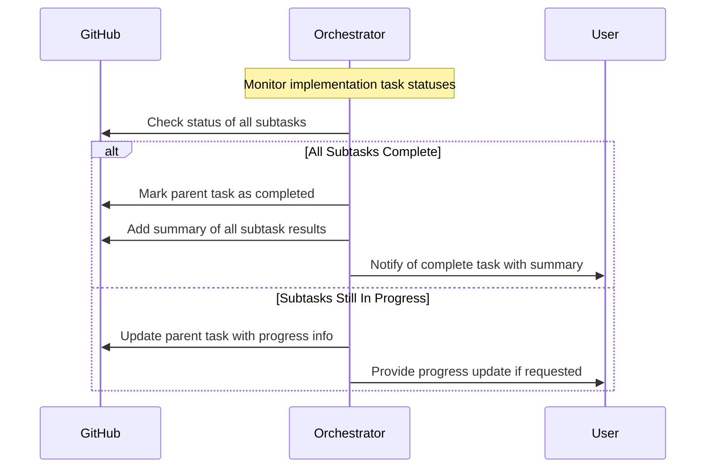

The Orchestrator manages task completion and status tracking:

1. Orchestrator monitors the status of all tasks and subtasks
2. For parent tasks with subtasks:
   - Orchestrator checks if all subtasks are complete
   - If complete, marks the parent task as completed
   - Adds a comprehensive summary of all subtask results
3. Orchestrator notifies users of task completion or progress as appropriate
4. Orchestrator maintains a complete task history and relationship map

## Workflow Diagrams

### Complete Task Lifecycle

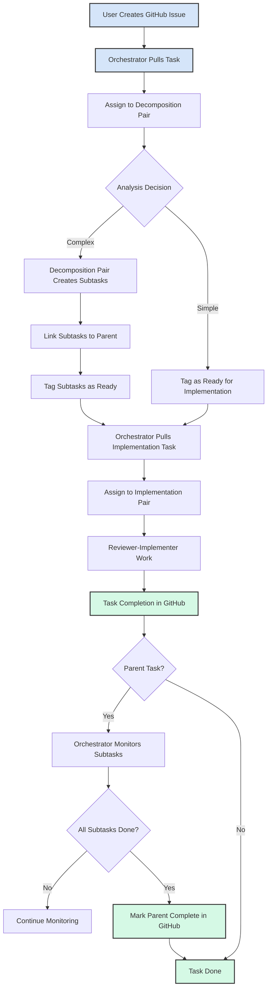

### Task Decomposition Flow

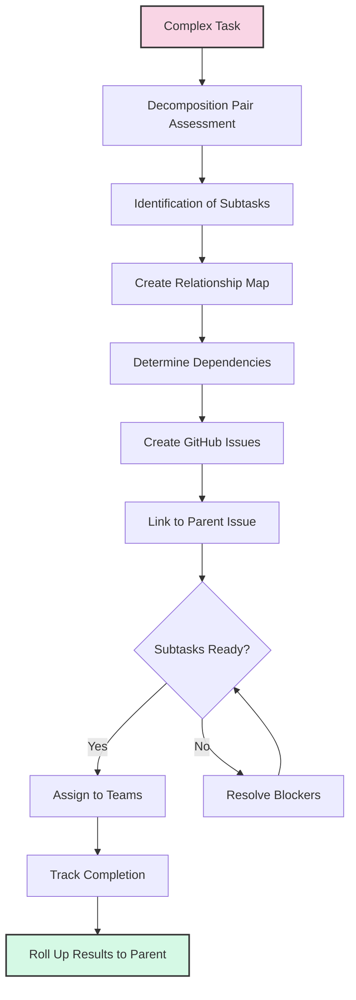

### Multi-Agent Orchestration

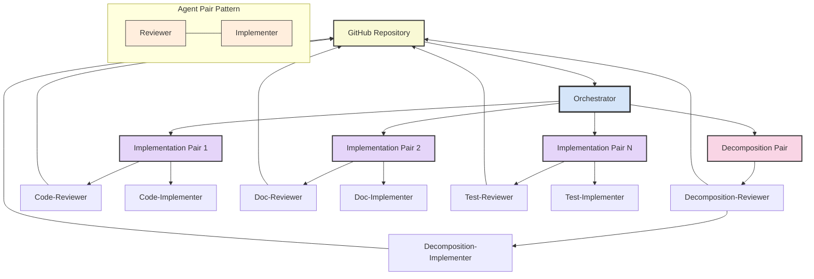

## Pull Request Policy

The system follows these guidelines for when to create Pull Requests:

1. **PRs ARE Required When**:
   - Actual artifacts (code, documentation, images, etc.) have been committed to the repository
   - Implementation tasks that produce valuable files stored in the repository
   - Any work that modifies or adds files tracked by git that should be kept

2. **PRs ARE NOT Required When**:
   - Tasks only involve creating or updating GitHub issues
   - Task decomposition that only results in issue creation/linking
   - Work that only modifies GitHub metadata (labels, assignments, etc.)
   - No files were committed to the repository
   - The Reviewer determines that the work does not meet quality standards or is not valuable

3. **Reviewer Authority**:
   - Reviewers have the final authority to decide whether work merits a PR
   - After work is completed, Reviewers evaluate the results and decide to:
     - Create a PR if the work should be merged into the codebase
     - Delete the branch if the work is not of sufficient quality/value
   - This decision must be documented in the GitHub issue

Examples:
- A Decomposition Pair that only creates subtasks in GitHub does NOT need a PR
- An Implementation Pair adding quality code files DOES need a PR
- An Implementation Pair whose work is deemed insufficient will have their branch deleted (NO PR)
- A Documentation Pair submitting well-formed diagrams or text files DOES need a PR
- Teams only updating issue status or adding comments do NOT need a PR

This policy ensures that PRs are used efficiently, only for changes that require formal review and integration into the codebase. It also gives Reviewers appropriate control over code quality by allowing them to reject work that doesn't meet standards.

## Edge Cases

The Orchestrator must handle various edge cases, including:

1. **Task Decomposition Refinement**: Sometimes the initial decomposition may need refinement
   - Orchestrator detects decomposition issues
   - Re-assigns to Decomposition Pair for refinement
   - Updates GitHub with refined decomposition

2. **Implementation Team Reassignment**: When a team cannot complete a task
   - Reviewer reports inability to complete
   - Orchestrator selects new team
   - Transfers context and updates GitHub

3. **Subtask Dependency Management**: When subtasks have dependencies
   - Orchestrator tracks dependency graph
   - Schedules subtasks according to dependencies
   - Handles blocked tasks appropriately

4. **Failure Recovery**: When a task implementation fails
   - Analyzes failure information
   - Determines recovery strategy
   - May create new issues for recovery work

---

🧭 **Navigation**
- [Architecture Diagrams Home](./README.md)
- [System Overview](../system-overview.md)
- [Consolidated MCP Workflow](./consolidated-mcp-workflow.md)
- [Orchestrator Component](../components/orchestrator.md)

*Last updated: May 17, 2025*