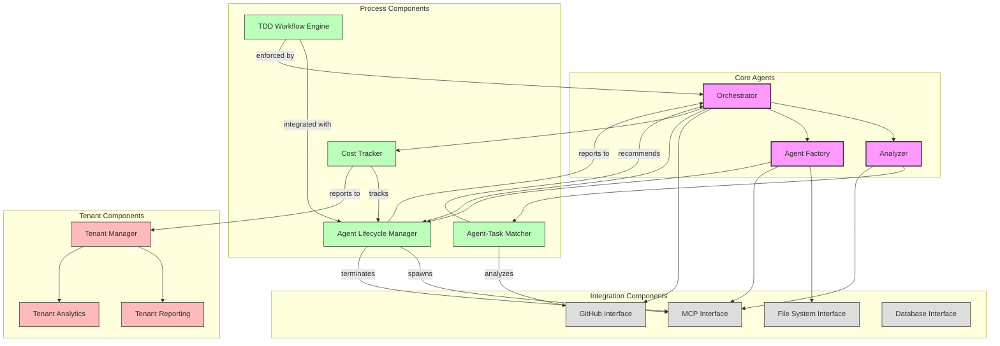
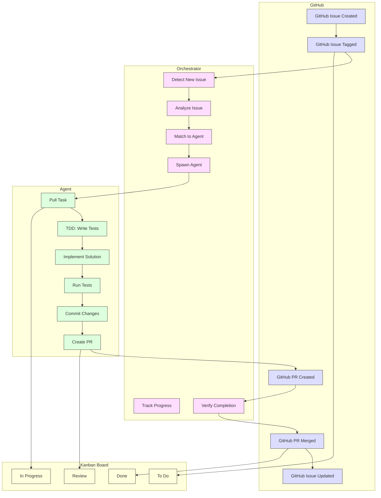
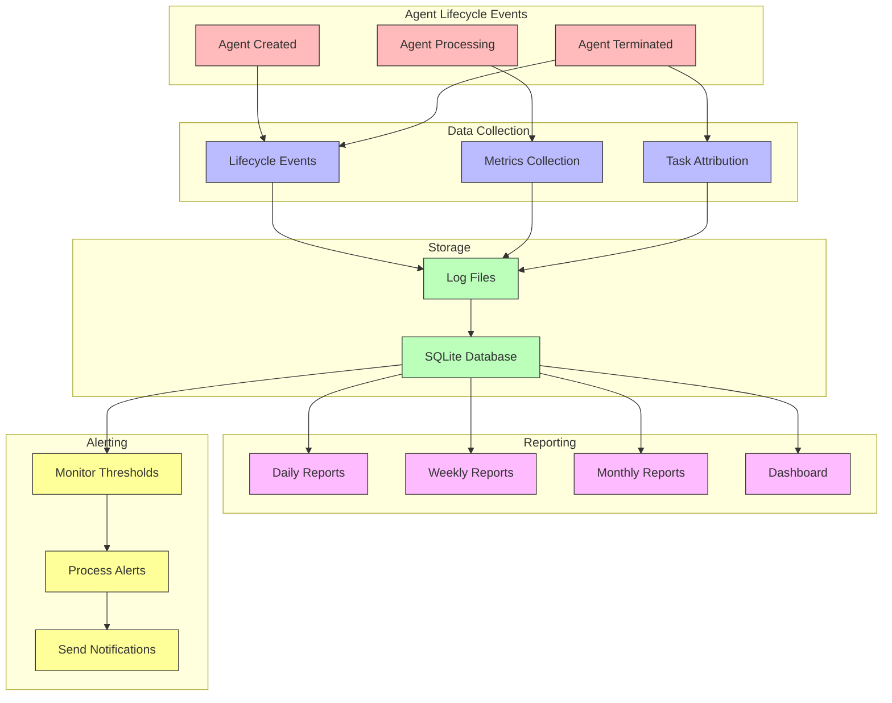

# 🏗️ System Architecture Diagrams

<!-- 📑 TABLE OF CONTENTS -->
- [🏗️ System Architecture Diagrams](#️-system-architecture-diagrams)
  - [📋 Overview](#-overview)
  - [🔄 High-Level System Architecture](#-high-level-system-architecture)
  - [🧩 Component Relationships](#-component-relationships)
  - [♻️ Agent Lifecycle Workflow](#️-agent-lifecycle-workflow)
  - [🔄 Task Processing Flow](#-task-processing-flow)
  - [💰 Tenant Cost Tracking Flow](#-tenant-cost-tracking-flow)

---

## 📋 Overview

This document provides visual representations of the multi-agent system architecture through various diagrams. These diagrams complement the written documentation by illustrating relationships, workflows, and interactions between components.

## 🔄 High-Level System Architecture

```mermaid
graph TD
    subgraph "Infrastructure Layer"
        GH[GitHub Repository]
        MCP[MCP Protocol]
        FS[File System]
        CCR[Claude Code Runtime]
    end

    subgraph "Core Components"
        O[Orchestrator Agent]
        A[Analyzer Agent]
        AF[Agent Factory]
    end

    subgraph "Agent Instances"
        D1[Implementer Agent 1]
        D2[Implementer Agent 2]
        T1[Tester Agent]
        R1[Reviewer Agent]
        Doc1[Documentation Agent]
        Dots1[...]
    end

    subgraph "Process Components"
        TEM[Task Execution Manager]
        ATM[Agent-Task Matcher]
        TDD[TDD Workflow Engine]
        ALM[Agent Lifecycle Manager]
        CT[Cost Tracker]
    end

    subgraph "Tenant Layer"
        T1M[Tenant 1 Management]
        T2M[Tenant 2 Management]
        DotsT[...]
    end

    GH <--> O
    O <--> A
    O <--> AF
    O <--> TEM
    A <--> ATM
    AF <--> ALM
    
    O <--> D1
    O <--> D2
    O <--> T1
    O <--> R1
    O <--> Doc1
    O <--> Dots1
    
    D1 <--> MCP
    D2 <--> MCP
    T1 <--> MCP
    R1 <--> MCP
    Doc1 <--> MCP
    Dots1 <--> MCP
    O <--> MCP
    A <--> MCP
    AF <--> MCP
    
    D1 <--> CCR
    D2 <--> CCR
    T1 <--> CCR
    R1 <--> CCR
    Doc1 <--> CCR
    Dots1 <--> CCR
    O <--> CCR
    A <--> CCR
    AF <--> CCR
    
    TEM --- TDD
    
    T1M --- CT
    T2M --- CT
    DotsT --- CT
    
    D1 --- FS
    D2 --- FS
    T1 --- FS
    R1 --- FS
    Doc1 --- FS
    Dots1 --- FS
    AF --- FS
    
    classDef core fill:#f9f,stroke:#333,stroke-width:2px;
    classDef agent fill:#bbf,stroke:#333,stroke-width:1px;
    classDef infra fill:#ddd,stroke:#333,stroke-width:1px;
    classDef process fill:#bfb,stroke:#333,stroke-width:1px;
    classDef tenant fill:#fbb,stroke:#333,stroke-width:1px;
    
    class O,A,AF core;
    class D1,D2,T1,R1,Doc1,Dots1 agent;
    class GH,MCP,FS,CCR infra;
    class TEM,ATM,TDD,ALM,CT process;
    class T1M,T2M,DotsT tenant;
```

## 🧩 Component Relationships

## ♻️ Agent Lifecycle Workflow

```mermaid
stateDiagram-v2
    [*] --> TaskDetection
    
    state TaskDetection {
        [*] --> NewTask
        NewTask --> AnalyzeTask
        AnalyzeTask --> FindAgent
        FindAgent --> AgentDecision
        
        state AgentDecision <<choice>>
        AgentDecision --> ExistingAgent : Agent found
        AgentDecision --> CreateNewAgent : No suitable agent
    }
    
    TaskDetection --> AgentSpawning
    
    state AgentSpawning {
        [*] --> PrepareConfig
        PrepareConfig --> LoadTemplate
        LoadTemplate --> ConfigureMCP
        ConfigureMCP --> LaunchAgent
        LaunchAgent --> RegisterAgent
    }
    
    AgentSpawning --> TaskExecution
    
    state TaskExecution {
        [*] --> PullTask
        PullTask --> AnalyzeRequirements
        AnalyzeRequirements --> WriteTDDTests
        WriteTDDTests --> Implement
        Implement --> TestImplementation
        TestImplementation --> RefactorCode
        
        state TaskDecision <<choice>>
        RefactorCode --> TaskDecision
        TaskDecision --> SubmitResults : Task completed
        TaskDecision --> Reassign : Task not feasible
    }
    
    TaskExecution --> AgentTermination
    
    state AgentTermination {
        [*] --> FinalizeTask
        FinalizeTask --> UnregisterAgent
        UnregisterAgent --> CleanupResources
        CleanupResources --> ArchiveLogs
    }
    
    AgentTermination --> [*]
    
    TaskExecution --> TaskReassignment : Reassign
    
    state TaskReassignment {
        [*] --> DocumentReason
        DocumentReason --> UpdateIssue
        UpdateIssue --> CreateNewIssue
        CreateNewIssue --> LinkIssues
    }
    
    TaskReassignment --> TaskDetection : Restart process
```

## 🔄 Task Processing Flow

## 💰 Tenant Cost Tracking Flow

---

<!-- 🧭 NAVIGATION -->
**Navigation**: [Home](../README.md) | [System Overview](../system-overview.md)

*Last updated: 2025-05-17*