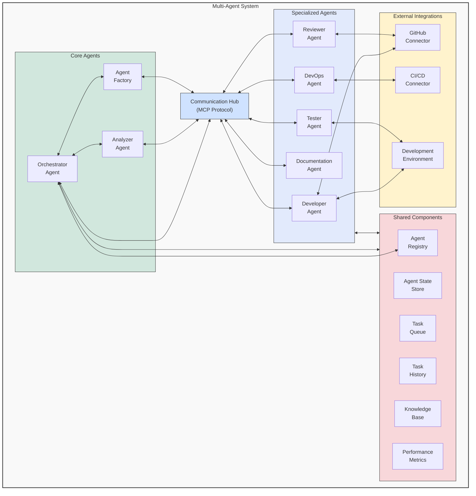

# 🏗️ System Overview Diagram

This diagram illustrates the high-level architecture of the multi-agent system, showing the key components and their relationships.

## Component Descriptions

1. **Core Agents**:
   - **Orchestrator Agent**: Manages task distribution, coordinates between agents, and oversees the task lifecycle
   - **Analyzer Agent**: Analyzes requirements, breaks down tasks, and creates initial implementation plans
   - **Agent Factory**: Creates and configures new agent instances based on task requirements

2. **Communication Hub**:
   - Facilitates STDIO-based communication between agents using the MCP Protocol
   - Provides standardized message passing and formatting
   - Handles message routing and delivery

3. **Specialized Agents**:
   - **Developer Agent**: Implements code changes based on task requirements
   - **Tester Agent**: Writes and executes tests to verify implementations
   - **Reviewer Agent**: Reviews code changes and ensures standards compliance
   - **Documentation Agent**: Creates and maintains documentation
   - **DevOps Agent**: Handles deployment, infrastructure, and CI/CD processes

4. **Shared Components**:
   - **Agent Registry**: Maintains registry of all active agents and their capabilities
   - **Agent State Store**: Persists agent state across sessions
   - **Task Queue**: Manages pending tasks prioritized for execution
   - **Task History**: Records task execution history and outcomes
   - **Knowledge Base**: Provides shared knowledge across agents
   - **Performance Metrics**: Tracks system performance and agent efficiency

5. **External Integrations**:
   - **GitHub Connector**: Interfaces with GitHub repositories for code management
   - **CI/CD Connector**: Connects to CI/CD pipelines for build and deployment
   - **Development Environment**: Provides isolated environments for development work

## Integration with Component Responsibilities

This diagram aligns with the [Component Responsibilities Matrix](../component-responsibilities.md), which defines clear boundaries between components to resolve contradictions. The diagram visually represents the relationships defined in that document.

## Relationship to Terminology Standard

All component names in this diagram conform to the [Standardized Terminology](../terminology-standard.md) document, which establishes consistent naming across the architecture documentation.

---

<!-- 🧭 NAVIGATION -->
**Navigation**: [Home](../README.md) | [Architecture](../README.md) | [Diagrams](./README.md) | [Component Responsibilities](../component-responsibilities.md) | [Terminology Standard](../terminology-standard.md)

*Last updated: 2025-05-17*