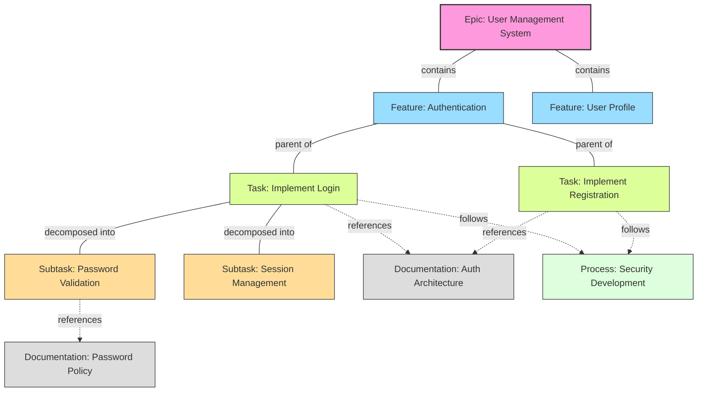
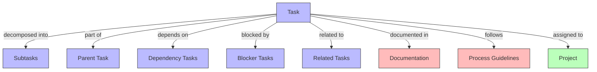

# 🔄 Task Relationship Model

<!-- 📑 TABLE OF CONTENTS -->
- [🔄 Task Relationship Model](#-task-relationship-model)
  - [📋 Overview](#-overview)
  - [🔄 Task Hierarchy and Relationships](#-task-hierarchy-and-relationships)
  - [📝 Task Content Structure](#-task-content-structure)
  - [🔗 Task Reference Types](#-task-reference-types)
  - [🔄 Task Relationship Maintenance](#-task-relationship-maintenance)

---

## 📋 Overview

This document visualizes the task relationship model used in the multi-agent system. GitHub issues serve as the primary task management mechanism, with special attention to maintaining proper relationships between tasks, documentation, and processes.

## 🔄 Task Hierarchy and Relationships



## 📝 Task Content Structure

GitHub issues are structured to maintain these relationships:

```
# Issue Title: Implement Password Validation

## Description
Implement robust password validation to ensure user passwords meet security requirements.

## Acceptance Criteria
- Password must be at least 8 characters
- Must include at least one uppercase letter, one lowercase letter, and one number
- Must include at least one special character
- Must not be one of the commonly used passwords

## Parent Tasks
- #123: Implement Login System
- #100: Authentication Feature

## Related Tasks
- #125: Session Management
- #126: Error Handling for Authentication

## Documentation
- [Password Security Policy](docs/security/password-policy.md)
- [Authentication System Architecture](docs/architecture/auth-system.md)

## Process Guidelines
- [Security Development Lifecycle](docs/processes/security-development.md)
- [TDD for Security Features](docs/processes/tdd-security.md)

## Project
- User Management System (PROJECT_ID)
```

## 🔗 Task Reference Types

The system maintains various types of task relationships:



## 🔄 Task Relationship Maintenance

Agents maintain task relationships using GitHub CLI:

```bash
# Creating a new subtask linked to a parent
create_subtask() {
  parent_id="$1"
  title="$2"
  description="$3"
  
  # Get parent information
  parent_title=$(gh issue view "$parent_id" --json title -q .title)
  
  # Create subtask with reference to parent
  gh issue create --title "$title" --body "## Description
$description

## Parent Task
- #$parent_id: $parent_title

## Documentation
$(gh issue view "$parent_id" --json body -q '.body | capture("## Documentation(?:\\n|.)*?(?:##|$)") | .[0]')

## Process Guidelines
$(gh issue view "$parent_id" --json body -q '.body | capture("## Process Guidelines(?:\\n|.)*?(?:##|$)") | .[0]')" --label "subtask"
  
  # Get the ID of the newly created issue
  subtask_id=$(gh issue list --limit 1 --json number,title -q '.[] | select(.title == "'"$title"'") | .number')
  
  # Update parent task to reference the subtask
  parent_body=$(gh issue view "$parent_id" --json body -q .body)
  
  # Check if Subtasks section exists
  if echo "$parent_body" | grep -q "## Subtasks"; then
    # Append to existing Subtasks section
    updated_body=$(echo "$parent_body" | sed "/## Subtasks/a - #$subtask_id: $title")
  else
    # Create Subtasks section
    updated_body="$parent_body

## Subtasks
- #$subtask_id: $title"
  fi
  
  # Update parent issue
  gh issue edit "$parent_id" --body "$updated_body"
  
  echo "Created subtask #$subtask_id and updated parent task #$parent_id"
}

# Adding documentation references to a task
add_documentation_references() {
  issue_id="$1"
  shift
  doc_references=("$@")
  
  # Get current issue body
  body=$(gh issue view "$issue_id" --json body -q .body)
  
  # Check if Documentation section exists
  if echo "$body" | grep -q "## Documentation"; then
    # Prepare new references
    new_refs=""
    for ref in "${doc_references[@]}"; do
      new_refs="$new_refs\\n- $ref"
    done
    
    # Append to existing Documentation section
    updated_body=$(echo "$body" | sed "/## Documentation/a $new_refs")
  else
    # Create Documentation section
    doc_section="

## Documentation"
    for ref in "${doc_references[@]}"; do
      doc_section="$doc_section
- $ref"
    done
    
    updated_body="$body$doc_section"
  fi
  
  # Update issue
  gh issue edit "$issue_id" --body "$updated_body"
  
  echo "Updated documentation references for issue #$issue_id"
}
```

---

<!-- 🧭 NAVIGATION -->
**Navigation**: [Home](../README.md) | [System Overview](../system-overview.md) | [Diagrams Index](./README.md)

*Last updated: 2024-05-16*