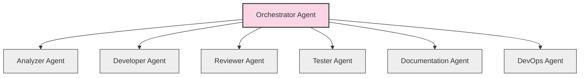

# 🔄 Model Context Protocol (MCP) Interface

<!-- 📑 TABLE OF CONTENTS -->
- [🔄 Model Context Protocol (MCP) Interface](#-model-context-protocol-mcp-interface)
  - [📋 Overview](#-overview)
  - [🔌 STDIO-Based MCP Architecture](#-stdio-based-mcp-architecture)
  - [📨 Message Format](#-message-format)
  - [🔄 Message Types](#-message-types)
  - [📊 MCP Debug Mode](#-mcp-debug-mode)
  - [🔑 Implementation Requirements](#-implementation-requirements)
  - [🧪 Testing Considerations](#-testing-considerations)
  - [📚 Launch Scripts](#-launch-scripts)

---

## 📋 Overview

The Model Context Protocol (MCP) is the primary communication mechanism between agents in the system. Each agent is a Claude instance running with `claude mcp serve` command and communicating with other agents via MCP calls. This document defines how the Claude MCP protocol is implemented in our multi-agent system.

## 🔌 STDIO-Based MCP Architecture

In our implementation, each Claude instance operates using the `claude mcp serve` command and communicates through standard input and output (STDIO):

1. **MCP Servers**: Each agent runs as an MCP server that:
   - Operates in its own workspace directory
   - Is launched with a specific system prompt file
   - Processes requests via STDIO
   - Maintains its context for conversations

2. **MCP Communication**: Agents communicate by:
   - Using the `@mcp_call` and `@mcp_response` syntax via STDIO
   - Specifying the recipient agent by name
   - Sending JSON-formatted payloads
   - Operating in a hierarchical arrangement with the Orchestrator Agent at the center



## 📨 Message Format

Claude MCP messages use a specific syntax format:

For MCP calls:
```
@mcp_call
{
  "recipient": "agent-name",
  "action": "action-type",
  "task_id": "task-identifier",
  "payload": {
    // Task-specific payload
  }
}
@end_mcp_call
```

For MCP responses:
```
@mcp_response
{
  "status": "completed|in_progress|blocked|failed",
  "task_id": "task-identifier",
  "result": {
    // Result payload
  }
}
@end_mcp_response
```

## 🔄 Message Types

The system uses the following standardized MCP message types:

1. **Task Assignment**: From Orchestrator Agent to any specialized agent
   - Task details, requirements, and constraints
   - Expected deliverables and priorities
   - Task identification information
   
   Example:
   ```
   @mcp_call
   {
     "recipient": "developer",
     "action": "assign_task",
     "task_id": "TASK-123",
     "payload": {
       "title": "Implement feature X",
       "description": "Create a component that...",
       "requirements": [
         "Must handle edge cases",
         "Should integrate with existing systems"
       ],
       "priority": "high"
     }
   }
   @end_mcp_call
   ```

2. **Task Analysis**: From Orchestrator Agent to Analyzer Agent
   - Task details requiring analysis
   - Context for analysis
   - Analysis parameters
   
   Example:
   ```
   @mcp_call
   {
     "recipient": "analyzer",
     "action": "analyze_task",
     "task_id": "TASK-123",
     "payload": {
       "description": "Create a component that...",
       "context": "This component will be part of...",
       "parameters": {
         "depth": "detailed",
         "focus": "implementation_approach"
       }
     }
   }
   @end_mcp_call
   ```

3. **Task Decomposition**: From Analyzer Agent to Orchestrator Agent
   - Analysis results
   - Proposed subtasks
   - Dependencies between subtasks
   
   Example:
   ```
   @mcp_response
   {
     "status": "completed",
     "task_id": "TASK-123",
     "result": {
       "analysis": "This task can be broken down into...",
       "subtasks": [
         {
           "id": "SUBTASK-1",
           "title": "Design database schema",
           "description": "Create the required tables and relationships",
           "estimated_complexity": "medium"
         },
         {
           "id": "SUBTASK-2",
           "title": "Implement API endpoints",
           "description": "Create REST endpoints for...",
           "estimated_complexity": "high",
           "dependencies": ["SUBTASK-1"]
         }
       ]
     }
   }
   @end_mcp_response
   ```

4. **Implementation Response**: From Developer Agent to Orchestrator Agent
   - Implementation details and code
   - Test results
   - Documentation
   
   Example:
   ```
   @mcp_response
   {
     "status": "completed",
     "task_id": "TASK-123",
     "result": {
       "code": "// Implementation code here...",
       "documentation": "# Documentation\n...",
       "test_results": {
         "passed": 15,
         "failed": 0,
         "coverage": "92%"
       },
       "pull_request": {
         "id": "PR-456",
         "url": "https://github.com/org/repo/pull/456"
       }
     }
   }
   @end_mcp_response
   ```

5. **Review Request**: From Orchestrator Agent to Reviewer Agent
   - Task and implementation details
   - Review criteria
   - Pull request information
   
   Example:
   ```
   @mcp_call
   {
     "recipient": "reviewer",
     "action": "review_implementation",
     "task_id": "TASK-123",
     "payload": {
       "pull_request": {
         "id": "PR-456",
         "url": "https://github.com/org/repo/pull/456"
       },
       "criteria": [
         "Code quality",
         "Test coverage",
         "Documentation completeness"
       ]
     }
   }
   @end_mcp_call
   ```

6. **Status Update**: From any agent to Orchestrator Agent
   - Current status of assigned task
   - Progress information
   - Blockers or issues
   
   Example:
   ```
   @mcp_response
   {
     "status": "in_progress",
     "task_id": "TASK-123",
     "result": {
       "progress": 75,
       "current_step": "Implementing error handling",
       "estimated_completion": "2025-05-18T15:30:00Z",
       "blockers": []
     }
   }
   @end_mcp_response
   ```

7. **Question/Blocker**: From any agent to Orchestrator Agent
   - Questions that need answering
   - Blockers preventing progress
   - Required clarifications
   
   Example:
   ```
   @mcp_response
   {
     "status": "blocked",
     "task_id": "TASK-123",
     "result": {
       "questions": [
         "Should the API use pagination?",
         "What is the expected payload format?"
       ],
       "blockers": [
         "Missing API specification document"
       ]
     }
   }
   @end_mcp_response
   ```

## 📊 MCP Debug Mode

All agents run with MCP debug mode enabled (`--mcp-debug`), which provides:

1. **Verbose Logging**: Detailed logs of all MCP traffic
2. **Message Inspection**: Complete message contents for debugging
3. **Timing Information**: Performance metrics for message processing
4. **Connection Diagnostics**: Network and connection status details
5. **Context Tracking**: Information about context usage and management

Debug logs are stored in a structured format for analysis and troubleshooting.

## 🔑 Implementation Requirements

Agent implementations must adhere to these requirements:

1. **Process Management**:
   - Proper agent initialization
   - Clean process termination
   - Process monitoring and health checks

2. **Message Processing**:
   - Validation of incoming messages
   - Proper message routing
   - Error handling and recovery
   - Consistent status reporting

3. **State Management**:
   - Persistence of task state
   - Context management
   - Transaction logging
   - State recovery mechanisms

4. **Security Considerations**:
   - Sensitive data handling
   - Authentication between agents
   - Input validation and sanitization
   - Access control enforcement

## 🧪 Testing Considerations

Testing the MCP implementation requires:

1. **Agent Isolation Testing**: Verify each agent can function independently
2. **Communication Testing**: Validate message exchange between agents
3. **Error Handling Testing**: Confirm proper handling of communication issues
4. **Integration Testing**: Test the complete agent network
5. **End-to-End Testing**: Verify complete task workflows

## 📚 Launch Scripts

Launch script for a multi-agent system with STDIO-based MCP:

```bash
#!/bin/bash
# launch-agent-system.sh

# Get directory where script is located
SCRIPT_DIR="$(cd "$(dirname "${BASH_SOURCE[0]}")" && pwd)"

# Create workspace and log directories
WORKSPACE_DIR="${SCRIPT_DIR}/workspace"
LOG_DIR="${SCRIPT_DIR}/logs"
mkdir -p "$WORKSPACE_DIR/orchestrator" "$WORKSPACE_DIR/analyzer" "$WORKSPACE_DIR/developer" "$WORKSPACE_DIR/reviewer"
mkdir -p "$LOG_DIR"

# System prompt files
ORCHESTRATOR_PROMPT="${SCRIPT_DIR}/prompts/orchestrator-prompt.md"
ANALYZER_PROMPT="${SCRIPT_DIR}/prompts/analyzer-prompt.md"
DEVELOPER_PROMPT="${SCRIPT_DIR}/prompts/developer-prompt.md"
REVIEWER_PROMPT="${SCRIPT_DIR}/prompts/reviewer-prompt.md"

# Check if system prompt files exist
for PROMPT_FILE in "$ORCHESTRATOR_PROMPT" "$ANALYZER_PROMPT" "$DEVELOPER_PROMPT" "$REVIEWER_PROMPT"; do
  if [ ! -f "$PROMPT_FILE" ]; then
    echo "System prompt file not found: $PROMPT_FILE"
    exit 1
  fi
done

# Launch Agent MCP Servers in background
echo "Starting Developer MCP server..."
cd "$WORKSPACE_DIR/developer"
nohup claude mcp serve --system-prompt "$(cat "$DEVELOPER_PROMPT")" \
  --print --debug --verbose --mcp-debug > "$LOG_DIR/developer.log" 2>&1 &
DEVELOPER_PID=$!
echo "Developer started with PID: $DEVELOPER_PID"

echo "Starting Reviewer MCP server..."
cd "$WORKSPACE_DIR/reviewer"
nohup claude mcp serve --system-prompt "$(cat "$REVIEWER_PROMPT")" \
  --print --debug --verbose --mcp-debug > "$LOG_DIR/reviewer.log" 2>&1 &
REVIEWER_PID=$!
echo "Reviewer started with PID: $REVIEWER_PID"

echo "Starting Analyzer MCP server..."
cd "$WORKSPACE_DIR/analyzer"
nohup claude mcp serve --system-prompt "$(cat "$ANALYZER_PROMPT")" \
  --print --debug --verbose --mcp-debug > "$LOG_DIR/analyzer.log" 2>&1 &
ANALYZER_PID=$!
echo "Analyzer started with PID: $ANALYZER_PID"

# Wait for agents to initialize
sleep 5

# Launch Orchestrator in interactive terminal
echo "Starting Orchestrator in interactive mode..."
cd "$WORKSPACE_DIR/orchestrator"
osascript -e "tell application \"Terminal\" to do script \"cd '$WORKSPACE_DIR/orchestrator' && claude mcp serve --system-prompt '$(cat "$ORCHESTRATOR_PROMPT")' --interactive --print --debug --verbose\""

echo "Agent system launched successfully!"
echo "Orchestrator: Interactive terminal"
echo "Developer: PID $DEVELOPER_PID, log: $LOG_DIR/developer.log"
echo "Reviewer: PID $REVIEWER_PID, log: $LOG_DIR/reviewer.log"
echo "Analyzer: PID $ANALYZER_PID, log: $LOG_DIR/analyzer.log"
echo ""
echo "To stop background agents, run: kill $DEVELOPER_PID $REVIEWER_PID $ANALYZER_PID"
```

---

<!-- 🧭 NAVIGATION -->
**Navigation**: [Home](../README.md) | [Interface Index](./README.md) | [GitHub Interface](./github-interface.md) | [Component Responsibilities](../component-responsibilities.md) | [Terminology Standard](../terminology-standard.md)

*Last updated: 2025-05-17*