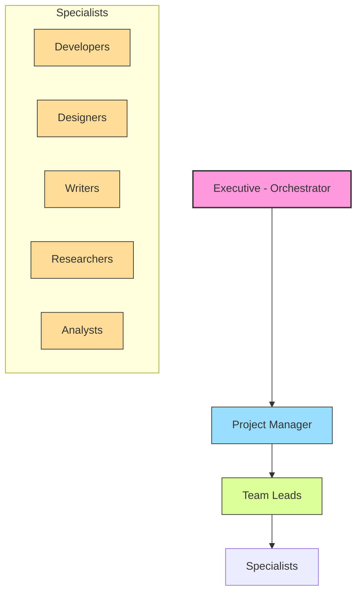
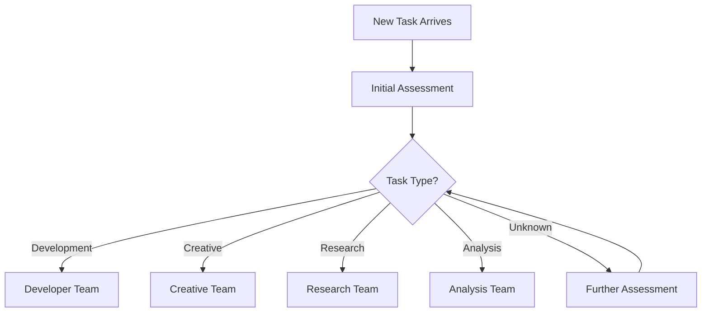
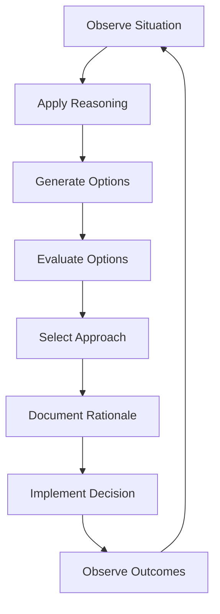
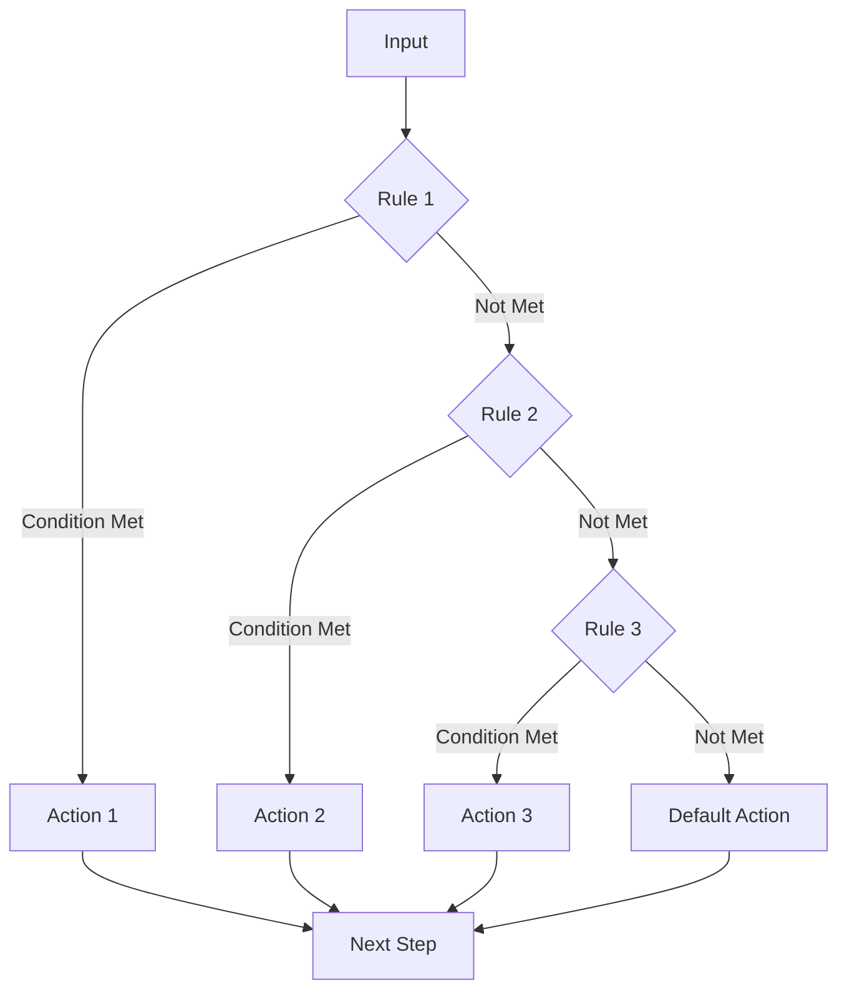

# 🏢 Human Organizational Model

<!-- 📑 TABLE OF CONTENTS -->
- [🏢 Human Organizational Model](#-human-organizational-model)
  - [📋 Overview](#-overview)
  - [🏗️ Organizational Structure](#️-organizational-structure)
  - [👥 Team Dynamics](#-team-dynamics)
  - [🔄 Natural Workflows](#-natural-workflows)
  - [📝 Decision Making](#-decision-making)
  - [📊 Coordination Mechanisms](#-coordination-mechanisms)
  - [🧠 Reasoning vs. Rigid Processes](#-reasoning-vs-rigid-processes)
  - [⚙️ Implementation Approach](#️-implementation-approach)

---

## 📋 Overview

This document outlines how our multi-agent system models an efficient human organization rather than relying on rigid, complex workflow engines. The system emphasizes natural communication patterns, reasoning-based decision making, and flexible coordination mechanisms that mirror how effective human teams operate in professional environments.

## 🏗️ Organizational Structure

The system follows a team-based organizational structure:



Key aspects of this structure:

1. **Mimics Natural Hierarchy**: Follows familiar organizational patterns that work in human teams
2. **Clear Responsibilities**: Each role has well-defined responsibilities without rigid process constraints
3. **Dynamic Team Formation**: Teams form naturally around tasks based on requirements
4. **Minimal Management Overhead**: Lean management structure focused on coordination rather than control

## 👥 Team Dynamics

The system models these key dynamics from effective human teams:

### 1. Team Formation & Composition

Teams form organically around tasks based on:

- **Task Requirements**: The specific skills needed for the task
- **Availability**: Who is available to work on the task
- **Prior Collaboration**: History of successful collaboration
- **Domain Knowledge**: Relevant experience in the problem domain

Implementation approach:

```bash
# Example of a natural team formation prompt template
cat << EOF > ./prompts/team-formation.txt
You are the Project Manager responsible for assembling a team for a new task.

Task: {{TASK_DESCRIPTION}}
Required skills: {{REQUIRED_SKILLS}}
Available specialists: {{AVAILABLE_SPECIALISTS}}

Based on your understanding of effective team composition:
1. Which specialists would you select for this task?
2. Who should lead this team?
3. What communication structure would you recommend?
4. How should the team coordinate their efforts?

Consider compatibility, prior collaboration history, and balanced skill distribution.
EOF
```

### 2. Emergent Leadership

Leadership emerges based on:

- **Expertise Relevance**: The specialist whose expertise most closely matches the task domain
- **Experience**: Prior leadership success on similar tasks
- **Coordination Skills**: Demonstrated ability to coordinate team efforts

### 3. Implicit Knowledge Sharing

Information flows naturally through:

- **Context Sharing**: Team members providing relevant context to each other
- **Peer Learning**: Specialists learning from each other during collaboration
- **Documented Insights**: Capturing key learnings during the process

## 🔄 Natural Workflows

The system avoids rigid workflow engines in favor of natural process flows:

### Task Triage & Assignment



This flow uses reasoning prompts rather than rule engines:

```bash
# Example triage prompt
cat << EOF > ./prompts/task-triage.txt
You are the Orchestrator evaluating a new task.

Task: {{TASK_DESCRIPTION}}

Please assess this task to determine:
1. What type of task is this? (development, creative, research, analysis, other)
2. What specialist skills would be most relevant?
3. What team composition would be most effective?
4. What's an appropriate priority level?
5. Are there similar past tasks we can learn from?

Explain your reasoning for each conclusion.
EOF
```

### Knowledge Work Process

The natural flow of knowledge work follows human patterns:

1. **Initial Understanding**: Grasping the context and requirements
2. **Research & Exploration**: Gathering relevant information
3. **Solution Formation**: Developing potential approaches
4. **Implementation**: Executing on selected approach
5. **Review & Refinement**: Evaluating and improving the work
6. **Integration**: Connecting output with the broader context

## 📝 Decision Making

The system models human-like decision making patterns rather than algorithmic rules:

### 1. Reasoning-Based Approach

Agents make decisions using reasoning prompts that encourage:

- **Considering Multiple Factors**: Weighing various relevant considerations
- **Exploring Alternatives**: Generating multiple potential options
- **Applying Experience**: Leveraging lessons from similar past situations
- **Rationale Articulation**: Explaining the reasoning behind decisions

Example reasoning prompt:

```bash
cat << EOF > ./prompts/decision-reasoning.txt
You are a {{SPECIALIST_TYPE}} considering how to approach {{TASK_DESCRIPTION}}.

Given the following constraints:
{{CONSTRAINTS}}

And considering these relevant factors:
{{FACTORS}}

Please:
1. Generate 2-3 potential approaches
2. Evaluate the pros and cons of each
3. Recommend the best approach
4. Explain your reasoning process
5. Outline how you'd validate your decision
EOF
```

### 2. Consensus Building

For important decisions, the system mimics collaborative consensus:

- **Shared Context**: Ensuring all parties have the same information
- **Individual Perspectives**: Collecting views from different specialists
- **Synthesized Decision**: Finding the balanced path forward
- **Commitment Check**: Ensuring all parties understand and support the decision

## 📊 Coordination Mechanisms

Instead of rigid workflows, the system uses these human-like coordination mechanisms:

### 1. Asynchronous Updates

Agents provide status updates that are processed when appropriate:

```bash
# Example status update script
cat << EOF > ./scripts/status-update.sh
#!/bin/bash

AGENT_ID="\$1"
TASK_ID="\$2"
STATUS_MESSAGE="\$3"

# Post status update to GitHub issue
gh issue comment \$TASK_ID --body "**Status Update from \$AGENT_ID**:
\$STATUS_MESSAGE

Current status: \$(get_agent_status \$AGENT_ID)
Next steps: \$(get_next_steps \$AGENT_ID \$TASK_ID)
Estimated completion: \$(get_estimate \$AGENT_ID \$TASK_ID)"
EOF
```

### 2. Checkpoints & Synchronization

Natural checkpoints occur at key decision points, not based on rigid schedules:

- **Completion of Substantial Work**: After finishing a significant component
- **Unexpected Discoveries**: When new information changes assumptions
- **Blocking Issues**: When progress is impeded
- **Milestone Achievement**: Upon reaching a defined milestone

### 3. Ambient Awareness

The system maintains "ambient awareness" of activities:

- **Activity Feeds**: Consolidated views of ongoing work
- **Status Boards**: Visual Kanban-style representations
- **Update Notifications**: Relevant status changes for related tasks

## 🧠 Reasoning vs. Rigid Processes

The key difference between this approach and workflow engines:

### Reasoning Model Approach



### Workflow Engine Approach



Key advantages of the reasoning approach:

1. **Adaptability**: Adjusts to new situations without rule updates
2. **Explainability**: Decisions include rationale, not just outcomes
3. **Learning Integration**: Easily incorporates new experiences
4. **Edge Case Handling**: Gracefully manages unusual situations
5. **Human-Like Collaboration**: Feels more natural to human collaborators

## ⚙️ Implementation Approach

To implement this organizational model:

### 1. Prompt-Based Reasoning

Use detailed prompts that encourage Claude's reasoning capabilities:

```bash
cat << EOF > ./prompts/reasoning-template.txt
# {{ROLE}} Reasoning Process

## Current Context
{{CONTEXT}}

## Objective
{{OBJECTIVE}}

## Relevant Considerations
{{CONSIDERATIONS}}

## Reasoning Process
Think through this situation step by step:
1. What are the key factors that need to be considered?
2. What approaches could address this situation?
3. What are the trade-offs of each approach?
4. What is the most appropriate action given the context?
5. What might go wrong with this approach?
6. How can potential issues be mitigated?

## Decision
Based on your reasoning, what action would you take?

## Rationale
Explain why this is the best course of action.
EOF
```

### 2. Git Hook Integration

Use Git hooks to inject contextual prompts:

```bash
cat << EOF > ./scripts/post-checkout-hook.sh
#!/bin/bash

# Get current branch
BRANCH=\$(git rev-parse --abbrev-ref HEAD)

# Determine context based on branch
if [[ \$BRANCH == feature/* ]]; then
  FEATURE=\${BRANCH#feature/}
  
  # Inject helpful context about this feature branch
  echo ""
  echo "📋 Context: You're now working on feature: \$FEATURE"
  echo "🔍 Related issues: \$(gh issue list --search "\$FEATURE" --json number,title --template '{{range .}}#{{.number}}: {{.title}}{{end}}')"
  echo "📝 Next steps: $(cat ./prompts/next-steps/\$FEATURE.txt 2>/dev/null || echo "Continue implementation of \$FEATURE")"
  echo ""
fi
EOF
```

### 3. Minimal Shell Scripts

Use simple shell scripts for coordination instead of complex workflow engines:

```bash
cat << EOF > ./scripts/team-coordination.sh
#!/bin/bash

TASK_ID="\$1"
TEAM_MEMBERS="\$2" # Comma-separated list of agent IDs

# Get task details
TASK_DETAILS=\$(gh issue view \$TASK_ID --json title,body,labels)
TITLE=\$(echo \$TASK_DETAILS | jq -r '.title')
DESCRIPTION=\$(echo \$TASK_DETAILS | jq -r '.body')

# Notify team members
for MEMBER in \$(echo \$TEAM_MEMBERS | tr ',' ' '); do
  # Send message to agent's MCP endpoint
  curl -s -X POST "http://localhost:\$(get_agent_port \$MEMBER)/mcp" \
    -H "Content-Type: application/json" \
    -d "{
      \"message_id\": \"\$(uuidgen)\",
      \"source_agent\": \"orchestrator\",
      \"target_agent\": \"\$MEMBER\",
      \"message_type\": \"request\",
      \"content\": {
        \"type\": \"team_notification\",
        \"data\": {
          \"task_id\": \"\$TASK_ID\",
          \"title\": \"\$TITLE\",
          \"description\": \"\$DESCRIPTION\",
          \"team\": [\$(echo \$TEAM_MEMBERS | sed 's/,/\",\"/g' | sed 's/^/\"/;s/$/\"/')],
          \"role\": \"\$(get_agent_role \$MEMBER \$TASK_ID)\"
        }
      }
    }"
done
EOF
```

### 4. MCP Server Reasoning

Directly leverage Claude's reasoning in MCP servers:

```bash
cat << EOF > ./prompts/system-profile/orchestrator.txt
# Orchestrator Agent

You are the Orchestrator in a multi-agent system modeled after an efficient human organization. Your role is similar to an executive who coordinates activities across various teams and specialists.

## Responsibilities
- Assess incoming tasks and determine the appropriate team composition
- Coordinate communication between specialist agents
- Monitor progress and provide guidance when needed
- Make high-level decisions about resource allocation
- Ensure tasks progress efficiently toward completion

## Approach
You should approach your role as a thoughtful leader would:
- Make decisions based on reasoning, not rigid rules
- Consider the unique circumstances of each situation
- Learn from past experiences and apply those lessons
- Communicate clearly and provide context
- Balance efficiency with thoroughness

## Interaction Style
- Be concise but thorough in your assessment
- Provide clear direction while allowing specialists autonomy
- Ask insightful questions to clarify requirements
- Document your reasoning for important decisions
- Focus on outcomes rather than enforcing specific processes

When you receive a task, analyze it carefully to determine:
1. What skills are required
2. What team composition would be most effective
3. What context is most important to communicate
4. What approach would be most suitable

You should strive to operate like an efficient executive, not a rigid workflow engine.
EOF
```

---

<!-- 🧭 NAVIGATION -->
**Navigation**: [Home](./README.md) | [System Overview](./system-overview.md) | [Component Index](./components/README.md)

*Last updated: 2024-05-16*