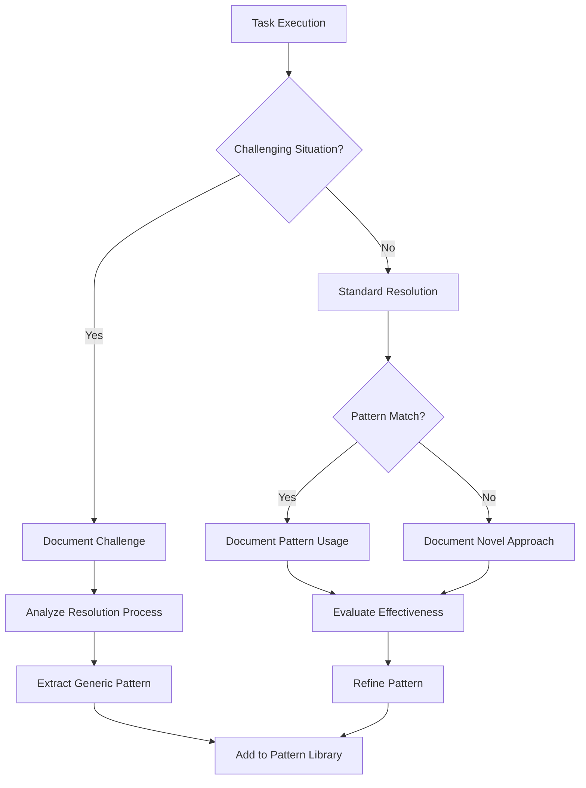
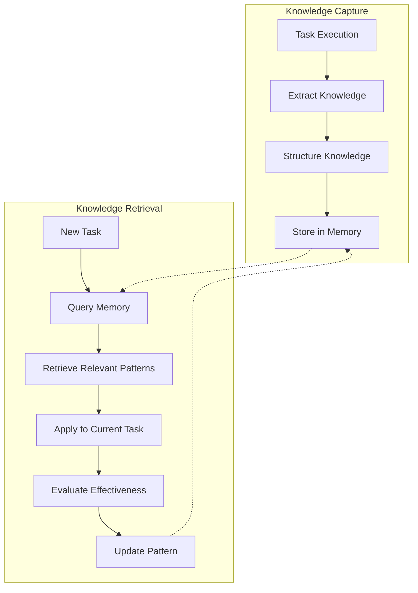
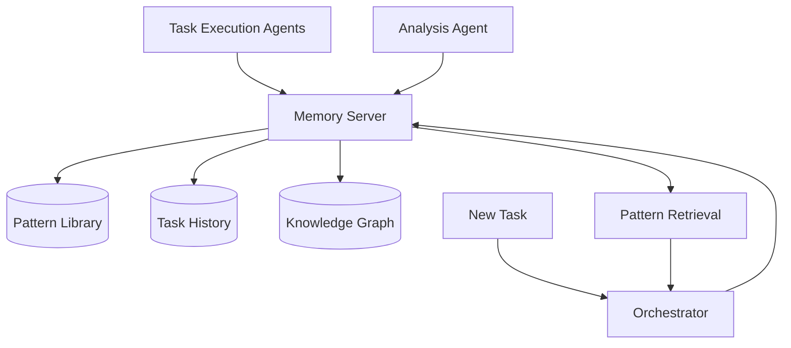

# 🧠 System Self-Improvement Capabilities

<!-- 📑 TABLE OF CONTENTS -->
- [🧠 System Self-Improvement Capabilities](#-system-self-improvement-capabilities)
  - [📋 Overview](#-overview)
  - [🔍 Pattern Recognition & Documentation](#-pattern-recognition--documentation)
  - [📊 Post-Task Analysis](#-post-task-analysis)
  - [📚 Knowledge Management](#-knowledge-management)
  - [🧩 Pattern Library](#-pattern-library)
  - [🧪 Pattern Application & Refinement](#-pattern-application--refinement)
  - [📐 Implementation Approach](#-implementation-approach)

---

## 📋 Overview

The multi-agent system is designed to continuously improve itself by learning from experience, documenting solution patterns, and refining its approaches based on past tasks. This document outlines how the system captures, analyzes, and leverages knowledge gained during task execution to enhance future performance.

## 🔍 Pattern Recognition & Documentation

The system recognizes and documents patterns in the following scenarios:



The system specifically documents:

1. **Complex Problem Solving**: When tasks require multiple approaches before success
2. **Question-Driven Research**: When additional questions and research were needed
3. **Trial and Error**: When multiple solutions were attempted
4. **Collaboration Patterns**: How multiple agents worked together
5. **Unexpected Obstacles**: Unforeseen challenges and their resolutions

Documentation includes:

- Initial problem characteristics
- Approaches attempted (successful and unsuccessful)
- Questions asked and answers received
- Research paths followed
- Final solution structure
- Generalizable insights

## 📊 Post-Task Analysis

After each task completion, the system performs a post-mortem analysis:

### Analysis Process

```bash
# Example post-task analysis function
function perform_post_task_analysis() {
  task_id="$1"
  
  # Gather task data
  task_details=$(gh issue view "$task_id" --json title,body,comments,labels)
  agent_logs=$(get_agent_logs_for_task "$task_id")
  
  # Extract key components
  title=$(echo "$task_details" | jq -r '.title')
  domain=$(echo "$task_details" | jq -r '.labels[] | select(startswith("domain:")) | sub("domain:"; "")')
  complexity=$(echo "$task_details" | jq -r '.labels[] | select(startswith("complexity:")) | sub("complexity:"; "")')
  
  # Analyze process
  prompt_text=$(cat << EOF
# Post-Task Analysis

## Task Information
Task: $title (ID: $task_id)
Domain: $domain
Complexity: $complexity

## Task History
$(summarize_task_history "$task_id")

## Questions Asked
$(extract_questions "$task_id")

## Approaches Tried
$(extract_approaches "$task_id")

## Final Solution
$(extract_solution "$task_id")

## Analysis Instructions
1. Identify the key challenges faced in this task
2. Determine which approaches were most effective and why
3. Extract generalizable patterns that could apply to similar tasks
4. Identify knowledge or capability gaps revealed by this task
5. Suggest improvements to the process for similar future tasks
6. Create a generic pattern description that captures the essence of the solution
7. Tag this pattern with relevant domains, problem types, and characteristics

Your analysis should focus on creating reusable knowledge rather than task-specific details.
EOF
)

  # Send to analysis agent
  analysis_result=$(send_to_analysis_agent "$prompt_text")
  
  # Extract pattern
  pattern=$(echo "$analysis_result" | extract_pattern)
  
  # Store in pattern library
  store_pattern "$pattern" "$domain" "$task_id"
  
  echo "Post-task analysis completed for task #$task_id"
  echo "Pattern stored: $(echo "$pattern" | jq -r '.name')"
}
```

### Analysis Components

1. **Efficiency Analysis**: Identifying unnecessary steps or delays
2. **Quality Assessment**: Evaluating solution against requirements
3. **Pattern Extraction**: Generalizing the approach for similar tasks
4. **Process Improvement**: Identifying workflow enhancements
5. **Knowledge Gap Identification**: Discovering areas for improvement

## 📚 Knowledge Management

The system uses advanced knowledge management techniques:

### Long-Term Memory Integration



### GraphRAG Implementation

The system implements GraphRAG (Graph-based Retrieval Augmented Generation) for sophisticated knowledge management:

1. **Knowledge Graph Construction**:
   - Tasks are nodes with properties (domain, complexity, etc.)
   - Patterns are nodes with relationships to tasks
   - Agents are nodes connected to tasks they completed
   - Solution approaches form edges with properties

2. **Graph Query Capabilities**:
   - Find patterns successfully applied to similar tasks
   - Identify common challenges in a specific domain
   - Discover effective agent combinations for complex tasks
   - Track pattern evolution and refinement

3. **RAG-Enhanced Prompting**:
   - Retrieve relevant patterns before task execution
   - Augment agent prompts with contextual knowledge
   - Provide historical insights for similar challenges

```python
# Example GraphRAG query (conceptual)
def find_relevant_patterns(task_description, domain, complexity):
    # Convert to graph query
    query = f"""
    MATCH (p:Pattern)-[r:APPLIED_TO]->(t:Task)
    WHERE t.domain = '{domain}' AND t.complexity = '{complexity}'
    AND r.success = true
    WITH p, COUNT(t) as usage_count
    ORDER BY usage_count DESC
    RETURN p.name, p.description, p.application_tips, usage_count
    LIMIT 5
    """
    
    # Execute query against knowledge graph
    results = graph_database.execute(query)
    
    # Format for prompt augmentation
    pattern_context = format_patterns_for_prompt(results)
    
    return pattern_context
```

## 🧩 Pattern Library

The system maintains a library of solution patterns:

### Pattern Structure

```json
{
  "pattern_id": "recursive-decomposition-pattern",
  "name": "Recursive Task Decomposition",
  "description": "Breaking down complex problems into self-similar smaller problems that can be solved independently and then recomposed into a complete solution.",
  "problem_context": "When facing tasks that are too complex to solve directly, but contain repeating structures or can be divided into similar sub-problems.",
  "solution_approach": "1. Identify the smallest self-contained sub-problem\n2. Create a solution template for this sub-problem\n3. Apply the template recursively to all similar sub-problems\n4. Combine the sub-solutions following the original problem structure",
  "applicability": ["algorithm-design", "content-structuring", "system-architecture"],
  "examples": [
    {
      "task_id": "123",
      "context": "Parsing a nested JSON structure of unknown depth",
      "application": "Created a recursive function that processes each level and calls itself for nested objects"
    }
  ],
  "related_patterns": ["divide-and-conquer", "template-method"],
  "effectiveness_metrics": {
    "application_count": 27,
    "success_rate": 0.93,
    "efficiency_improvement": 0.76
  },
  "usage_guidance": "Most effective when the sub-problems are truly independent. Less effective when there are many cross-dependencies between components."
}
```

### Pattern Categories

1. **Problem-Solving Patterns**:
   - Divide and Conquer
   - Incremental Refinement
   - Comparative Analysis
   - Constraint Satisfaction

2. **Research Patterns**:
   - Snowball Research (following citation trails)
   - Diverge-Converge Investigation
   - Expert Consultation Pattern
   - Systematic Literature Review

3. **Implementation Patterns**:
   - Test-Driven Scaffolding
   - Interface-First Design
   - Outside-In Development
   - Feature Toggling

4. **Collaboration Patterns**:
   - Specialist Consultation
   - Parallel Exploration
   - Sequential Refinement
   - Review and Revise

## 🧪 Pattern Application & Refinement

The system continuously refines patterns through application:

### Application Process

1. **Pattern Selection**:
   - Match task characteristics to pattern library
   - Rank patterns by relevance and success rate
   - Consider pattern combinations for complex tasks

2. **Contextual Adaptation**:
   - Modify generic pattern for specific context
   - Blend multiple patterns when appropriate
   - Adapt based on domain-specific requirements

3. **Execution & Monitoring**:
   - Apply pattern with monitoring for effectiveness
   - Track deviation from expected pattern results
   - Collect data on pattern performance

4. **Pattern Refinement**:
   - Update success metrics and application count
   - Refine pattern description based on new insights
   - Add variant forms for different contexts
   - Deprecate or merge patterns as needed

```bash
# Example pattern application function
function apply_pattern() {
  task_id="$1"
  pattern_id="$2"
  
  # Retrieve pattern
  pattern=$(get_pattern "$pattern_id")
  
  # Retrieve task details
  task_details=$(gh issue view "$task_id" --json title,body,labels)
  
  # Create application prompt
  prompt=$(cat << EOF
# Pattern Application: $(echo "$pattern" | jq -r '.name')

## Task Details
$(echo "$task_details" | jq -r '.title')
$(echo "$task_details" | jq -r '.body')

## Pattern Information
$(echo "$pattern" | jq -r '.description')

### Problem Context
$(echo "$pattern" | jq -r '.problem_context')

### Solution Approach
$(echo "$pattern" | jq -r '.solution_approach')

### Usage Guidance
$(echo "$pattern" | jq -r '.usage_guidance')

## Application Instructions
1. Analyze how this specific task maps to the pattern's problem context
2. Adapt the solution approach to this specific task
3. Outline the concrete steps to implement this pattern for the current task
4. Identify any aspects of the task that may require pattern modification
5. Create a plan for implementing the solution using this pattern

Your response should include a concrete application plan, not just theoretical discussion.
EOF
)

  # Send to appropriate agent
  domain=$(echo "$task_details" | jq -r '.labels[] | select(startswith("domain:")) | sub("domain:"; "")')
  agent_id=$(select_agent_for_domain "$domain")
  
  application_plan=$(send_to_agent "$agent_id" "$prompt")
  
  # Create tracking record
  create_pattern_application_record "$task_id" "$pattern_id" "$application_plan"
  
  echo "Pattern $(echo "$pattern" | jq -r '.name') applied to task #$task_id"
  echo "$application_plan"
}
```

## 📐 Implementation Approach

The system implements self-improvement through these components:

### 1. MCP-Based Memory Servers



Memory servers provide:
- Persistent storage of patterns and experiences
- Graph-based knowledge representation
- Efficient retrieval of relevant patterns
- Context-aware knowledge integration

### 2. Post-Task Analysis Scripts

Shell scripts trigger analysis after task completion:

```bash
# Example post-completion hook
cat << EOF > .git/hooks/post-commit
#!/bin/bash

# Get the issue number from the commit message
ISSUE_ID=\$(git log -1 --pretty=%B | grep -o '#[0-9]*' | sed 's/#//')

# Check if this commit closes an issue
if git log -1 --pretty=%B | grep -q -E 'fixes|closes|resolves'; then
  if [ -n "\$ISSUE_ID" ]; then
    echo "Task #\$ISSUE_ID completed. Running post-task analysis..."
    
    # Run analysis in background to not block the commit
    nohup /path/to/perform_post_task_analysis "\$ISSUE_ID" > /dev/null 2>&1 &
  fi
fi
EOF

chmod +x .git/hooks/post-commit
```

### 3. Pattern Application Prompts

Templates guide pattern application:

```bash
# Template for pattern application prompt
cat << EOF > ./prompts/pattern-application-template.txt
# Applying Pattern: {{PATTERN_NAME}}

## Task Context
{{TASK_DESCRIPTION}}

## Pattern Description
{{PATTERN_DESCRIPTION}}

## Application Guidelines
{{PATTERN_GUIDELINES}}

## Previous Success Examples
{{SUCCESS_EXAMPLES}}

Consider how to adapt this pattern to the current task:
1. What are the key elements in this task that match the pattern?
2. How should the pattern be adapted to this specific context?
3. What steps would you take to implement this solution?
4. What potential challenges might arise in applying this pattern here?
5. How would you verify that the pattern application was successful?
EOF
```

### 4. Knowledge Integration

GraphRAG integration for contextual knowledge:

```bash
# Knowledge retrieval for task preparation
function prepare_task_with_knowledge() {
  task_id="$1"
  agent_id="$2"
  
  # Get task details
  task_details=$(gh issue view "$task_id" --json title,body,labels)
  
  # Extract domain and characteristics
  domain=$(echo "$task_details" | jq -r '.labels[] | select(startswith("domain:")) | sub("domain:"; "")')
  complexity=$(echo "$task_details" | jq -r '.labels[] | select(startswith("complexity:")) | sub("complexity:"; "")')
  
  # Query graph database for relevant patterns
  relevant_patterns=$(query_graph_for_patterns "$domain" "$complexity")
  
  # Query for similar past tasks
  similar_tasks=$(query_graph_for_similar_tasks "$task_id")
  
  # Query for common challenges
  common_challenges=$(query_graph_for_common_challenges "$domain" "$complexity")
  
  # Prepare knowledge-enhanced prompt
  prompt=$(cat << EOF
# Task: $(echo "$task_details" | jq -r '.title')

## Description
$(echo "$task_details" | jq -r '.body')

## Relevant Patterns
$relevant_patterns

## Similar Past Tasks
$similar_tasks

## Common Challenges
$common_challenges

Based on this knowledge context, please approach this task with these insights in mind.
EOF
)

  # Send to agent
  send_to_agent "$agent_id" "$prompt"
}
```

---

<!-- 🧭 NAVIGATION -->
**Navigation**: [Home](./README.md) | [System Overview](./system-overview.md) | [Organizational Model](./organizational-model.md)

*Last updated: 2025-05-16*