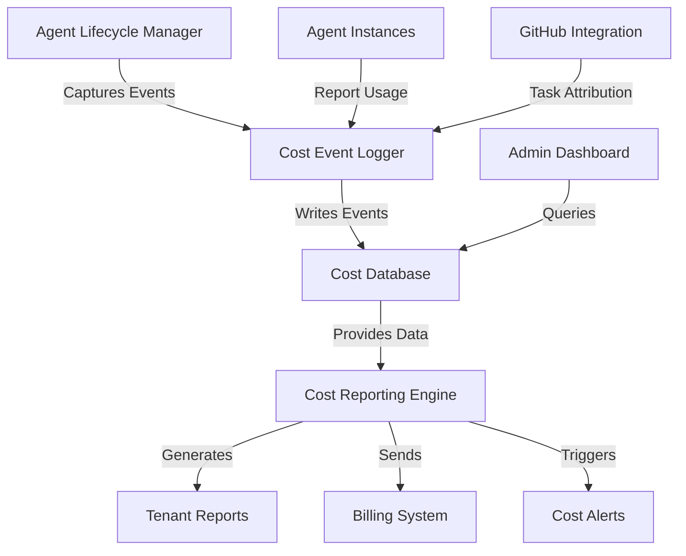

# 💰 Tenant Cost Tracking

<!-- 📑 TABLE OF CONTENTS -->
- [💰 Tenant Cost Tracking](#-tenant-cost-tracking)
  - [📋 Overview](#-overview)
  - [🏗️ Architecture](#️-architecture)
  - [🔄 Data Collection](#-data-collection)
  - [🗄️ Storage Strategy](#️-storage-strategy)
  - [📊 Reporting System](#-reporting-system)
  - [⚙️ Implementation Approach](#️-implementation-approach)
  - [🚥 Limitations and Considerations](#-limitations-and-considerations)
  - [🔐 Security and Privacy](#-security-and-privacy)

---

## 📋 Overview

This document outlines the approach for tracking costs in our multi-tenant agent system. Since each agent is a Claude Code instance with associated costs, and multiple tenants will be using the system simultaneously, accurate cost tracking and attribution are essential for billing, resource allocation, and system optimization.

## 🏗️ Architecture

The cost tracking architecture consists of these components:



### Key Components

1. **Cost Event Logger**: Captures all cost-relevant events
2. **Cost Database**: Stores usage data with tenant attribution
3. **Cost Reporting Engine**: Analyzes and presents cost data
4. **Tenant Reports**: Customized reports per tenant
5. **Billing System Integration**: Feeds data to billing
6. **Cost Alerts**: Notifies on threshold breaches

## 🔄 Data Collection

Cost data is collected at these key points:

### 1. Agent Lifecycle Events

```bash
#!/bin/bash
# log-lifecycle-event.sh - Log agent lifecycle events with tenant data

# Import utilities
source "$(dirname "$0")/utils/config.sh"

# Parse arguments
EVENT_TYPE="$1"    # spawn, terminate, reassign
AGENT_ID="$2"
TENANT_ID="$3"
ADDITIONAL_DATA="$4"  # JSON string with additional event data

# Validate arguments
if [[ -z "$EVENT_TYPE" || -z "$AGENT_ID" || -z "$TENANT_ID" ]]; then
  echo "Usage: log-lifecycle-event.sh <event_type> <agent_id> <tenant_id> [additional_data]"
  exit 1
fi

# Create log entry
TIMESTAMP=$(date -u +"%Y-%m-%dT%H:%M:%SZ")
LOG_ENTRY="{\"timestamp\": \"$TIMESTAMP\", \"event\": \"$EVENT_TYPE\", \"agent_id\": \"$AGENT_ID\", \"tenant_id\": \"$TENANT_ID\""

# Add additional data if provided
if [[ -n "$ADDITIONAL_DATA" ]]; then
  # Merge the JSON objects
  LOG_ENTRY=$(echo "$LOG_ENTRY, ${ADDITIONAL_DATA:1}" | sed 's/^{//')
else
  LOG_ENTRY="$LOG_ENTRY}"
fi

# Log to file
echo "$LOG_ENTRY" >> "${LOGS_DIR}/cost_events.jsonl"

# If database logging is enabled, also log to database
if [[ "$ENABLE_DB_LOGGING" == "true" ]]; then
  log_to_database "lifecycle_events" "$LOG_ENTRY"
fi

echo "Logged $EVENT_TYPE event for agent $AGENT_ID (tenant: $TENANT_ID)"
```

Events captured include:

1. **Agent Spawn**: 
   - Timestamp
   - Tenant ID
   - Agent Type
   - Task ID
   - Initial configuration

2. **Agent Termination**:
   - Runtime duration
   - Task completion status
   - Resource usage

3. **Task Reassignment**:
   - Original agent
   - New agent
   - Reason for reassignment

### 2. Agent Runtime Metrics

Captured during agent operation:

```bash
#!/bin/bash
# log-agent-metrics.sh - Log agent runtime metrics

# Import utilities
source "$(dirname "$0")/utils/config.sh"

# Parse arguments
AGENT_ID="$1"
METRICS_JSON="$2"  # JSON string with metrics data

# Validate arguments
if [[ -z "$AGENT_ID" || -z "$METRICS_JSON" ]]; then
  echo "Usage: log-agent-metrics.sh <agent_id> <metrics_json>"
  exit 1
fi

# Get tenant ID from agent configuration
INSTANCE_DIR="${WORKSPACE_DIR}/instances/${AGENT_ID}"
if [[ ! -d "$INSTANCE_DIR" ]]; then
  echo "Error: Agent instance directory not found: ${INSTANCE_DIR}"
  exit 1
fi

TENANT_ID=$(jq -r '.tenant_id' "${INSTANCE_DIR}/config.json")

# Add timestamp and IDs to metrics
TIMESTAMP=$(date -u +"%Y-%m-%dT%H:%M:%SZ")
METRICS=$(echo "$METRICS_JSON" | jq --arg ts "$TIMESTAMP" --arg aid "$AGENT_ID" --arg tid "$TENANT_ID" \
  '. + {timestamp: $ts, agent_id: $aid, tenant_id: $tid}')

# Log to file
echo "$METRICS" >> "${LOGS_DIR}/agent_metrics.jsonl"

# If database logging is enabled, also log to database
if [[ "$ENABLE_DB_LOGGING" == "true" ]]; then
  log_to_database "agent_metrics" "$METRICS"
fi

echo "Logged metrics for agent $AGENT_ID (tenant: $TENANT_ID)"
```

Metrics include:

1. **Token Usage**:
   - Input tokens
   - Output tokens
   - Cache usage

2. **API Duration**:
   - Active processing time
   - Wait time

3. **Resource Utilization**:
   - Memory usage
   - CPU utilization

### 3. Task Attribution Data

```bash
#!/bin/bash
# log-task-event.sh - Log task-related events with cost attribution

# Import utilities
source "$(dirname "$0")/utils/config.sh"
source "$(dirname "$0")/utils/github.sh"

# Parse arguments
EVENT_TYPE="$1"    # created, updated, completed, reassigned
TASK_ID="$2"
AGENT_ID="$3"
TENANT_ID="$4"

# Validate arguments
if [[ -z "$EVENT_TYPE" || -z "$TASK_ID" || -z "$TENANT_ID" ]]; then
  echo "Usage: log-task-event.sh <event_type> <task_id> <agent_id> <tenant_id>"
  exit 1
fi

# Get task details from GitHub
REPO=$(jq -r '.github.repo' "${CONFIG_DIR}/system.json")
TASK=$(get_github_issue "$REPO" "$TASK_ID")
TASK_TITLE=$(echo "$TASK" | jq -r '.title')
TASK_LABELS=$(echo "$TASK" | jq -r '.labels | map(.name) | join(",")')

# Create log entry
TIMESTAMP=$(date -u +"%Y-%m-%dT%H:%M:%SZ")
LOG_ENTRY=$(cat <<EOF
{
  "timestamp": "$TIMESTAMP",
  "event": "$EVENT_TYPE",
  "task_id": "$TASK_ID",
  "task_title": "$TASK_TITLE",
  "task_labels": "$TASK_LABELS",
  "agent_id": "$AGENT_ID",
  "tenant_id": "$TENANT_ID"
}
EOF
)

# Log to file
echo "$LOG_ENTRY" >> "${LOGS_DIR}/task_events.jsonl"

# If database logging is enabled, also log to database
if [[ "$ENABLE_DB_LOGGING" == "true" ]]; then
  log_to_database "task_events" "$LOG_ENTRY"
fi

echo "Logged $EVENT_TYPE event for task $TASK_ID (tenant: $TENANT_ID)"
```

Task data includes:

1. **Task Type Classification**:
   - Task category
   - Required skills/capabilities
   - Priority level

2. **Attribution Data**:
   - Tenant ID
   - Project ID
   - Department/team

3. **Process Information**:
   - Workflow stages
   - Time spent in each stage

## 🗄️ Storage Strategy

Cost data is stored using this approach:

### 1. Log Files

Primary storage using structured log files:

```
/logs/
├── cost_events.jsonl      # Agent lifecycle events
├── agent_metrics.jsonl    # Agent runtime metrics
├── task_events.jsonl      # Task attribution data
├── billing_summary/       # Aggregated billing data
│   ├── daily/
│   ├── weekly/
│   └── monthly/
└── archived/              # Archived logs by date
```

### 2. SQLite Database

For queryable storage and reporting:

```sql
-- Schema for tenant_costs.db

-- Tenants table
CREATE TABLE tenants (
  tenant_id TEXT PRIMARY KEY,
  name TEXT NOT NULL,
  billing_tier TEXT DEFAULT 'standard',
  cost_center TEXT,
  created_at TIMESTAMP DEFAULT CURRENT_TIMESTAMP
);

-- Agents table
CREATE TABLE agents (
  agent_id TEXT PRIMARY KEY,
  tenant_id TEXT NOT NULL,
  agent_type TEXT NOT NULL,
  created_at TIMESTAMP NOT NULL,
  terminated_at TIMESTAMP,
  runtime_seconds INTEGER,
  FOREIGN KEY (tenant_id) REFERENCES tenants (tenant_id)
);

-- Agent metrics table
CREATE TABLE agent_metrics (
  id INTEGER PRIMARY KEY AUTOINCREMENT,
  agent_id TEXT NOT NULL,
  timestamp TIMESTAMP NOT NULL,
  input_tokens INTEGER,
  output_tokens INTEGER,
  cache_read_tokens INTEGER,
  cache_write_tokens INTEGER,
  api_duration_ms INTEGER,
  memory_mb REAL,
  cpu_percent REAL,
  FOREIGN KEY (agent_id) REFERENCES agents (agent_id)
);

-- Tasks table
CREATE TABLE tasks (
  task_id TEXT PRIMARY KEY,
  tenant_id TEXT NOT NULL,
  title TEXT NOT NULL,
  task_type TEXT,
  priority TEXT,
  created_at TIMESTAMP NOT NULL,
  completed_at TIMESTAMP,
  FOREIGN KEY (tenant_id) REFERENCES tenants (tenant_id)
);

-- Task-agent relations
CREATE TABLE task_agents (
  id INTEGER PRIMARY KEY AUTOINCREMENT,
  task_id TEXT NOT NULL,
  agent_id TEXT NOT NULL,
  assigned_at TIMESTAMP NOT NULL,
  unassigned_at TIMESTAMP,
  FOREIGN KEY (task_id) REFERENCES tasks (task_id),
  FOREIGN KEY (agent_id) REFERENCES agents (agent_id)
);

-- Cost entries table
CREATE TABLE cost_entries (
  id INTEGER PRIMARY KEY AUTOINCREMENT,
  tenant_id TEXT NOT NULL,
  agent_id TEXT,
  task_id TEXT,
  timestamp TIMESTAMP NOT NULL,
  cost_type TEXT NOT NULL,  -- 'api', 'runtime', 'storage', etc.
  amount REAL NOT NULL,
  currency TEXT DEFAULT 'USD',
  FOREIGN KEY (tenant_id) REFERENCES tenants (tenant_id),
  FOREIGN KEY (agent_id) REFERENCES agents (agent_id),
  FOREIGN KEY (task_id) REFERENCES tasks (task_id)
);

-- Cost summaries table
CREATE TABLE cost_summaries (
  id INTEGER PRIMARY KEY AUTOINCREMENT,
  tenant_id TEXT NOT NULL,
  period_start TIMESTAMP NOT NULL,
  period_end TIMESTAMP NOT NULL,
  period_type TEXT NOT NULL,  -- 'daily', 'weekly', 'monthly'
  total_cost REAL NOT NULL,
  agent_count INTEGER,
  task_count INTEGER,
  total_runtime_seconds INTEGER,
  total_input_tokens INTEGER,
  total_output_tokens INTEGER,
  FOREIGN KEY (tenant_id) REFERENCES tenants (tenant_id)
);

-- Indexes for performance
CREATE INDEX idx_agent_metrics_agent_id ON agent_metrics (agent_id);
CREATE INDEX idx_agent_metrics_timestamp ON agent_metrics (timestamp);
CREATE INDEX idx_cost_entries_tenant_id ON cost_entries (tenant_id);
CREATE INDEX idx_cost_entries_timestamp ON cost_entries (timestamp);
CREATE INDEX idx_task_agents_task_id ON task_agents (task_id);
CREATE INDEX idx_task_agents_agent_id ON task_agents (agent_id);
CREATE INDEX idx_tasks_tenant_id ON tasks (tenant_id);
```

### 3. Database Interface

Shell-based interface to the database:

```bash
#!/bin/bash
# db-interface.sh - Interface to the cost tracking database

# Import utilities
source "$(dirname "$0")/utils/config.sh"

DB_PATH="${DATA_DIR}/tenant_costs.db"

# Function to execute SQL queries
execute_query() {
  local QUERY="$1"
  sqlite3 -header -csv "$DB_PATH" "$QUERY"
}

# Function to log to database
log_to_database() {
  local TABLE="$1"
  local JSON_DATA="$2"
  
  # Convert JSON to SQL insert statement based on table
  case "$TABLE" in
    "lifecycle_events")
      # Extract fields from JSON and insert into agents table
      local AGENT_ID=$(echo "$JSON_DATA" | jq -r '.agent_id')
      local TENANT_ID=$(echo "$JSON_DATA" | jq -r '.tenant_id')
      local EVENT=$(echo "$JSON_DATA" | jq -r '.event')
      local TIMESTAMP=$(echo "$JSON_DATA" | jq -r '.timestamp')
      local AGENT_TYPE=$(echo "$JSON_DATA" | jq -r '.agent_type // "unknown"')
      
      if [[ "$EVENT" == "spawn" ]]; then
        execute_query "INSERT INTO agents (agent_id, tenant_id, agent_type, created_at) VALUES ('$AGENT_ID', '$TENANT_ID', '$AGENT_TYPE', '$TIMESTAMP');"
      elif [[ "$EVENT" == "terminate" ]]; then
        local RUNTIME=$(echo "$JSON_DATA" | jq -r '.runtime_seconds // 0')
        execute_query "UPDATE agents SET terminated_at = '$TIMESTAMP', runtime_seconds = $RUNTIME WHERE agent_id = '$AGENT_ID';"
      fi
      ;;
      
    "agent_metrics")
      # Extract metrics and insert into agent_metrics table
      local AGENT_ID=$(echo "$JSON_DATA" | jq -r '.agent_id')
      local TIMESTAMP=$(echo "$JSON_DATA" | jq -r '.timestamp')
      local INPUT_TOKENS=$(echo "$JSON_DATA" | jq -r '.input_tokens // 0')
      local OUTPUT_TOKENS=$(echo "$JSON_DATA" | jq -r '.output_tokens // 0')
      local CACHE_READ=$(echo "$JSON_DATA" | jq -r '.cache_read_tokens // 0')
      local CACHE_WRITE=$(echo "$JSON_DATA" | jq -r '.cache_write_tokens // 0')
      local API_DURATION=$(echo "$JSON_DATA" | jq -r '.api_duration_ms // 0')
      local MEMORY=$(echo "$JSON_DATA" | jq -r '.memory_mb // 0')
      local CPU=$(echo "$JSON_DATA" | jq -r '.cpu_percent // 0')
      
      execute_query "INSERT INTO agent_metrics (agent_id, timestamp, input_tokens, output_tokens, cache_read_tokens, cache_write_tokens, api_duration_ms, memory_mb, cpu_percent) VALUES ('$AGENT_ID', '$TIMESTAMP', $INPUT_TOKENS, $OUTPUT_TOKENS, $CACHE_READ, $CACHE_WRITE, $API_DURATION, $MEMORY, $CPU);"
      ;;
      
    "task_events")
      # Handle task events
      local TASK_ID=$(echo "$JSON_DATA" | jq -r '.task_id')
      local TENANT_ID=$(echo "$JSON_DATA" | jq -r '.tenant_id')
      local EVENT=$(echo "$JSON_DATA" | jq -r '.event')
      local TIMESTAMP=$(echo "$JSON_DATA" | jq -r '.timestamp')
      local AGENT_ID=$(echo "$JSON_DATA" | jq -r '.agent_id // "null"')
      local TITLE=$(echo "$JSON_DATA" | jq -r '.task_title')
      local TASK_TYPE=$(echo "$JSON_DATA" | jq -r '.task_labels' | grep -o 'type:[^,]*' | cut -d':' -f2 || echo "unknown")
      local PRIORITY=$(echo "$JSON_DATA" | jq -r '.task_labels' | grep -o 'priority:[^,]*' | cut -d':' -f2 || echo "medium")
      
      if [[ "$EVENT" == "created" ]]; then
        execute_query "INSERT INTO tasks (task_id, tenant_id, title, task_type, priority, created_at) VALUES ('$TASK_ID', '$TENANT_ID', '$TITLE', '$TASK_TYPE', '$PRIORITY', '$TIMESTAMP');"
      elif [[ "$EVENT" == "completed" ]]; then
        execute_query "UPDATE tasks SET completed_at = '$TIMESTAMP' WHERE task_id = '$TASK_ID';"
      fi
      
      if [[ "$AGENT_ID" != "null" ]]; then
        if [[ "$EVENT" == "assigned" ]]; then
          execute_query "INSERT INTO task_agents (task_id, agent_id, assigned_at) VALUES ('$TASK_ID', '$AGENT_ID', '$TIMESTAMP');"
        elif [[ "$EVENT" == "unassigned" || "$EVENT" == "reassigned" ]]; then
          execute_query "UPDATE task_agents SET unassigned_at = '$TIMESTAMP' WHERE task_id = '$TASK_ID' AND agent_id = '$AGENT_ID' AND unassigned_at IS NULL;"
        fi
      fi
      ;;
  esac
}

# Main function to handle commands
main() {
  local COMMAND="$1"
  shift
  
  case "$COMMAND" in
    "query")
      # Execute a custom query
      local QUERY="$1"
      execute_query "$QUERY"
      ;;
      
    "tenant-costs")
      # Get costs for a specific tenant
      local TENANT_ID="$1"
      local PERIOD="${2:-daily}"
      local START_DATE="${3:-$(date -d '7 days ago' +%Y-%m-%d)}"
      local END_DATE="${4:-$(date +%Y-%m-%d)}"
      
      if [[ "$PERIOD" == "daily" ]]; then
        execute_query "
          SELECT 
            date(period_start) as date,
            total_cost,
            agent_count,
            task_count,
            total_runtime_seconds,
            total_input_tokens,
            total_output_tokens
          FROM cost_summaries
          WHERE tenant_id = '$TENANT_ID'
            AND period_type = 'daily'
            AND date(period_start) BETWEEN '$START_DATE' AND '$END_DATE'
          ORDER BY period_start;
        "
      elif [[ "$PERIOD" == "monthly" ]]; then
        execute_query "
          SELECT 
            strftime('%Y-%m', period_start) as month,
            sum(total_cost) as monthly_cost,
            sum(agent_count) as total_agents,
            sum(task_count) as total_tasks,
            sum(total_runtime_seconds) as total_runtime,
            sum(total_input_tokens) as total_input,
            sum(total_output_tokens) as total_output
          FROM cost_summaries
          WHERE tenant_id = '$TENANT_ID'
            AND period_type = 'daily'
            AND date(period_start) BETWEEN '$START_DATE' AND '$END_DATE'
          GROUP BY strftime('%Y-%m', period_start)
          ORDER BY month;
        "
      fi
      ;;
      
    "agent-costs")
      # Get costs by agent type
      local TENANT_ID="$1"
      local START_DATE="${2:-$(date -d '7 days ago' +%Y-%m-%d)}"
      local END_DATE="${3:-$(date +%Y-%m-%d)}"
      
      execute_query "
        SELECT 
          a.agent_type,
          count(distinct a.agent_id) as agent_count,
          sum(c.amount) as total_cost,
          avg(c.amount) as avg_cost_per_agent
        FROM agents a
        JOIN cost_entries c ON a.agent_id = c.agent_id
        WHERE a.tenant_id = '$TENANT_ID'
          AND date(c.timestamp) BETWEEN '$START_DATE' AND '$END_DATE'
        GROUP BY a.agent_type
        ORDER BY total_cost DESC;
      "
      ;;
      
    "task-costs")
      # Get costs by task
      local TENANT_ID="$1"
      local LIMIT="${2:-10}"
      
      execute_query "
        SELECT 
          t.task_id,
          t.title,
          t.task_type,
          t.priority,
          sum(c.amount) as total_cost,
          count(distinct a.agent_id) as agent_count,
          julianday(t.completed_at) - julianday(t.created_at) as days_to_complete
        FROM tasks t
        JOIN task_agents ta ON t.task_id = ta.task_id
        JOIN agents a ON ta.agent_id = a.agent_id
        JOIN cost_entries c ON a.agent_id = c.agent_id
        WHERE t.tenant_id = '$TENANT_ID'
          AND t.completed_at IS NOT NULL
        GROUP BY t.task_id
        ORDER BY total_cost DESC
        LIMIT $LIMIT;
      "
      ;;
      
    "generate-daily-summary")
      # Generate daily cost summary for yesterday
      local DATE="${1:-$(date -d 'yesterday' +%Y-%m-%d)}"
      
      execute_query "
        INSERT INTO cost_summaries (
          tenant_id, 
          period_start, 
          period_end, 
          period_type, 
          total_cost, 
          agent_count, 
          task_count, 
          total_runtime_seconds, 
          total_input_tokens, 
          total_output_tokens
        )
        SELECT 
          a.tenant_id,
          '$DATE 00:00:00' as period_start,
          '$DATE 23:59:59' as period_end,
          'daily' as period_type,
          sum(c.amount) as total_cost,
          count(distinct a.agent_id) as agent_count,
          count(distinct t.task_id) as task_count,
          sum(a.runtime_seconds) as total_runtime_seconds,
          sum(m.input_tokens) as total_input_tokens,
          sum(m.output_tokens) as total_output_tokens
        FROM agents a
        LEFT JOIN cost_entries c ON a.agent_id = c.agent_id
        LEFT JOIN task_agents ta ON a.agent_id = ta.agent_id
        LEFT JOIN tasks t ON ta.task_id = t.task_id
        LEFT JOIN agent_metrics m ON a.agent_id = m.agent_id
        WHERE date(c.timestamp) = '$DATE'
        GROUP BY a.tenant_id;
      "
      echo "Generated daily summary for $DATE"
      ;;
      
    *)
      echo "Unknown command: $COMMAND"
      echo "Available commands: query, tenant-costs, agent-costs, task-costs, generate-daily-summary"
      exit 1
      ;;
  esac
}

# Execute main function with all arguments
main "$@"
```

## 📊 Reporting System

Cost reporting uses these components:

### 1. Daily Cost Report

```bash
#!/bin/bash
# generate-tenant-report.sh - Generate cost report for tenant

# Import utilities
source "$(dirname "$0")/utils/config.sh"

# Parse arguments
TENANT_ID="$1"
REPORT_TYPE="${2:-daily}"
OUTPUT_FORMAT="${3:-text}"  # text, csv, json, html

# Validate arguments
if [[ -z "$TENANT_ID" ]]; then
  echo "Usage: generate-tenant-report.sh <tenant_id> [report_type] [output_format]"
  exit 1
fi

# Get tenant name
TENANT_NAME=$(sqlite3 "${DATA_DIR}/tenant_costs.db" "SELECT name FROM tenants WHERE tenant_id = '$TENANT_ID';")
if [[ -z "$TENANT_NAME" ]]; then
  echo "Error: Tenant not found: $TENANT_ID"
  exit 1
fi

# Set date range based on report type
case "$REPORT_TYPE" in
  "daily")
    START_DATE=$(date -d 'yesterday' +%Y-%m-%d)
    END_DATE=$(date -d 'yesterday' +%Y-%m-%d)
    TITLE="Daily Cost Report for $TENANT_NAME ($START_DATE)"
    ;;
  "weekly")
    START_DATE=$(date -d '7 days ago' +%Y-%m-%d)
    END_DATE=$(date -d 'yesterday' +%Y-%m-%d)
    TITLE="Weekly Cost Report for $TENANT_NAME ($START_DATE to $END_DATE)"
    ;;
  "monthly")
    START_DATE=$(date -d '30 days ago' +%Y-%m-%d)
    END_DATE=$(date -d 'yesterday' +%Y-%m-%d)
    TITLE="Monthly Cost Report for $TENANT_NAME ($START_DATE to $END_DATE)"
    ;;
  *)
    echo "Error: Unknown report type: $REPORT_TYPE"
    echo "Available types: daily, weekly, monthly"
    exit 1
    ;;
esac

# Run the database queries
TENANT_COSTS=$(${BIN_DIR}/db-interface.sh tenant-costs "$TENANT_ID" "$REPORT_TYPE" "$START_DATE" "$END_DATE")
AGENT_TYPE_COSTS=$(${BIN_DIR}/db-interface.sh agent-costs "$TENANT_ID" "$START_DATE" "$END_DATE")
TOP_TASKS=$(${BIN_DIR}/db-interface.sh task-costs "$TENANT_ID" 5)

# Generate the report based on format
REPORT_FILE="${REPORTS_DIR}/${TENANT_ID}_${REPORT_TYPE}_$(date +%Y%m%d).${OUTPUT_FORMAT}"

case "$OUTPUT_FORMAT" in
  "text")
    {
      echo "$TITLE"
      echo "=================="
      echo ""
      echo "SUMMARY"
      echo "------"
      echo "$TENANT_COSTS" | column -t -s,
      echo ""
      echo "COST BY AGENT TYPE"
      echo "----------------"
      echo "$AGENT_TYPE_COSTS" | column -t -s,
      echo ""
      echo "TOP 5 MOST EXPENSIVE TASKS"
      echo "------------------------"
      echo "$TOP_TASKS" | column -t -s,
    } > "$REPORT_FILE"
    ;;
    
  "csv")
    {
      echo "# $TITLE"
      echo "# SUMMARY"
      echo "$TENANT_COSTS"
      echo ""
      echo "# COST BY AGENT TYPE"
      echo "$AGENT_TYPE_COSTS"
      echo ""
      echo "# TOP 5 MOST EXPENSIVE TASKS"
      echo "$TOP_TASKS"
    } > "$REPORT_FILE"
    ;;
    
  "json")
    {
      echo "{"
      echo "  \"title\": \"$TITLE\","
      echo "  \"tenant_id\": \"$TENANT_ID\","
      echo "  \"tenant_name\": \"$TENANT_NAME\","
      echo "  \"period\": {"
      echo "    \"type\": \"$REPORT_TYPE\","
      echo "    \"start_date\": \"$START_DATE\","
      echo "    \"end_date\": \"$END_DATE\""
      echo "  },"
      
      # Convert tenant costs to JSON
      echo "  \"summary\": $(echo "$TENANT_COSTS" | tail -n +2 | python -c "import csv, json, sys; print(json.dumps(list(csv.DictReader(sys.stdin))))")"
      
      # Convert agent type costs to JSON
      echo "  \"agent_type_costs\": $(echo "$AGENT_TYPE_COSTS" | tail -n +2 | python -c "import csv, json, sys; print(json.dumps(list(csv.DictReader(sys.stdin))))")"
      
      # Convert top tasks to JSON
      echo "  \"top_tasks\": $(echo "$TOP_TASKS" | tail -n +2 | python -c "import csv, json, sys; print(json.dumps(list(csv.DictReader(sys.stdin))))")"
      
      echo "}"
    } > "$REPORT_FILE"
    ;;
    
  "html")
    {
      cat <<EOF
<!DOCTYPE html>
<html>
<head>
  <title>$TITLE</title>
  <style>
    body { font-family: Arial, sans-serif; margin: 40px; }
    h1 { color: #333; }
    h2 { color: #666; margin-top: 30px; }
    table { border-collapse: collapse; width: 100%; margin-bottom: 20px; }
    th, td { text-align: left; padding: 8px; }
    tr:nth-child(even) { background-color: #f2f2f2; }
    th { background-color: #4CAF50; color: white; }
  </style>
</head>
<body>
  <h1>$TITLE</h1>
  
  <h2>Summary</h2>
  <table>
    <tr>
$(echo "$TENANT_COSTS" | head -n1 | awk -F, '{for(i=1;i<=NF;i++) printf "<th>%s</th>", $i; print ""}')
    </tr>
$(echo "$TENANT_COSTS" | tail -n+2 | awk -F, '{print "<tr>"; for(i=1;i<=NF;i++) printf "<td>%s</td>", $i; print "</tr>"}')
  </table>
  
  <h2>Cost by Agent Type</h2>
  <table>
    <tr>
$(echo "$AGENT_TYPE_COSTS" | head -n1 | awk -F, '{for(i=1;i<=NF;i++) printf "<th>%s</th>", $i; print ""}')
    </tr>
$(echo "$AGENT_TYPE_COSTS" | tail -n+2 | awk -F, '{print "<tr>"; for(i=1;i<=NF;i++) printf "<td>%s</td>", $i; print "</tr>"}')
  </table>
  
  <h2>Top 5 Most Expensive Tasks</h2>
  <table>
    <tr>
$(echo "$TOP_TASKS" | head -n1 | awk -F, '{for(i=1;i<=NF;i++) printf "<th>%s</th>", $i; print ""}')
    </tr>
$(echo "$TOP_TASKS" | tail -n+2 | awk -F, '{print "<tr>"; for(i=1;i<=NF;i++) printf "<td>%s</td>", $i; print "</tr>"}')
  </table>
  
  <p><small>Generated on $(date)</small></p>
</body>
</html>
EOF
    } > "$REPORT_FILE"
    ;;
esac

echo "Generated $REPORT_TYPE report for tenant $TENANT_ID in $OUTPUT_FORMAT format"
echo "Report saved to: $REPORT_FILE"
```

### 2. Cost Alert System

```bash
#!/bin/bash
# cost-alert-monitor.sh - Monitor for cost thresholds and send alerts

# Import utilities
source "$(dirname "$0")/utils/config.sh"

# Check all tenants or a specific one
TENANT_ID="${1:-all}"

# Get thresholds from config
THRESHOLD_CONFIG="${CONFIG_DIR}/cost_thresholds.json"
if [[ ! -f "$THRESHOLD_CONFIG" ]]; then
  echo "Error: Threshold configuration not found at ${THRESHOLD_CONFIG}"
  exit 1
fi

# Function to check thresholds for a tenant
check_tenant_thresholds() {
  local TENANT="$1"
  
  # Get tenant details
  TENANT_NAME=$(jq -r --arg tid "$TENANT" '.tenants[$tid].name // $tid' "$THRESHOLD_CONFIG")
  TENANT_THRESHOLD=$(jq -r --arg tid "$TENANT" '.tenants[$tid].daily_threshold // .default_daily_threshold' "$THRESHOLD_CONFIG")
  NOTIFICATION_EMAIL=$(jq -r --arg tid "$TENANT" '.tenants[$tid].notification_email // .default_notification_email' "$THRESHOLD_CONFIG")
  
  echo "Checking thresholds for tenant $TENANT_NAME ($TENANT) - Daily threshold: \$$TENANT_THRESHOLD"
  
  # Get today's cost
  TODAY=$(date +%Y-%m-%d)
  DAILY_COST=$(${BIN_DIR}/db-interface.sh query "
    SELECT COALESCE(SUM(amount), 0) AS daily_cost
    FROM cost_entries
    WHERE tenant_id = '$TENANT'
      AND date(timestamp) = '$TODAY';
  " | tail -n1)
  
  echo "Today's cost so far: \$$DAILY_COST"
  
  # Check if threshold is exceeded
  if (( $(echo "$DAILY_COST > $TENANT_THRESHOLD" | bc -l) )); then
    echo "ALERT: Daily threshold exceeded for tenant $TENANT_NAME ($TENANT)"
    
    # Generate alert message
    ALERT_SUBJECT="Cost Alert: $TENANT_NAME has exceeded daily threshold"
    ALERT_MESSAGE="
Cost Alert for $TENANT_NAME ($TENANT)
======================================

Daily cost threshold of \$$TENANT_THRESHOLD has been exceeded.
Current daily cost: \$$DAILY_COST ($(echo "scale=1; $DAILY_COST / $TENANT_THRESHOLD * 100" | bc -l)% of threshold)

Cost breakdown by agent type:
$(${BIN_DIR}/db-interface.sh agent-costs "$TENANT" "$TODAY" "$TODAY" | column -t -s,)

Top expensive tasks today:
$(${BIN_DIR}/db-interface.sh task-costs "$TENANT" 3 | column -t -s,)

View the full cost report at: ${SYSTEM_URL}/reports/${TENANT}

This is an automated message from the Agent Cost Tracking System.
"
    
    # Log the alert
    ALERT_LOG="${LOGS_DIR}/cost_alerts.log"
    echo "[$(date)] ALERT: Tenant $TENANT exceeded daily threshold. Current: $DAILY_COST, Threshold: $TENANT_THRESHOLD" >> "$ALERT_LOG"
    
    # Send notification
    if [[ -n "$NOTIFICATION_EMAIL" && "$NOTIFICATION_EMAIL" != "null" ]]; then
      # Send email notification
      echo "$ALERT_MESSAGE" | mail -s "$ALERT_SUBJECT" "$NOTIFICATION_EMAIL"
      echo "Sent alert email to $NOTIFICATION_EMAIL"
    fi
    
    # Add to alerts database
    ${BIN_DIR}/db-interface.sh query "
      INSERT INTO cost_alerts (
        tenant_id, 
        alert_type, 
        threshold_value, 
        current_value, 
        timestamp, 
        notification_sent
      ) VALUES (
        '$TENANT',
        'daily_threshold',
        $TENANT_THRESHOLD,
        $DAILY_COST,
        '$(date -u +"%Y-%m-%dT%H:%M:%SZ")',
        $([[ -n "$NOTIFICATION_EMAIL" && "$NOTIFICATION_EMAIL" != "null" ]] && echo 1 || echo 0)
      );
    "
    
    return 1  # Threshold exceeded
  fi
  
  return 0  # Threshold not exceeded
}

# Main execution
if [[ "$TENANT_ID" == "all" ]]; then
  # Get all tenant IDs
  TENANTS=$(jq -r '.tenants | keys[]' "$THRESHOLD_CONFIG")
  
  # Check each tenant
  ALERTS=0
  for TENANT in $TENANTS; do
    check_tenant_thresholds "$TENANT"
    ALERTS=$((ALERTS + $?))
  done
  
  echo "Checked all tenants. $ALERTS alerts triggered."
else
  # Check specific tenant
  check_tenant_thresholds "$TENANT_ID"
  if [[ $? -eq 0 ]]; then
    echo "No alerts triggered for tenant $TENANT_ID."
  fi
fi
```

### 3. Cost Dashboard

Creating a simple web-based dashboard with cost visuals:

```bash
#!/bin/bash
# generate-cost-dashboard.sh - Generate HTML dashboard with cost visualizations

# Import utilities
source "$(dirname "$0")/utils/config.sh"

# Dashboard output directory
DASHBOARD_DIR="${REPORTS_DIR}/dashboard"
mkdir -p "$DASHBOARD_DIR"

# Generate dashboard index page
generate_index_page() {
  cat > "${DASHBOARD_DIR}/index.html" << EOF
<!DOCTYPE html>
<html>
<head>
  <title>Agent System Cost Dashboard</title>
  <meta charset="UTF-8">
  <meta name="viewport" content="width=device-width, initial-scale=1.0">
  <script src="https://cdn.jsdelivr.net/npm/chart.js"></script>
  <script src="https://cdn.jsdelivr.net/npm/chartjs-adapter-date-fns"></script>
  <style>
    body { font-family: Arial, sans-serif; margin: 0; padding: 20px; background: #f5f5f5; }
    .container { max-width: 1200px; margin: 0 auto; }
    .header { background: #333; color: white; padding: 20px; border-radius: 5px; margin-bottom: 20px; }
    .card { background: white; border-radius: 5px; padding: 20px; margin-bottom: 20px; box-shadow: 0 2px 4px rgba(0,0,0,0.1); }
    .row { display: flex; flex-wrap: wrap; margin: 0 -10px; }
    .col { flex: 1; padding: 0 10px; min-width: 300px; }
    h1, h2, h3 { margin-top: 0; }
    .metric { font-size: 24px; font-weight: bold; margin: 10px 0; }
    .metric-label { font-size: 14px; color: #666; }
    .chart-container { height: 300px; margin-top: 20px; }
    table { width: 100%; border-collapse: collapse; }
    th, td { text-align: left; padding: 8px; border-bottom: 1px solid #ddd; }
    tr:nth-child(even) { background-color: #f9f9f9; }
    th { background-color: #4CAF50; color: white; }
    .alert { background-color: #ffebee; border-left: 4px solid #f44336; padding: 10px; margin-bottom: 10px; }
  </style>
</head>
<body>
  <div class="container">
    <div class="header">
      <h1>Agent System Cost Dashboard</h1>
      <p>Last updated: $(date)</p>
    </div>
    
    <div class="row">
      <div class="col">
        <div class="card">
          <h2>System Overview</h2>
          <div class="row">
            <div class="col">
              <div class="metric-label">Total Cost (30 days)</div>
              <div class="metric" id="total-cost">...</div>
            </div>
            <div class="col">
              <div class="metric-label">Active Agents</div>
              <div class="metric" id="active-agents">...</div>
            </div>
            <div class="col">
              <div class="metric-label">Tasks Completed (30 days)</div>
              <div class="metric" id="tasks-completed">...</div>
            </div>
          </div>
          <div class="chart-container">
            <canvas id="cost-trend-chart"></canvas>
          </div>
        </div>
      </div>
    </div>
    
    <div class="row">
      <div class="col">
        <div class="card">
          <h2>Cost by Tenant</h2>
          <div class="chart-container">
            <canvas id="tenant-cost-chart"></canvas>
          </div>
        </div>
      </div>
      <div class="col">
        <div class="card">
          <h2>Cost by Agent Type</h2>
          <div class="chart-container">
            <canvas id="agent-type-chart"></canvas>
          </div>
        </div>
      </div>
    </div>
    
    <div class="row">
      <div class="col">
        <div class="card">
          <h2>Recent Cost Alerts</h2>
          <div id="alerts-container">Loading alerts...</div>
        </div>
      </div>
      <div class="col">
        <div class="card">
          <h2>Top Expensive Tasks</h2>
          <div id="expensive-tasks">Loading tasks...</div>
        </div>
      </div>
    </div>
    
    <div class="row">
      <div class="col">
        <div class="card">
          <h2>Tenant Reports</h2>
          <table id="tenant-reports">
            <tr>
              <th>Tenant</th>
              <th>Daily Report</th>
              <th>Weekly Report</th>
              <th>Monthly Report</th>
            </tr>
            <!-- Tenant reports will be loaded here -->
          </table>
        </div>
      </div>
    </div>
  </div>

  <script>
    // Load dashboard data
    fetch('dashboard-data.json')
      .then(response => response.json())
      .then(data => {
        // Update metrics
        document.getElementById('total-cost').textContent = '$' + data.system_overview.total_cost.toFixed(2);
        document.getElementById('active-agents').textContent = data.system_overview.active_agents;
        document.getElementById('tasks-completed').textContent = data.system_overview.tasks_completed;
        
        // Cost trend chart
        const costTrendCtx = document.getElementById('cost-trend-chart').getContext('2d');
        new Chart(costTrendCtx, {
          type: 'line',
          data: {
            labels: data.cost_trend.dates,
            datasets: [{
              label: 'Daily Cost',
              data: data.cost_trend.values,
              borderColor: '#4CAF50',
              backgroundColor: 'rgba(76, 175, 80, 0.1)',
              fill: true
            }]
          },
          options: {
            responsive: true,
            maintainAspectRatio: false,
            scales: {
              x: {
                type: 'time',
                time: {
                  unit: 'day'
                }
              },
              y: {
                beginAtZero: true,
                title: {
                  display: true,
                  text: 'Cost ($)'
                }
              }
            }
          }
        });
        
        // Tenant cost chart
        const tenantCostCtx = document.getElementById('tenant-cost-chart').getContext('2d');
        new Chart(tenantCostCtx, {
          type: 'bar',
          data: {
            labels: data.tenant_costs.tenants,
            datasets: [{
              label: '30-Day Cost',
              data: data.tenant_costs.values,
              backgroundColor: '#2196F3'
            }]
          },
          options: {
            responsive: true,
            maintainAspectRatio: false,
            scales: {
              y: {
                beginAtZero: true,
                title: {
                  display: true,
                  text: 'Cost ($)'
                }
              }
            }
          }
        });
        
        // Agent type chart
        const agentTypeCtx = document.getElementById('agent-type-chart').getContext('2d');
        new Chart(agentTypeCtx, {
          type: 'pie',
          data: {
            labels: data.agent_type_costs.types,
            datasets: [{
              data: data.agent_type_costs.values,
              backgroundColor: [
                '#4CAF50', '#2196F3', '#FFC107', '#F44336', '#9C27B0',
                '#00BCD4', '#FF9800', '#795548', '#607D8B', '#E91E63'
              ]
            }]
          },
          options: {
            responsive: true,
            maintainAspectRatio: false,
            plugins: {
              legend: {
                position: 'right'
              }
            }
          }
        });
        
        // Load recent alerts
        const alertsContainer = document.getElementById('alerts-container');
        if (data.recent_alerts.length === 0) {
          alertsContainer.innerHTML = '<p>No recent alerts</p>';
        } else {
          let alertsHtml = '';
          data.recent_alerts.forEach(alert => {
            alertsHtml += \`
              <div class="alert">
                <strong>\${alert.tenant_name}</strong> exceeded \${alert.alert_type} threshold on \${new Date(alert.timestamp).toLocaleDateString()}
                <br>Threshold: $\${alert.threshold_value.toFixed(2)}, Actual: $\${alert.current_value.toFixed(2)}
              </div>
            \`;
          });
          alertsContainer.innerHTML = alertsHtml;
        }
        
        // Load expensive tasks
        const expensiveTasksContainer = document.getElementById('expensive-tasks');
        if (data.expensive_tasks.length === 0) {
          expensiveTasksContainer.innerHTML = '<p>No tasks found</p>';
        } else {
          let tasksHtml = '<table><tr><th>Task</th><th>Tenant</th><th>Cost</th></tr>';
          data.expensive_tasks.forEach(task => {
            tasksHtml += \`
              <tr>
                <td>\${task.title}</td>
                <td>\${task.tenant_name}</td>
                <td>$\${task.cost.toFixed(2)}</td>
              </tr>
            \`;
          });
          tasksHtml += '</table>';
          expensiveTasksContainer.innerHTML = tasksHtml;
        }
        
        // Load tenant reports
        const tenantReportsTable = document.getElementById('tenant-reports');
        let reportsHtml = '<tr><th>Tenant</th><th>Daily Report</th><th>Weekly Report</th><th>Monthly Report</th></tr>';
        data.tenant_reports.forEach(tenant => {
          reportsHtml += \`
            <tr>
              <td>\${tenant.name}</td>
              <td><a href="\${tenant.daily_report}">Daily</a></td>
              <td><a href="\${tenant.weekly_report}">Weekly</a></td>
              <td><a href="\${tenant.monthly_report}">Monthly</a></td>
            </tr>
          \`;
        });
        tenantReportsTable.innerHTML = reportsHtml;
      })
      .catch(error => {
        console.error('Error loading dashboard data:', error);
        document.body.innerHTML = '<div class="container"><div class="card"><h2>Error loading dashboard data</h2><p>' + error + '</p></div></div>';
      });
  </script>
</body>
</html>
EOF

  echo "Generated dashboard index page"
}

# Generate dashboard data
generate_dashboard_data() {
  # Today's date and 30 days ago
  TODAY=$(date +%Y-%m-%d)
  THIRTY_DAYS_AGO=$(date -d '30 days ago' +%Y-%m-%d)
  
  # Get system overview metrics
  TOTAL_COST=$(${BIN_DIR}/db-interface.sh query "
    SELECT COALESCE(SUM(amount), 0) FROM cost_entries 
    WHERE date(timestamp) BETWEEN '$THIRTY_DAYS_AGO' AND '$TODAY';
  " | tail -n1)
  
  ACTIVE_AGENTS=$(${BIN_DIR}/db-interface.sh query "
    SELECT COUNT(*) FROM agents 
    WHERE terminated_at IS NULL;
  " | tail -n1)
  
  TASKS_COMPLETED=$(${BIN_DIR}/db-interface.sh query "
    SELECT COUNT(*) FROM tasks 
    WHERE completed_at IS NOT NULL 
      AND date(completed_at) BETWEEN '$THIRTY_DAYS_AGO' AND '$TODAY';
  " | tail -n1)
  
  # Get cost trend data
  COST_TREND=$(${BIN_DIR}/db-interface.sh query "
    SELECT 
      date(timestamp) as date,
      SUM(amount) as daily_cost
    FROM cost_entries
    WHERE date(timestamp) BETWEEN '$THIRTY_DAYS_AGO' AND '$TODAY'
    GROUP BY date(timestamp)
    ORDER BY date;
  ")
  
  # Get tenant costs
  TENANT_COSTS=$(${BIN_DIR}/db-interface.sh query "
    SELECT 
      t.name as tenant_name,
      SUM(c.amount) as total_cost
    FROM tenants t
    JOIN cost_entries c ON t.tenant_id = c.tenant_id
    WHERE date(c.timestamp) BETWEEN '$THIRTY_DAYS_AGO' AND '$TODAY'
    GROUP BY t.tenant_id
    ORDER BY total_cost DESC;
  ")
  
  # Get agent type costs
  AGENT_TYPE_COSTS=$(${BIN_DIR}/db-interface.sh query "
    SELECT 
      a.agent_type,
      SUM(c.amount) as total_cost
    FROM agents a
    JOIN cost_entries c ON a.agent_id = c.agent_id
    WHERE date(c.timestamp) BETWEEN '$THIRTY_DAYS_AGO' AND '$TODAY'
    GROUP BY a.agent_type
    ORDER BY total_cost DESC;
  ")
  
  # Get recent alerts
  RECENT_ALERTS=$(${BIN_DIR}/db-interface.sh query "
    SELECT 
      ca.tenant_id,
      t.name as tenant_name,
      ca.alert_type,
      ca.threshold_value,
      ca.current_value,
      ca.timestamp
    FROM cost_alerts ca
    JOIN tenants t ON ca.tenant_id = t.tenant_id
    ORDER BY ca.timestamp DESC
    LIMIT 5;
  ")
  
  # Get expensive tasks
  EXPENSIVE_TASKS=$(${BIN_DIR}/db-interface.sh query "
    SELECT 
      t.task_id,
      t.title,
      tn.name as tenant_name,
      SUM(c.amount) as cost
    FROM tasks t
    JOIN tenants tn ON t.tenant_id = tn.tenant_id
    JOIN task_agents ta ON t.task_id = ta.task_id
    JOIN agents a ON ta.agent_id = a.agent_id
    JOIN cost_entries c ON a.agent_id = c.agent_id
    WHERE date(c.timestamp) BETWEEN '$THIRTY_DAYS_AGO' AND '$TODAY'
    GROUP BY t.task_id
    ORDER BY cost DESC
    LIMIT 10;
  ")
  
  # Get tenant report links
  TENANTS=$(${BIN_DIR}/db-interface.sh query "SELECT tenant_id, name FROM tenants;")
  
  # Format data as JSON
  cat > "${DASHBOARD_DIR}/dashboard-data.json" << EOF
{
  "system_overview": {
    "total_cost": ${TOTAL_COST},
    "active_agents": ${ACTIVE_AGENTS},
    "tasks_completed": ${TASKS_COMPLETED}
  },
  "cost_trend": {
    "dates": [$(echo "$COST_TREND" | tail -n+2 | cut -d, -f1 | awk '{printf("%s\"%s\"", NR>1?",":"", $1)}')],
    "values": [$(echo "$COST_TREND" | tail -n+2 | cut -d, -f2 | awk '{printf("%s%s", NR>1?",":"", $1)}')]
  },
  "tenant_costs": {
    "tenants": [$(echo "$TENANT_COSTS" | tail -n+2 | cut -d, -f1 | awk '{printf("%s\"%s\"", NR>1?",":"", $1)}')],
    "values": [$(echo "$TENANT_COSTS" | tail -n+2 | cut -d, -f2 | awk '{printf("%s%s", NR>1?",":"", $1)}')]
  },
  "agent_type_costs": {
    "types": [$(echo "$AGENT_TYPE_COSTS" | tail -n+2 | cut -d, -f1 | awk '{printf("%s\"%s\"", NR>1?",":"", $1)}')],
    "values": [$(echo "$AGENT_TYPE_COSTS" | tail -n+2 | cut -d, -f2 | awk '{printf("%s%s", NR>1?",":"", $1)}')]
  },
  "recent_alerts": [
$(echo "$RECENT_ALERTS" | tail -n+2 | awk -F, '{
  printf("    {\"tenant_id\": \"%s\", \"tenant_name\": \"%s\", \"alert_type\": \"%s\", \"threshold_value\": %s, \"current_value\": %s, \"timestamp\": \"%s\"}%s\n", 
    $1, $2, $3, $4, $5, $6, (NR<6?",":""))
}')
  ],
  "expensive_tasks": [
$(echo "$EXPENSIVE_TASKS" | tail -n+2 | awk -F, '{
  printf("    {\"task_id\": \"%s\", \"title\": \"%s\", \"tenant_name\": \"%s\", \"cost\": %s}%s\n", 
    $1, $2, $3, $4, (NR<11?",":""))
}')
  ],
  "tenant_reports": [
$(echo "$TENANTS" | tail -n+2 | awk -F, '{
  printf("    {\"tenant_id\": \"%s\", \"name\": \"%s\", \"daily_report\": \"reports/%s_daily_'$(date +%Y%m%d)'.html\", \"weekly_report\": \"reports/%s_weekly_'$(date +%Y%m%d)'.html\", \"monthly_report\": \"reports/%s_monthly_'$(date +%Y%m%d)'.html\"}%s\n", 
    $1, $2, $1, $1, $1, (NR<'"$(echo "$TENANTS" | wc -l)"'?",":""))
}')
  ]
}
EOF

  echo "Generated dashboard data"
}

# Main execution
generate_index_page
generate_dashboard_data

echo "Dashboard generated at: ${DASHBOARD_DIR}/index.html"
```

## ⚙️ Implementation Approach

The implementation strategy follows these steps:

### 1. Setup Phase

1. **Database Setup**:
   - Create SQLite database schema
   - Set up initial tables and indexes

2. **Directory Structure**:
   - Create log and data directories
   - Set up report output locations

3. **Configuration**:
   - Define tenant details
   - Set cost thresholds and alert settings
   - Configure default rate calculations

### 2. Integration Phase

1. **Agent Lifecycle Scripts**:
   - Add cost tracking hooks to spawn scripts
   - Add usage capturing to termination scripts
   - Integrate heartbeat with metrics collection

2. **Task Management**:
   - Add tenant ID tracking to tasks
   - Enhance GitHub integration with cost attribution
   - Update task assignment to track agent costs

3. **MCP Integration**:
   - Capture metrics from MCP servers
   - Add cost tracking fields to MCP messages
   - Implement usage reporting protocol

### 3. Reporting Phase

1. **Report Generation**:
   - Set up daily/weekly/monthly report generation
   - Implement tenant-specific reports
   - Create dashboard generation scripts

2. **Alert System**:
   - Implement threshold monitoring
   - Set up notification mechanism
   - Create alert logging and tracking

3. **Data Analysis**:
   - Implement cost trend analysis
   - Set up predictive usage modeling
   - Create optimization recommendations

## 🚥 Limitations and Considerations

When implementing the cost tracking system, consider these limitations:

1. **Accuracy Trade-offs**:
   - Basic shell implementation may have less precision than dedicated tools
   - Some resource usage might not be fully attributed
   - Token counting is an estimate without direct API access

2. **Performance Impact**:
   - Logging adds overhead to agent operations
   - Database operations may impact system performance
   - Consider efficient storage and rotation strategies

3. **Security Considerations**:
   - Cost data contains sensitive business information
   - Tenant isolation should extend to cost data
   - API tokens should be secured and rotated

4. **Scaling Issues**:
   - SQLite may not scale beyond moderate usage
   - Consider migration path to more robust databases
   - Log rotation and archiving policies needed

5. **Billing Integration**:
   - Actual billing may require external system integration
   - Reconciliation process for cost accuracy
   - Currency and tax handling considerations

## 🔐 Security and Privacy

Security measures for tenant cost data:

1. **Data Isolation**:
   - Tenant costs are strictly separated
   - Access controls prevent cross-tenant visibility
   - Database queries enforce tenant boundaries

2. **Audit Trail**:
   - All cost operations are logged with timestamps
   - Changes to cost data are tracked
   - Reports include data provenance information

3. **Access Controls**:
   - Tenant-specific API keys for report access
   - Role-based permissions for cost data
   - Encrypted communication for sensitive data

4. **Data Retention**:
   - Clear policies for cost data retention
   - Automated purging of old detailed logs
   - Aggregated data retained longer than details

5. **Compliance Considerations**:
   - Data storage location constraints
   - Privacy requirements for cost attribution
   - Regulatory reporting capabilities

---

<!-- 🧭 NAVIGATION -->
**Navigation**: [Home](./README.md) | [System Overview](./system-overview.md) | [Implementation Approach](./implementation-approach.md)

*Last updated: 2025-05-16*