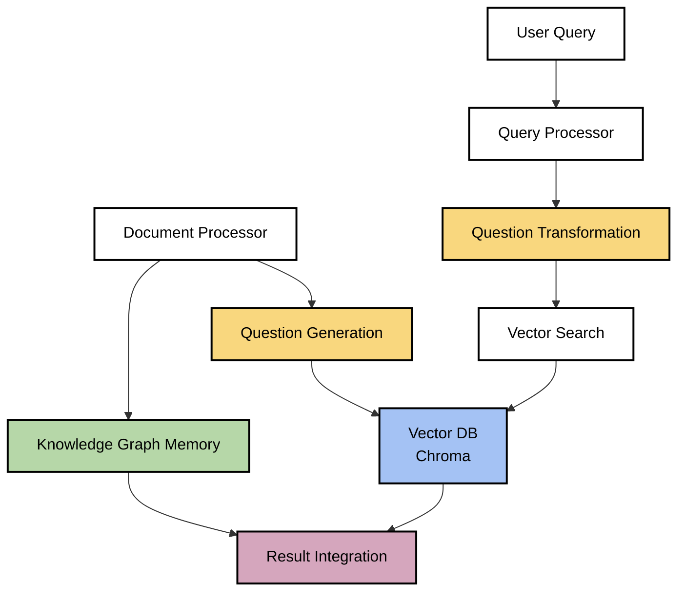

# 🧠 Question-Based Embedding Approach Discussion

**Date:** 2025-05-19

## 📋 Table of Contents
- [Context](#context)
- [Proposal](#proposal)
- [Analysis](#analysis)
- [Implementation Considerations](#implementation-considerations)
- [Integration with Current Approach](#integration-with-current-approach)
- [Next Steps](#next-steps)

## Context

During our discussion about RAG implementation approaches for documentation search, an important refinement was proposed regarding the embedding strategy. This discussion took place after we had already decided on a hybrid approach combining vector-based RAG with the Memory MCP server's knowledge graph capabilities.

## Proposal

The proposed approach involves using question-based embeddings rather than direct content embeddings:

> "In my experience with RAGs, it is promising to do embeddings not directly to the content, but instead first check if the content represents questions (if not, then generate questions that the content gives the answers for), and get embeddings for those questions. When querying, the same thing should be done: ensure that the input query represents questions, get the embeddings from that, and finally do search in the DB."

This strategy involves:
1. Generating representative questions from documentation content
2. Creating embeddings of these questions rather than the raw content
3. Processing user queries into question format before performing searches
4. Using these aligned question-based representations for matching

## Analysis

### Key Advantages

The question-based embedding approach offers several significant benefits:

1. **Intent Alignment**
   - Questions naturally capture the underlying intent and purpose behind information
   - Creates better semantic matching between user queries and content
   - Reduces the semantic gap between how information is stored and how it's queried

2. **Normalized Representation**
   - Converting diverse content into a consistent question format standardizes the embedding space
   - Reduces noise and variability in the vector representation
   - Creates more consistent distance measurements in the vector space

3. **Natural Query Mapping**
   - Users typically search with an implicit question in mind
   - Having both content and queries represented as questions creates natural alignment
   - Improves relevance of search results by matching at the intent level

4. **Hierarchical Relationship Capture**
   - Questions excel at representing hierarchical relationships:
     - "Which epics contain this user story?"
     - "What are the child tasks of this feature?"
     - "How does this component relate to the overall architecture?"
   - Complements our knowledge graph approach with semantic relationship representation

5. **Ambiguity Reduction**
   - Transforms potentially ambiguous content into explicit information needs
   - Makes the system's interpretation of content more transparent
   - Enables better debugging and refinement of the search process

### Potential Challenges

1. **Computational Overhead**
   - Question generation adds an additional processing step
   - Requires LLM usage for both indexing and querying

2. **Quality Dependence**
   - Performance heavily depends on the quality of generated questions
   - Poor question generation could misrepresent content

3. **Coverage Concerns**
   - Need to ensure generated questions cover all important aspects of content
   - May require generating multiple questions per content chunk

## Implementation Considerations

### Question Generation Strategy

For effective implementation, we would need to:

1. **Content Analysis**
   - Analyze document chunks to identify key information points
   - Determine the main concepts and relationships present

2. **Question Generation**
   - Generate diverse question types:
     - Factual questions ("What is X?")
     - Relationship questions ("How does X relate to Y?")
     - Purpose questions ("Why is X important?")
     - Process questions ("How does X work?")
   - Generate multiple questions per content chunk to ensure coverage

3. **Question Filtering**
   - Remove redundant or low-quality questions
   - Prioritize questions that capture the essence of the content

### Query Processing

When processing user queries:

1. **Intent Detection**
   - Determine if the user query is already in question form
   - Identify the underlying information need

2. **Question Transformation**
   - Convert statements or keywords into well-formed questions
   - Expand ambiguous queries into multiple specific questions

3. **Vector Search**
   - Create embeddings of the processed question(s)
   - Perform similarity search against question-based vector store

## Integration with Current Approach

The question-based embedding approach fits well within our planned hybrid RAG implementation:

In this architecture:
1. Document content is processed into both knowledge graph entities and generated questions
2. Questions are embedded and stored in the vector database
3. User queries are transformed into questions before searching
4. Results are integrated from both the vector search and knowledge graph

## Next Steps

To incorporate this approach into our implementation:

1. **Research & Prototyping**
   - Investigate question generation techniques and best practices
   - Develop a prototype to evaluate question quality and coverage
   - Test retrieval performance with question-based embeddings

2. **Pipeline Enhancement**
   - Update our planned document processing pipeline to include question generation
   - Design an efficient query transformation module
   - Integrate with our chosen vector database

3. **Technical Specification Update**
   - Revise the technical specification to include this approach
   - Detail the question generation and transformation processes
   - Define metrics for evaluating question quality and search performance

4. **Documentation**
   - Update our RAG implementation analysis document
   - Create examples of how different content types are transformed into questions

This question-based embedding approach represents a valuable enhancement to our hybrid RAG strategy, potentially improving search relevance and accuracy significantly.

---

🧭 **Navigation**
- [Home](/docs/README.md)
- [Architecture Documentation](/docs/architecture/README.md)
- [Logs Directory](/docs/logs/README.md)
- [RAG Implementation Analysis](/docs/logs/2025-05-19/rag-implementation-analysis.md)
- [Memory MCP Server](/docs/architecture/interfaces/mcp/memory-server.md)
- [Mermaid Diagram Standard](/.claude/rules/mermaid-diagram-standard.md)